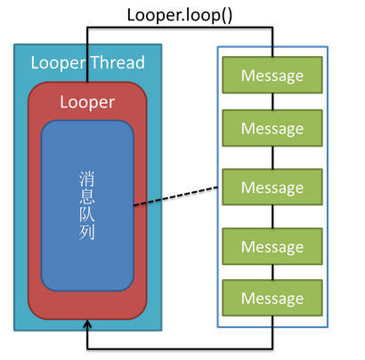

# Android的消息机制（1501210956 刘艺霞）

【摘要】在Android应用程序开发过程中，经常会用到消息传递，在本文中，我们重点介绍了Android的消息机制，介绍了与消息机制相关的类，及其使用机制。在最后通过两个实例，介绍了如何在子程序中给主程序发送消息并处理以及如何给一个线程升级为Looper线程，并与主程序通信。

【关键词】Android、消息机制、Looper线程

# 

1、引言

## 

Android是Google公司在2007年推出的一种基于Linux的源码开放的操作系统，其主要用于移动设备。Android采用分层的系统架构思想，自底向上分别是：Linux内核、系统库和Android运行时、应用框架层、应用程序层。而我们所研究的Android的消息机制就是其应用框架层所提供的系统服务。那么在什么时候我们会用到消息机制呢？

当我们在开发基于Android平台的应用软件时，如果在这个程序中要执行一个用时比较长的操作，例如访问网络，为了避免出现No Response错误，我们要将该操作放在一个单独的线程中执行。但是如果该操作完成后，需要修改UI界面，若直接在该子线程中修改，则会报如下错误：CalledFromWrongThreadException: Only the original thread that created a view hierarchy can touch its views.。这是因为Android系统中的视图组件并不是线程安全的，它不允许Activity新启动的线程访问该Activity里的界面组件，所以如果要更新视图，必须在主线程中更新。即除了UI线程，其它线程不能修改UI界面。在这种情况下，我们就需要借助于消息传递机制了，即我们可以在子线程中通知主线程，让主线程做更新操作。

# 

2、有关消息机制的基本知识

## 

在Android中，线程内部或者线程之间进行信息交互时经常会使用消息，所以首先我们在学习Android的消息机制之前，先了解一下与消息有关的几个类：

### 

2.1 Message

Message即消息，它是线程之间传递信息的载体，包含了对消息的描述和任意的数据对象。它可以发送给Handler来进行处理。

在使用Message时，我们可以通过new Message()创建一个Message实例，但是Android更推荐我们通过Message.obtain()或者Handler.obtainMessage()获取Message对象。这并不一定是直接创建一个新的实例，而是先从消息池中看有没有可用的Message实例，存在则直接取出并返回这个实例。反之如果消息池中没有可用的Message实例，则根据给定的参数new一个新Message对象。

Message有几个比较重要的字段：

    a、arg1和arg2：用于存放我们要传递的整形数据，例如在Service中，我们可以用来存放Service的ID。
    b、obj：该字段是Object类型，我们可以让该字段传递任意对象到消息的接收者中。
    c、what：这个字段可以说是消息的标志，在消息处理中，我们可以根据这个字段的不同的值进行不同的处理。

### 

2.2 Message Queue

消息队列，用来存放通过Handler发布的消息，按照“先进先出”的原则执行。Message Queue中的存放并非实际意义的保存，而是将Message对象以链表的方式串联起来的。MessageQueue对象不需要我们自己创建，而是有Looper对象对其进行管理，一个线程最多只可以拥有一个MessageQueue。我们可以通过Looper.myQueue()获取当前线程中的MessageQueue。

### 

2.3 Handler

Handler是Message的主要处理者，负责将Message添加到消息队列以及对消息队列中的Message进行处理。具体过程如下：

通过Handler对象我们可以封装Message对象，然后通过sendMessage(msg)把Message对象添加到MessageQueue中；当MessageQueue循环到该Message时，就会调用该Message对象对应的Handler对象的handleMessage()方法对其进行处理，整个过程是异步的。由于是在handleMessage()方法中处理消息，因此我们应该编写一个类继承自Handler，然后在handleMessage()中处理我们需要的操作。

Handler拥有两个重要的特点：

(1)、Handler可以在任意线程发送消息，这些消息会被添加到关联的MQ上。

(2)、Handler是在它关联的looper线程中处理消息的。

### 

2.4 Looper

Looper是消息循环器，它扮演着Message Queue和Handler之间桥梁的角色，循环取出Message Queue里面的Message，并交付给相应的Handler进行处理。

Looper也是MessageQueue的管理者，在一个线程中，如果存在Looper对象，则必定存在MessageQueue对象，并且只存在一个Looper对象和一个MessageQueue对象。

在Android系统中，除了主线程有默认的Looper对象，其它线程默认是没有Looper对象的。那么我们如何使我们新创建的普通线程拥有Looper对象呢？

首先应调用Looper.prepare()方法，然后再调用Looper.loop()方法即可。其工作过程如下图所示：

倘若我们的线程中存在Looper对象，则我们可以通过Looper.myLooper()获取当前线程的Looper对象，此外我们还可以通过Looper.getMainLooper()获取当前应用系统中主线程的Looper对象。在这个地方有一点需要注意，假如Looper对象位于应用程序主线程中，则Looper.myLooper()和Looper.getMainLooper()获取的是同一个对象。还有getThread()可得到Looper对象所属线程，quit()方法可结束Looper循环。

# 

3、Android的消息机制

## 

Google在设计Android系统的消息机制时时参考了Windows程序的消息机制的，因此Android应用程序的消息处理机制也是由消息循环、消息发送和消息处理三部分构成的。

消息循环是指发送给每个线程的消息都被按处理时间的先后顺序存入该线程的消息队列MessageQueue中，然后该线程的循环器Looper不断的从该队列中依次取出每条消息进行处理，若消息队列为空，则该线程处于空闲等待状态；消息发送是指把消息发送到需要处理该消息的线程的消息队列中，也就是需要与当前线程进行通信的线程的消息队列中，Android中一般是通过Handler的相关方法来进行消息发送的；消息处理是指消息被从消息队列中取出时，调用Handler的相关方法，一般是handleMessage()方法来对消息进行处理。

## 

3.1 消息处理流程

整个消息处理流程由以下3步来完成：

### 

3.1.1 包装Message对象（指定Handler、回调函数和携带数据等）；

### 

3.1.2 通过Handler的sendMessage()等类似方法将Message发送出去；

### 

3.1.3 在Handler的处理方法里面将Message添加到Handler绑定的Looper的消息队列MessageQueue中；

### 

3.1.4 Looper的loop()方法通过循环不断从MessageQueue中提取Message进行处理，并移除处理完毕的Message；

### 

3.1.5 通过调用Message绑定的Handler对象的handleMessage()方法完成对消息的处理。在handleMessage()中对消息如何处理则是用户自己编写的。

## 

3.2 实例验证

### 

3.2.1 在子线程中发送消息，主线程中处理消息

（1）在主线程中创建Handler

        private static final int COMPLETED = 0;
        private Handler handler = new Handler() {
            @Override
            public void handleMessage(Message msg) {
                if (msg.what == COMPLETED) {
                    text.setText("completed");
                }
            }
        };

（2）子线程发送消息

        @Override
        protected void onCreate(Bundle savedInstanceState) {
            super.onCreate(savedInstanceState);
            setContentView(R.layout.activity_main);
    
            text = (TextView)findViewById(R.id.tv);
            btn = (Button)findViewById(R.id.btn);
            btn.setOnClickListener(new View.OnClickListener() {
                @Override
                public void onClick(View v) {
                    new MyThread().start();
                }
            });
        }
        
        private class MyThread extends Thread {
            @Override
            public void run() {
                Message msg = new Message();
                msg.what = COMPLETED;
                handler.sendMessage(msg);
            }
        }

处理流程为：点击主UI中的按钮，启动子线程，子线程给主线程发送消息，主线程更新UI界面。

### 

3.2.2 在子线程中创建消息处理循环

本例中的主线程和子线程都各有一个Looper和Handler。

（1）在主线程中创建Handler

        public final static int MESSAGE_WXB_1 = 1;
        private static Handler mHandler = new Handler(){
            @Override
            public void handleMessage(Message msg) {
                switch(msg.what){
                    case MESSAGE_WXB_1:
                        tv.setText("completed");
                        break;
                }
                super.handleMessage(msg);
            }
        };

（2）在主线程中给子线程发送消息

        @Override
        protected void onCreate(Bundle savedInstanceState) {
            super.onCreate(savedInstanceState);
            setContentView(R.layout.activity_main);
            tv = (TextView) this.findViewById(R.id.textView1);
            new LooperThread().start();//创建子线程
    
            Button btn = (Button) this.findViewById(R.id.btnSendMessage);
            btn.setOnClickListener(new OnClickListener() {
                @Override
                public void onClick(View v) {
                    LooperThread.sHandler.sendEmptyMessage(MESSAGE_WXB_1);
                }
            });
        }

（3）创建一个Looper线程，给主线程发送消息

        static class LooperThread extends Thread {
            public static Handler sHandler = null;
            public void run() {
                Looper.prepare();//创建消息循环
                sHandler = new Handler() {
                    public void handleMessage(Message msg) {
                        switch(msg.what){
                            case MESSAGE_WXB_1:
                                mHandler.sendEmptyMessage(MESSAGE_WXB_1);
                                break;
                        }
                    }
                };
                Looper.loop();//开启消息循环
            }
        }

本例的处理流程为：在主UI中点击按钮，主线程就给子线程发送消息，子线程接收到消息之后，开始处理消息，然后子线程处理完后给主线程回发消息，主线程接收到消息，更新主UI界面。

# 

4、结论

## 

在Android的应用开发中，我们经常需要使用消息机制来进行线程间通信，但是在使用的时候经常会出现一些错误，这都是我们对消息机制理解的不透彻，所以我们需要对Message、MessageQueue、Looper、Handler有深入的理解，才能更加得心应手的使用Android的消息机制。

# 

参考文献

## 

[1] 黄蓉. Android的消息处理机制研究. 黑龙江科技信息, 2012, 期 33

[2] 解志君.Android多线程与消息循环.电子世界, 2013, 期 19