# Android6.0 App Links功能分析（1501211014 闫森）
#摘要
在上次的I/O大会上，谷歌宣布了Android M支持app链接（App Links），谷歌正在不遗余力的推动深度链接（deep linking）。这将对Android M的用户体验造成深远的积极影响，用户点击一个web链接就能直接跳转到app。

#1 什么是App Links？
谷歌的App Link让用户在点击一个普通web链接的时候可以打开指定app的指定页面，前提是这个app已经安装并且经过了验证，否则会显示一个打开选项的弹出框。自此，在安卓中打开一个链接的用户体验大大提高，用户可以在链接与app之间快速切换。

在Android M之前，点击一个链接会产生一个弹出框，询问用户打开哪个应用－包括浏览器应用。但是谷歌在Android M实现了一个自动认证（auto-verify）机制，让开发者可以避开这个弹出框，使用户不必去选择一个列表，直接跳转到他们的app。在以往应用强制打开某些其他应用和链接的情况在Android M中也会有所改善，新的App Links应用连接管理允许你方便地管理应用的启动URL，流氓应用突然弹到广告页面的情况将会随这个功能的出现而有所改善。

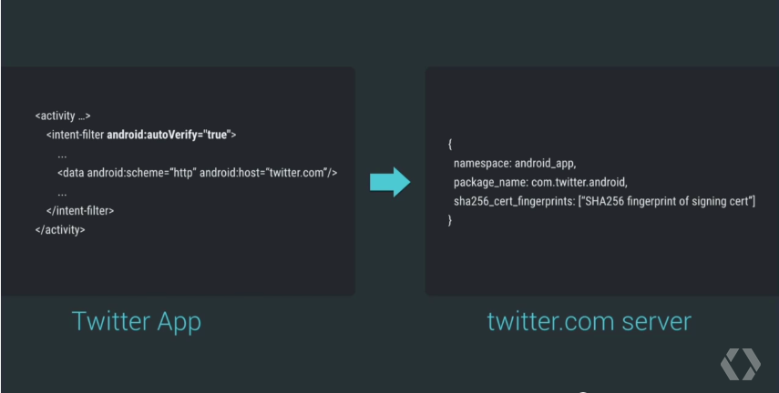

在app的manifest中添加 auto-verify（左边）并且在web服务器上添加一个statements JSON 文件（右边）就可以让你的web链接打开一个app。（statements JSON 文件即一个叫statements.json的文件，后面会提到）

比如，点击谷歌关于食谱的移动搜索结果或者一个别人发来的食谱链接会直接导航你到与该链接域名相关的app的食谱页面。

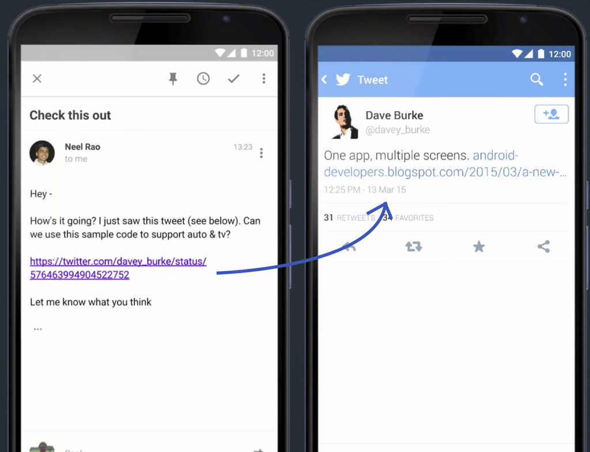

点击一条推特的web链接会直接带你到Twitter应用的相关推文页面。演示时以 Twitter url 为例，可以自动识别 url，点击就可自动打开对应的 app，其实 app 间的平行无缝切换，Android 一直就比其他平台都做得好。而这次的更新又可以使 App 间以及 App 与 Web 的联动表现得更加流畅了，通过 链接实现 app 与 Web 间的无缝切换形成的任务流更加连贯，只是不知道一向水火不容的国内某些厂商能不能把这样的特性加入到自己的 app 中？不过这个特性也给产品设计师们提供了更多使用场景的设想，也是一个为自己 App 带入流量的新途径。

web链接可以在任意地方发送，发布，或者打开，因为他们就是普通的链接，而且如果出现了什么错误，则会像平常一样用浏览器打开这个web页面。

#2 处理应用程序链接（App links）
用户在设备上跟随网络链接经常呈现混乱的选择。打开一个链接通常会导致系统询问用户应该选择哪个应用程序来处理这个链接。例如，点击一个来自银行的电子邮件里面的URI可能导致出现一个对话框询问用户是否使用浏览器，或银行的自己的应用程序来打开该链接。Android 6.0（API level 23）和其更高版本允许应用程序将自身指定为特定类型的链路的默认处理程序。如果用户不希望该应用作为默认处理程序，他们可以在设置里覆盖此行为 。
##2.1 创建验证的应用程序链接一般步骤
自动处理环节需要应用程序开发人员和网站所有者的合作。开发人员必须配置他们的应用程序来声明与一个或多个网站的关联，并要求该系统验证这些关联。一个网站所有者必须反过来，通过发布数字资产链接（Digital Asset Links)文件来提供验证。用于创建验证的应用程序链接（app links）的一般步骤如下：

**在您的app manifest，为您的网站的URI创建intent过滤器（intent filters）。**

**配置您的应用程序来请求app links的验证。**

**在你的网站发布数字资产链接（Digital Asset Links)JSON文件来提供验证。**

## 2.2 理解URI请求处理
App links功能可以让您的应用程序成为你指定网站的URI默认处理器，只要用户没有选择一个默认的应用程序来处理那个URI模式。当点击链接或程序的请求调用一个网站的URI的intent，Android系统使用以下准则，按降序排列，以确定如何处理请求：
###2.2.1用户设置了app links的关联：
如果用户已指定一个应用程序来处理app links，该系统传递网络的URI请求到那个应用程序。用户可以设置此关联的两种方法之一：从一个应用程序选择对话框选择一个应用程序的时候，单击**总是**;或者，打开设置>应用程序>（齿轮图标）>应用环节（ Settings > Apps > (gear icon) > App links），选择一个应用程序来使用，并设置应用程序的**App links**属性设置为**Open in this app**选项。
###2.2.2该用户没有设置任何关联，并且存在一个支持的应用程序：
如果用户没有设置匹配网页URI请求的优先权，并且只有一个应用程序声明支持此intent的URI模式，系统会自动将请求传递到该应用程序。
###2.2.3该用户没有设置任何关联，并且有多个支持的应用程序：
如果有多个应用程序声明支持该Web URI模式，系统会显示一个应用程序选择对话框，提示用户选择最合适的应用程序。

在情况2中，如果用户有新安装的应用程序，并且系统已经验证它成为一个处理这种类型的link的处理程序时，系统设置该应用为默认处理程序。在其它两种情况下，一个已验证的app links处理器的存在对系统的行为没有任何影响。

##2.3 为URIs创建一个Intent Handler
App links基于**intent**框架，它让应用程序能够处理来自系统或其他应用程序的请求。多个应用程序可以在他们的**intent filters**声明相同的网站链接URI模式。当用户点击一个没有默认启动处理程序的网络链接，平台会选择一个应用程序来处理该请求，使用**2.2理解URI请求处理**中所描述的标准。

为了让您的应用程序能够处理链接，在您的app manifest中使用intent filters 来声明你的应用程序要处理的URI模式。下面的例子显示了一个可以处理链接http://www.android.com 和 https://www.android.com 的intent filter 。

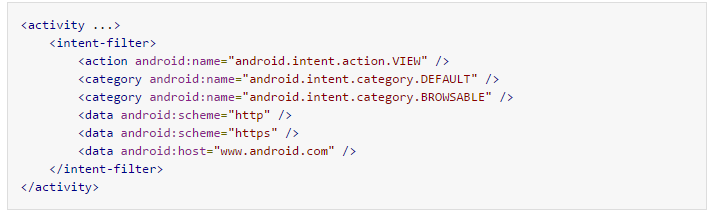

这个例子说明，app links的intent filter必须声明一个android：scheme value of http, https，或两者兼而有之。该过滤器不能声明任何其他方案。该过滤器还必须包括android.intent.action.VIEW和android.intent.category.BROWSABLE类别名称。

此manifest声明定义了您的应用程序和网站之间的连接。然而，为了使系统将您的应用程序作为一组URIs的默认处理程序，还必须要求系统验证此连接。下一节介绍如何实现这种验证。

##2.4 请求App Links验证
除了使用intent filters来声明一个你的应用程序和网站之间的关联，你的manifest中还必须包括一个附加声明—要求自动验证。当这个声明存在，Android系统会在安装后验证您的应用程序。如果验证成功，并且用户没有设置一个备用优先处理你的网站的URIs时，系统会自动将这些URI请求连接到你的应用程序。

该系统通过比较应用程序的intent filters的数据元素中的主机名的和托管在相应的网站域名上的**Digital Asset Links files**(**assetlinks.json**）执行app links验证。为了使系统能够验证一台主机，请确保您的intent filter的声明包括**android.intent.action.VIEW** intent action，**android.intent.category.BROWSABLE** intent category。
###2.4.1 启用自动验证
为了您的应用程序能够进行链接处理验证，在你的应用程序清单（app manifest）中的至少一个网络URI的intent filters中设置**android:autoVerify**属性为 **true**，如下面在清单中的的代码片段：

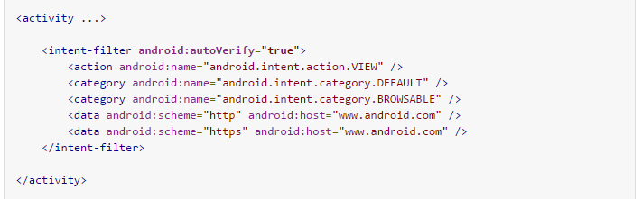

当android:autoVerify属性存在时，安装应用程序将导致系统尝试验证与您的所有应用程序的intent filter中与网络的URI相关联的所有主机。系统会将你的应用程序作为指定的URI模式的默认处理器，只有当它成功地验证所有在你的清单（manifest）中声明app link模式。
###2.4.2支持应用程序连接多台主机
该系统必须能够验证应用程序的网络URI的intent filters的数据元素中与托管在相应的网站域名上的Digital Asset Links files比较过的每一台主机。如果有任何验证失败，该应用程序就不能被验证是任何应用程序的intent filters定义的网络URI模式的默认处理器。例如，下面带有intent filters的一个应用程序会验证失败，如果assetlinks.json文件在 https://www.domain1.com/.well-known/assetlinks.json 和 https://www.domain2.com/.well-known/assetlinks.json 中未找到：

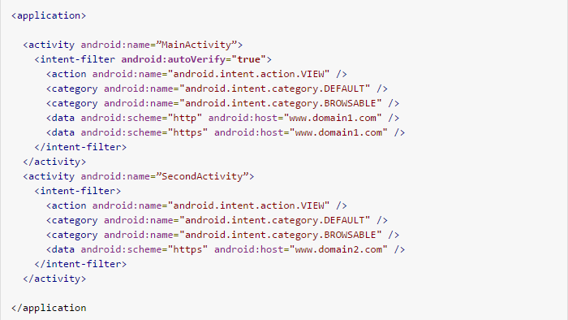

###2.4.3支持应用程序连接多个子域
数字资源链接协议（Digital Asset Links protocol ）会将一些子域看作一个独特的，分离的主机群。如果你的intent filter列出www.example.com和mobile.example.com子域作为主机，你必须在每个子域上搭一个单独的assetlink.json文件。例如，一个带有如下intent filter声明的应用程序将通过验证，当且仅当网站所有者发布有效的assetlinks.json文件在 https://www.example.com/.well-known/assetlinks.json 和 https://mobile.example.com/.well-known/assetlinks.json :

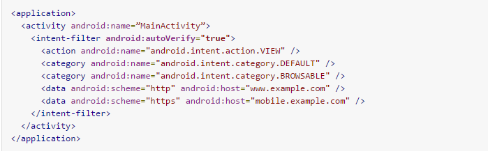
##2.5声明网站关联
为了使app link验证是成功的，网站所有者必须声明与应用程序的关联。网站所有者通过数字资产链接JSON（Digital Asset Links JSON）文件来声明与一个应用程序的关联，使用名字 assetlinks.json 在如下域上众所周知的位置：

**重要提示**：系统通过加密的HTTPS协议验证JSON文件。确保您托管的文件通过HTTPS是可以连接访问的，不管你的应用程序的intent filter是否包括https。

一个数字资产链接JSON文件表示与该网站相关的Android应用程序。JSON文件使用以下字段来标识相关的应用程序：

•	package_name：在应用程序的清单（manifest.）中声明的包名。

•	sha256_cert_fingerprints：您的应用程序的签名证书的SHA256指纹。您可以使用下面的命令通过Java密钥工具来生成指纹：

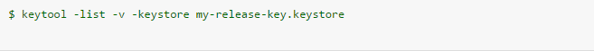

该字段支持多种指纹，它可以用于支持不同版本的应用程序，如debug和production builds。

在下面的例子中，assetlinks.json文件授予一个com.example Android应用程序link-opening权利：

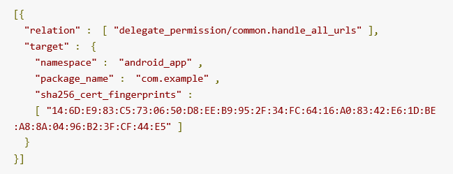

###2.5.1 一个网站关联多个应用程序
一个网站可以用相同的assetlinks.json 文件声明与多个应用程序的关联。下面的列出的文件显示一个例子，一个statement file声明分别与两个应用程序关联，并驻留在 https://www.example.com/.well-known/assetlinks.json ：

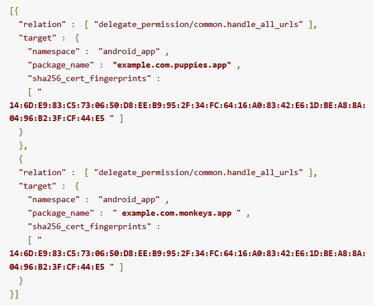

不同的应用程序可以在相同的网络主机处理不同资源的链接。例如，APP1可以为https://example.com/articles 声明一个intent filter，APP2可以为https://example.com/videos 声明一个intent filter。

注：与一个域相关的多个应用程序可以使用相同或不同的证书进行签名。

###2.5.2 多个网站关联单一的应用程序
多个网站可以声明与同一个应用程序关联，在它们各自的assetlinks.json文件中。下列文件显示如何声明domain1和domain2与APP1关联的一个例子。第一个显示了domain1与APP1的关联：

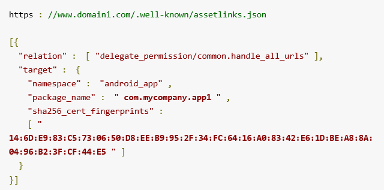

下一个显示domain2与APP1的关联。只有最后一行是不同的，它指定URL：

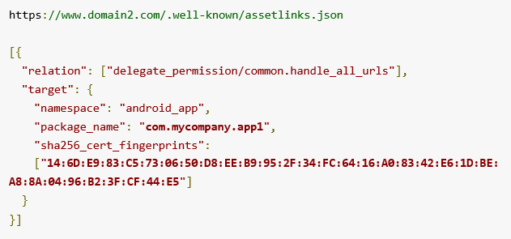

##2.6 测试App Links
当实现应用程序的连接功能时，您应该测试连接的功能，以确保该系统可以将您的应用程序与你的网站关联起来，并如您所愿处理URI请求。
###2.6.1 确认主机的列表来验证
测试时，您应确认该系统应该为您的应用程序验证的相关联主机列表。使的所有网络的URI，其相应的intent filters包含下列属性和元素：

•	android:scheme 值为http或https的属性

•	android:host 域URI模式的属性

•	android.intent.action.VIEW 类元素

•	android.intent.category.BROWSABLE 类元素

使用此列表检查在每个被命名的主机和子域上都有一个数字资产链接JSON文件。

###2.6.2确认数字资产链接文件（Digital Asset Links files）
对于每一个网站，使用数字资产链接的API，以确认该数字资产链接JSON文件正确地被部署和定义：

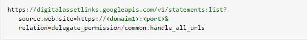

