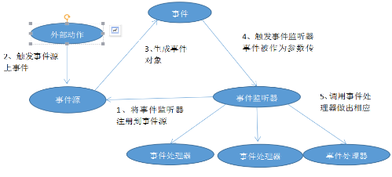
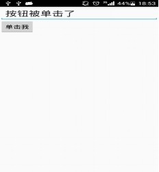

# Android基于监听的事件处理（1501210420 候转转）

## 

姓名：候转转              
学号：1501210420               

摘要：本论文主要介绍Android事件基于监听的事件处理机制。所谓事件监听器，就是实现了特定接口的java类的实例，在程序中实现事件监听器有5中情形，分别是内部类形式、外部类形式、Activity本身作为事件监听器类形式，匿名内部类形式、绑定标签的形式。

关键词：Android，监听器，5种情形

## 

1、基于监听事件的流程图



## 

2、事件监听涉及到的对象

 在事件监听的处理模型中，主要涉及如下这三类对象
* Event Source(事件源)：事件发生的场所，通常就是各个组件，例如按钮、窗口、菜单等。
* 
Event(事件)：事件封装了界面组件上的特定事情（通常就是一次用户操作），如果程序需要获得界面组件上的相关信息，一般通过Event对象来取得。
* 
Event Listener(事件监听器)：负责事件监听源所发生的事件，并对各种事件作出相应的相应。

## 

3、监听事件模型的编程步骤
* 
获取事件组件（事件源），也就是被监听的对象
* 实现事件监听器，该监听器类是一个特殊的类。必须实现一个XxxListener
* 调用事件源setXxxListerner方法事件监听器注册给普通组件（事件源）

## 

4、五种基于监听的事件处理类型

### 

4.1 内部内形式

布局文件：

```
<?xml version="1.0" encoding="utf-8"?>
<LinearLayout xmlns:android="http://schemas.android.com/apk/res/android"
    android:layout_width="match_parent"
    android:layout_height="match_parent"
    android:layout_gravity="center_horizontal"
    android:orientation="vertical"
    >
    <EditText
        android:id="@+id/txt"
        android:layout_width="match_parent"
        android:layout_height="wrap_content"
        android:editable="false"
        android:cursorVisible="false"
        android:textSize="12pt"/>
    <Button
        android:id="@+id/bn"
        android:layout_width="wrap_content"
        android:layout_height="wrap_content"
        android:text="单击我"/>
</LinearLayout>
```

Activity文件：

```
package com.example.hzz.myjishuwendang;

import android.support.v7.app.AppCompatActivity;
import android.os.Bundle;
import android.view.Menu;
import android.view.MenuItem;
import android.view.View;
import android.widget.Button;
import android.widget.EditText;

import java.security.PublicKey;
public class MainActivity extends AppCompatActivity {

    @Override
    protected void onCreate(Bundle savedInstanceState) {
        super.onCreate(savedInstanceState);
        setContentView(R.layout.main);
        Button bn=(Button)findViewById(R.id.bn);
        bn.setOnClickListener(new MyClickListener());
    }
    class  MyClickListener implements View.OnClickListener
    {
        @Override
          public void  onClick(View v)
       {
          EditText txt=(EditText)findViewById(R.id.txt);
          txt.setText("按钮被点击了");
       }
    }
}

```

运行结果：




使用内部类的优点是：可以在当前类中复用监听器类，因为监听器类是外部类的内部类，所以可以自由访问外部类的所有界面组件。


### 

4.2 外部内形式

Activity文件

```
package com.example.hzz.myjishuwendang;

import android.app.Activity;
import android.os.Bundle;
import android.support.v7.app.AppCompatActivity;
import android.widget.Button;
import android.widget.EditText;

/**
 * Created by hzz on 2015/12/14.
 */
public class MainActivity1 extends AppCompatActivity{
    @Override
    protected void onCreate(Bundle saveInstanceState) {
        super.onCreate(saveInstanceState);
        setContentView(R.layout.main);
        Button bnt=(Button)findViewById(R.id.bn);
        EditText edt=(EditText)findViewById(R.id.txt);
        bnt.setOnClickListener(new external(edt));
    }

}
```

外部内类作为监测器：

```
package com.example.hzz.myjishuwendang;

import android.app.Activity;
import android.os.Bundle;
import android.view.View;
import android.widget.EditText;

/**
 * Created by hzz on 2015/12/14.
 */
public class external implements View.OnClickListener{
    private EditText editable;
    public  external(EditText edit)
    {
        this.editable=edit;
    }
    @Override
    public void onClick(View v) {
        editable.setText("按钮被单击了");
    }
}


```

运行结果和4.1的结果一样，使用这个方法的优点是：如果某个事件监听器确实需要被多个gui界面所共享，而且主要是完成某种业务逻辑的实现，则可以考虑使用外部类的形式来定义事件监听器类。缺点是事件监听器通常属于特定的gui界面，定义成外部类不利于提高程序的内聚性。

### 

4.3 Activity本身作为事件监听器类

```
package com.example.hzz.myjishuwendang;

import android.os.Bundle;
import android.support.v7.app.AppCompatActivity;
import android.view.View;
import android.widget.Button;
import android.widget.EditText;

/**
 * Created by hzz on 2016/1/2.
 */
public class MainActivity4 extends AppCompatActivity implements View.OnClickListener {
   EditText show;
    @Override
    protected void onCreate(Bundle saveInstanceState) {
        super.onCreate(saveInstanceState);
        setContentView(R.layout.main);
        Button bnt=(Button)findViewById(R.id.bn);
        show=(EditText)findViewById(R.id.txt);
        bnt.setOnClickListener( this);
    }
    @Override
    public void onClick(View view)
    {
       show.setText("按钮被单击了");
    }

}

```


程序运行结果和4.1的结果一样，使用这种方法的优点是
可以直接在activity中定义事件的处理方法。
缺点有两点，一是程序结构混乱，Activity的主要职责应该是完成界面初始化，但此时还需包含事件处理器方法。
二是activity类实现了onclicklister事件监听接口，从而可以在该Activity类中直接定义事件处理器方法Onclick(viiew v),当为某个组件添加事件监听器对象时，直接使用this 作为事件监听器即可。

### 

4.4 匿名内部类形式

```
package com.example.hzz.myjishuwendang;

import android.os.Bundle;
import android.support.v7.app.AppCompatActivity;
import android.view.View;
import android.widget.Button;
import android.widget.EditText;

/**
 * Created by hzz on 2016/1/2.
 */
public class MainActivity2 extends AppCompatActivity {
    @Override
    protected void onCreate(Bundle saveInstanceState) {
        super.onCreate(saveInstanceState);
        setContentView(R.layout.main);
        Button bnt=(Button)findViewById(R.id.bn);
        final EditText editText=(EditText)findViewById(R.id.txt);
        bnt.setOnClickListener(new View.OnClickListener() {
            @Override
            public void onClick(View v) {
                editText.setText("按钮被点击了");
            }
        });
    }
}

```

程序运行结果个4.1一样。使用这种方法的优点是：大部分时候，事件处理器都没有什么利用价值（可复用代码通常都被抽象成了业务逻辑方法），因此大部分事件监听器只是临时使用一次，所以匿名内部类形式的事件监听器更合适这种形式是目前使用最广泛的事件监听器形式。
缺点：匿名内部类的语法有点不易掌握。

### 

4.5标签绑定形式

```
package com.example.hzz.myjishuwendang;
import android.app.Activity;
import android.os.Bundle;
import android.support.v7.app.AppCompatActivity;
import android.view.View;
import android.widget.Button;
import android.widget.EditText;

/**
 * Created by hzz on 2015/12/14.
 */
public class MainActivity3 extends Activity{
    @Override
    protected void onCreate(Bundle saveInstanceState) {
        super.onCreate(saveInstanceState);
        setContentView(R.layout.main);
    }
    public void clickHandler(View source)
        {
            EditText  show=(EditText)findViewById(R.id.txt);
            show.setText("按钮被单击了");
        }
}

```

### 

注明：在xml文件中的Button中要加一句android:onClick="clickHandler"

程序运行结果和4.1的结果一样。

## 

5、常见事件监听器接口及其处理方法

### 

5.1 OnClickListener接口
* 
功能：该接口处理的是点击事件。在触控模式下，是在某个View上按下并抬起的组合动作，而在键盘模式下，是某个View额焦点候点击确定键或者安装下轨迹球事件
* 
对应的回调方法：public void onClick(View v)
* 
说明：需要实现onClick方法，参数V便为事件发生的事件源。

### 

5.2 OnLongClickListener接口
* 
功能：OnLongClickListener接口与之前介绍的OnClickListener接口原理基本相同，只是该接口为View长按事件的捕捉接口，即当长时间按下某个View时触发的事件。
* 
对应的回调方法：public boolean onLongClick(View v)
* 
说明：需要实现onLongClick(View v)
* 
参数v：参数v为事件源控件，当长时间按下此控件时才会触发该方法。
* 
返回值：该方法的返回值为一个boolean类型的变量，当返回true时，表示已经完整的处理了整个事件，并不希望其他的回调方法再次执行；当返回false时，表示并没有完全处理完该事件，更希望其他方法对其进行处理。

### 

5.3 OnkeyListener接口
* 
功能：OnKeyListener是对手机键盘进行监听的接口，通过对某个View进行监听，当View获得焦点并有键盘事件时，便会触发该接口中的回调方法。
* 
对应的回调方法：public boolean onKey(View v,int keyCode,KeyEvent)
* 
说明：需要实现onKey方法。
* 
参数v：参数v为事件源的事件源控件。
* 
参数keyCode：参数keyCode为手机键盘的键盘码。
* 
参数event：参数event便为键盘事件封装类的对象，其中包含了事件的详细信息，例如发生的事件、事件的类型。

### 

5.4 OnFocusCjangeListener接口
* 
功能：OnFocusChangeListener接口用来处理控件焦点发生改变的事件。如果注册了该接口，当某个控件失去焦点或者获得焦点都会触发该接口中的回调方法。
* 
对应的回调方法：public void onFocusChange(View v,Boolean hasFocus)
* 
说明：需要实现onFocusChange方法。
* 
参数v：参数v便为触发该事件的事件源。
* 
参数hasFocus：参数hasFocus表示v的新状态，即v是否获得焦点。

### 

5.5 OnTouchListener接口
* 
功能：OnTouchListener接口是用来处理手机屏幕事件的监听接口，当为View的范围内触摸按下、抬起或滑动等动作时都会触发该方法。
* 
说明：需要实现onTouch方法。
* 
参数v：参数v同样为事件源对象。
* 
参数event：参数event为事件封装类的对象，其中封装了触发事件的详细信息，同样包括事件的类型、触发时间等信息。

### 

5.6 OnCreateContextMenuListener接口
* 
功能：OnCreateContextMenuListener接口是用来处理上下文菜单显示事件的监听接口。该方法是定义和注册上下文菜单的另一种方式。
* 
对应的回调方法：public void onCreateContextMenu(Context menu,View v,ContextMeneInfo info)
* 
说明：需要实现onCreateContextMenu方法。
* 
参数menu:参数manu为事件的上下文菜单。
* 
参数v：参数v为事件源view，当该View获得焦点时才可能接受该方法的事件相应。
* 
参数info：info对象中显示上下文菜单时被调用，开发人员通过实现该方法来处理上下文菜单显示时的一些操作，其使用方法与前面介绍的各个监听接口没有任何的区别。

## 

6 View类常见事件监听器注册方法
* 
void setOnClickListener(View.OnClickListener l)
* 
void setOnLongClickListener(View.OnLongClickListener l)
* 
void setOnKeyListener(View.OnKeyListener l)
* 
void setOnFocusChangeListener(View.OnFocusChangeListener l)
* 
void setOnTouchListener(View.OnTouchListener l)
* 
void setOnCreateContextMenuListener(View.OnCreateContextMenuListener l)


## 

7 总结

我们开发APP更多的时候是需要与用户的交互，即对用户的操作进行响应，这就涉及到了Android的事件处理机制。Android的事件处理机制是一种委托派事件处理方式：普通组件（事件源）将整个事件处理委托给特定的对象（事件监听器）；当该事件源发生指定的事件时，就通知所委托的事件监听器，由事件监听器来处理这个事件。本文中提到的五种监听形式各有自己的优缺点，我们编程的时候可以按照自己的需求采用最合适的方法。


## 

参考文献

### 

[1]李刚.疯狂Android讲义.电子工业出版社


