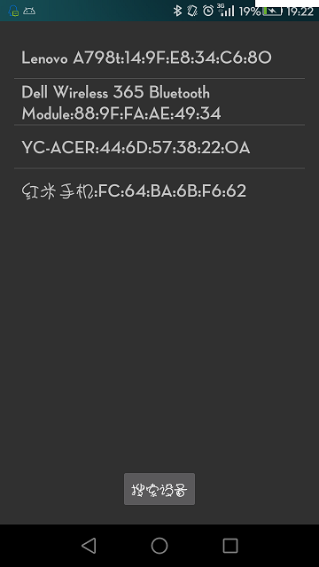

# Android无线网络技术——Bluetooth&WiFi编程（1501211015 杨超）

摘要
：自2008年10月发布第一部Android智能手机以来，其市场份额逐年提升，到2013年其全球市场占有率已达到78.1%，发展到当下Android设备已经成为应用最广泛的智能设备，其在电视、数码相机、游戏机、智能家居等领域也有非常多的应用。这些智能设备在使用过程中通常不可避免的需要进行网络互联，与Internet的连接、与其他设备之间的连接等。Android提供了多种交互方式的支持，包括Bluetooth、NFC、WiFi-Direct、USB和SIP，本文主要分析了Android在利用无线网络技术进行设备交互的特点和基本开发流程，分为AndroidBluetooth和WiFi两大部分。前者主要针对短距离内设备间的直接交互，后者可以通过互联网与远端设备进行交互，实际是网络通信方式的一种。

关键字：Android 蓝牙，WiFi，网络通信


## 一、Android Bluetooth通信


### 1.1、Bluetooth的功能与特性


安卓平台提供对蓝牙通讯栈的支持，它允许设备和其他的蓝牙设备进行无线传输数据。 应用程序层通过调用Android Bluetooth 相关的API来调用蓝牙相关功能。这些API使程序能够无线连接蓝牙设备，建立通信连接并进行信息传递，并拥有P2P或多端无线连接的特性。Adnroid Bluetooth API主要提供的功能有：扫描其他蓝牙设备、为可配对蓝牙设备查询蓝牙适配器、建立RFCOMM通道、通过服务搜索来连接其他设备、与其他设备进行数据传输、管理多个连接。


### 1.2、Bluetooth开发基本流程以及主要的类和接口


在进行蓝牙通信时其基本的也是关键的步骤主要有5步：

1、	开启蓝牙

2、	查找附近已配对或可用的设备

3、	创建通信连接

4、	获取输入输出流并读取或写入数据

5、	关闭连接、释放资源

常用的类和接口：

BluetoothAdapter类

表示本地蓝牙适配器，主要用来对蓝牙进行基本操作，它是所有蓝牙交互操作的入口，如搜索其他的蓝牙设备、查询可配对的设备集合、根据已知的MAC地址来初始化一个BluetoothDevice实例对象、创建一个BluetoothServerSocket类以监听其它设备对本机的连接请求等。

获取BluetoothAdapter实例，在Android4、4.2.2（对应的API级别为17）及之前的版本使用getDefaultAdapter()方法获取，在Android4.3（对应的API级别为18）及其以后的版本中可以使用getSystemService()和BLUETOOTH_SERVICE方式获取。该类常用的方法如下表：

| BluetoothAdapter  getDefaultAdapter() |获取本地蓝牙适配器|
| -- | -- |
| boolean startDiscovery() | 开始搜索附近的蓝牙设备 |
| Set&lt;bluetoothdevice&gt; getBondedDevice() | 获取已配过对的蓝牙设备集合 |
| BluetoothServiceSocket listenUsingRfcommWithServiceRecord(String name, UUID uuid) | 建立监听请求的Socket(用作服务端)|
| BluetoothDevice getRemoteDevice()| 获取BluetoothDevice对象|

BluetoothDevice类

该类表示一个远程的蓝牙设备，该对象包含了对蓝牙硬件的基本信息以及对蓝牙设备的操作，对于基本信息而言，这部分是硬件固有的属性，如MAC地址，其提供了外部访问的接口，另外还封装了一些逻辑操作，如建立通信连接、获取绑定状态等，这些都是与使用过程相关的信息。其提供的常用方法如下表：

| BluetoothSocket createRfcommSocketToServiceRecord(UUID uuid) |创建一个蓝牙Socket通信连接。 |
| -- | -- |
| Int getBondState() |获取设备的绑定状态 |
| String getName()| 获取设备的名称 |
| String getAddress() | 获取设备的硬件地址 |
BluetoothSocket类

与TCP通信的Socket类似，该类表示了蓝牙通信的逻辑连接，通过该类实现数据的读取与写入，控制通信过程。其提供的方法如下表：

|BluetoothDevice getRemoteDevice()|	获取待连接或已连接的蓝牙设备|
| -- | -- |
|boolean isConnected()	|判断Socket的连接状态|
|InputStream getInputStream()	|获取与Socket关联的输入流
|OutputStream getOutputStream()	|获取与Socket关联的输出流|
|Void connect()	|尝试连接一个远程的蓝牙设备|
|Void close()	|关闭连接并释放资源|
BluetoothServerSocket类

该类主要用于当设备作为服务端时的操作，服务端一般会被动的等待来自客户端的连接或服务请求，因此其功能与提供的方法也非常简单，如下表：

|BluetoothSocket accept(int timeout)|	等待建立连接，知道超过timeout规定的时间|
|--|--|
|BluetoothSocket accept()	|一直等待，直到建立连接|
|Void close()	|关闭连接并释放资源|

上述介绍了Android Bluetooth中常用的几个类，除了这些还有许多其他的类或接口，如BluetoothClass，其描述了蓝牙设备的通用特性和功能；BluetoothProfile，用于定义设备间基于蓝牙的通信规范，目的是保持不同蓝牙设备之间的兼容，基本的规范有GAP、SDAP、SPP和GOEP；BluetoothHeadset，与头戴式蓝牙设备如蓝牙耳机相关的类；BluetoothHealth，用于定义蓝牙健康设备有关的类；BluetoothA2dp、BluetoothHealthCallback、BluetoothHealthAppConfiguration、BluetoothProfile.ServiceListener等。


### 1.3、蓝牙开发实例


本实例实现了两部Android手机利用蓝牙互相发送消息的功能。
开发客户端应用：
1、在AndroidManifest.xml中申请蓝牙相关操作权限

&lt;uses-permission android:name="android.permission.BLUETOOTH_ADMIN" />
&lt;uses-permission android:name="android.permission.BLUETOOTH" />

2、请求用户开启蓝牙设备
```
if(!bluetoothAdapter.isEnabled()){
    Intent intent = new Intent(BluetoothAdapter.ACTION_REQUEST_ENABLE);
    intent.putExtra(BluetoothAdapter.EXTRA_DISCOVERABLE_DURATION,600);
    startActivity(intent);
}
```
如下图：


在此之前同过BluetoothAdapter.getDefaultAdapter()方法获取蓝牙适配器对象

3、搜索附近可用否设备
bluetoothAdapter.startDiscovery()

如下图：
可以看到搜索到了四个蓝牙设备

4、连接设备，连接设备时需要确保搜索过程已经结束，否则会出现异常。
另外利用createRfcommSocketToServiceRecord(UUID)的方式可能会连接异常，可以使用Method m = device.getClass().getMethod("createRfcommSocket", new Class[] {int.class});
bluetoothSocket = (BluetoothSocket) m.invoke(device, Integer.valueOf(1));
的方式获取bluetoothSocket对象。
```
protected void connect(final BluetoothDevice device){
    new Thread(){
        @Override
        public void run() {
            super.run();
            System.out.println("连接设备...");
            bluetoothAdapter.cancelDiscovery();
            Message message = new Message();
            try {
                bluetoothSocket = device.createRfcommSocketToServiceRecord(UUID.fromString("00001101-0000-1000-8000-00805F9B34FB"));
                bluetoothSocket.connect();
                message.obj = device.getName();
                message.what = 1;
            }catch (Exception e) {
                message.what = 0;
                System.out.println("连接失败");
                e.printStackTrace();
            }
            handler.sendMessage(message);
        }
    }.start();
}
```
5、发送信息，其数据的传递是通过字节流的方式进行的。

```
try {
    outputStream = bluetoothSocket.getOutputStream();
    byte[] buf = str.getBytes();
    outputStream.write(buf);
    outputStream.close();
}catch (Exception e){
    e.printStackTrace();
}

```
开发服务端应用：
与客户端一样也需要申请蓝牙相关的权限、开启蓝牙设备等。不同的是在服务端需要监听来自客户端的请求。主要代码如下：
```
new Thread(){
    @Override
    public void run() {
        super.run();
        System.out.println("等待设备连接");
        if(bluetoothAdapter!=null){
            Message message = new Message();
            try {
                bluetoothServerSocket = bluetoothAdapter.listenUsingRfcommWithServiceRecord("BluetoothChat",UUID.fromString("00001101-0000-1000-8000-00805F9B34FB"));
                    bluetoothSocket = bluetoothServerSocket.accept();
                bluetoothServerSocket.close();
                    if(bluetoothSocket!=null){
                        message.what = 1;
                }
            }catch (Exception e){
                message.what = 0;
                isConnected = false;
                e.printStackTrace();
            }finally {
                handler.sendMessage(message);
            }
        }
    }
}.start();

```

由于bluetoothServerSocket的accept方法会阻塞主线程，因此需要另外开辟新的线程来处理来自客户端的连接请求，在accept方法成功返回后，会得到一个与客户端连接的bluetoothSocket对象，通过该对象可以获取客户端传递过来的数据，也可以通过该对象想客户端发送数据，这样就实现了双方的互相通信。主要代码如下：
```
try {
    String name = bluetoothSocket.getRemoteDevice().getName();
    System.out.println(name+"设备连接");
    tv_target.setText(name);
    byte[] buf = new byte[1024];
    inputStream = bluetoothSocket.getInputStream();
    isConnected = true;
    inputStream.read(buf);
    String s = new String(buf);
    System.out.println("服务端接收到：" + s);
    String content = tv_content.getText().toString();
    tv_content.setText(content + "\n" + s);
    inputStream.close();
}catch (Exception e){
    e.printStackTrace();
}

```
上述代码实现了简单的字符串数据传递，对于大容量的二进制数据其处理方式大致与此类似。需要注意的是，由于蓝牙版本的不同，也可能导致在建立连接时出现各种异常，因此，为了应用的通用性需要做更多的适配工作。


### 1.3、Bluetooth开发小结


从蓝牙的应用上看，现在市面上绝大部分Android设备都具有蓝牙模块，由于其通信距离的限制，对其实际的应用场景不是很多，在一些特定的场景，如健康设备、短距离互联才体现其应用，关于利用蓝牙进行应用程序相关开发，总体不是特别复杂，重点在于不同设备、不同版本的的蓝牙设备之间建立连接的过程，一旦成功建立连接，其信息传递过程还是相对比较容易的。


## 二、Android WIFI通信


### 2.1、WiFi的功能与特性


WiFi是一种可以将个人电脑、手持设备（如pad、手机）等终端以无线方式互相连接的技术，相对于有线网络，其具有便携特性，极大的简化的设备的设计，方便的人们的生活。常见的无线网络有无线路由器实现，如果该无线路由器连接了一条ADSL线路或者别的上网线路，则又被称为热点。


### 2.2、WiFi开发基本流程以及主要的类和接口


利用WiFi进行通信与直接进行网络通信没有太大的区别，其也是网络通信中的一种，相关的类集中在android.net.wifi包中，Android提供了许多针对WiFi通信的工具类，用于管理WiFi、传输信息等。

基于Android wifi的应用程序开发流程与网络程序开发流程相似，其支持B/S与C/S两种网络架构，即也支持基于Http协议和基于Socket的开发方式。Http方式是一种应答模式，即一方发起请求另一方做出反馈，通信过程中需要遵循一定的规范，Socket方式是比Http方式更加底层网络通信方式，其通信是在一条全双工的逻辑链路上进行通信，双方既可以作为客户端也可以作为服务端，其具有更高的通信效率和灵活性。Socket通信模型如下图：


基于Http协议的开发流程：

1、	利用HttpURLConnection连接到指定的URL

2、	向服务器发送请求参数，即Http请求头相关参数的设定

3、	向服务器发起请求或发送数据

4、	解析服务器返回的数据

基于Socket的开发流程：

1、	创建Socket连接

2、	传输数据

3、	关闭连接

常用的关于WiFi的工具类

ScanResult类：
描述检测到的WiFi接入点信息，包含网络名称、接入点地址、频率等信息。其只包含一个描述这些信息的toString方法。

WifiConfiguration类：主要提供了WiFi配置信息的访问接口，如安全协议、密码管理模式、认证方式等。

WifiInfo类：用于描述已经建立连接的或正在建立连接的WiFi状态信息。如IP地址、MAC地址、网络id等。

WifiManager类：提供针对WiFi连接的基本操作，管理WiFi连接。
常用的方法如下表：

|WifiManager.WifiLock createWifiLock()|	创建保持WiFi连接一直持续的锁|
| -- | -- |
|boolean disconnect()	|断开wifi连接|
|WifiInfo getConnectionInfo()	|获取连接状态信息|
|List&lt;ScanResult> getScanResults()|	获取扫描结果集|
|Int getWifiState()	|获取wifi启动状态|
|boolean startScan()	|开始进行接入点扫描|

### 2.3、WiFi开发实例


本实例实现了通过Android手机控制电脑播放PPT的功能。

基本思路：分为服务端与App端，App端主要向服务端发送操作命令，同过Socket进行通信，在服务端利用java提供Robot对象模拟对机器的操作，如键盘按压，鼠标点击，模拟PPT快捷键实现对PPT的控制，PPT的打开快捷键为Shift+F5，上一张和下一张分别为键盘左右键，退出为ESC键。

主要代码：

App端

申请网络权限
```
<uses-permission android:name="android.permission.ACCESS_NETWORK_STATE"/>
<uses-permission android:name="android.permission.INTERNET"/>

```
主要代码：
```
public class MainActivity extends AppCompatActivity implements View.OnClickListener {

    private Button btn_open,btn_close,btn_last,btn_next;
    private Socket socket;
    private ObjectOutputStream objectOutputStream;

    @Override
    protected void onCreate(Bundle savedInstanceState) {
        super.onCreate(savedInstanceState);
        setContentView(R.layout.activity_main);
        btn_open = (Button)findViewById(R.id.btn_open);
        btn_close = (Button)findViewById(R.id.btn_close);
        btn_last = (Button)findViewById(R.id.btn_last);
        btn_next = (Button)findViewById(R.id.btn_next);
        btn_open.setOnClickListener(this);
        btn_close.setOnClickListener(this);
        btn_last.setOnClickListener(this);
        btn_next.setOnClickListener(this);
        new Thread(){
            @Override
            public void run() {
                super.run();
                try {
                    socket = new Socket(InetAddress.getByName("192.168.14.170"),8888);
                    objectOutputStream = new ObjectOutputStream(socket.getOutputStream());
                }catch(Exception e) {
                    e.printStackTrace();
                }
            }
        }.start();


    }

    @Override
    public void onClick(View v){
        try {
            switch (v.getId()){
                case R.id.btn_open:
                    objectOutputStream.writeObject(new String("open"));
                    break;
                case R.id.btn_close:
                    objectOutputStream.writeObject(new String("close"));
                    break;
                case R.id.btn_last:
                    objectOutputStream.writeObject(new String("last"));
                    break;
                case R.id.btn_next:
                    objectOutputStream.writeObject(new String("next"));
                    break;
                default:break;
            }
        }catch (Exception e){
            e.printStackTrace();
        }
    }

    @Override
    protected void onDestroy() {
        try {
            objectOutputStream.writeObject(new String("quit"));
        super.onDestroy();
            if(objectOutputStream!=null)objectOutputStream.close();
            if(socket!=null)socket.close();
        }catch (Exception e){
            e.printStackTrace();
        }
    }
}

```
可以看到在App端，通过传递String的方式传递操作命令，在测试时手机与PC在同一个局域网内，但如有需要，也可以改为远端设备的IP地址，通信的端口设置为8888.
布局文件内容：

```
<RelativeLayout xmlns:android="http://schemas.android.com/apk/res/android"
    xmlns:tools="http://schemas.android.com/tools" android:layout_width="match_parent"
    android:layout_height="match_parent" android:paddingLeft="@dimen/activity_horizontal_margin"
    android:paddingRight="@dimen/activity_horizontal_margin"
    android:paddingTop="@dimen/activity_vertical_margin"
    android:paddingBottom="@dimen/activity_vertical_margin" tools:context=".MainActivity">
    <Button
        android:id="@+id/btn_open"
        android:text="开始"
        android:layout_centerInParent="true"
        android:layout_width="wrap_content"
        android:layout_height="wrap_content" />
    <Button
        android:id="@+id/btn_close"
        android:text="结束"
        android:layout_centerInParent="true"
        android:layout_below="@+id/btn_open"
        android:layout_width="wrap_content"
        android:layout_height="wrap_content" />
    <LinearLayout
        android:layout_width="fill_parent"
        android:layout_height="wrap_content"
        android:layout_alignParentBottom="true"
        android:orientation="horizontal">
        <Button
            android:id="@+id/btn_last"
            android:text="上一张"
            android:layout_weight="1"
            android:layout_width="wrap_content"
            android:layout_height="wrap_content" />
        <Button
            android:id="@+id/btn_next"
            android:text="下一张"
            android:layout_weight="1"
            android:layout_width="wrap_content"
            android:layout_height="wrap_content" />
    </LinearLayout>
</RelativeLayout>

```
页面布局仅包含四个表示对PPT控制的基本操作。

服务端的代码为：

```
public class PPTControler {

    private static ObjectInputStream inputStream;

    public static void main(String[] args) throws IOException,ClassNotFoundException, AWTException, InterruptedException{
        ServerSocket sSocket = new ServerSocket(8888);
        System.out.println("等待连接...");
        Robot robot = new Robot();
        Socket socket = sSocket.accept();
        System.out.println("接收到连接"+socket.getInetAddress().getHostAddress());
        inputStream = new ObjectInputStream(socket.getInputStream());
        while(true){
            String opt = (String)inputStream.readObject();
            if(opt.equals("open")){
                robot.keyPress(KeyEvent.VK_SHIFT);
                Thread.sleep(20);
                robot.keyPress(KeyEvent.VK_F5);
                Thread.sleep(10);
                robot.keyRelease(KeyEvent.VK_F5);
                robot.keyRelease(KeyEvent.VK_SHIFT);
                Thread.sleep(10);
            }else if(opt.equals("close")){
                robot.keyPress(KeyEvent.VK_ESCAPE);
                Thread.sleep(10);
                robot.keyPress(KeyEvent.VK_ESCAPE);
                Thread.sleep(10);
            }else if(opt.equals("last")) {
                robot.keyPress(KeyEvent.VK_LEFT);
                Thread.sleep(10);
                robot.keyRelease(KeyEvent.VK_LEFT);
                Thread.sleep(10);
            }else if (opt.equals("next")) {
                robot.keyPress(KeyEvent.VK_RIGHT);
                Thread.sleep(10);
                robot.keyRelease(KeyEvent.VK_RIGHT);
                Thread.sleep(10);
            }else if(opt.equals("quit")) {
                break;
            }else {
                System.out.println("无法识别的命令");
            }
        }
        inputStream.close();
        socket.close();
        sSocket.close();
    }

}

```
先运行服务端的程序，起开始处于监听状态，当打开App后，建立与PC的连接，然后在操作App的过程中将对应操作字符串传递到服务端，服务端获取命令后，根据操作类型模拟相应的操作。在服务端的代码中可以看到，模拟键盘操作时有许多的Thread.sleep()，这是模拟了键盘按压过程的时间间隔与按压与释放的时间间隔。

运行效果截图：

开启服务端程序

打开App时
服务端
	
App端


打开一个PPT文件	

在App端点击开始按钮

在App端点击下一张

其他操作过程类似，可以实现对PPT的播放控制。

### 2.3、WiFi开发小结


WiFi是网络接入方式的一种，在我们日常生活中其应用也十分广泛，属于无线网络技术的一种，WiFi开发实际也是网络开发的一种，其开发流程比较固定，相对于蓝牙，其支持范围更广的通信，支持多种网络协议的通信。

## 三、总结和收获


通过对Android的无线网络技术的学习，基本了解了Android在利用无线网络技术进行通信的基本特点，以及相关的概念和实际开发问题。

进过对Android蓝牙和WiFi的相关实验操作，了解到了许多在实际开发过程中的问题，如蓝牙设备之间互相连接的问题，网络数据传递的问题等。对于实现手机控制PPT，实际是网络通信的过程，然后有PC端转化成相应的操作命令，利用java提供的Robot对象，还可以实现其他的一些控制，如定时关机、传输文件、远程桌面控制等。

## 四、感谢


 非常感谢张老师这一个学期的辛勤指导，在此过程中让我收获颇丰，通过课程的学习以及课后大项目的练习，我了解了Android用于的基本架构，掌握了许多Android开发技巧，对Android在实际生产过程中的应用也有了一定的认识，具备了一定的开发能力，同时也对Android开发产生了较为浓烈的兴趣。非常希望有机会能再次学习类似实践型的课程。


## 参考文献


1 扶松柏;Android开发从入门到精通[D];兵器工业出版社;2012年
2 郭霖;第一行代码Android[D];人民邮电出版社;2014年
3 John Wiley & Sons, Inc., Beginning Android™ 4 Application Development[D];2012
