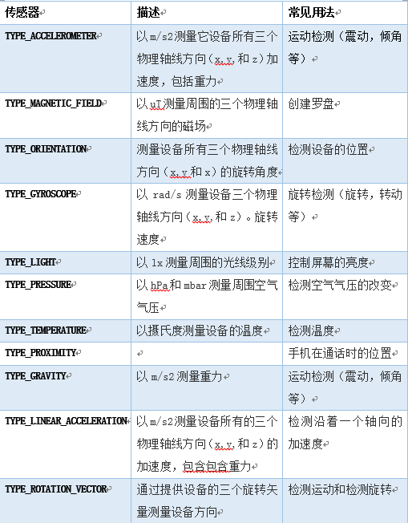

# Android加速度传感器编程

起草人: 胡煌   日期：15年11月30日

# 
**一、实验目的**

*探究Android中加速度传感器在应用开发中的具体实现，通过编写一个加速度传感器的代码实例，来展现在改变手机的位置状态时，传感器中X坐标值、Y坐标值和Z坐标值会发生相应的变化。*

**二、基础知识**

*1、在绝大多数Android设备中都内置有各类传感器，用来测量运动、方向和各种环境条件。这些传感器能够提供非常精确的原始数据，来刻画手机的各种状态，这些高精度的原始数据对你监控设备的三维运动，或者设备周围的环境变化等等，是非常有用的。例如，在玩游戏过程中需要跟踪重力传感器的数据，来推断复杂的用户手势和动作；在天气应用中可能需要使用温度传感器和湿度传感器来记录数据；在旅行过程中可能会使用磁场传感器和加速度传感器来判断方。
Android平台目前支持的三大类传感器：*

*1) 位移传感器，这些传感器测量沿三个轴线测量加速度和旋转。这类包含家加速度，重力传感器，陀螺仪，和矢量传感器。*

*2) 环境传感器，这些传感器测量各种环境参数，例如周围的空气温度和压力，光线，和湿度。这类包含气压，光线，和温度传感器。*

*3) 位置传感器，这些传感器测量设备的物理位置。这类包含方向和磁力传感器。*

*在开发过程中，通过使用Android传感器提供的框架获取原始数据。传感器框架提供了一些类和接口，帮助开发者来完成各种与传感器有关的任务。本次试验我们主要介绍位移传感器中的加速度传感器。*

*2、Android平台主要支持的传感器类型，具体如下（Sensor类）：*


*3、加速度传感器，又称G-sensor,返回X轴、Y轴和Z轴的加速度值。这里要先介绍一下Android中如何用这三条轴线来描述，当手机垂直放在桌面上，X轴正向为沿着屏幕向右的方向，Y轴正向为沿着屏幕向前的方向，Z轴正向为垂直与屏幕平面向上的方向，如图：*


*该数值包含地心引力的影响，单位是m/s^2。*

*将手机平放在桌面上，x轴默认为0，y轴默认0，z轴默认9.81。*

*将手机朝下放在桌面上，z轴为-9.81。*

*将手机向左倾斜，x轴为正值。*

*将手机向右倾斜，x轴为负值。*

*将手机向上倾斜，y轴为负值。*

*将手机向下倾斜，y轴为正值。*


**三、基础知识**

**3.1 实验内容**

*实现一个加速度传感器的用例代码，在手机上运行，通过晃动，翻转和倾斜来观察加速度传感器返回三个轴线的值的变化情况。*

**3.2实验步骤**

*（1）新建一个Android工程，命令为AccelerometerSensorDemo*


*（2）在MainActivity中需要实现SensorEventListener接口，这个接口用来监听传感器，并从传感器中获取数据。需要注意的是，在实现SenorEventListener接口之后，需要重写两个重要的方法：*

*onAccuracyChanged(Sensor sensor, int accuracy)*

*onSensorChanged(SensorEvent event)*

*下面看下Android的官方文档对这两个方法的解释。第一个方法在监听传感器的精度发生变化的时候调用，由于每种传感器的精度不一样，当精度变换时此方法就被触发了。方法中的第一个参数就是已经注册并且正在监听的传感器，第二个参数accuracy为新的精度值：*

*SensorManager.SENSOR_STATUS_ACCURACY_HIGH  传感器报告高精度值*

*SensorManager.SENSOR_STATUS_ACCURACY_LOW  传感器报告低精度值*

*SensorManager.SENSOR_STATUS_ACCURACY_MEDIUM  传感器报告平均精度值*

*SensorManager.SENSOR_STATUS_ACCURACY_UNRELIABLE 传感器报告的精度值不可靠。*

*第二个方法在监听传感器返回的值发生变化时调用，这个好理解，比如在加速度传感器中，会有x、y和z三个值来描述手机状态，当这三个值发生变化的时候，此方法就被调用了。*

*（3）编写的代码如下：*

*首先在MainActivity中定义四个TextView来显示加速度传感器返回的三维坐标值*


```
private SensorManager mSensorManager;
private Sensor mSensor;
......
mSensorManager = (SensorManager) getSystemService(SENSOR_SERVICE);
if (mSensorManager == null) {
    Log.d(TAG, "device does not support SensorManager");
} else {
    //  G-Sensor
    mSensor = mSensorManager.getDefaultSensor(Sensor.TYPE_ACCELEROMETER);
    mSensorManager.registerListener(this, mSensor, SensorManager.SENSOR_DELAY_NORMAL);
}
```
*定义一个SensorManager对象和Sensor对象，然后通过调用系统方法getSystemService来获取传感器服务，返回一个SensorManager对象，然后在通过SensorManager来返回一个加速度传感器对象，通过SensorManager对象来给加速度传感器对象添加监听器。*

*由于开始状态时，X = 0, Y = 0, Z = 9；所以把posX、posY和posZ的初始化为0、0和9。这里主要重写onSensorChanged方法，通过SensorEvent对象返回的values数组中获取三维坐标值。*
```
int x = (int) event.values[0];
int y = (int) event.values[1];
int z = (int) event.values[2];
...
int px = Math.abs(posX - x);
int py = Math.abs(posY - y);
int pz = Math.abs(posZ - z);
int maxValue = getMaxValue(px, py, pz);

```
*然后将这三个值与posX、posY和posZ比较进行判断，获取坐标轴方向上变化最大的值，同时获取设备处于这种新状态的时间，*
```
long stamp = mCalendar.getTimeInMillis() / 10001;

```
*之后判断，如果坐标轴方向上变化的最大值超过2，并且这种状态持续了30ms，那就可以大致判断手机是处于颠簸状态了，当然这种判断不一定完全准确，但是在一定的环境是行得通的。*
```
if (maxValue > 2 && (stamp - lastTimeStamp) > 30) {
    lastTimeStamp = stamp;
    Log.d(TAG, " sensor is moved or changed...");
    textViewInfo.setText("检测手机在移动...");
}

```
*最后将新状态下的三维坐标值记录下来，以便下次获取另外一个状态的坐标值后，与之进行比较。*
```
posX = x; 
posY = y; 
posZ = z;

```
*MainActivity.java的代码如下：*
```
package com.example.tony.gravitysensordemo;

import android.app.Activity;
import android.hardware.Sensor;
import android.hardware.SensorEvent;
import android.hardware.SensorEventListener;
import android.hardware.SensorManager;
import android.os.Bundle;
import android.util.Log;
import android.view.Menu;
import android.view.MenuItem;
import android.widget.TextView;

import java.util.Calendar;

public class MainActivity extends Activity implements SensorEventListener {

    private static final String TAG = "AccelerometerSensorDemo";

    private SensorManager mSensorManager;
    private Sensor mSensor;

    private TextView textViewInfo;
    private TextView textViewX;
    private TextView textViewY;
    private TextView textViewZ;

    private int posX = 0;
    private int posY = 0;
    private int posZ = 9;

    private Calendar mCalendar;
    private long lastTimeStamp = 0;

    @Override
    protected void onCreate(Bundle savedInstanceState) {
        super.onCreate(savedInstanceState);
        setContentView(R.layout.activity_main);

        textViewInfo = (TextView) findViewById(R.id.textView1);
        textViewX = (TextView) findViewById(R.id.textView2);
        textViewY = (TextView) findViewById(R.id.textView3);
        textViewZ = (TextView) findViewById(R.id.textView4);

        mSensorManager = (SensorManager) getSystemService(SENSOR_SERVICE);
        if (mSensorManager == null) {
            Log.d(TAG, "device does not support SensorManager");
        } else {
            //  G-Sensor
            mSensor = mSensorManager.getDefaultSensor(Sensor.TYPE_ACCELEROMETER);
            mSensorManager.registerListener(this, mSensor, SensorManager.SENSOR_DELAY_NORMAL);
        }
    }

    @Override
    public boolean onCreateOptionsMenu(Menu menu) {
        // Inflate the menu; this adds items to the action bar if it is present.
        getMenuInflater().inflate(R.menu.menu_main, menu);
        return true;
    }

    @Override
    public boolean onOptionsItemSelected(MenuItem item) {
        // Handle action bar item clicks here. The action bar will
        // automatically handle clicks on the Home/Up button, so long
        // as you specify a parent activity in AndroidManifest.xml.
        int id = item.getItemId();

        //noinspection SimplifiableIfStatement
        if (id == R.id.action_settings) {
            return true;
        }

        return super.onOptionsItemSelected(item);
    }

    @Override
    protected void onStop() {
        super.onStop();

        if (mSensorManager != null) {
            mSensorManager.unregisterListener(this);
            mSensorManager = null;
        }
    }

    @Override
    public void onAccuracyChanged(Sensor sensor, int accuracy) {

    }

    @Override
    public void onSensorChanged(SensorEvent event) {
        if (event.sensor == null)
            return;

        if (event.sensor.getType() == Sensor.TYPE_ACCELEROMETER) {
            int x = (int) event.values[0];
            int y = (int) event.values[1];
            int z = (int) event.values[2];

            mCalendar = Calendar.getInstance();
            long stamp = mCalendar.getTimeInMillis() / 10001;

            textViewX.setText(String.valueOf(x));
            textViewY.setText(String.valueOf(y));
            textViewZ.setText(String.valueOf(z));

            int second = mCalendar.get(Calendar.SECOND);

            int px = Math.abs(posX - x);
            int py = Math.abs(posY - y);
            int pz = Math.abs(posZ - z);
            Log.d(TAG, "X:" + x + " Y:" + y + " Z:" + z + " stamp:" + stamp
                    + " second:" + second);
            int maxValue = getMaxValue(px, py, pz);
            if (maxValue > 2 && (stamp - lastTimeStamp) > 30) {
                lastTimeStamp = stamp;
                Log.d(TAG, " sensor is moved or changed...");
                textViewInfo.setText("检测手机在移动...");
            }

            posX = x;
            posY = y;
            posZ = z;
        }
    }

    public int getMaxValue(int x, int y, int z) {
        int max = 0;
        if (x >= y && x >= z) {
            max = x;
        } else if (y >= x && y >= z) {
            max = y;
        } else if (z >= x && z >= y) {
            max = z;
        }

        return max;
    }
}
```


**四、常见问题及注意事项**

*详细描述本此实验的可能会遇到的问题以及相关的注意事项*