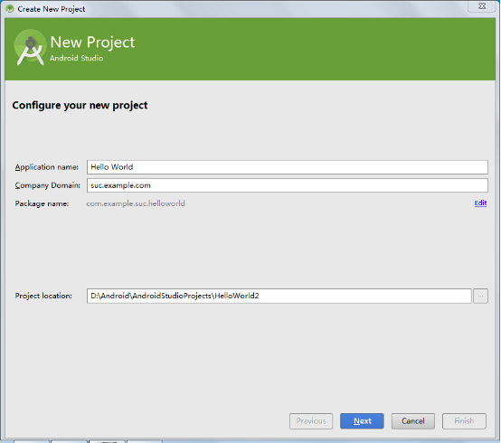
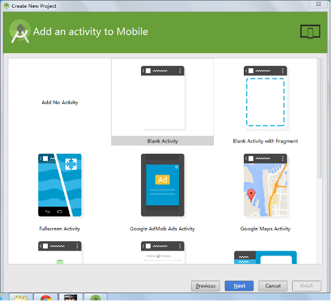
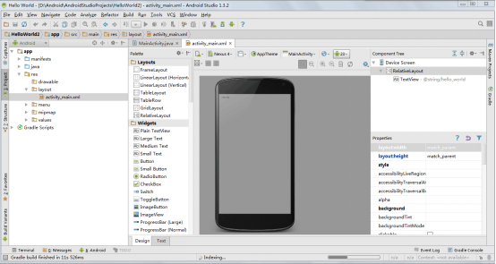
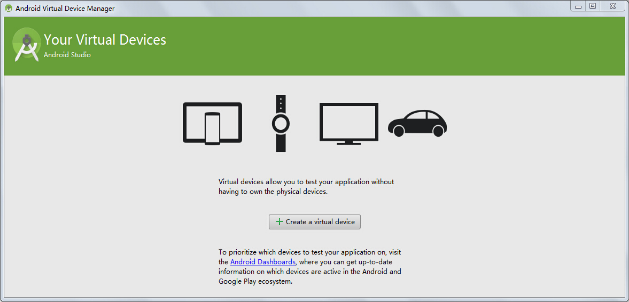
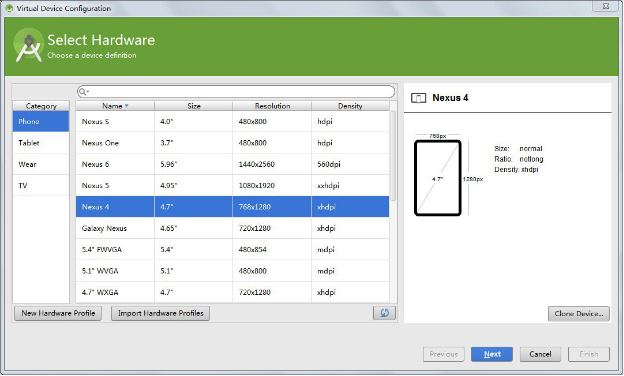
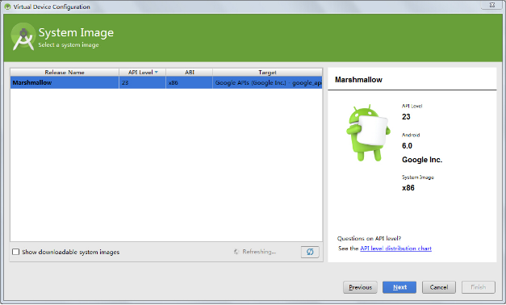
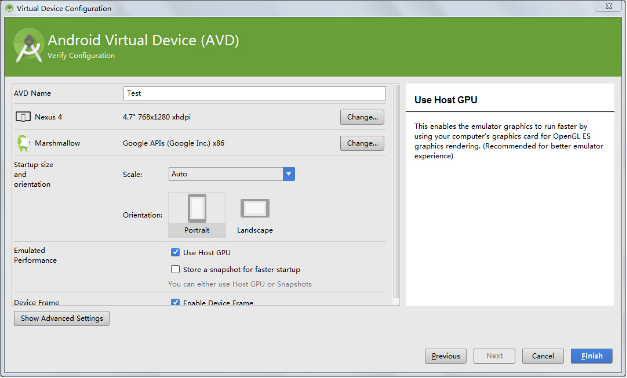
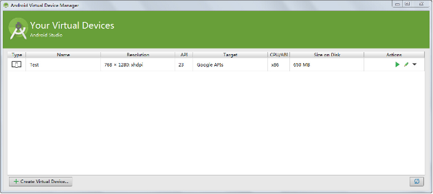
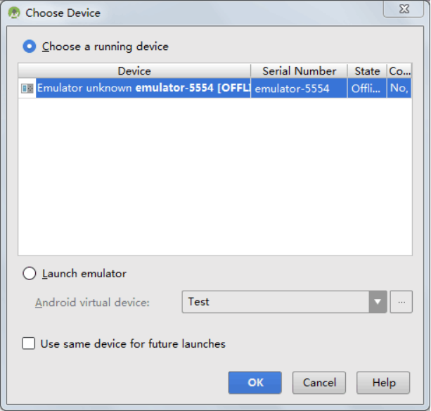
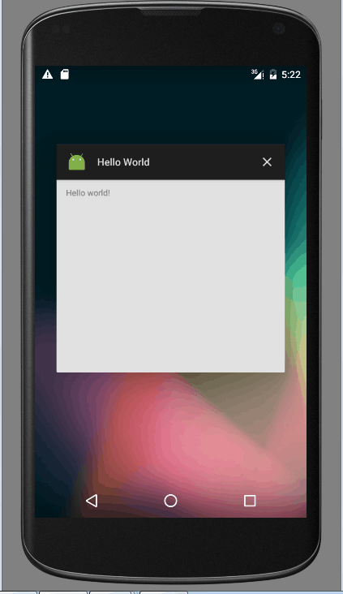

# Hello World应用程序

起草人: 丁文玲1501210892   日期：15年11月25日

修改完善：OOOO   日期：15年00月00日
# 

    小组成员: OOOO   最终完成日期：15年00月00日
# 

**一、实验目的**

*编写一个Hello World应用程序。*

**二、基础知识**

*简要介绍本次实验所需掌握的基础知识*
   
* 知识点1：

      *使用ADT创建Helloword应用，使用ADT我们能很方便的创建一个Android的Helloworld应用*

* 知识点2：

      *创建AVD，一个Android要想运行起来必须要有一个环境，这个环境就是模拟器。使用 AVD manager可以轻松的创建一个AVD（配置好的模拟器）。*

* 知识点3：

      知识点介绍

   

**三、实验内容及步骤**

**3.1 实验内容**

*简要介绍本次实验的主要内容*

**3.2 实验步骤**

*详细描述本次实验的具体步骤*

**1，点击“Start a new Android Studio project”创建我的第一个Android程序Hello World：**

*选择安卓设备和最小支持的SDK版本：*

*选择一个activity：*

*finish后，已经创建了一个“Hello World”工程。*

**2, 创建一个AVD以运行程序**

*我们可以利用AVD来做测试机来调试程序，在上图的工具栏中点击（AVD图标），这时可以“Create Virtual Device”来创
建一个AVD*

*选择合适的硬件后，点击“Next”。*

*选择合适的安卓系统镜像，因为我们安装了Intel HAXM，所以我们选择一个X86的ABI：*

*然后命名你的AVD，可以设置一些参数，然后“finish”完成。*

*点击图标绿色三角形“Action”来运行AVD：*

*启动后点击android studio中的运行按钮，选择一个可以利用的设备，点击“OK”：*

*可见，我们的Hello Wworld可以运行在设备上了：*

*至此，我们的第一个安卓程序就完成了。*

**四、常见问题及注意事项**

*详细描述本此实验的可能会遇到的问题以及相关的注意事项*

