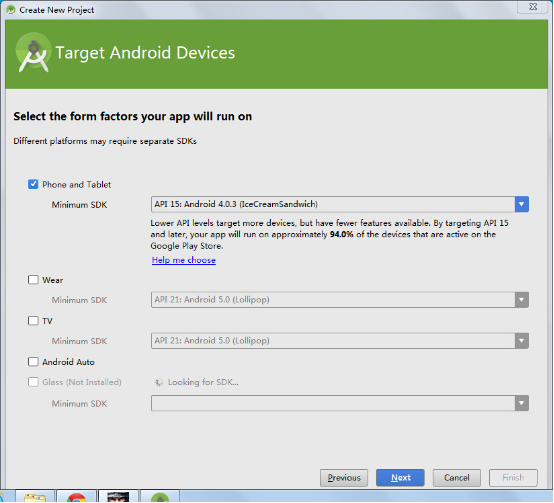

# Hello World应用程序

起草人: 丁文玲1501210892   日期：15年11月25日

修改完善：OOOO   日期：15年00月00日
# 

    小组成员: OOOO   最终完成日期：15年00月00日
# 

**一、实验目的**

*编写一个Hello World应用程序。*

**二、基础知识**

*简要介绍本次实验所需掌握的基础知识*
   
* 知识点1：

      知识点介绍

* 知识点2：

      知识点介绍

* 知识点3：

      知识点介绍

   

**三、实验内容及步骤**

**3.1 实验内容**

*简要介绍本次实验的主要内容*

**3.2 实验步骤**

*详细描述本次实验的具体步骤*

*1，点击“Start a new Android Studio project”创建我的第一个Android程序Hello World：*

*选择安卓设备和最小支持的SDK版本：*

*选择一个activity：*

**四、常见问题及注意事项**

*详细描述本此实验的可能会遇到的问题以及相关的注意事项*

