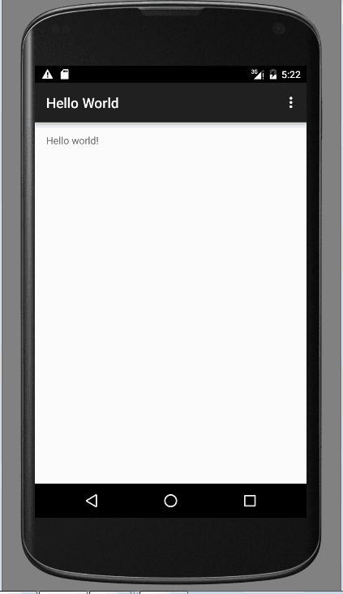

# Hello World应用程序

起草人: 丁文玲1501210892   日期：15年11月25日

修改完善：徐荣涛1501211012   日期：15年12月5日
# 

**一、实验目的**

*编写一个Hello World应用程序。*

**二、基础知识**

*简要介绍本次实验所需掌握的基础知识*
   
* 知识点1：

    *使用ADT创建Helloword应用，使用ADT我们能很方便的创建一个Android的Helloworld应用*

* 知识点2：

    *创建AVD，一个Android要想运行起来必须要有一个环境，这个环境就是模拟器。使用 AVD manager可以轻松的创建一个AVD（配置好的模拟器）。*

* 知识点3：

   *运行Helloword应用
有个AVD我们就可以运行Android应用了。找到我们的Helloword的项目，右击选择“Run”，选择Android Application 就可以运行Helloword应用了。*

   

**三、实验内容及步骤**

**3.1 实验内容**

*1搭建好Android开发环境，编写一个Hello World应用程序*

*2首先点击“Start a new Android Studio project”创建我的第一个Android程序Hello World，*

*3然后创建一个AVD以运行程序，*

*4最后启动后点击android studio中的运行按钮，选择一个可以利用的设备，点击“OK”*

**3.2 实验步骤**

*详细描述本次实验的具体步骤*

**1，点击“Start a new Android Studio project”创建我的第一个Android程序Hello World：**

*选择安卓设备和最小支持的SDK版本：*

*选择一个activity：*

*finish后，已经创建了一个“Hello World”工程。*

**2, 创建一个AVD以运行程序**

*我们可以利用AVD来做测试机来调试程序，在上图的工具栏中点击（AVD图标），这时可以“Create Virtual Device”来创
建一个AVD*

*选择合适的硬件后，点击“Next”。*

*选择合适的安卓系统镜像，因为我们安装了Intel HAXM，所以我们选择一个X86的ABI：*

*然后命名你的AVD，可以设置一些参数，然后“finish”完成。*

*点击图标绿色三角形“Action”来运行AVD：*

*启动后点击android studio中的运行按钮，选择一个可以利用的设备，点击“OK”：*

*可见，我们的Hello Wworld可以运行在设备上了：*

*至此，我们的第一个安卓程序就完成了。*

**四、常见问题及注意事项**

*在进行X86模拟器搭建过程中，遇到了无法安装模拟器的提示，后查资料得知是因为电脑的主板未开启“Virtualization”选项，解决办法是：进入BIOS修改Virtualization选项。因为我的电脑是Thinkpad x250，开机后按F1进入BIOS，而后找到Virtualization选项，使Virtualization Technology由“Disabled”变为“Enabled”，保存后继续安装，一路点击“Next”，最后“finish”完成。*

