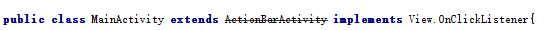
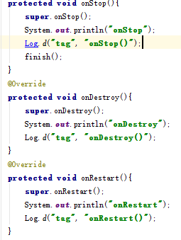
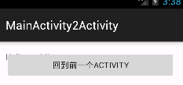
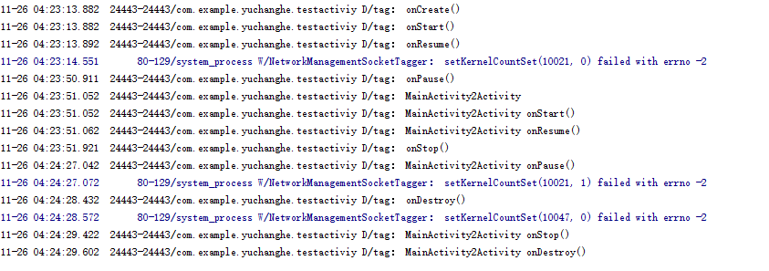

# Activity生命周期

起草人: 于昌和   日期：15年11月24日

修改完善：OOOO   日期：15年00月00日
# 

    小组成员: OOOO   最终完成日期：15年00月00日
# 

**一、实验目的**

了解Activity的生命周期

**二、基础知识**

要知道Activity的主要方法。每个Activity有运行、暂停、停止和销毁四个状态。
   
* 知识点1：
* 
      Activity与生命周期有关的主要方法onCreate(),onStart(),onResume(),onPause(),onStop(),onRestart(),onDestroy().
在程序启动时，会调用onCreate()方法，然后调用onStart()方法，然后调用onResume()方法，activity这时开始运行，如果此时当前activity调用了别的activity,当前activity的onPause()方法会被调用，当前activity会进入暂停状态，

* 知识点2：

      Activity的启动模式有四个，standard、singleTop、singleTask,singleInstance.

* 知识点3：

      知识点介绍

   

**三、实验内容及步骤**

**3.1 实验内容**
通过程序验证，Activity的生命周期。本程序有两个Activity,通过一个Activity调用另一个Activity然后返回当前Activity看看程序的运行结果。

**3.2 实验步骤**

1.建了一个Activity继承
2.重写有关生命周期的方法](1.png)
3.启动Activity查看运行结果
4.点击桌面按钮
5.查看结果和当前的界面
6.点击按钮查看结果
7.程序运行的完整结果图

**四、常见问题及注意事项**
注意Activity各个方法的调用时机

