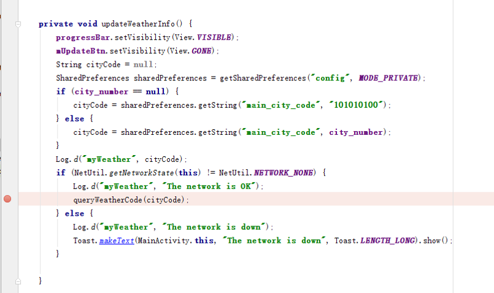
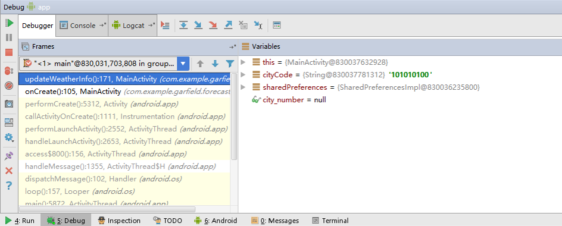
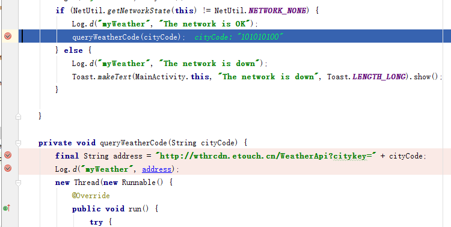
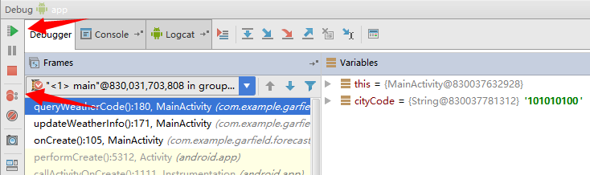

# Android应用程序调试

起草人: 王宇     日期：15年12月07日

修改完善：OOOO   日期：15年00月00日
# 

**一、实验目的**

了解使用Android Studio调试Android程序的基本用法。

**二、基础知识**

   
* 知识点1：

      程序调试方法。

**三、实验内容及步骤**

**3.1 实验内容**

Android系统调试

**3.2 实验步骤**

*详细描述本次实验的具体步骤*
1. 设置程序断点

2. 单击Debug按钮

3. 在Debug目录查看断点处的程序运行状态

4. Debug目录四个按钮的功能

从左至右依次为：

    Step over：程序向下执行一行；

    Step into：程序向下执行一行；如果该行有自定义方法，则运行进入自定义方法（不会进入官方类库的方法）；

    Force Step into：在调试的时候能进入任何方法；

    Step out：跳出当前方法。

5. 设置多个断点

6. 单击绿色按钮，程序将运行到下一断点；单击上下圆按钮，可以查看和设置断点的属性

**四、常见问题及注意事项**

*无*

