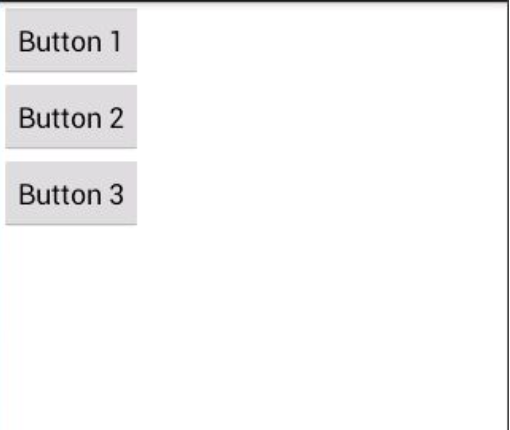
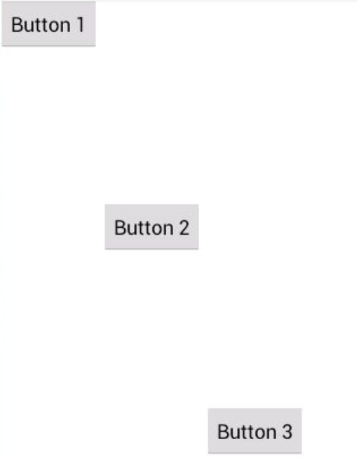
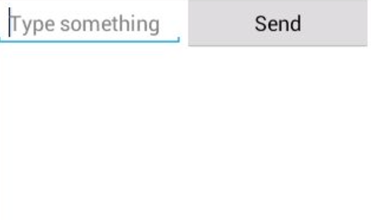
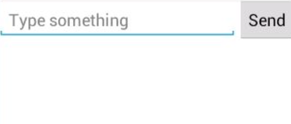

# 线性布局

起草人: 孙晴 1501210986   日期：15年11月24日

修改完善：OOOO   日期：15年00月00日
# 

**一、实验目的**

*一个丰富的界面总是要由很多个控件组成的,那我们如何才能让各个控件都有条不紊地摆放在界面上,而不是乱糟糟的呢?这就需要借助布局来实现了。布局是一种可用于放置很多控件的容器,它可以按照一定的规律调整内部控件的位置,从而编写出精美的界面。当然, 布局的内部除了放置控件外,也可以放置布局,通过多层布局的嵌套,我们就能够完成一些比较复杂的界面实现*

**二、基础知识**

*本次实验所需掌握的基础知识*
   
* 知识点1：

      android:orientation 属性：排列方向
      1.排列方向是vertical,控件就会在垂直方向上排列；如果指定的是horizontal,控件就会在水平方向上排列
      2.如果 LinearLayout 的排列方向是 horizontal,内部的控件就绝对不能将 宽度指定为 match_parent,因为这样的话单独一个控件就会将整个水平方向占满,其他的控件就没有可放置的位置了。同样的道理,如果 LinearLayout 的排列方向是 vertical,内部的控 件就不能将高度指定为 match_parent
      

* 知识点2：

      android:layout_gravity 属性：对齐方式
      1.用于指定控件在布局中的对齐方式
      2.当 LinearLayout 的排列方向是 horizontal 时,只有垂直方向上的对齐方式才会生效,因为此时水平方向上的长度是不固定的,每添加一个控件,水平方向上的长度都会改变,因而无法指定该方向上的对齐方式。同样的道理,当 LinearLayout 的排列方向是 vertical 时,只有水平方 向上的对齐方式才会生效。

* 知识点3：

      android:layout_weight：使用比例的方式来控件的大小
      

   

**三、实验内容及步骤**

**3.1 实验内容**

* 介绍线性布局及属性*

**3.2 实验步骤**

*1.orientation 属性*
   
    android:orientation="vertical"
设计三个button,效果如下
  
  
    android:orientation="horizontal"
    
    
button水平排开，效果图略。
    
    
  
*2.android:layout_gravity* 

    android:orientation="horizontal"
    <Button
            android:id="@+id/button1"
            android:layout_width="wrap_content"
            android:layout_height="wrap_content"
            android:layout_gravity="top"
            android:text="Button 1" />
        <Button
            android:id="@+id/button2"
            android:layout_width="wrap_content"
            android:layout_height="wrap_content"
            android:layout_gravity="center_vertical"
            android:text="Button 2" />
        <Button
            android:id="@+id/button3"
            android:layout_width="wrap_content"
            android:layout_height="wrap_content"
            android:layout_gravity="bottom"
            android:text="Button 3" />

运行结果

*3.android:layout_weight* 

    <EditText
            android:id="@+id/input_message"
            android:layout_width="0dp"
            android:layout_height="wrap_content"
            android:layout_weight="1"
            android:hint="Type something"
            />
        <Button
            android:id="@+id/send"
            android:layout_width="0dp"
            android:layout_height="wrap_content"
            android:layout_weight="1"
            android:text="Send"
            />
EditText 和 Button 的宽度都指定成了 0,这样文本编辑框和按钮 还能显示出来吗?不用担心,由于我们使用了android:layout_weight 属性,此时控件的宽度 就不应该再由 android:layout_width 来决定,这里指定成 0 是一种比较规范的写法。然后我们在 EditText 和 Button 里都将 android:layout_weight 属性的值指定为 1,这表示 EditText 和 Button 将在水平方向平分宽度.将 android:layout_weight 属性的值同时指定为 1 就会平分屏幕宽度呢?

其实原理 也很简单,系统会先把 LinearLayout 下所有控件指定的 layout_weight 值相加,得到一个总值, 然后每个控件所占大小的比例就是用该控件的 layout_weight 值除以刚才算出的总值。因此如 果想让 EditText 占据屏幕宽度的 3/5,Button 占据屏幕宽度的 2/5,只需要将 EditText 的 layout_weight 改成 3,Button 的 layout_weight 改成 2 就可以了。分别运行下程序,效果如下

**四、常见问题及注意事项**

*无*

