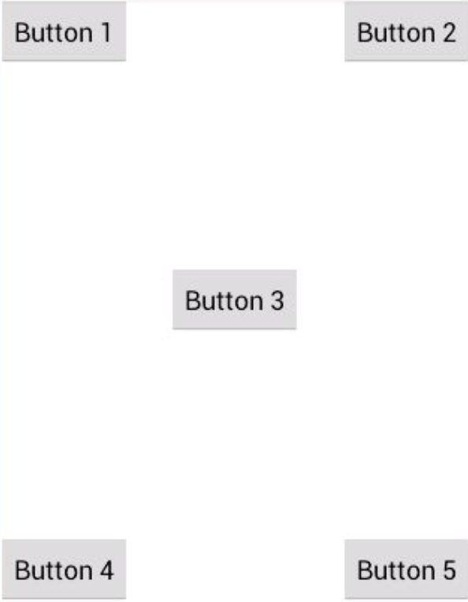
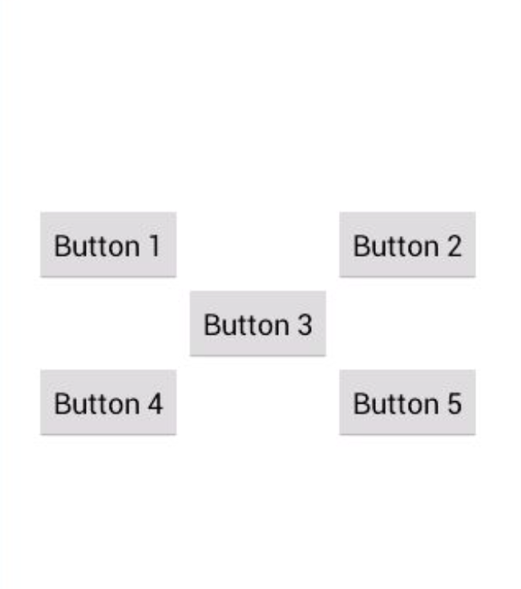

# 相对布局

起草人: 孙晴1501210986   日期：15年11月24日

修改完善：OOOO   日期：15年00月00日
# 

**一、实验目的**

*介绍相对布局。*

**二、基础知识**

*RelativeLayout 又称作相对布局,也是一种非常常用的布局。和 LinearLayout 的排列规则不同,RelativeLayout 显得更加随意一些,它可以通过相对定位的方式让控件出现在布局 的任何位置。也正因为如此,RelativeLayout 中的属性非常多,不过这些属性都是有规律可 循的,其实并不难理解和记忆。*
   
* 知识点1：

相对于父布局定位

      
      android:layout_alignParentLeft     父布局的左边
      android:layout_alignParentTop      父布局的顶边
      android:layout_alignParentRight    父布局的右边
      android:layout_alignParentBottom   父布局的底边
      android:layout_centerInParent      父布局的中间

* 知识点2：

相对于控件button3进行定位：例如

      android:layout_above="@id/button3"
      android:layout_toLeftOf="@id/button3"

   

**三、实验内容及步骤**

**3.1 实验内容**

*理解相对布局*

**3.2 实验步骤**

*1.相对于父布局*

    <RelativeLayout xmlns:android="http://schemas.android.com/apk/res/android" android:layout_width="match_parent"         android:layout_height="match_parent" >
        <Button
            android:id="@+id/button1"
            android:layout_width="wrap_content"
            android:layout_height="wrap_content"
            android:layout_alignParentLeft="true"
            android:layout_alignParentTop="true"
            android:text="Button 1" />
        <Button
            android:id="@+id/button2"
            android:layout_width="wrap_content"
            android:layout_height="wrap_content"
            android:layout_alignParentRight="true"
            android:layout_alignParentTop="true"
            android:text="Button 2" />
        <Button
            android:id="@+id/button3"
            android:layout_width="wrap_content"
            android:layout_height="wrap_content"
            android:layout_centerInParent="true"
            android:text="Button 3" />
        <Button
            android:id="@+id/button4"
            android:layout_width="wrap_content"
            android:layout_height="wrap_content"
            android:layout_alignParentBottom="true"
            android:layout_alignParentLeft="true"
            android:text="Button 4" />
        <Button
            android:id="@+id/button5"
            android:layout_width="wrap_content"
            android:layout_height="wrap_content"
            android:layout_alignParentBottom="true"
            android:layout_alignParentRight="true"
            android:text="Button 5" />
            

我们让 Button 1 和父布局的左上角对齐,Button 2 和父布局的右上角对齐,Button 3 居中显示,Button 4 和父 布局的左下角对齐,Button 5 和父布局的右下角对齐。运行程序,效果如图

*2.相对于控件进行布局*

    <RelativeLayout xmlns:android="http://schemas.android.com/apk/res/android" android:layout_width="match_parent" android:layout_height="match_parent" >
        <Button
            android:id="@+id/button3"
            android:layout_width="wrap_content"
            android:layout_height="wrap_content"
            android:layout_centerInParent="true"
            android:text="Button 3" />
        <Button
            android:id="@+id/button1"
            android:layout_width="wrap_content"
            android:layout_height="wrap_content"
            android:layout_above="@id/button3"
            android:layout_toLeftOf="@id/button3"
            android:text="Button 1" />
        <Button
            android:id="@+id/button2"
            android:layout_width="wrap_content"
            android:layout_height="wrap_content"
            android:layout_above="@id/button3"
            android:layout_toRightOf="@id/button3"
            android:text="Button 2" />
        <Button
            android:id="@+id/button4"
            android:layout_width="wrap_content"
            android:layout_height="wrap_content"
            android:layout_below="@id/button3"
            android:layout_toLeftOf="@id/button3"
            android:text="Button 4" />
        <Button
            android:id="@+id/button5"
            android:layout_width="wrap_content"
            android:layout_height="wrap_content"
            android:layout_below="@id/button3"
            android:layout_toRightOf="@id/button3"
            android:text="Button 5" />
    </RelativeLayout>

android:layout_above 属性可以让 一个控件位于另一个控件的上方,需要为这个属性指定相对控件 id 的引用,这里我们填入 了@id/button3,表示让该控件位于 Button 3 的上方。其他的属性也都是相似的,android:layout_below 表示让一个控件位于另一个控件的下方,android:layout_toLeftOf 表示让 一个控件位于另一个控件的左侧,android:layout_toRightOf 表示让一个控件位于另一个控件 的右侧。注意,当一个控件去引用另一个控件的 id 时,该控件一定要定义在引用控件的后 面,不然会出现找不到 id 的情况。效果如下图

**四、常见问题及注意事项**

*无*

