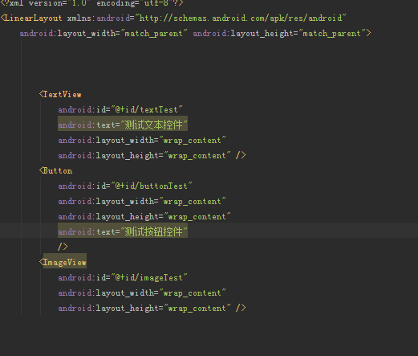
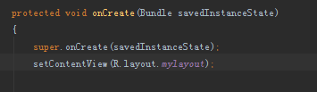
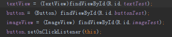
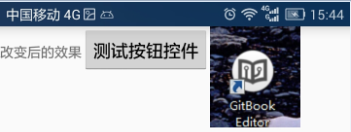

# 基本控件

起草人: 孔润   日期：15年12月06日

修改完善：   日期：15年00月00日
# 

**一、实验目的**

*了解android studio的几种基本控件并学会使用*

**二、基础知识**

* 大多数的界面控件都在android.view和android.widget包中，android.view.View为他们的父类，还有Dialog系列,android.app.Dialog为父类等等。Android的原生控件，一般是在res/layout下的xml文件中声明。然后在Activity通过使用super.setContentView(R.layout.某布局layout文件名)来加载layout。在Activity中获取控件的引用需要使用super.findViewById(R.id.控件的ID)，接着就可以使用这个引用对控件进行操作，例如添加监听，设置内容等。当然也可以通过代码动态的使用控件。*
   
* 文本类：

     主要是显示文本，获取文本内容，例如：
     
     TextView,EditText,AutoCompleteTextView,
* 按钮类：

   
      
      Button，CheckBox，RadioButton,ToggleButton,
      
      ZoomButton  
* 图片类：

      ImageView,

* 时间控件：

      Datepicker,DigitalClock,AnalogClock
      

* 进度显示：

      ProcessBar,SeekBar,AbsSeekBar

* 导航：

      TabHost,TabWidget
   

**三、实验内容及步骤**

**3.1 实验内容**

*  主要是在布局中使用文本类（实验用TextView），图片类（实验中用ImageView），按钮类（试验中用Button）控件，显示控件，修改控件 *

**3.2 实验步骤**

* 1，新建一个布局，并在布局中加入名为TextViewTest的文本类控件，名为ImageViewTest的图片类控件，名为ButtonTest的按钮控件 
* 

 2，在活动中载入布局，使布局可见

 3，通过控件的id寻找指定控件并修改控件内容格式等
 
 改变前的效果：
 
 改变后的效果：
 

**四、常见问题及注意事项**

*详细描述本此实验的可能会遇到的问题以及相关的注意事项*

