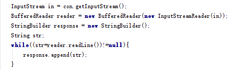

# HttpUrlConection

起草人: 盛啸然   日期：15年00月00日

修改完善：谢峰 1501211009  日期：15年00月00日

# 

**一、实验目的**

了解HttpURLConnection，并使用HttpURLConnection访问网络资源

**二、基础知识**

*简要介绍本次实验所需掌握的基础知识*
   
* 知识点1：

     HttpURLConnection继承了URLConnection，也可以向指定的网站发送GET请求。HttpURLConnection在URLConnection的基础上做了改进，增加一些用于HTTP资源的方法。

* 知识点2：

     HttpURLConnection新增加的四种方法： getResponseCode(): 获取服务器的响应消息。 getResponseMessage(): 获取服务器的响应消息。 getRequestMethod(): 获取发送请求的方法。 setRequestMethod(String method): 设置发送请求的方法。

   

**三、实验内容及步骤**

**3.1 实验内容**

通过程序，调用HttpURLConnection的方法访问网络资源

**3.2 实验步骤**

1.建立连接、配置参数

2.读取数据并输出

3.查看响应信息

**四、常见问题及注意事项**
无
*详细描述本此实验的可能会遇到的问题以及相关的注意事项*

