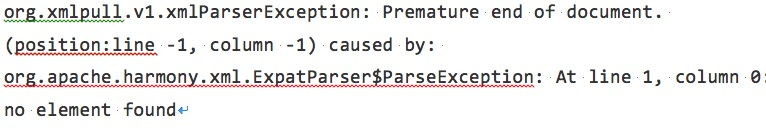

# XML解析

起草人: 高参 1501210527   日期：15年11月25日

修改完善：OOOO   日期：15年00月00日
# 

    小组成员: OOOO   最终完成日期：15年00月00日
# 

**一、实验目的**

pull解析器解析XML文件

**二、基础知识**

简要介绍本次实验所需掌握的基础知识
   
* 知识点1：XML文件知识基础

     XML是可扩展标记语言（Extensible Markup Language）的缩写，其中的标记（markup）是关键部分。你可以创建内容，然后使用限定标记标记它，从而使每个单词、短语或块成为可识别、可分类的信息。你创建的文件，或文档实例由元素（标记）和内容构成。当从打印输出读取或以电子形式处理文档时，元素能够帮助更好地理解文档。元素的描述性越强，文档各部分越容易识别。自从出现标记至今，带有标记的内容就有一个优势，即在计算机系统缺失时，仍然可以通过标记理解打印出来数据。

* 知识点2：XML常用解析方法

     在Android平台可以使用Simple API for XML(SAX) 、 Document Object Model(DOM) 和Android附带的Pull 解析器解析XML文件。XML文件基本的解析方式有两种,一种叫SAX，另一种叫DOM。SAX是基于事件流的解析,DOM是基于XML文档树结构的解析。本实验着重介绍Pull解析器解析XML文件。

**三、实验内容及步骤**

**3.1 实验内容**

基于天气预报项目，从天气网站服务器上下载好的XML数据进行解析，从而得到需要的那部分天气数据。

**3.2 实验步骤**

*3.2.1* 从address为"http://wthrcdn.etouch.cn/WeatherApi?citykey=" + cityCode的服务器上下载数据，并进行预处理为string型数据，将string型数据传给解析函数parseXML()进行解析。

*3.2.2* 下面就来仔细看下parseXML()方法中的代码吧。这里首先要获取到一个XmlPullParserFactory的实例,并借助这个实例得到 XmlPullParser对象,然后调用XmlPullParser的setInput()方法将服务器返回的XML数据设置进去就可以开始解析了。解析的过程也是非常简单,通过getEventType()可以得到当前的解析事件,然后在一个while循环中不断地进行解析,如果当前的解析事件不等于XmlPullParser.END_DOCUMENT,说明解析工作还没完成,调用next()方法后可以获取下一个解析事件。在while循环中,我们通过getName()方法得到当前结点的名字,如果发现结点名等于city,就调用nextText()方法来获取结点内具体的内容,每当解析完一个app结点后就将获取到的内容打印出来。

*3.2.3* 现在我们看一下打印日志可以看到,我们已经将 XML 数据中的指定内容成功解析出来了。

**四、常见问题及注意事项**

*4.1* 在实际的开发中我们发送请求访问服务器端，当返回的是xml格式的InputStream对象时，有时我们采用解析方法如sax，pull 对流进行解析时会出现上面的情况，显示解析，这时可以将流对象读取到内存中转换成字符串，在以流的方式从内存中读出。重新解析就可以得到正确的对象集合。

