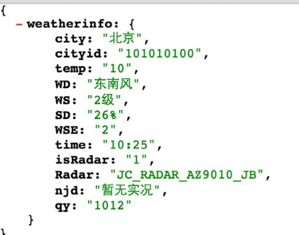
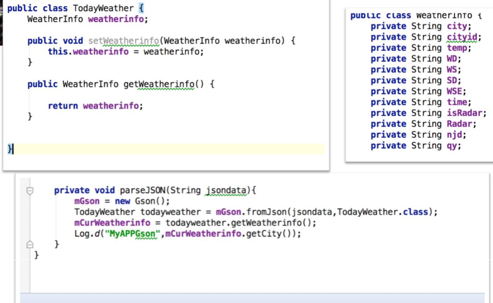

# Json数据解析

起草人: 黄志达   日期：15年11月29日

修改完善：孔润   日期：15年12月05日
# 

**一、实验目的**

*了解和使用Json格式*

**二、基础知识**

*Json格式的定义，封装和解析*
  * Json概述：

      一种轻量级的数据交换格式，具有良好的可读和便于快速编写的特性
      业内主流技术为其提供了完整的解决方案（有点类似于正则表达式，获得了当今大部分语言的支持），从而可以在不同平台间进行数据交换。json采用兼容性很高的文本格式。
      
* Json格式：

    
      json格式主要有对象类型和数组类型，当然也有复合型（两种都存在）
      对象类型例如：
      { "firstName": "Brett", "lastName":"McLaughlin", "email": "aaaa" } 
      数组类型例如：{"people":[
      {"firstName":"Brett","lastName":"McLaughlin","email":"aaaa"},
      {"firstName":"Jason","lastName":"Hunter","email":"bbbb"},
      {"firstName":"Elliotte","lastName":"Harold","email":"cccc"}]}
      
      混合类型如： {success: 0, result:{ a:z, b:y, c:
      [{name:jack, id:12}, {name:Tom, id:13}]}
     

* Json解析：

      在Android中解析JSON数据解析有多种：
      官方提供的JSONObject
      谷歌开源的GSON
      第三方开源库Jackson, FastJSON

* Json封装：

      使用JSONObject进行对象的封装，使用JSONArray进行数组的封装。
      如：public JSONObject makJsonObject(int id[], String name[], String year[],
            String curriculum[], String birthday[], int numberof_students)
            throws JSONException {
            JSONObject obj = null;
            JSONArray jsonArray = new JSONArray();
            for (int i = 0; i < numberof_students; i++) {
                obj = new JSONObject();
                try {
                    obj.put("id", id[i]);
                    obj.put("name", name[i]);
                    obj.put("year", year[i]);
                    obj.put("curriculum", curriculum[i]);
                    obj.put("birthday", birthday[i]);
    
                } catch (JSONException e) {
                    // TODO Auto-generated catch block
                    e.printStackTrace();
                }
                jsonArray.put(obj);
            }
    
            JSONObject finalobject = new JSONObject();
            finalobject.put("student", jsonArray);
            return finalobject;
    }

   

**三、实验内容及步骤**

**3.1 实验内容**

*解析Json格式*

**3.2 实验步骤**

1. GSON的使用：
   把gson-*.*.*.jar放入libs文件夹，右击它，然后点击'Add as library'
    确保build.gradle文件中的依赖文件是正确的
2. 使用返回Json格式天气预报的接口，返回的数据格式如下图：
   
3. 编写代码解析返回的天气信息
   

**四、常见问题及注意事项**

*详细描述本此实验的可能会遇到的问题以及相关的注意事项*

