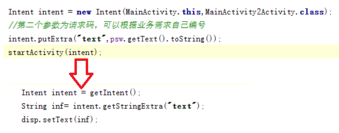
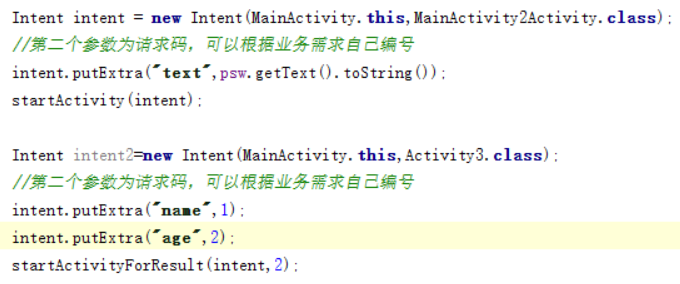

# Intent基础

起草人: 屈中山1501210974   日期：15年11月26日

修改完善：朱思敏1501211048   日期：15年11月27日
# 

    小组成员: OOOO   最终完成日期：15年00月00日
# 

**一、实验目的**

*了解Intent的使用*

**二、基础知识**

*要知道Activity的简单使用。了解Intent的定义，类型，传递参数的方法*
   
* 知识点1：

      Intent基本使用,怎么传递参数

* 知识点2：

      startActivity()和startActivityForResult()的区别

* 知识点3：

      Intent在寻找目标组件时有两种方法

   

**三、实验内容及步骤**

**3.1 实验内容**

*通过程序练习使用Intent怎么传递参数，比较 startActivity()和startActivityForResult()的区别和怎么寻找组件*

**3.2 实验步骤**

*1、新建一个工程，在里面建3个Activity
     2、MainActivity中尝试传递数据到MainActivity2Activity中，并显示
3、MainActivity中、startActivity()跳转到MainActivity2Activit和和startActivityForResult()跳转到Activity3

startActivityForResult在关闭子Activity后父Activity可以接受到子Activity返回值,而startActivity，当你的Activity嵌套在另一个Activity中时就不能能它了回报android.content.ActivityNotFoundException错误，哪怕你AndroidManifest.xml中配置了这个Activity。
*

**四、常见问题及注意事项**

*详细描述本此实验的可能会遇到的问题以及相关的注意事项*

