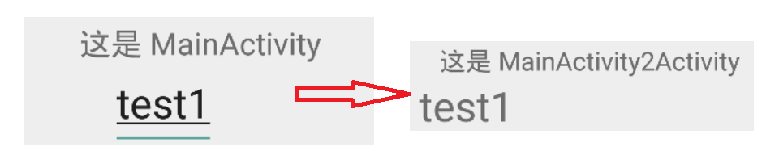

# Intent基础

起草人: 屈中山1501210974   日期：15年11月26日

修改完善：朱思敏1501211048   日期：15年11月27日

# 

**一、实验目的**

*了解Intent的基本概念、工作过程、属性和操作方法，了解显示Intent和隐士Intent，并且能够通过Intent来实现活动之间的跳转*

**二、基础知识**

*要知道Activity的简单使用。了解Intent的定义，类型，传递参数的方法*
   
* 知识点1：

      Intent中包含对其他组件的意图的描述信息，如要执行的动作、涉及的数据等等。
      Android根据Intent的描述，找到相应的组件，并将Intent传递给相应的组件，完成组件的调用。
      Intent在这里起到一个媒介的作用，专门提供组件互相调用的相关信息。
      Intent对象主要包括：组件名称、动作、数据、类别、附加信息和标志位6大部分。

* 知识点2：

      了解Activity栈的概念：
      某一时刻只有一个Activity处在栈顶。
      Activity创建、压栈、用户可交互。
      Back，退栈。
      Activity销毁，退栈。

* 知识点3：

      Intent的用法大致可以分为两种，显式Intent和隐式Intent。相比于显式Intent，隐式Intent含蓄了很多，
      它并不明确指出我们想要启动哪一个活动，而是指定了一系列更为抽象的action和category等信息，然后交友系统去分析这个Intent，并找出
      合适的方法去启动。

   

**三、实验内容及步骤**

**3.1 实验内容**

*通过程序练习使用Intent怎么传递参数，比较 startActivity()和startActivityForResult()的区别和怎么寻找组件*

**3.2 实验步骤**

*1、新建一个工程，在里面建3个Activity
     2、MainActivity中尝试传递数据到MainActivity2Activity中，并显示
3、MainActivity中、startActivity()跳转到MainActivity2Activit和和startActivityForResult()跳转到Activity3

startActivityForResult在关闭子Activity后父Activity可以接受到子Activity返回值,而startActivity，当你的Activity嵌套在另一个Activity中时就不能能它了回报android.content.ActivityNotFoundException错误，哪怕你AndroidManifest.xml中配置了这个Activity。
 4、没有明确指定目标组件的名称，那么就要通过一定的条件过滤筛选。在MainActivity中尝试隐试跳转
*

**四、常见问题及注意事项**

*注意startActivityForResul调用的请求码要对应好*

