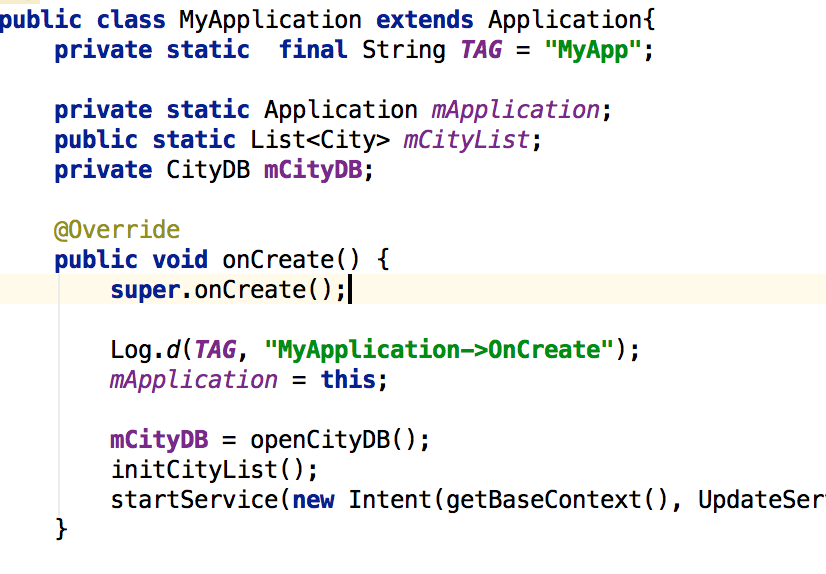
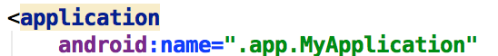

# Application对象

起草人: 黄志达   日期：15年11月28日

修改完善：OOOO   日期：15年00月00日

# 

**一、实验目的**

*学会Application的使用。*

**二、基础知识**

*了解Application类的概念，生命周期和使用方法*
   
*  Application类的概念：

     当Android程序启动时系统会创建一个Application对象，Application是单例模式的一个类， 
      每个程序运行时只创建一个Application类的对象。也可以继承Application，定制自己的Application

* Application对象的应用：

      启动Application时，系统会创建一个进程ID,所有的Activity都在此进程运行；
      Application对象的生命周期是整个程序最长的，它的生命周期就等于程序的生命周期；
      Application对象是全局单例的，可以通过Application来进行一些数据传递，数据共享和数据缓存等操作

* 获取Application对象：

      Context的调用getApplicationContext
      Activity的getApplication

   

**三、实验内容及步骤**

**3.1 实验内容**

*继承Application类，自定义一些初始化的操作*

**3.2 实验步骤**

1.新建一个MyApplication类
2.继承Application类，重写onCreate方法，在里面进行一些初始化的操作，如打开数据库，启动后台的service

**四、常见问题及注意事项**

修改AndroidManifest.xml的android:name为对应自定义类的名称

