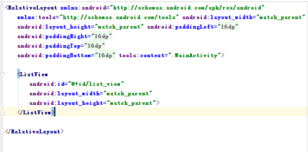
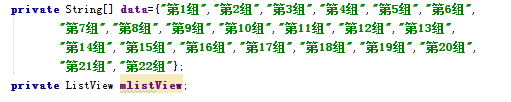
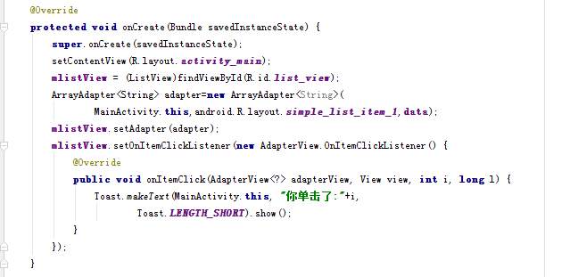
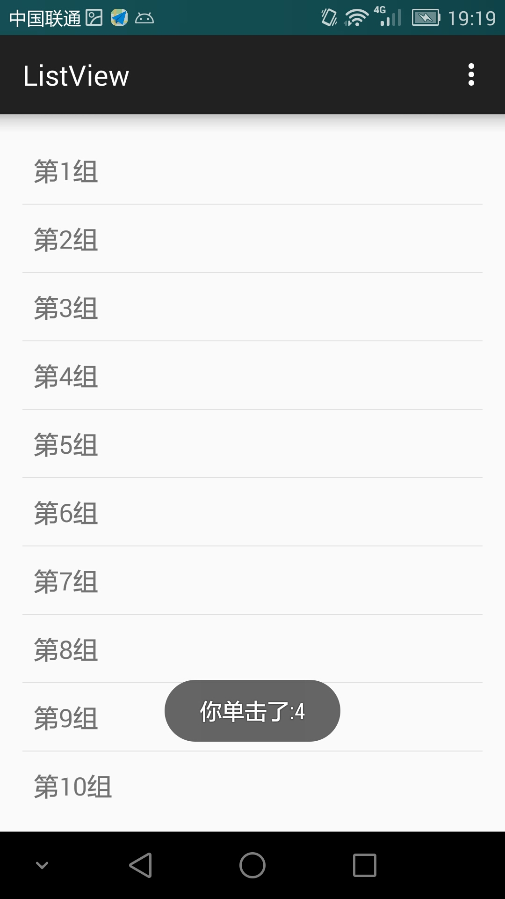

# ListView

起草人: 陈靖野   日期：15年11月29日

修改完善：GGGOO   日期：15年00月00日

# 

**一、实验目的**

了解ListView的基本用法

**二、基础知识**

ListView的基本功能，Adapter的使用
   
* 知识点1：

      一个ListView通常有两个职责。
      （1）将数据填充到布局。
      （2）处理用户的选择点击等操作。
      

* 知识点2：

      一个ListView的创建需要3个元素。
      （1）ListView中的每一列的View。
      （2）填入View的数据或者图片等。
      （3）连接数据与ListView的适配器。
      

* 知识点3：

      适配器是一个连接数据和AdapterView的桥梁，通过它能有效地实现数据与AdapterView的分离设置，使AdapterView与数据的绑定更加简便，修改更加方便
      Android中提供了很多的Adapter，下表列出了常用的几个。

| Adapter | 含义 |
| -- | -- |
| ArrayAdapter<T> | 用来绑定一个数组，支持泛型操作 |
| SimpleAdapter | 用来绑定在xml中定义的控件对应的数据 |
| SimpleCursorAdapter | 用来绑定游标得到的数据 |
| BaseAdapter | 通用的基础适配器 |

**三、实验内容及步骤**

**3.1 实验内容**

*编写一个简单的ListView控件*

**3.2 实验步骤**

*先在Android Studio中新建一个空项目*
在布局文件activity_main.xml中添加ListView控件

在MainActivity中插入如下java代码，首先定义变量

在onCreate方法中绑定Adapter，并添加onItemClick事件

在手机上的运行效果如下图

**四、常见问题及注意事项**

实际使用时可能显示的是从数据库中取的出来的数据

