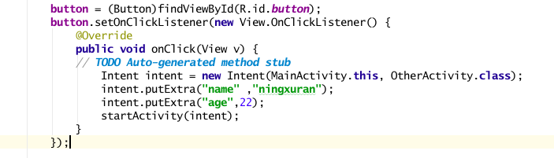
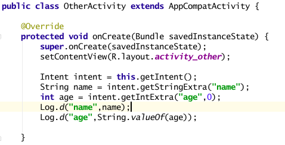

# Intent传递数据

起草人: 宁旭冉   日期：15年11月24日

修改完善：OOOO   日期：15年00月00日
# 

    小组成员: OOOO   最终完成日期：15年00月00日
# 

**一、实验目的**

*了解Intent传递数据的过程，学会使用Intent在Activity间传递数据*

**二、基础知识**

*参照Intent基础*
   
* 知识点1：

      通过使用Intent对象的putExtra()⽅方法来添加附加信息；
      
      通过使用Intent对象的getXXXExtra()⽅方法可以获取附加信息,例：
      
      String name=intent.getStringExtra("name");
     

* 知识点2：

      知识点介绍

* 知识点3：

      知识点介绍

   

**三、实验内容及步骤**

**3.1 实验内容**

*点击button，在MainActivity中启用一个新的Activity，并将name和age传给它。*

**3.2 实验步骤**

*1.在MainActivity中创建一个Button；*

*2.为Button添加事件,并为Intent添加参数；*

*3.创建OtherActivity，接收数据并打印；*

*4.运行测试*

**四、常见问题及注意事项**

*1.需要回收数据时使用startActivityForResult方法；*

*2.如果要传递⾃自定义的对象数据,需要要借助将对象序列化(Serializable)的⽅方式。*

intent.getSerializableExtra(”name");

