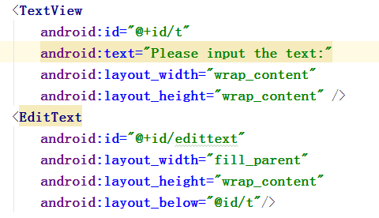
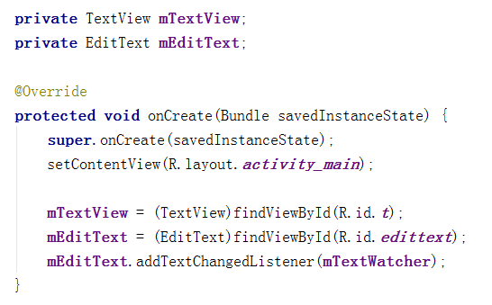
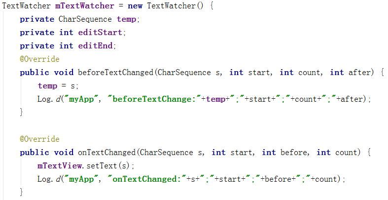
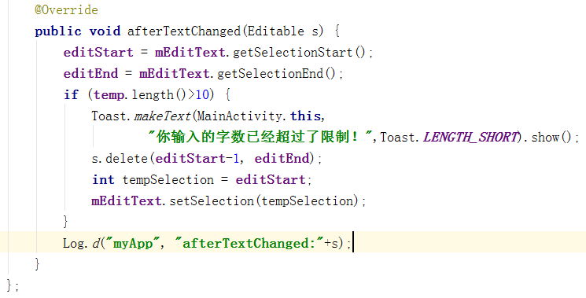
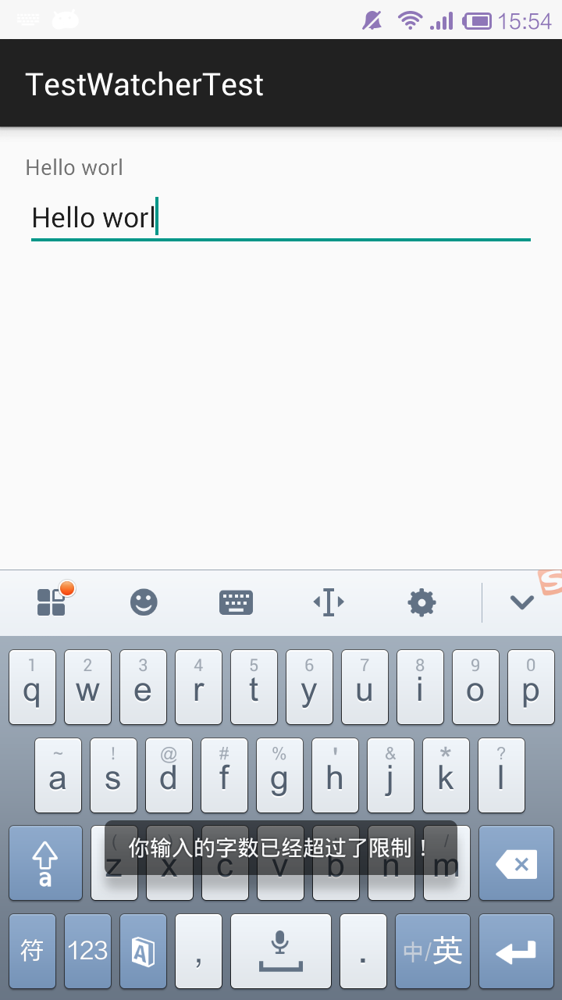
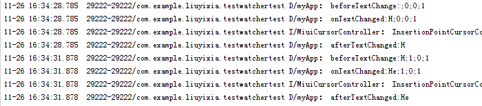
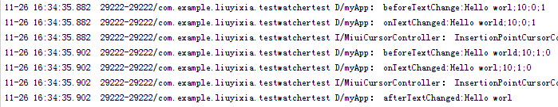

# TextWatcher

起草人: 刘艺霞   日期：15年11月26日

修改完善：黄志达   日期：15年11月28日

# 

**一、实验目的**

    掌握TextWatcher的基本用法，使用TextWatcher限制输入字符个数以及实现EditText和TextView的同步

**二、基础知识**

*简要介绍本次实验所需掌握的基础知识*
   
* 知识点1：

      在Android里使用TextWatcher接口可以很方便的对EditText进行监听；
      
注册监听：

mEditText = (EditText)findViewById(R.id.edittext);

mEditText.addTextChangedListener(mTextWatcher);

* 知识点2：

      TextWatcher中有3个函数需要重载：
    
public void beforeTextChanged(CharSequence s, int start, int count, int after);

//在s中，从start处开始的count个字符将要被长度为after的文本替代 
* s 为变化前的内容； 
* start 为开始变化位置的索引，从0开始计数； 
* count 为将要发生变化的字符数 
* after 为用来替换旧文本的长度，比如s由1变为12，after为1，由12变为1，after为0；

public void onTextChanged(CharSequence s, int start, int before, int count);

//在s中，从start处开始的count个字符刚刚替换了原来长度为before的文本 
* s 为变化后的内容； 
* start 为开始变化位置的索引，从0开始计数； 
* before 为被取代的老文本的长度，比如s由1变为12，before为0，由12变为1，before为1； 
* count 为将要发生变化的字符数 

public void afterTextChanged(Editable s);

//表示最终内容

* 知识点3：

      知识点介绍

   

**三、实验内容及步骤**

**3.1 实验内容**

1、对布局中的EditText限制其输入字符个数

2、在EditText的文本发生改变的时候让TextView的内容跟着发生改变

**3.2 实验步骤**

1、在布局文件activity_main.xml中添加TextView和EditText控件：

2、在MainActivity.java中实现TextWatcher的三个方法，并对EditText添加事件监听函数

3、运行测试

……

**四、常见问题及注意事项**

1、注意要对EditText添加监听事件，如下：
mEditText.addTextChangedListener(mTextWatcher);

