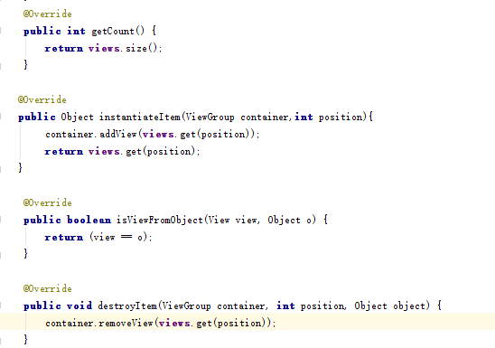
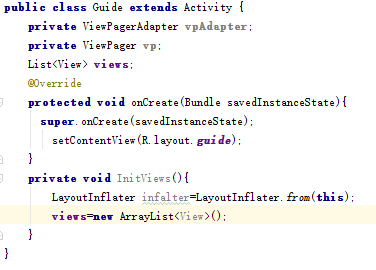

# ViewPager

起草人: 舒心   日期：15年11月26日

修改完善：赖涛   日期：15年00月00日

# 

**一、实验目的**

学习并掌握android中的ViewPager控件

**二、基础知识**

*简要介绍本次实验所需掌握的基础知识*
   
* 知识点1：

      ViewPager的功能是可以是页面滑动，可以用来制作程序首次启动时的引导页面, 也可以实现程序中多个视图切换的效果

* 知识点2：

      ViewPager的适配器是PageerAdapter。它来填充页面ViewPager内部

* 知识点3：

      实现PagerAdapter，至少要实现getCount()、instantiateItem(ViewGroup container, int position)、isViewFromobject(View view, object object)、destroyItem(ViewGroup container, int position, object object)方法
      
      getCount()是返回当前有效视图的个数，在创建页面和滑动过程中都会调用
      
      instantiateItem(ViewGroup container,int position)是创建指定位置的页面视图，适配器创建View视图到container中。返回值代表一个新增视图页面的Object，创建ViewPager时会调用
      
      isViewFromobject(View view, object object)用来判断instantiateItem(ViewGroup container,int position)返回的object与页面视图是否是对应的，在创建页面和滑动过程中都会调用
      
      destroyItem(ViewGroup container, int position, object object)是从container中删除给定位置的视图,在创建页面和滑动过程中都会调用

   

**三、实验内容及步骤**

**3.1 实验内容**
 
 通过ViewPager实现简单的程序引导页面

**3.2 实验步骤**

*详细描述本次实验的具体步骤*

新建一个空项目ViewPagerTest

创建一个用于程序引导页面的Activity，类名为Guide，继承Activity，重写onCreate()方法

创建引导页面视图的布局文件

添加ViewPager控件

在Activity中绑定布局，并在AndroidManifest.xml中注册Activity，设置为程序的入口

新建ViewPagerAdapter类,继承PagerAdapter类，重写相应的方法,定义构造函数对List<View>和Context进行初始化

重写Adapter中的方法

在引导页中初始化ViewPager,并用LayoutInflater设置动态加载视图

新建三个布局，分别把背景设置为红色绿色和蓝色

在Guide类初始化View那里加入这三个view对象，由inflater通过布局文件转化过来

实例化ViewPagerAdapter对象,设置ViewPager的适配器

在onCreate()中调用InitViews方法

现在可以用模拟器或者Android系统来看一下实现的ViewPager滑动效果了

**四、常见问题及注意事项**

*详细描述本此实验的可能会遇到的问题以及相关的注意事项*

