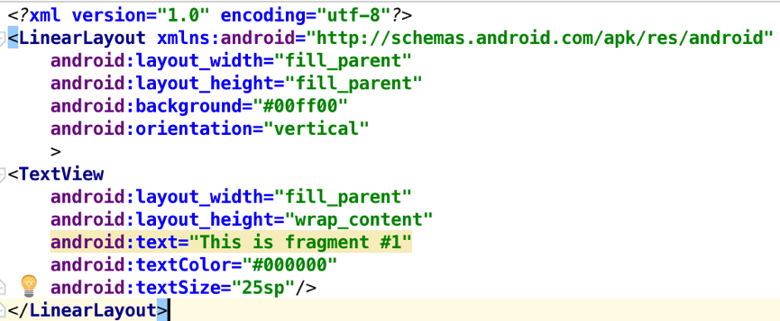
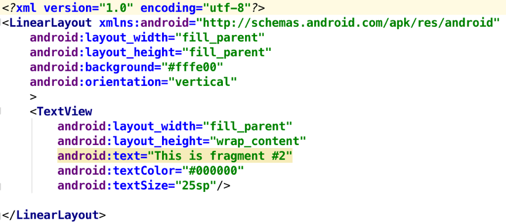
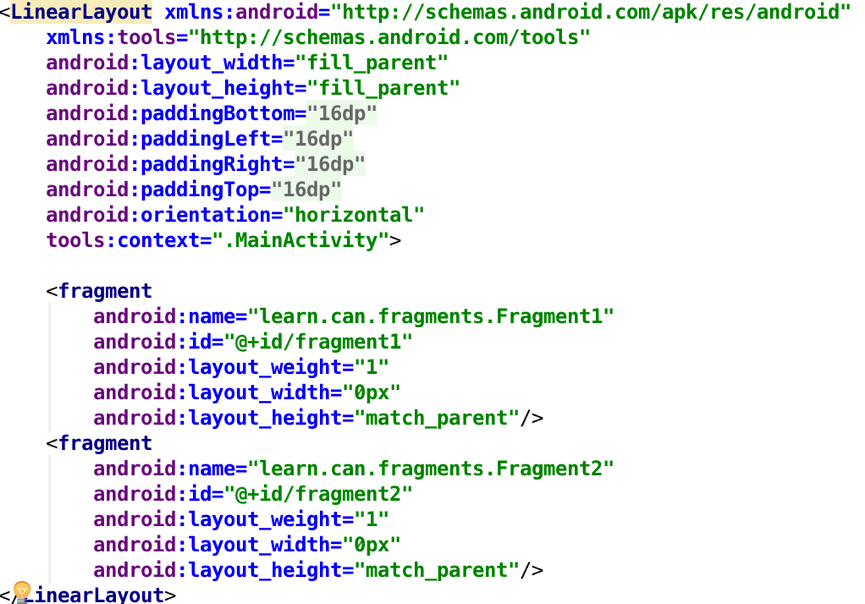
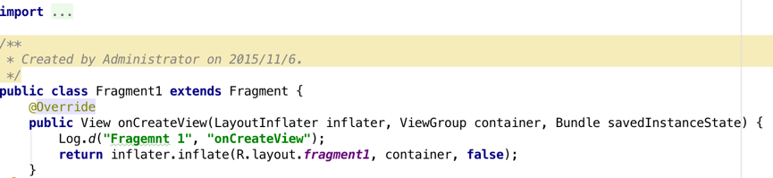
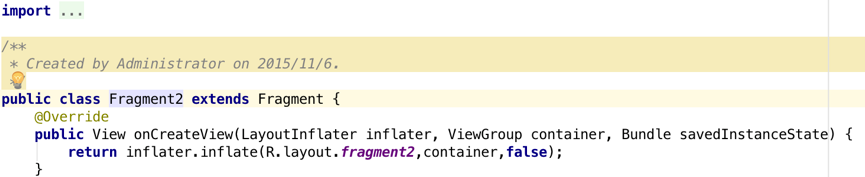
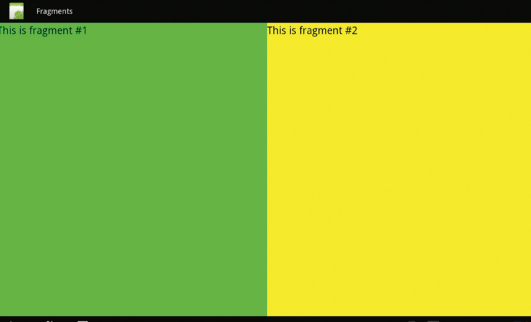
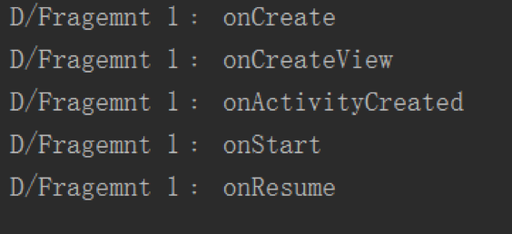
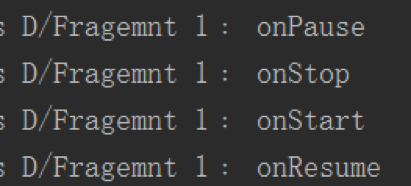
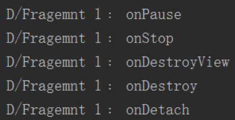

# Fragment

起草人: 高参 1501210527   日期：15年00月00日

修改完善：李智博 1501210942   日期：15年00月00日

# 

**一、实验目的**

Fragment的使用方式及生命周期

**二、基础知识**

简要介绍本次实验所需掌握的基础知识
   
* 知识点：Fragment的简介

&#160; &#160; &#160; &#160;Fragment是一种可以嵌入在活动当中的UI片段,它能让程序更加合理和充分地利用大屏幕的空间,因而在平板上应用的非常广泛。它和活动是很像,同样都能包含布局,同样都有自己的生命周期。你可以将碎片理解成一个迷你型的活动,虽然这个迷你型的活动有可能和普通的活动是一样大的。总的说来Fragment是嵌套在Activity上面的，多个Fragment可以嵌套在一个Activity上。

**三、实验内容及步骤**

**3.1 实验内容**

&#160; &#160; &#160; &#160;通过xml布局⽂文件嵌套多个Fragments，在Activity中动态加入Fragments

**3.2 实验步骤**

&#160; &#160; &#160; &#160;新建一个项目并命名为fragments。在布局文件夹下建一个Fragment1.xml和Fragment2.xml文件。分别如下布局:  
  
&#160; &#160; &#160; &#160;并在主布局文件中将两个fragment添加进去，如下:  
  
&#160; &#160; &#160; &#160;增加两个java class文件，并命名为Fragment1.java和Fragment2 .java，分别在其onCreateView()做如下增加:  
  
在Fragment1类当中加入如下的函数，便于追踪Fragment生命周期中函数的调用情况。
```
@Override
public void onAttach(Activity activity) {
    super.onAttach(activity);
    Log.e("Fragment1", "onAttach");
}

@Override
public void onCreate(Bundle savedInstanceState) {
    super.onCreate(savedInstanceState);
    Log.d("Fragment1", "onCreate");
}

@Override
public void onActivityCreated(Bundle savedInstanceState) {
    super.onActivityCreated(savedInstanceState);
    Log.e("Fragment1", "onActivityCreated");
}

@Override
public void onStart() {
    super.onStart();
    Log.e("Fragment1", "onStart");
}

@Override
public void onResume() {
    super.onResume();
    Log.e("Fragment1", "onResume");
}

@Override
public void onPause() {
    super.onPause();
    Log.e("Fragment1", "onPause");
}

@Override
public void onStop() {
    super.onStop();
    Log.e("Fragment1", "onStop");
}

@Override
public void onDestroyView() {
    super.onDestroyView();
    Log.e("Fragment1", "onDestroyView");
}

@Override
public void onDestroy() {
    super.onDestroy();
    Log.e("Fragment1", "onDestroy");
}

@Override
public void onDetach() {
    super.onDetach();
    Log.e("Fragment1", "onDetach");
}

```
&#160; &#160; &#160; &#160;测试结果如下:  
  
&#160; &#160; &#160; &#160;生命周期分析  
&#160; &#160; &#160; &#160;**a.** 当载入真机上时，依次运行方法onCreate()->onCreateView()-> onActivityCreated  ()->onStart()->onResume()，logcat如下图:  
  
&#160; &#160; &#160; &#160;**b.** 当点击home退出并重进时,依次运行方法onPause()->onStop()->onStart()->onResume()，logcat如下图:  
  
&#160; &#160; &#160; &#160;**c.** 当点击home键退出并在后台关闭该应用时，依次运行方法onPause()->onStop()->onDestroyView()->onDestroy()->onDetach()，logcat如下图:  
  
&#160; &#160; &#160; &#160;➤ onAttached() —函数在fragment和activity建立关联的时候调用；  
&#160; &#160; &#160; &#160;➤ onCreateView() — 函数在fragment加载布局时调用；  
&#160; &#160; &#160; &#160;➤ onActivityCreated() — 函数在activity中的onCreate函数执行完后调用；   
&#160; &#160; &#160; &#160;➤ onDestroyView() — 函数在fragment中的布局被移除时调用；  
&#160; &#160; &#160; &#160;➤ onDetach() — 函数在fragment和activity解除关联时调用。

**四、常见问题及注意事项**

**4.1如何在活动中调用碎片里的方法**

&#160; &#160; &#160; &#160;为了方便碎片和活动之间进行通信,FragmentManager提供了一个类似于findViewById()的方法,专门用于从布局文件中获取碎片的实例,代码如下所示:  RightFragment rightFragment = (RightFragment)getFragmentManager().findFragmentById(R.id.right_fragment); 调用 FragmentManager 的 findFragmentById()方法,可以在活动中得到相应碎片的实例, 然后就能轻松地调用碎片里的方法了。  

**4.2如何在碎片中调用活动里的方法**

&#160; &#160; &#160; &#160;在每个碎片中都可以通过调用getActivity()方法来得到和当前碎片相关联 的活动实例,代码如下所示:  MainActivity activity = (MainActivity) getActivity();有了活动实例之后,在碎片中调用活动里的方法就变得轻而易举了。另外当碎片中需要使用 Context 对象时,也可以使用getActivity()方法,因为获取到的活动本身就是一个 Context 对象了。

**4.3如何碎片和碎片之间可不可以进行通信呢**

&#160; &#160; &#160; &#160;首先在一个碎片中可以得到与它相关联的活动,然后再通过这个活动去获取另外一个碎片的实例,这样也就实现了不同碎片之间的通信功能。
