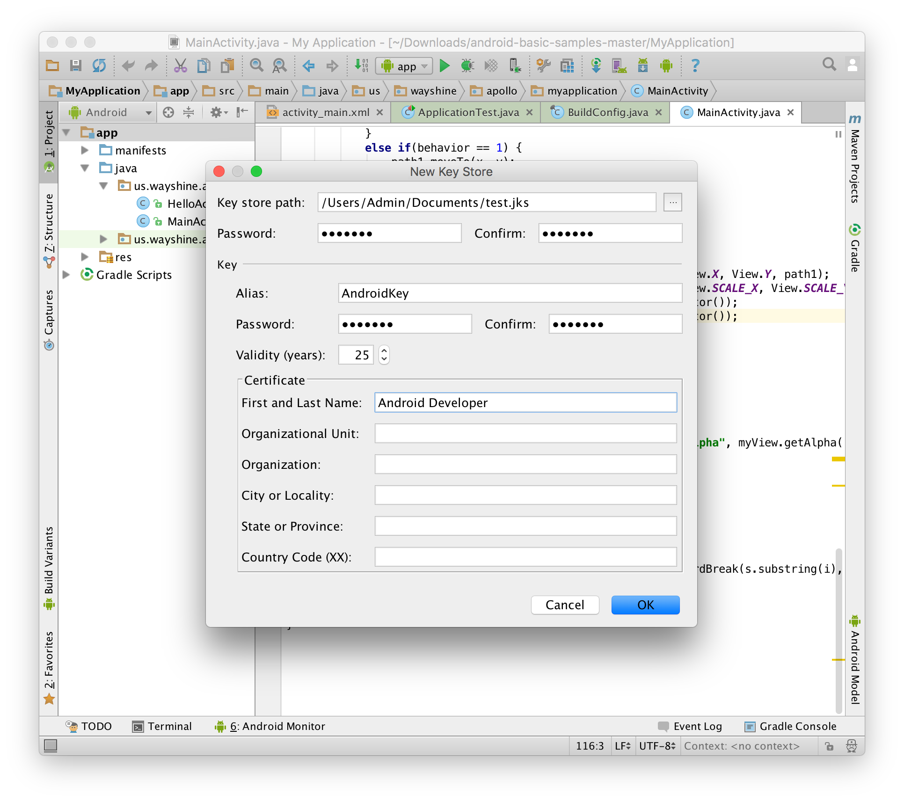
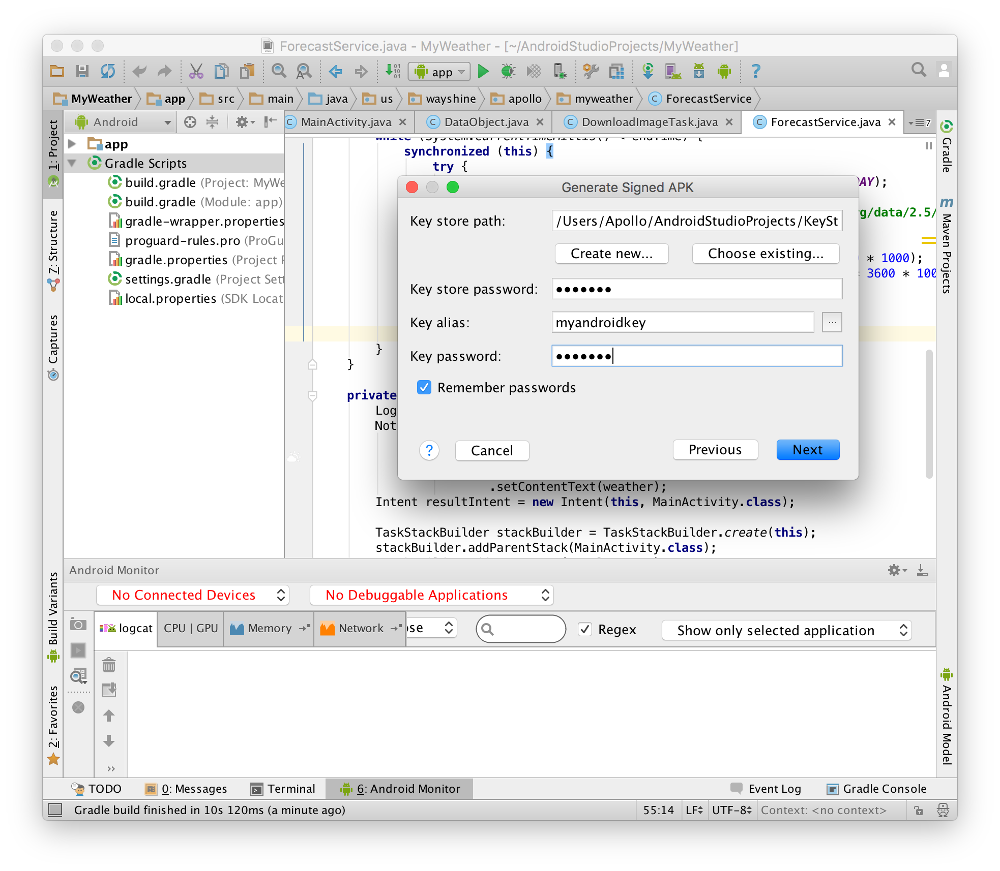

# 签名

起草人: 魏钊旸   日期：15年12月07日

修改完善：OOOO   日期：15年00月00日

# 

**一、实验目的**

了解对应用程序签名的意义，掌握在本地建立密码库，并使用密码库对已有程序进行签名的方法，为应用程序发布做好准备。

**二、基础知识**
   
* 知识点1：对应用程序进行签名的意义

      签名可以给应用程序一个唯一的标识，从而可以被用来完成程序升级等工作。


* 知识点2：在本地建立证书和密码库的方法

      签名所用的证书保存在本地的密码库中，这个密码库需要开发者自行维护和管理。

**三、实验内容及步骤**

**3.1 实验内容**

使用Android Studio的工具在本地建立密码库，并使用密码库对应用程序进行签名。

**3.2 实验步骤**

1. 
在本地新建密码库。

点击“编译”菜单中的“生成签名APK”项目即可进入Android Studio所提供的签名工具。在签名过程中首先需要选择密码库，密码库可以由开发者自行建立，如下图所示：

新建密码库时需要设置年限和证书，其中证书至少要包括开发者的一项信息。必要内容填写完毕后点击保存即可。

1. 
使用已有的密码库对应用程序进行签名。

建立好密码库之后，便可使用它对应用程序进行签名。在提示窗口中输入密码库位置和密码，然后点击下一步选择编译类型（debug或是release）即可。

设置完成之后Android Studio会自动对应用程序进行编译和签名工作，工作完成之后会给出信息提示。至此我们获得了一个已签名完毕的，可用于网络发布的APK文件。

**四、常见问题及注意事项**

* 如何自行获取密码库中的证书信息

Android Studio提供了一个名为keytool的工具，这个工具可用于获得签名时所用的密码库的证书信息。在终端中，我们可以输入以下命令获得密码库的证书指纹：
```
keytool -exportcert \
-alias <your-key-name> \
-keystore <path-to-production-keystore> \
-list –v
```
之后我们会获得一串SHA1码，其与用于签名的证书信息相关。它可用于应用程序的身份确认以及一些网络服务的授权等工作，比如为应用程序增加Google Play Game Service支持。


