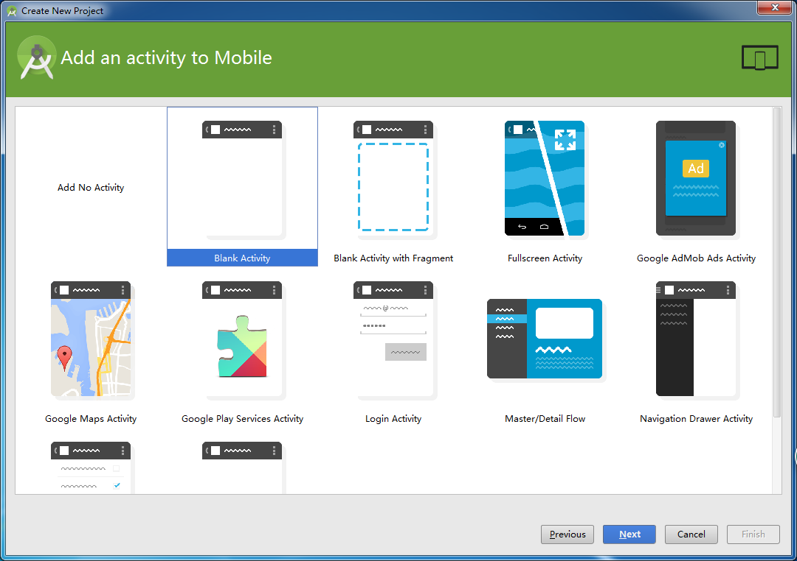
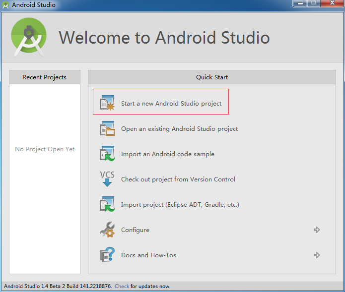
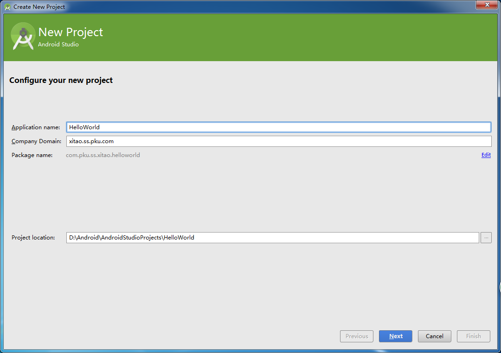
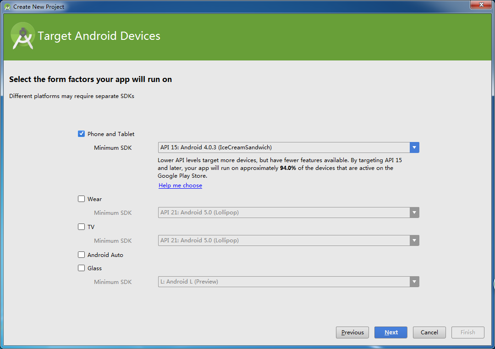
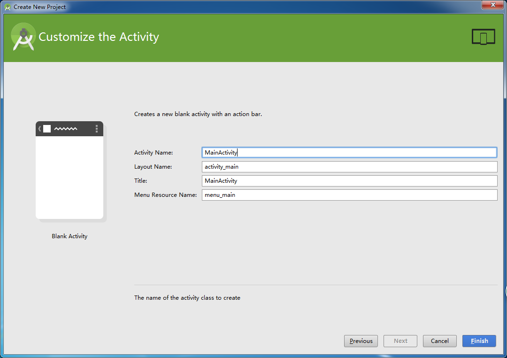
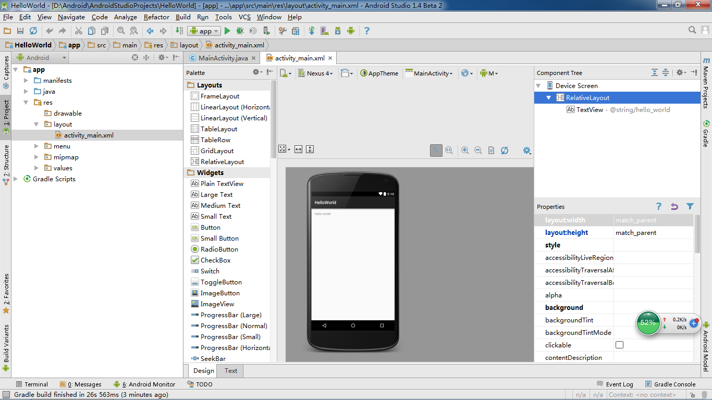

#  创建工程

    小组成员: 李佳佳、马熠东、王宇、王可颖
    
    最终完成日期：15年12月06日
    （第一次编辑因网络原因未成功上传）
# 

**一、简介**

*本实验演示了如何在Android Studio中新建一个工程并开始开发。*

   

**二、主要思路及步骤**

以下演示使用android studio创建你的第一个Android程序。

点击”Start a new Android Studio project”来开始创建一个android程序。如图：

为你的程序起一个名字，“Application name”就是将来你做的这个App的名字。

这里选择你的代码服务与什么类型的安卓设备和最小支持的SDK版本。

这里我们选择“Blank Activity”，这个选项，android studio会帮我们自动建一个“Hello World”的Activity以及一些默认的设置。我们可以在这个程序上进行修改。如果你想自己创建这些东西，你应该选择“Add No Activity”.

在这里你可以修改这些文件的名字，然后点击“finish”来完成工程的创建。

至此，你已经创建了一个“Hello World”工程并且可以对这个工程进行修改。

