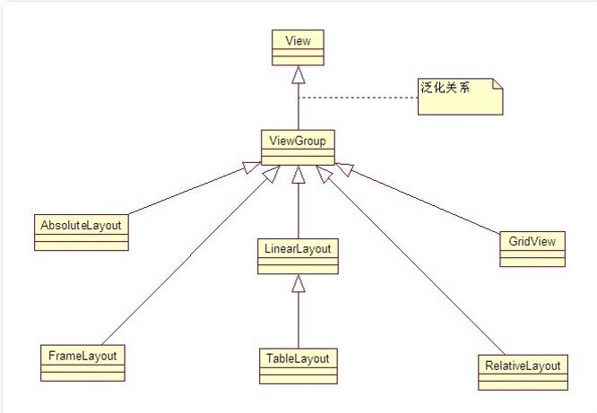
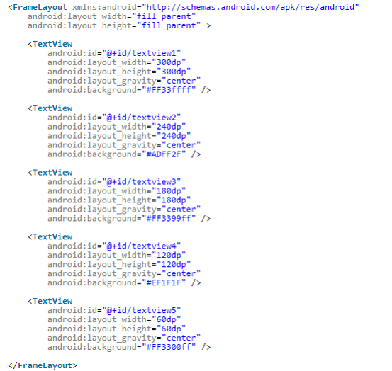
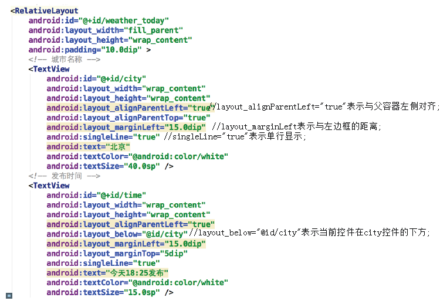
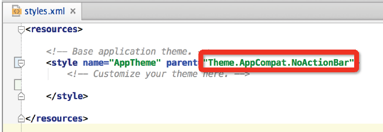

# 制作今日天气界面

    小组成员: 第11组(徐荣涛,巫思杏，陈善浩，陈增华，魏焓颖)   最终完成日期：15年12月02日
# 

**一、简介**

完成天气预报中的今日天气界面。

**二、基础知识**

*本模块主要介绍关于今日天气的界面制作，主要涉及XML各种布局知识、android开发中布局的设计与实现、TextView控件的设计与实现、ImageView控件的设计与实现等*

* 布局间的继承关系：
	  在UML图中可以看出, 绝对布局 帧布局 网格布局 相对布局 线性布局是直接继承ViewGroup。
	  表格布局是继承的LinearLayout。
	  

      android中View类是最基本的一个UI类，基本上所有高级UI组件都是继承View类实现的，一个Viewgroup对象是一个Android.view.Viewgroup的实例，Viewgroup的作用就是View的容器，它负责对添加进Viewgroup的这些View进行布局。当然一个Viewgroup也可以加入另一个Viewgroup里面，因为Viewgroup也是继承于View.Viewgroup类，它是一个抽象类，也是其他容器类的基类。
	  下面我们用到的布局就是它的实现类。Viewgroups的实现类比较多，在我们的demo中用到的比较多的就是线性布局和相对布局。

* 线性布局（LinearLayout）：

      线性布局（LinearLayout）：在该布局下的所有子元素会根据orientation属性的值来决定是按行或者是按列来逐个显示
	  作用 : 线性布局会将容器中的组件一个一个排列起来, LinearLayout可以控制组件 横向 或者 纵向 排列, 通过android:orientation属性控制;
	  不换行属性 : 线性布局中的组件不会自动换行, 如果组件一个一个排列到尽头之后, 剩下的组件就不会显示出来;
	  LayoutParams属性 : 所有的布局管理器都提供了相应的LayoutParams内部类, 这些内部类用于控制该布局本身, 如 对齐方式 layout_gravity, 所占权重 layout_weight, 这些属性用于设置本元素在父容器中的对齐方式;
	  容器属性 : 在android:后面没有layout的属性基本都是容器属性, android:gravity作用是指定指定本元素包含的子元素的对齐方式, 一般只有容器才支持这个属性;
      
* 相对布局（RelativeLayout）：
		相对布局（RelativeLayout）:在该布局下所有子元素会根据相互之间的相对位置来排布和显示
		相对布局容器内子组件的位置总是相对兄弟组件、父容器决定的，因此这种布局方式称为相对布局。
		同样的，为了控制该布局容器内各子组件的布局分布，RelativeLayout提供了一个内部类，RelativeLayout.LayoutParams,该类提供了大量的XML属性来控制R布局容器中子组件的布局分布。
		在相对布局中，一般用到的控件属性解释如下：
		android:layout_above  为将该控件的底部放在指定id控件的上方
		android:layout_below   同理类似，将该控件的顶部放在指定id控件的下方
		android:layout_toLeftOf  将该控件的右端紧挨着放在指定id控件的左端。
		android:layout_toRightOf  将该控件的左端紧挨着放在指定id控件的右端
		android:layout_alignParentRight 为true时将该控件右端与父控件右端对齐
		android:layout_alignParentLeft  为true时将该控件左端与父控件左端对齐
		android:layout_alignParentTop  为true时将该控件顶端与父控件顶端对齐
		android:layout_alignParentBottom 为true时将该控件底端与父控件底端对齐
		android:layout_alignBottom  将该控件底部与指定id控件底部控件对齐
		android:layout_alignLeft 将该控件左边与指定id控件左边对齐
		android:layout_alignRight  将该控件右边与指定id控件右边对齐
		android:layout_alignTop  将该控件顶端与指定id控件顶端对齐

* padding和margin：
		padding: 指定控件的内边距，也就是说控件当中的内容,相应的有paddingTop、paddingBottom、paddingLeft、paddingRight几个属性。
		此处与layout_margin属性进行区别，layout_margin表示该控件距离父控件的边距。

  
* gravity：
		gravity:设置布局管理器内组件(子元素)的对齐方式 。
		该属性是对该view 内容的限定．比如一个button 上面的text. 你可以设置该text 在view的靠左，靠右等位置．此处要与layout_gravity有所区别，layout_gravity是用来设置该view相对与父view 的位置．也就是说，指定该元素在LinearLayout(父容器)的对齐方式, 也就是该组件本身的对齐方式
		android:gravity 还可以写成：bottom|center_horizontal
		简单的说，android:layout_gravity 是控制组件本身的对齐方式, android:gravity是控制本容器子组件的对齐方式;
		android:orientation 设置布局管理器内组件排列方式, 设置为horizontal(水平),vertical(垂直), 默认为垂直排列

* TextView：
      
      TextView控件主要用于静态文本的显示
      TextView控件的基本属性包括：TextSize、TextColor和text，其作用分别为设定文字的大小、颜色和内容

* ImageView：

      ImageView控件主要用于图片的显示
      Image控件的基本常用属性为src，作用是指定图片来源   
* 其他布局：
	  1）TableLayout表格布局。TableLayout继承了LinearLayout，它的本质仍然是线性布局。不需要声明包含多少列多少行，通过添加TableRow以及其他组件控制表格的行列数。向TableLayout中添加一个TableRow，TableRow就是一个表格行，它也是容器，可以继续添加其他组件。
	  2）FrameLayout帧布局。帧布局容器为每个加入其中的组件创建一个空白的区域（称为一帧），每个子组件占据一帧，这些帧根据gravity的属性执行自动对齐。帧布局的效果把组件一个一个叠加在一起。
	  3）GridLayout网格布局。把整个容器划分成rows*columns个网格，每个网格可以放一个组件，也可以设置一个组件横跨多少列纵跨多少行。
	  4）AbsoluteLayout绝对布局。就是android不提供任何布局控制，而由开发人员自己通过X坐标，Y坐标来控制组件的位置。

* 帧布局示意：
	  示意代码如下：

	  运行图如下

 
	  如果将每个TextView大小设置的一样的话，帧布局的效果就是 只会显示最上面这个蓝色的TextView了。
**三、主要思路及步骤**

**3.1 主要思路**

	  将今日天气界面划分成几个模块，模块之间采用线性布局，模块内部的控件使用相对布局，以此实现今日天气的界面。

**3.2 实践步骤**
	  
	  
	  
	  
	  3、 搭建主体框架
	  根据前面的分析，这里采用嵌套布局的方式，放置一个线性布局，采用垂直方式分布，分别放置今日天气、7日天气信息以及广告信息。并指定背景图片。
	  
	  
	  城市名称、发布时间、湿度信息的配置内容，如下图所示：
	  
	  
	  
	  
	  
	  
	  
	  
	  
	  
	  
	  
	  以上，就完成了今日天气信息的制作。
	  
**四、常见问题及注意事项**

	  1、区分开margin和padding等诸如此类的易混淆属性。
	  2、如果不清楚某个布局的常用属性，及时到API查阅。
	  3、对于不同应用场景，选择合适的布局事半功倍。如制作一个计算器，布局采用网格布局会更方便。
