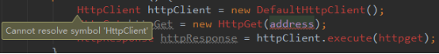
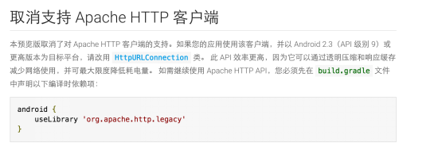
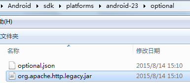
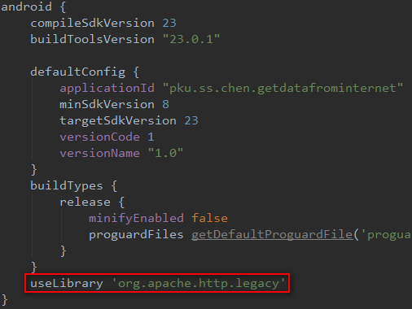
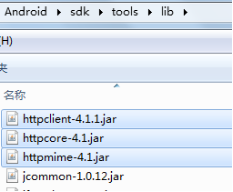
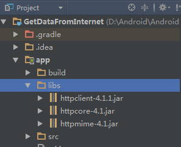

# 获取网络数据

    小组成员: 第八组   最终完成日期：15年11月30日
# 

**一、简介**

天气预报项目需要从网站拿到天气预报的相关信息,本节主要就是讲如何连接到网站,并且拿到网络数据。

**二、基础知识**

   
* 知识点1：

     在AndroidManifest.xml中添加访问INTERNET的权限：
        <uses-permission android:name="android.permission.INTERNET"/>

* 知识点2：
  
  URL的相关知识
    
   1、URL（Uniform Resource Locator，统一资源定位符）是对可以从互联网上得到的资源的位置和访问方法的一种简洁的表示，是互联网上标准资源的地址。互联网上的每个文件都有一个唯一的URL。   
  2、URL类提供了多个构造器用于创建URL对象。   
3、URL类提供了多个方法来访问URL对应的资源：
openConnection()返回一个URLConnection对象，它表示到URL所引用的远程对象的连接； 
openStream()：打开此URL的连接，并返回一个用于读取该URL资源的InputStream。  
4、支持File、FTP、HTTP、HTTPS、Jar协议等，根据url的协议不同，要将openConnection()返回的结果转换成对应的实例对象。如果是http协议，返回HttpURLConnection对象，如果是一个jar文件，就返回JarURLConnection对象。 
5、在天气预报项目中，我们使用的是通过给定的url字符串创建url。
URL url = new URL("http://wthrcdn.etouch.cn/WeatherApi?citykey=101010100");

* 知识点3：
  
 HttoClient的相关知识  
  1、HttpClient是Apache Jakarta Common下的子项目，可以用来提供高效的、最新的、功能丰富的支持HTTP协议的客户端编程工具包。Android系统已经集成了HttpClient，开发人员可以直接在Android应用中使用HttpClient来提交请求、接收响应。  
2、使用HttpClient的步骤：
 1.  HttpClient是一个接口，因此要创建一个DefaultHttpClient实例；
 2. 如果需要发送GET请求，创建HttpGet对象；如果需要发送POST请求，创建HttpPost对象（如果需要发送POST请求，通过HttpPost的setEntity()方法将构造好的UrlEncodedFormEntity传入）；
 3. 调用HttpClient对象的execute()方法发送请求，该方法返回一个HttpResponse对象；
 4. 调用HttpResponse的getEntity()方法获取HttpEntity对象；
 5. 也可以调用HttpResponse的getStatusLine.getStatusCode()方法获取返回状态码，来确定是否成功，200代表成功。

* 知识点4：    
   1、URLConnection是向一个URL读或写的连接，继承自URLConnection，是通过网络用来向HTTP发送和获取数据的URLConnection，数据可以是任意类型的、事先不知道长度的流数据。  
   2、使用HttpURLConnection的步骤：
  1. 用url地址创建URL对象，通过调用URL的openConnection()得到一个URLCon nection，需要显式地将其转换成HttpURLConnection对象。
  2. 准备请求request。一个请求的主要属性是它的URI，请求头部可能也会包含像证书、content types和session cookies这样的元数据。
  3. 可选地上传请求主体。如果实例包含了一个request entity，必须用setDoOutput(true)配置。通过向getOutputStream()返回的流进行写操作来传送数据。
  4. 读取response。响应的头部通常包括像response entity的content type及长度、修改时间和session cookies这样的元数据。Response entity从getInputStream()返回的流中读取。如果响应不包含body，方法返回一个空流。
  5. disconnect()断开连接。一旦读完了response entity，调用disconnect()来关闭HttpURLConnection，断开连接就释放了它占用的资源，以至于他们可以被关闭或者重用。    
 
 3、some tips：  
向web服务器上传数据时，使用setDoOutput(true)来为输出配置连接；
HttpURLConnection返回的输入、输出流不是缓冲的，可以用java.io.BufferedInputStream或java.io.BufferedOutputStream来显式转换流类型。当传送大量数据时，用流来限制每次有多少数据存在内存里，而不是把整个数据主体存成简单的byte数组或字符串。请求方法默认是GET方法，通过setDoOutput(true)可以使用POST方法，通过setRequestMethod()可以使用OPTIONS、HEAD、PUT、DELETE和TRACE等HTTP方法。
* 知识点5：   
响应的状态码通过getResponseCode()来获得   
2XX: generally "OK"，如202=accepted、200=ok；  
    3XX: relocation/redirect；  
    4XX: client error，如408=client timeout、403=forbidden、404=not found；  
    5XX: server error，如502=bad gateway、500=internal error。

* 知识点6：   
  get和post  
HTTP标准包含get和post这两种方法是为了达到不同的目的。POST用于创建资源，资源的内容会被编入HTTP请求的内容中。例如，处理订货表单、在数据库中加入新数据行等
当请求无副作用时（如进行搜索），便可使用GET方法；当请求有副作用时（如添加数据行），则用POST方法。一个比较实际的问题是：GET方法可能会产生很长的URL，或许会超过某些浏览器与服务器对URL长度的限制。

  若符合下列任一情况，则用POST方法：  
   请求的结果有持续性的副作用，例如，数据库内添加新的数据行；  
   若使用GET方法，则表单上收集的数据可能让URL过长；  
   要传送的数据不是采用7位的ASCII编码。   

  若符合下列任一情况，则用GET方法：   
  请求是为了查找资源，HTML表单数据仅用来帮助搜索；  
 请求结果无持续性的副作用；  
 收集的数据及HTML表单内的输入字段名称的总长不超过1024个字符。

**三、主要思路及步骤**

**3.1 主要思路**

使用get方式从提供天气信息的接口获取数据，分别通过HttpClient和HttpURLConnection两种方式实现。

**3.2 实践步骤**

1、使用HttpURLConnection方式：     

    URL url = new URL("http://wthrcdn.etouch.cn/WeatherApi?citykey=101010100");
    HttpURLConnection httpURLConnection = (HttpURLConnection)url.openConnection();
    InputStream inputStream = httpURLConnection.getInputStream();
           BufferedReader bufferedReader = new BufferedReader(new InputStreamReader(inputStream));
    String responseStr = "";
    String readLine = null;
    while((readLine=bufferedReader.readLine())!=null){
          responseStr = responseStr + readLine;
    }
       inputStream.close();
       bufferedReader.close();
       httpURLConnection.disconnect();
2、使用HttpClient方式   

    HttpClient httpClient = new DefaultHttpClient();
    HttpGet httpGet = new HttpGet("http://wthrcdn.etouch.cn/WeatherApi?citykey=101010100");
    HttpResponse httpResponse = httpClient.execute(httpGet);
    if(httpResponse.getStatusLine().getStatusCode() == 200){
     HttpEntity entity = httpResponse.getEntity();
    InputStream responseStream = entity.getContent();
    responseStream = new GZIPInputStream(responseStream);
    BufferedReader reader = new BufferedReader(new InputStreamReader(responseStream));
    StringBuilder response = new StringBuilder();
    String str;
    while((str = reader.readLine()) != null){
        response.append(str);
    }
    reader.close();
    responseStream.close();
	… …
    }
**四、常见问题及注意事项**  
在使用HttpClient类时，出现Cannot resolve symbol ‘HttpClient’的错误

出现这个问题是因为Android6.0取消了对Apache HTTP客户端的支持，在官方文档中可以看到如下说明：
      

 第一种解决方案：  
在sdk文件夹下的/platforms/ansdroid-23/optional中找到org.apache.http.legacy.jar，将jar包复制到项目的libs文件夹中，并修改build.gradle文件，添加一句useLirary ‘org.apache.http.legacy’。

  
第二种解决方案：   
将HttpClient所需的依赖包如httpclient-4.1.1.jar、httpcore-4.1.jar等添加到项目中，具体操作为：将依赖包复制到app/libs文件夹下，并右键点击“Add as Library”。依赖包可以从网络上下载，也可以直接在sdk文件夹下的/tools/lib文件夹中找到，如图所示：

