# 解析网络数据

    小组成员: 第二组   最终完成日期：15年11月29日
# 

**一、简介**

本模块完成解析从网络上获取的XML或者JSON格式的文件，获得数据后装配成TodayWeatherData类型的对象。

**二、基础知识**

   
* XML文件主要节点：

     元素：元素是 XML 的基本构造模块。通常，元素拥有子元素、文本节点，或两者的组合。元素节点也是能够拥有属性的唯一节点类型。
     
     属性：属性节点包含关于元素节点的信息，但是并不实际认为是元素的孩子。

 文本：文本节点就是名副其实的文本。它可以由更多信息组成，也可以只包含空白。

    CDATA：字符数据（Character Data）的缩写，这是一个特殊的节点，它包含不应该被解析器分析的信息。相反，它包含的信息应该以纯文本传递。例如，可能会为了特殊目的而存储 HTML 标签。在通常情形下，处理器可能尝试为所存储的每个标签创建元素，而这样可能导致文档不是格式良好的。这些问题可用通过使用 CDATA 节（section）来避免。
    
    注释：注释包括关于数据的信息，通常被应用程序忽略。
     

* XML文件中的namespace，prefix ,localName,qName，uri：

    以下图所示XML文件为例。
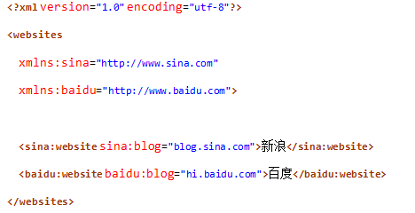
    namespace（空间名称，命名空间）,引入的原因是为了避免混淆。例如上面的这个XML文档，sina和baidu都有blog属性，通过

 xmlns:sina=http://www.sina.com

 xmlns:baidu=http://www.baidu.com

 定义了两个namespace，就像sax官网说的，用namespace是为了实现更多的扩展功能，作为基本应用，很多时候都用不到它.

 sina的namespace： http://www.sina.com

 baidu的namespace：http://www.baidu.com
 
 namespace的值可以任意，但是注意不要重复。一般默认的格式都是以url来作为namespace，比如
xmlns:android="http://schemas.android.com/apk/res/android。
 
 prefix（前缀）：sina:blog中 sina就是前缀。

 localName（本地名称）：sina:blog 中blog就是localName。

 qName（Qualified Name 限定名称）：sina:blog就是qName，相当于前缀+":"+localName。

 uri：namespace的uri，例如sina:blog的uri就是前缀sina的namespace，即"http://www.sina.com"。

* SAX方法解析XML：

* **1) SAX方法的特点**
	

SAX方法解析XML是事件驱动的，它并不需要读入整个文档，而文档的读入过程也就是SAX的解析过程。所谓事件驱动，是指一种基于回调（callback）机制的程序运行方法，每触发一个事件都会将数据通过参数方式推送给事件处理类。

 SAX方式只要开始解析，就一定会完成对整个XML文档的解析，不受控制。

* **2) 事件处理函数**
	

* ContentHandler接口:

ContentHandler接口是最常用的接口

void startDocument()//文件打开时调用

void endDocument()//当到文档的末尾调用

void startElement(String uri, String localName, String qName, Attributes atts)//当遇到元素开始标记时调用
。
void endElement(String uri, String localName, String qName)//当遇到节点结束时调用

void characters(char[ ] ch, int start, int length)//当分析器遇到文本节点或者无法识别为标记或者指令类型字符时调用
	ErrorHandler接口

* ErrorHandler接口是SAX错误处理程序的基本接口:

void warning() 警示那些不是由 XML 规范定义的错误。例如，当没有 XML 声明时，某些语法分析器发出警告。它不是错误（因为声明是可选的），但是它可能值得注意。

void error() 警示那些由 XML 规范定义的错误。

void fatalError() 警示那些由 XML 规范定义的致命错误。
*	其他接口

这两个接口不常用。

DTDHandler用于接收基本的DTD相关事件的通知。

EntityResolver接口是用于解析实体的基本接口。
* **3) 重要方法参数解析**
	
ContentHandler接口中的startElement方法中包含四个参数，String uri, String localName, String qName, Attributes atts，其中uri，localName，qName和上一节讲的XML文件中的uri,localName,qName相同；atts参数是元素的属性集合，其中每个属性也有uri，localName，qName，其含义与上文相同。

ContentHandler接口中的endElement方法中的前三个参数和startElement方法中的前三个含义相同。
* **4) 解析过程**

首先定义事件处理类
public class SAXHandler extends DefaultHandler
一般都是继承自DefaultHandler ，这个类实现了上述四个接口的所有方法，有需要的可以重写相应的方法。
然后构建
SAXParser parser=SAXParserFactory.newInstance().newSAXParser();
最后调用解析器的parse方法，两个参数分别是XML文件的URI或者是输入流，后一个是事件处理类
parser.parse(fi, new SAXHandler());

* JSON文件结构：

 对象：对象表示为“{}”括起来的内容，数据结构为 {key：value,key：value,...}的键值对的结构，这个属性值的类型可以是 数字、字符串、数组、对象几种。

 数组：数组是中括号“[]”括起来的内容，数据结构为 ["java","javascript","vb",...]，字段值的类型可以是 数字、字符串、数组、对象几种。

 经过对象、数组2种结构就可以组合成复杂的数据结构了。

      

* FastJSON：

    Fastjson是一个Java语言编写的高性能功能完善的JSON库，能够解析或者生成json数据，完全支持[http://json.org](http://json.org)的标准，也是官方网站收录的参考实现之一。支持各种JDK类型。包括基本类型、JavaBean、Collection、Map、Enum、泛型等。   
    
* FastJSON解析json数据过程：

 首先根据JSON文件的格式构造合适的JavaBean，构造规则如下：
 
 JavaBean的属性：根据JSON的对象的键值对的值类型确定属性类型，属性名就是键值，比如键值对”status”:”success”，可以构造成属性String status。

 键值对的值类型是数组的，属性类型用List<数组中元素的类型>。
构造bean时候只选取需要的属性即可，不用全部构造，比如json数据包含”error”：0，如果不需要就不用构造error属性。

 然后就是解析，BaiDuWeather就是上一步构造的JavaBean：
BaiDuWeather baiduWather = JSON.parseObject(date, BaiDuWeather.class);

**三、主要思路及步骤**

**3.1 主要思路**

首先获取从网络上获得的XML或者JSON格式的天气预报数据，然后分析数据格式，构造合适的SAX事件处理类或者JavaBean，然后解析数据，并将获得的结果封装成为一个TodayWeatherData类型的对象。

**3.2  SAX解析XML步骤**

* **1) 分析数据格式**
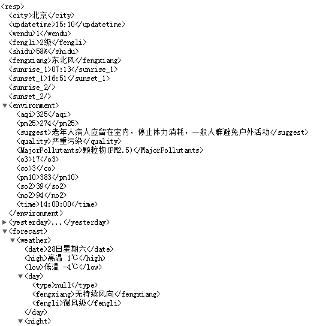
 需要的数据有resp元素里面的前六项；environment元素里面的里面的pm25和quality；forecast元素里面的第一个Weather里面的date，high，low和type，一共十二项数据。
* **2) 构造事件处理类**

 首先定义TodayWeatherData类型的对象todayWeatherData，然后定义tagName记录当前访问元素的名称。 
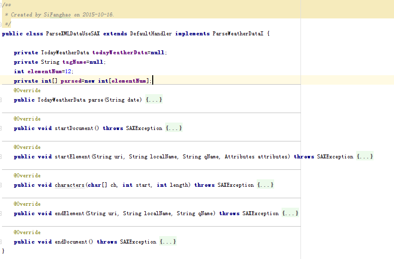
 先要定义private int[] parsed=new int[elementNum];，因为SAX方法不可控制，所以用这个数组记录元素是否已经解析到。

 然后在startDocument方法中将parsed数字初始化：
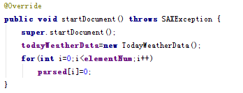
 
 在startElement方法中要记录当前解析的元素的名称，因为数据都会被characters方法处理，所以需要记录当前元素名称。
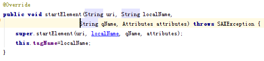
 在characters方法中解析需要的数据，并赋值给todayWeatherData相应的属性中，同时更新parsed数组中相应记录的值。下图只给出两个数据的处理方法，其他十个相同。
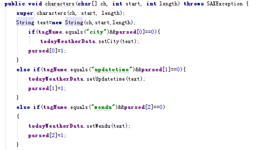
	在endElement方法中巴tagName设为null
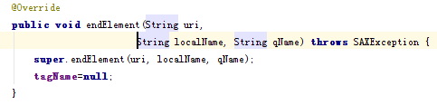
* **3) 开始解析，并返回结果**
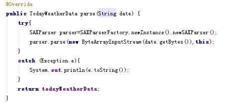

**3.3  FastJson解析JSON步骤**

* **1) 分析数据格式**

 本文使用的是百度天气API返回的json格式数据
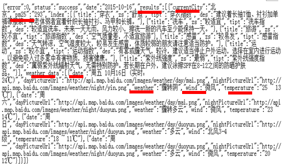
 需要的天气预报数据在上图中划线部分。
* **2) 构造JavaBean**

 首先需要构造最外层对象BaiDuWeather，因为results的值类型是数组，所以构造List类型的属性results，集合中每个元素的类型为Result。
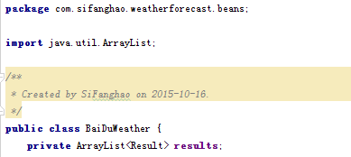
 
 然后是Result，表示返回的天气预报相关的数据，其中weather_data的值类型是数组，所以构造List类型的属性weather_data，集合中每个元素的类型为Weather_data_single。
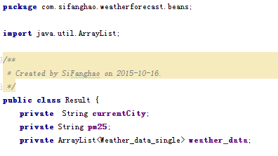
 
 然后是储存单个天气预报结果的Weather_data_single
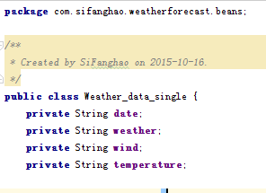
* **3) 开始解析，并返回结果**
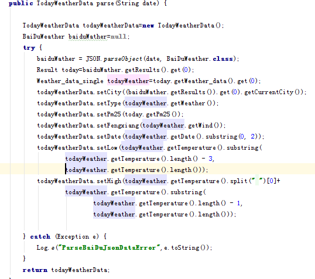
**四、常见问题及注意事项**

   1)	SAX解析XML时候会自动忽略注释。

2)	SAX解析XML时候遇到CDATA类型的节点，会调用characters方法，传递的内容就是CDATA节点内的文本。

3)	json字符串中，null也是作为字符串，不是空。

4)	json字符串中可能有的对象是null的，用fastjson解析的话，就可能出现空指针异常，所以在输出的时候注意先判断是否为空。

5)	json的key里面有一些特殊字符，例如"-"":"等，而Java命名规则不允许这些字符出现在属性名称的情况下，使用JSONField 注解，因为fastjson的key是根据javabean里面的getter和setter方法来的，不是根据属性名的，所以会出现这个问题，你在属性的get和set方法上面写上标注，说明转成什么就行了比如 @JSONField(name=“z-index”)。
