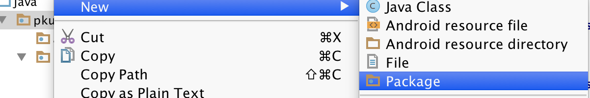
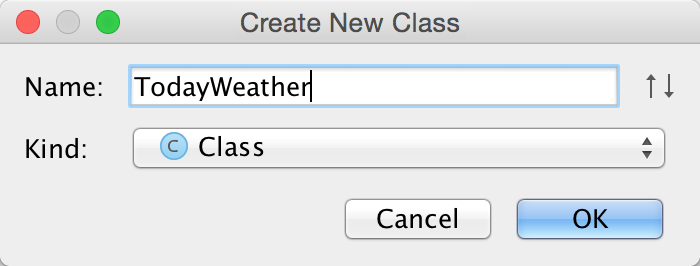
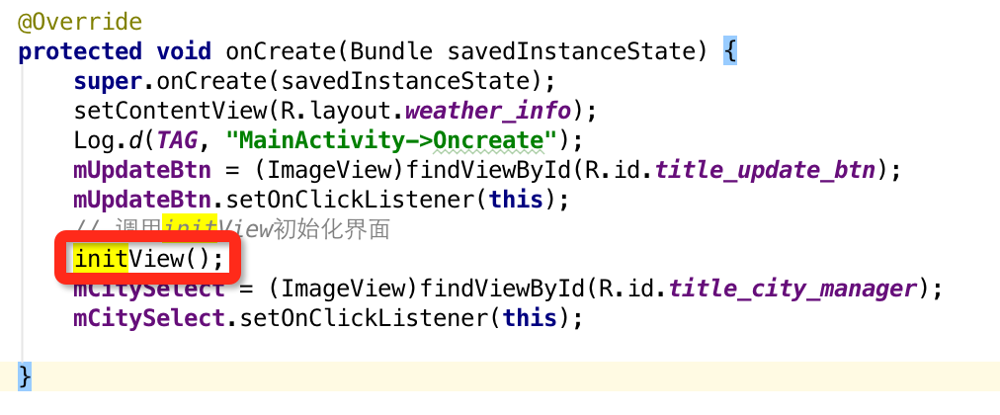
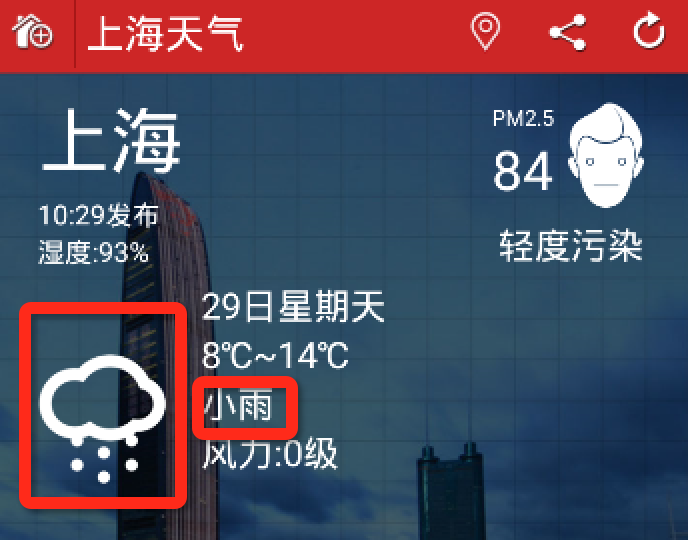
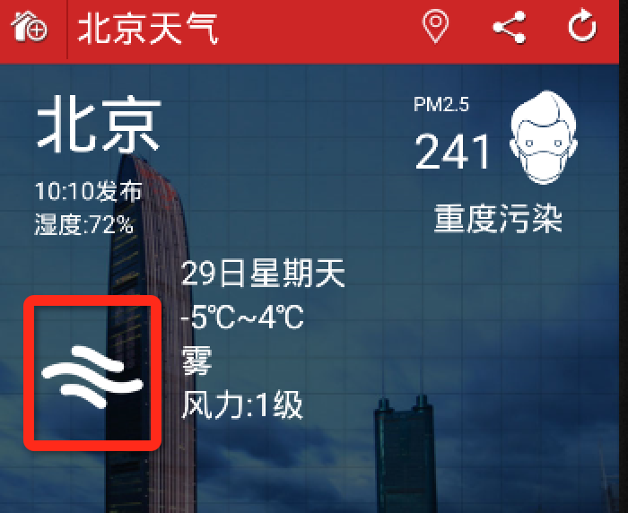

# 更新今日天气数据

    小组成员: 孙晴 宁旭冉 于昌和   最终完成日期：15年00月00日
# 

**一、简介**

*本实验完成天气预报项目中更新今日天气数据的模块。*

**二、基础知识**

   
* bean包：

      作用：封装数据
      实现： get、set、toString方法

* toString方法：

      toString()源自Object类，重写并不是必须的，需要根据当前程序的
      实际情况而定。在许多场合中,需要打印和比较出对象的内容,所以重写。
      toString()
      譬如一个JavaBean插入数据库时需要打印一段该JavaBean内容的日志
      ，这时在JavaBean里重写toString()就显得很优美了。

* 解析xml数据（PULL）：

      START_DOCUMENT：读取到XML的声明;
      END_DOCUMENT：读取到XML的结束返回；
      START_TAG : 读取到XML的开始标签；
      END_TAG：读渠道XML的结束标签；
      参照XML数据解析。

* 更新UI：

      xxx.setText():
      如果xxx是Text控件，那就是设置Text的控件中的文本内容
      xxx.setImageResource()：
      设置ImageView中的图片，setImageResource的参数是resId，必须是drawable目录下的资源。
      
* 主线程与子线程间的消息传递：

      handler是线程通讯工具类。用于传递消息。它有两个队列：
      1.消息队列
      2.线程队列
      消息队列使用sendMessage和HandleMessage的组合来发送和处理消息。
      handler是Message的主要处理者，负责Message的发送，Message内
      容的执行处理。后台线程就是通过传进来的Handler对象引用来sendMessage(Message)。
      而使用Handler，需要implement 该类的 handleMessage(Message) 
      方法，它是处理这些Message的操作内容，例如Update UI。 
      通常需要子类化Handler来实现handleMessage方法。
   

**三、主要思路及步骤**

**3.1 主要思路**

*完成更新今日天气的功能，需要前序工作：获取网络数据和解析网路数据，见本教程前面的模块*

**3.2 实践步骤**

***1.建立新的package，建立新的bean包--todayweather类***

todayweather类有如下属性：
    
    private String city;
    private String updatetime;
    private String wendu;
    private String fengli;
    private String shidu;
    private String fengxiang;
    private String pm25;
    private String quality;
    private String date;
    private String high;
    private String low;
    private String type;
为每个属性写get set方法
    
    public String getType() {
        return type;
    }

    public void setType(String type) {
        this.type = type;
    }

    public String getCity() {
        return city;
    }

    public void setCity(String city) {
        this.city = city;
    }

    public String getUpdatetime() {
        return updatetime;
    }

    public void setUpdatetime(String updatetime) {
        this.updatetime = updatetime;
    }

    public String getWendu() {
        return wendu;
    }

    public void setWendu(String wendu) {
        this.wendu = wendu;
    }

    public String getFengli() {
        return fengli;
    }

    public void setFengli(String fengli) {
        this.fengli = fengli;
    }

    public String getShidu() {
        return shidu;
    }

    public void setShidu(String shidu) {
        this.shidu = shidu;
    }

    public String getFengxiang() {
        return fengxiang;
    }

    public void setFengxiang(String fengxiang) {
        this.fengxiang = fengxiang;
    }

    public String getPm25() {
        return pm25;
    }

    public void setPm25(String pm25) {
        this.pm25 = pm25;
    }

    public String getQuality() {
        return quality;
    }

    public void setQuality(String quality) {
        this.quality = quality;
    }

    public String getDate() {
        return date;
    }

    public void setDate(String date) {
        this.date = date;
    }

    public String getHigh() {
        return high;
    }

    public void setHigh(String high) {
        this.high = high;
    }

    public String getLow() {
        return low;
    }

    public void setLow(String low) {
        this.low = low;
    }

写toString方法

    public String toString() {
        return "TodayWeather{" +
                "city='" + city + '\'' +
                ", updatetime='" + updatetime + '\'' +
                ", wendu='" + wendu + '\'' +
                ", fengli='" + fengli + '\'' +
                ", shidu='" + shidu + '\'' +
                ", fengxiang='" + fengxiang + '\'' +
                ", pm25='" + pm25 + '\'' +
                ", quality='" + quality + '\'' +
                ", date='" + date + '\'' +
                ", high='" + high + '\'' +
                ", low='" + low + '\'' +
                ", type='" + type + '\'' +
                '}';
    }
***2.将解析的数据存入TodayWeather对象中。***

在MainAcitivity中写parseXML方法
    
    private TodayWeather parseXML(String xmldata) {

        TodayWeather todayWeather = null;

        try{
            int fengxiangCount = 0;
            int fengliCount = 0;
            int dateCount = 0;
            int highCount = 0;
            int lowCount = 0;
            int typeCount = 0;

            XmlPullParserFactory fac = XmlPullParserFactory.newInstance();
            XmlPullParser xmlPullParser = fac.newPullParser();
            xmlPullParser.setInput(new StringReader(xmldata));

            int eventType =xmlPullParser.getEventType();
            Log.d("myapp", "parseXML");

            while(eventType != XmlPullParser.END_DOCUMENT){
                switch(eventType) {

                    // 判断当前事件是否为文档开始事件
                    case XmlPullParser.START_DOCUMENT:
                        break;

                    // 判断是否为标签元素开始事件
                    case XmlPullParser.START_TAG:
                        if(xmlPullParser.getName().equals("resp")){
                            todayWeather = new TodayWeather();
                            todayWeather.setQuality("null");
                        }
                        if (todayWeather != null){
                            if(xmlPullParser.getName().equals("city")){
                                eventType = xmlPullParser.next();
                                todayWeather.setCity(xmlPullParser.getText());
                                Log.d("myapp", "city" + xmlPullParser.getText());
                            }else if(xmlPullParser.getName().equals("updatetime")){
                                eventType = xmlPullParser.next();
                                todayWeather.setUpdatetime(xmlPullParser.getText());
                                Log.d("myapp", "updatetime" + xmlPullParser.getText());
                            }else if(xmlPullParser.getName().equals("shidu")){
                                eventType = xmlPullParser.next();
                                todayWeather.setShidu(xmlPullParser.getText());
                                Log.d("myapp", "shidu" + xmlPullParser.getText());
                            }else if(xmlPullParser.getName().equals("wendu")){
                                eventType = xmlPullParser.next();
                                todayWeather.setWendu(xmlPullParser.getText());
                                Log.d("myapp", "wendu" + xmlPullParser.getText());
                            }else if(xmlPullParser.getName().equals("pm25")){
                                eventType = xmlPullParser.next();
                                todayWeather.setPm25(xmlPullParser.getText());
                                Log.d("myapp", "pm2.5" + xmlPullParser.getText());
                            }else if(xmlPullParser.getName().equals("quality")){//顺义的时候根本没执行这里啊
                                eventType = xmlPullParser.next();
                                todayWeather.setQuality(xmlPullParser.getText());
                                Log.d("myapp", "quality" + xmlPullParser.getText());
                            }
                            else if(xmlPullParser.getName().equals("fengxiang") && fengxiangCount == 0){
                                eventType = xmlPullParser.next();
                                todayWeather.setFengxiang(xmlPullParser.getText());
                                Log.d("myapp", "fengxiang" + xmlPullParser.getText());
                                fengxiangCount++;
                            }else if(xmlPullParser.getName().equals("fengli") && fengliCount == 0){
                                eventType = xmlPullParser.next();
                                todayWeather.setFengli(xmlPullParser.getText());
                                Log.d("myapp", "fengli" + xmlPullParser.getText());
                                fengliCount++;
                            }else if(xmlPullParser.getName().equals("date") && dateCount == 0){
                                eventType = xmlPullParser.next();
                                todayWeather.setDate(xmlPullParser.getText());
                                Log.d("myapp", "date" + xmlPullParser.getText());
                                dateCount++;
                            }else if(xmlPullParser.getName().equals("high") && highCount == 0){
                                eventType = xmlPullParser.next();
                                todayWeather.setHigh(xmlPullParser.getText().substring(2).trim());
                                Log.d("myapp", "high" + xmlPullParser.getText().substring(2).trim());
                                highCount++;
                            }else if(xmlPullParser.getName().equals("low") && lowCount == 0){
                                eventType = xmlPullParser.next();
                                todayWeather.setLow(xmlPullParser.getText().substring(2).trim());
                                Log.d("myapp", "low" + xmlPullParser.getText());
                                lowCount++;
                            }else if(xmlPullParser.getName().equals("type") && typeCount == 0){
                                eventType = xmlPullParser.next();
                                todayWeather.setType(xmlPullParser.getText());
                                Log.d("myapp", "type" + xmlPullParser.getText());
                                typeCount++;
                            }
                        }

                        break;

                    // 判断是否为标签元素结尾事件
                    case XmlPullParser.END_TAG:
                        break;
                }

                // 进入下一个元素并触发相应事件
                eventType = xmlPullParser.next();

            }

        } catch (Exception e) {
            e.printStackTrace();
        }

        return todayWeather;
    }

利用刚写的方法，接收解析结果,并通过 Log打印是否接收正确queryWeatherCode方法里写如下代码

    TodayWeather todayWeather = parseXML(responseStr);//调用parseXML
                    if (todayWeather != null) {
                        Log.d("myapp", todayWeather.toString());

***3.将数据在 UI 上进行更新。***

定义控件对象
    
    private TextView cityTv, timeTv, humidityTv,weekTv,pmDataTv, pmQualityTv, tempertureTv, climateTv, windTv;
    private ImageView weatherImg, pmImg;

初始化控件

    void initView(){
        t= (TextView) findViewById(R.id.title_city_name);
        cityTv = (TextView) findViewById(R.id.city);
        timeTv = (TextView) findViewById(R.id.time);
        humidityTv = (TextView) findViewById(R.id.humidity);
        weekTv = (TextView) findViewById(R.id.week_today);
        pmDataTv = (TextView) findViewById(R.id.pm_data);
        pmQualityTv = (TextView) findViewById(R.id.pm2_5_quality);
        pmImg = (ImageView) findViewById(R.id.pm2_5_img);
        tempertureTv = (TextView) findViewById(R.id.temperature);
        climateTv = (TextView) findViewById(R.id.climate);
        windTv = (TextView) findViewById(R.id.wind);
        weatherImg = (ImageView) findViewById(R.id.weather_img);

        cityTv.setText("N/A");
        timeTv.setText("N/A");
        humidityTv.setText("N/A");
        weekTv.setText("N/A");
        pmDataTv.setText("N/A");
        pmQualityTv.setText("N/A");
        tempertureTv.setText("N/A");
        climateTv.setText("N/A");
        windTv.setText("N/A");
    }
initView()当然是在Activity创建的时候就调用了

编写 updateTodayWeather 函数，为我们的控件填写内容
    
    // 更新天气
    void updateTodayWeather (TodayWeather todayWeather){
        //Log.d("myapp3", todayWeather.toString());
        t.setText(todayWeather.getCity()+"天气");
        cityTv.setText(todayWeather.getCity());
        timeTv.setText(todayWeather.getUpdatetime() + "发布");
        humidityTv.setText("湿度:" + todayWeather.getShidu());
        weekTv.setText(todayWeather.getDate());
        pmDataTv.setText(todayWeather.getPm25());
        pmQualityTv.setText(todayWeather.getQuality());
        pmImg.setImageResource(getpmImage(todayWeather.getQuality()));
        tempertureTv.setText(todayWeather.getLow() + "~" + todayWeather.getHigh());
        climateTv.setText(todayWeather.getType());
        windTv.setText("风力:" + todayWeather.getFengli());
        weatherImg.setImageResource(getImage(todayWeather.getType()));
        Toast.makeText(MainActivity.this, "更新成功！", Toast.LENGTH_LONG).show();
        //Log.d("到底更新几次!!!!!!!!!!!!", todayWeather.toString());
    }
其中，要是先根据天气状况更新不同的图片，效果图如下：

写一个根据获得天气情况，更新对应图标的函数

    private int getImage(String type) {
        int imagetype=0;
        switch(type) {
            case "阴" : imagetype=R.drawable.biz_plugin_weather_yin;
                break;
            case "暴雪" : imagetype=R.drawable.biz_plugin_weather_baoxue;
                break;
            case "晴" : imagetype=R.drawable.biz_plugin_weather_qing;
                break;
            case "暴雨" : imagetype=R.drawable.biz_plugin_weather_baoyu;
                break;
            case "大暴雨" : imagetype=R.drawable.biz_plugin_weather_dabaoyu;
                break;
            case "大雪" : imagetype=R.drawable.biz_plugin_weather_daxue;
                break;
            case "大雨" : imagetype=R.drawable.biz_plugin_weather_dayu;
                break;
            case "多云" : imagetype=R.drawable.biz_plugin_weather_duoyun;
                break;
            case "雷阵雨冰雹" : imagetype=R.drawable.biz_plugin_weather_leizhenyubingbao;
                break;
            case "雷阵雨" : imagetype=R.drawable.biz_plugin_weather_leizhenyu;
                break;
            default:
                imagetype=R.drawable.biz_plugin_weather_qing;
        }
        return imagetype;
    }
同样对于空气质量图标的显示的函数

    private int getpmImage(String pm) {
        System.out.println(pm);
        int pmtype=0;
        switch(pm) {
            case "重度污染" : pmtype=R.drawable.biz_plugin_weather_201_300;
                break;
            case "中度污染" : pmtype=R.drawable.biz_plugin_weather_151_200;
                break;
            case "轻度污染" : pmtype=R.drawable.biz_plugin_weather_101_150;
                break;
            case "?还有什么等级" : pmtype=R.drawable.biz_plugin_weather_51_100;
                break;
            case "良" : pmtype=R.drawable.biz_plugin_weather_0_50;
                break;
            default:
                pmtype=R.drawable.biz_plugin_weather_0_50;
                System.out.println("pmnull  打印的default");
                break;
        }

        return pmtype;
    }
    
***4.定义主线程的 Handler。***

    
    private static final int UPDATE_TODAY_WEATHER = 1;
    // 定义主线程的 handler
    private Handler mHandler = new Handler() {

        @Override
        public void handleMessage(android.os.Message msg) {
            switch(msg.what){
                case UPDATE_TODAY_WEATHER:
                    updateTodayWeather((TodayWeather) msg.obj);
                    break;
                default:
                    break;
            }

        }
    };
***5.在子线程中发送更新 UI 的消息。***
    
            if (todayWeather != null) {
                        Log.d("myapp", todayWeather.toString());

                        // 发送消息，由主线程更新UI
                        Message msg =new Message();
                        msg.what = UPDATE_TODAY_WEATHER;
                        msg.obj = todayWeather;
                        mHandler.sendMessage(msg);
                    }

**四、常见问题及注意事项**

*1. 在处理数据时注意值为空的情况；*
