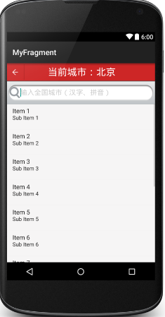
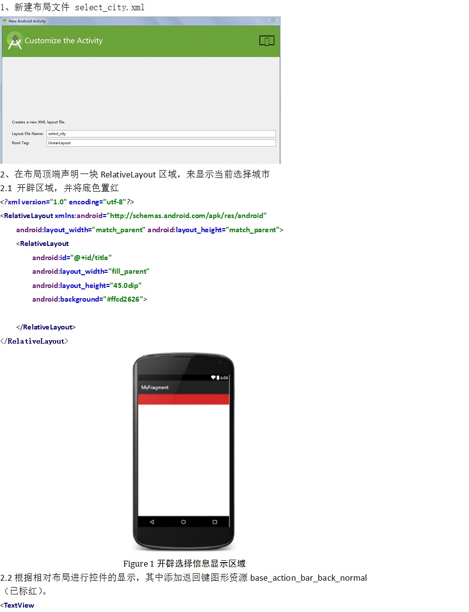
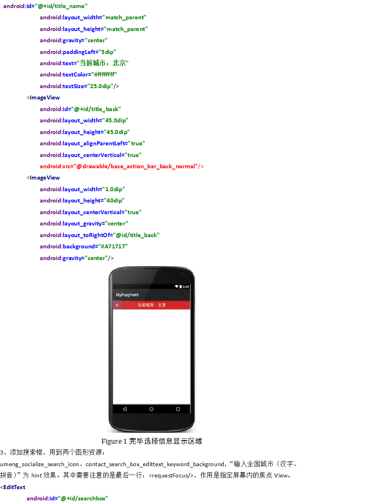
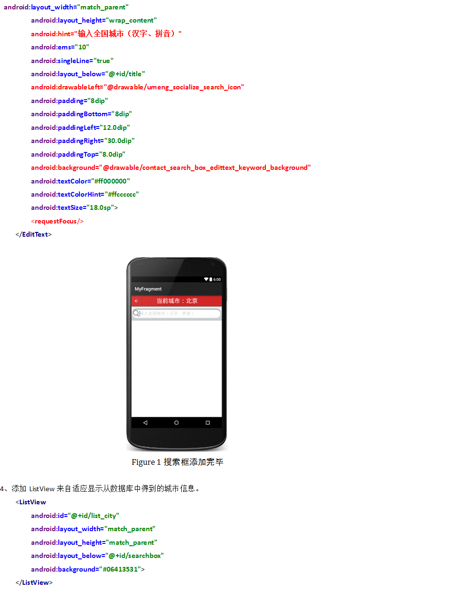
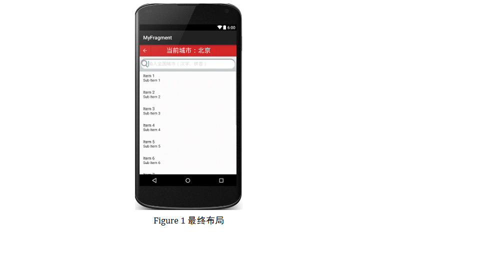

# 制作选择城市界面

小组成员: 张守一 张志康 许鑫 蒋也 侯转转

最终完成日期：15年12月02日

**一、简介**

*在天气预报项目里，光能显示一个城市的天气显然是不够的，用户可能不在不设定的这个城市，这时就需要城市的切换功能，我们需要做一个选择城市的界面供用户进行城市的选择。下面，我们先来介绍怎样制作一个城市选择界面。*

**二、基础知识**

  **

*在城市选择布局中，我们将要用到ImageView、ListView、TextView和EditText控件。*

* ImageView：

    首先确定下ImageView的全路径：android.widget.ImageView.描述：显示任意图像，例如图标。
    ImageView类可以加载各种来源的图片（如资源或图片库），需要计算图像的尺寸，比便它可以在其他布局中使用，并提供例如缩放和着色（渲染）各种显示选项。
    
    android:adjustViewBounds
    是否保持宽高比。需要与maxWidth、MaxHeight一起使用，否则单独使用没有效果。
    
    android:cropToPadding
    是否截取指定区域用空白代替。单独设置无效果，需要与scrollY一起使用

    android:maxHeight
    设置View的最大高度，单独使用无效，需要与setAdjustViewBounds一起使用。如果想设置图片固定大小，又想保持图片宽高比，需要如下设置：
    1） 设置setAdjustViewBounds为true；
    2） 设置maxWidth、MaxHeight；
    3） 设置设置layout_width和layout_height为wrap_content。

    android:maxWidth
    设置View的最大宽度。同上。

    android:scaleType
    设置图片的填充方式。

    android:src
    设置View的drawable(如图片，也可以是颜色，但是需要指定View的大小)

    android:tint
    将图片渲染成指定的颜色。

* TextView：

    TextView不仅可以用于显示丰富的文本信息，还可以用来显示图文并茂的混排页面。
    1.TextView常用属性
     TextView的常用属性有以下一些
     setText();  //设置文本内容，同xml中的android:text
     setTextSize();  //设置文本字体大小，同xml中的android:textSize
     setTextColor();  //设置文本颜色，同xml中的android:textColor
     setBackgroundColor();  //设置背景颜色，同xml中的android:background
     此外，还可以在xml中设置一些TextView的属性，如下：
     android:autoLink  //设置是否显示为可点击的链接。可选值(none/web/email/phone/map/all)
     android:drawableBottom   //在text的下方输出一个drawable(图片)
     android:drawableLeft  //在text的左边输出一个drawable(图片)
     android:drawableTop   //在text的正上方输出一个drawable(图片)
     android:drawablePadding  //设置text与drawable(图片)的间隔，与drawableLeft、drawableRight、drawableTop、drawableBottom一起使用，可设置为负数，单独使用没有效果
     android:ellipsize   //设置当文字过长时，该控件该如何显示。可设置如下属性值："start"省略号显示在开头;"end”省略号显示在结尾;"middle"省略号显示在中间; "marquee" 以跑马灯的方式显示(动画横向移动)
     android:gravity  //设置文本位置，设置成"center"，文本将居中显示
     android:linksClickable  //设置点击时是否链接，即使设置了autoLink
     android:marqueeRepeatLimit  //在ellipsize设定为marquee时，设置重复滚动的次数，设置为marquee_forever时表示无限次。
     android:lines   //设置文本的行数，设置两行就显示两行，即使第二行没有数据
     android:shadowRadius  //设置阴影的半径。设置为0.1就变成字体的颜色了，一般设置为3.0的效果比较好
     android:shadowColor  //指定文本阴影的颜色，需要与shadowRadius一起使用
     android:singleLine  //设置单行显示
     android:textColorLink   //设置文字链接的颜色
     android:textScaleX //设置文字之间间隔，默认为1.0f
     android:textStyle  //设置字形 bold(粗体) 0, italic(斜体) 1, olditalic(又粗又斜) 2, 可以设置一个或多个，用“|”隔开
     android:typeface  //设置文本字体，必须是以下常量值之一：normal 0, sans 1, serif 2, monospace(等宽字体) 3

* ListView：

    ListView 控件可使用四种不同视图显示项目。通过此控件，可将项目组成带有或不带有列标头的列，并显示伴随的图标和文本。 可使用 ListView 控件将称作 ListItem 对象的列表条目组织成下列四种不同的视图之一：1.大（标准）图标2.小图标3.列表4.报表 View 属性决定在列表中控件使用何种视图显示项目。还可用 LabelWrap 属性控制列表中与项目关联的标签是否可换行显示。另外，还可管理列表中项目的排序方法和选定项目的外观。

* EditText：

    EditText是一个非常重要的组件，可以说它是用户和Android应用进行数据传输窗户，有了它就等于有了一扇和Android应用传输的门，通过它用户可以把数据传给Android应用，然后得到我们想要的数据。
    EditText是TextView的子类，所以TextView的方法和特性同样存在于EditText中，具体的TextView的介绍可以参考上一节

**三、主要思路及步骤**

**3.1 主要思路**

*要制作城市选择界面，首先建立xml布局文件，再往布局文件中添加控件，这里我们需要一个返回按钮地ImageView，一个显示当前城市的TextView，一个进行城市输入的EditText和一个显示城市列表的ListView。*

**3.2 实践步骤**

**
**
**
**

**四、常见问题及注意事项**

*布局文件参考下载链接：*

*http://pan.baidu.com/s/1yXPc6*

