# 从数据库中读取城市列表

    小组成员: OOOO   最终完成日期：15年00月00日
# 

**一、简介**

*从数据库中读取城市列表*

**二、基础知识**

*简要介绍本模块所需掌握的基础知识*
   
* 知识点1：数据库文件存放位置

      在android中，为某个应用程序创建的数据库，只有它可以访问，其它应用程序是不能访问的，
      数据库位于Android设备/data/data/package_name/databases文件夹中，通过以下方式能够获得其根目录位置：
      
      String path = "/data"
                + Environment.getDataDirectory().getAbsolutePath()
                + File.separator + getPackageName()
                + File.separator + "databases"
                + File.separator
                ;

* 知识点2：获取工程中asset里的资源

      Android除了提供/res目录存放资源文件外，在/assets目录也会提供存放资源文件，在assets目录
      
      下面不会在R.java里面自动生成ID，所以读取assets目录下面的资源文件需要提供路径，我们可以
      
      通过AssetManager类来访问这些文件。
      
      AssetManager类提供对应用程序的原始资源文件进行访问的接口；此类提供了一个低级别的API，
      
      它允许你以简单的字节流的形式打开和读取和应用程序绑定在一起的原始资源文件。我们可以通过
      
      getAssets()方法获取AssetManager对象。
    
    
        **AssetManager类常用方法：**

        **Public Methods**

        final String[] list(Stringpath)

        返回指定路径下的所有文件及目录名。

        final InputStream open(String fileName)

        使用ACCESS_STREAMING模式打开assets下的指定文件。.

        final InputStream open(String fileName, int accessMode)

        使用显示的访问模式打开assets下的指定文件.

* 知识点3：android中如何使用SQLite

      现在的主流移动设备像Android、iPhone等都使用SQLite作为复杂数据的存储引擎，
      
      在我们为移动设备开发应用程序时，也许就要使用到SQLite来存储我们大量的数据，所以我们就需要掌握移动设备上的SQLite开发技巧。
      
      对于Android平台来说，系统内置了丰富的API来供开发人员操作SQLite，我们可以轻松的完成对数据的存取。
      
    打开或创建数据库  
        SQLiteDatabase db = openOrCreateDatabase("test.db", Context.MODE_PRIVATE, null);  

    对于sql语句的使用是十分方便的,对于已经创建好的数据库db，以下语句就能够执行sql语句完成增删改查
    
        db.execSQL(*sql语句*)
        
    除了统一的形式之外，他们还有各自的操作方法：
    
         db.insert(String table, String nullColumnHack, ContentValues values);  
         db.update(String table, Contentvalues values, String whereClause, String whereArgs);  
         db.delete(String table, String whereClause, String whereArgs); 
         
         以上三个方法的第一个参数都是表示要操作的表名；
         
         insert中的第二个参数表示如果插入的数据每一列都为空的话，需要指定此行中某一列的名称，系统将此列设置为NULL，不至于出现错误；
         
         insert中的第三个参数是ContentValues类型的变量，是键值对组成的Map，key代表列名，value代表该列要插入的值；
         
         update的第二个参数也很类似，只不过它是更新该字段key为最新的value值，第三个参数whereClause表示WHERE表达式，
         比如“age > ? and age < ?”等，最后的whereArgs参数是占位符的实际参数值；delete方法的参数也是一样。
     
    在本实验中，主要使用sql语句进行操作，其他详情可见http://blog.csdn.net/liuhe688/article/details/6715983/
    

   

**三、主要思路及步骤**

**3.1 主要思路**

*第一，新建一个application*

*第二，新建city类*

*第三，将所给的数据库文件导入*

*第四，对导入的数据库文件进行读取*

*第五，对读取出的数据进行显示*

**3.2 实践步骤**

*将数据库文件 city.db 放置到 assets 目录*
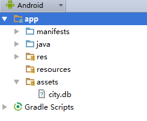

*建立 City 的 Bean*

*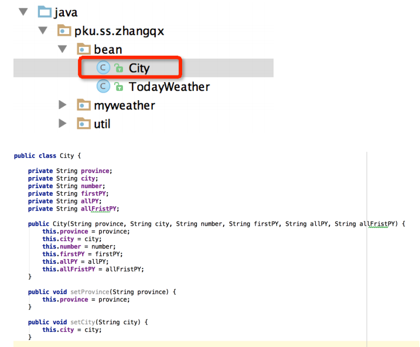*
*建立 MyApplication 类*
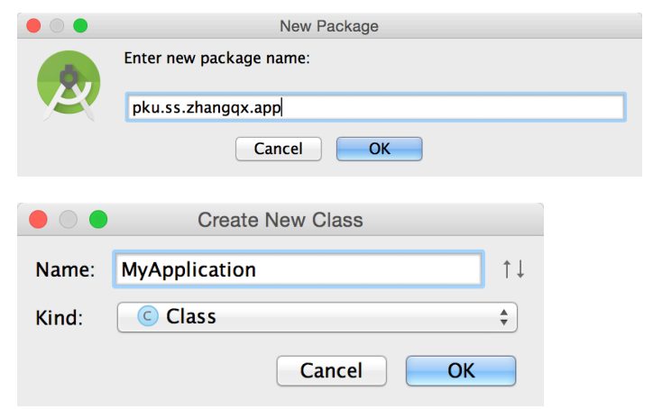
MyApplication 类继承自 Application 类，代码如下所示：

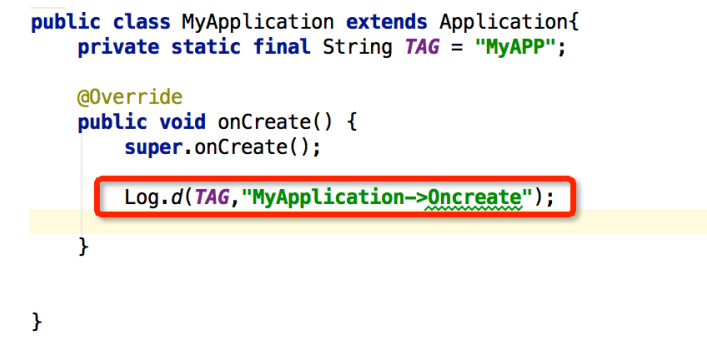
分别在 MyApplication 和 MainActivity 的 onCreate 方法中打印信息，观察函数的先后调用情
况。
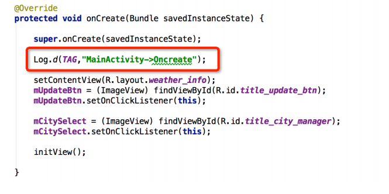
由于是自定义的 Application，需要在 AndroidManifest.xml 文件中进行注册，代码如下图所示：
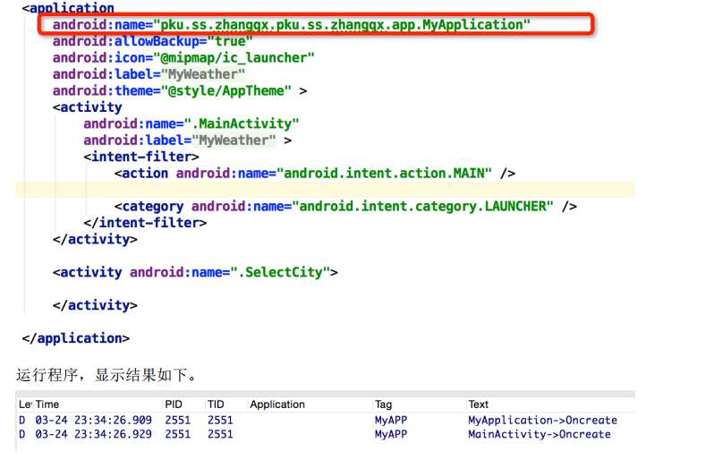
*在 MyApplication 类中创建 getInstance 方法*
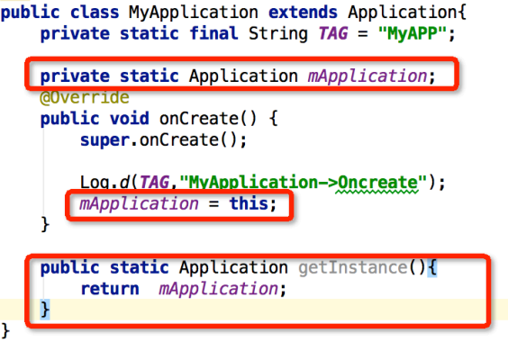
*创建 CityDB 操作类*
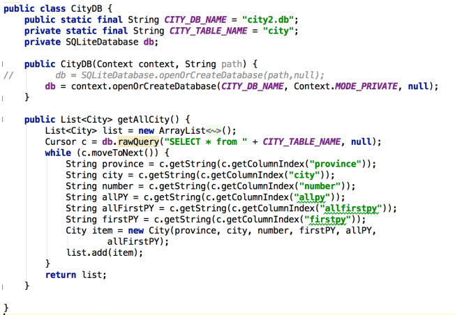
*创建初始化数据库的方法*
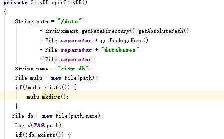
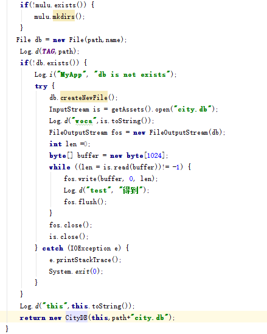
*初始化城市信息列表*
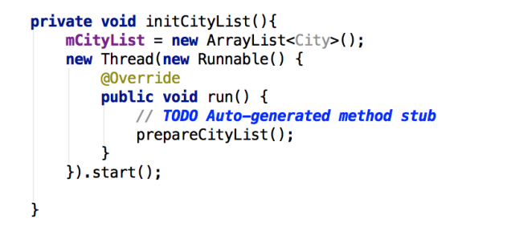
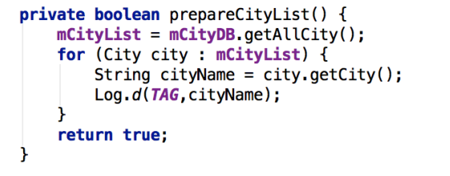

*在程序运行时调用数据库访问方法*
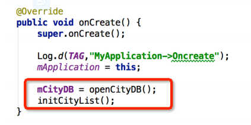
程序运行结果如下，可以在程序运行时，在 Application 对象中打开数据库，并取出城市列
表信息数据。
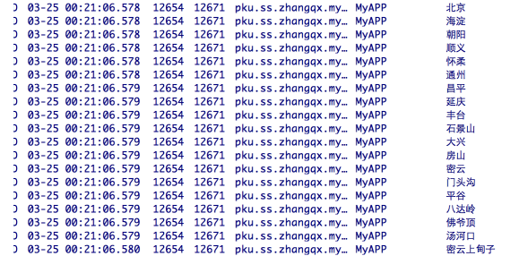

**四、常见问题及注意事项**

一、将city.db导入工程中时直接复制到asset目录下,没有的话自己建这个目录
二、自定义的 Application，需要在 AndroidManifest.xml 文件中进行注册
三、理解android中的目录体系

