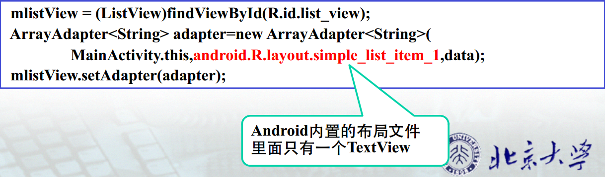
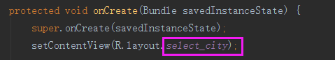
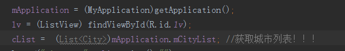
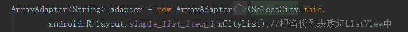
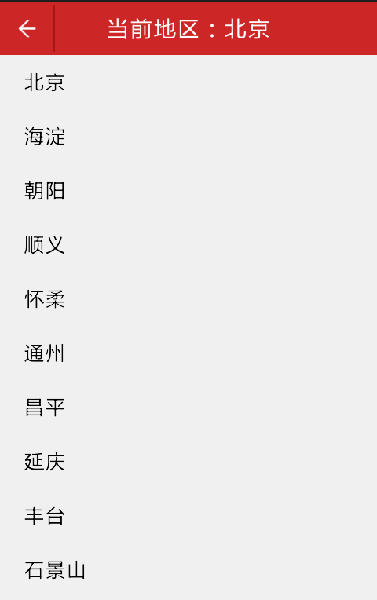
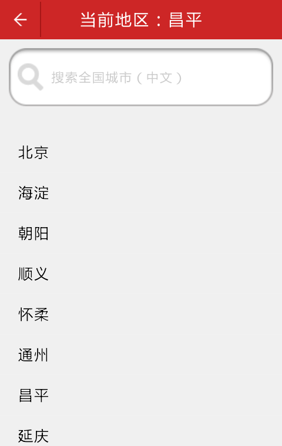

# 通过ListView展示城市列表#


 *小组成员*: 张凯云 杨宗睿 董雪 郭元歆 吴辉
 
 *最终完成日期*：15年11月30日

##**一、简介**##

&ensp;&ensp;&ensp;&ensp;ListView是Android一系列组件之一，它以垂直列表的方式列出所需的列表项，可以用来显示各项带图标的列表，也可以用来显示带有子项的列表。本次实验将使用listView在界面上展示城市列表。

##**二、基础知识**##

&ensp;&ensp;&ensp;&ensp;一个ListView的创建需要3个元素。

&ensp;&ensp;&ensp;&ensp;（1）ListView中的每一列的View。

&ensp;&ensp;&ensp;&ensp;（2）填入View的数据或者图片等。

&ensp;&ensp;&ensp;&ensp;（3）连接数据与ListView的适配器。

因此，要使用ListView，首先要了解什么是适配器。
* **知识点1----适配器Adapter：**

&ensp;&ensp;&ensp;&ensp;适配器是一个连接数据和AdapterView（ListView就是一个典型的AdapterView）的桥梁，通过它能有效地实现数据与AdapterView的分离设置，使AdapterView与数据的绑定更加简便，修改更加方便。常用的适配器有以下几种：  

| **Adapter**        | **含义**   |
| --------   | -----:  |
| ArrayAdapter&lt;T>|最简单的一个Adapter，只能展现一行文字，用来绑定一个数组，支持泛型操作|
| SimpleAdapter|同样具有良好扩展性的一个Adapter，可以自定义多种效果，比如可以用来绑定在xml中定义的控件对应的数据|
| SimpleCursorAdapter|用来绑定游标得到的数据，或用于显示简单文本类型的listView，一般在数据库那里会用到|
| BaseAdapter|通用的基础适配器|

* **知识点2----listView**

通过直接在布局中加入listView就可以实现，代码如下：
```
<ListView
        android:id="@+id/lv"
        android:layout_width="match_parent"
        android:layout_height="wrap_content"
        android:layout_below="@id/city_title"/>
```


##**三、主要思路及步骤**##

**3.1 主要思路**

1. 构建listView组件
2. 定义一个数组来存放ListView中item的内容。
3. 通过实现ArrayAdapter的构造函数来创建一个ArrayAdapter的对象。
4. 通过ListView的setAdapter()方法绑定ArrayAdapter。  



&ensp;&ensp;&ensp;&ensp;其中第二步有必要说一下的是，ArrayAdapter有多个构造函数，上图例子中实现的是最常用的一种。第一个参数为上下文，第二个参数为一个包含TextView，用来填充ListView的每一行的布局资源ID。第三个参数为ListView的内容。其中第二个参数可以自定义一个layout，但是这个layout必须要有TextView控件。

**3.2 实践步骤**

a. 构建listView组件

&ensp;&ensp;&ensp;&ensp;首先，在res/layout下新建一个select_city.xml
``````
<?xml version="1.0" encoding="utf-8"?>
<RelativeLayout xmlns:android="http://schemas.android.com/apk/res/android"
    android:layout_width="match_parent"
    android:layout_height="match_parent"
    android:background="#fff0f0f0">
    <RelativeLayout
        android:id="@+id/city_title"
        android:layout_width="fill_parent"
        android:layout_height="45.0dp"
        android:background="#ffcd2626">
        <!--选择城市界面，标题处：当前城市名称-->
        <TextView
            android:id="@+id/title_name"
            android:layout_width="fill_parent"
            android:layout_height="fill_parent"
            android:gravity="center"
            android:text="@string/current_city_name"
            android:textColor="#ffffffff"
            android:textSize="20.0dp" />
        <ImageView
            android:id="@+id/title_back"
            android:layout_width="45.0dp"
            android:layout_height="45.0dp"
            android:layout_alignParentLeft="true"
            android:layout_centerVertical="true"
            android:src="@drawable/base_action_bar_back_normal"
            android:background="@drawable/btn_bg" />
        <ImageView
            android:layout_width="1.0dip"
            android:layout_height="40dip"
            android:layout_centerVertical="true"
            android:layout_gravity="center"
            android:layout_toRightOf="@id/title_back"
            android:background="#A71717"
            android:gravity="center" />
    </RelativeLayout>
    <!--title结束-->
    <!--城市列表-->
    <ListView
        android:id="@+id/lv"
        android:layout_width="match_parent"
        android:layout_height="wrap_content"
        android:layout_below="@id/city_title"/>
</RelativeLayout>

``````
&ensp;&ensp;&ensp;&ensp;上述代码创建了一个新的界面，界面的上方是title部分，用于说明当前城市名，下方是我们要使用的listView。

b. 定义一个数组来存放ListView中item的内容。

&ensp;&ensp;&ensp;&ensp;定义好我们要用的listView之后，要在activity中引用它


这里，我们的数据是从数据库中获取得到


其中的MyApplication类就是一个model，在它里面已经把我们需要的城市数据封装成了泛型类型的数据List&lt;City>

c. 通过实现ArrayAdapter的构造函数来创建一个ArrayAdapter的对象。



d. 通过ListView的setAdapter()方法绑定ArrayAdapter。
```
mListItems.setAdapter(adapter);
```


运行结果如下图：



e. 添加搜索框

&ensp;&ensp;&ensp;&ensp;代码如下：
```
<!--搜索栏-->
    <EditText
        android:id="@+id/search_edit"
        android:layout_below="@id/city_title"
        android:layout_width="fill_parent"
        android:layout_height="wrap_content"
        android:layout_margin="10dp"
        android:paddingBottom="8dp"
        android:paddingLeft="10dp"
        android:paddingRight="30dp"
        android:paddingTop="8dp"
        android:hint="@string/hint_words"
        android:drawableLeft="@drawable/magnifying_glass"
        android:drawablePadding="8dp"
        android:cursorVisible="true"
        android:singleLine="true"
        android:background="@drawable/contact_search_box_edittext_keyword_background"
        android:textColor="#ff000000"
        android:textColorHint="#ffcccccc"
        android:textSize="15sp" />
    <TextView
        android:layout_below="@id/search_edit"
        android:id="@+id/textview"
        android:layout_width="match_parent"
        android:layout_height="wrap_content" />
```
效果如下：




##**四、常见问题及注意事项**##

*详细描述本部分的常遇到的问题以及开发过程中的注意事项*
