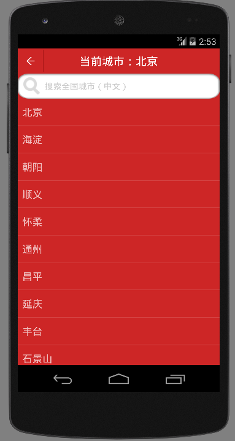
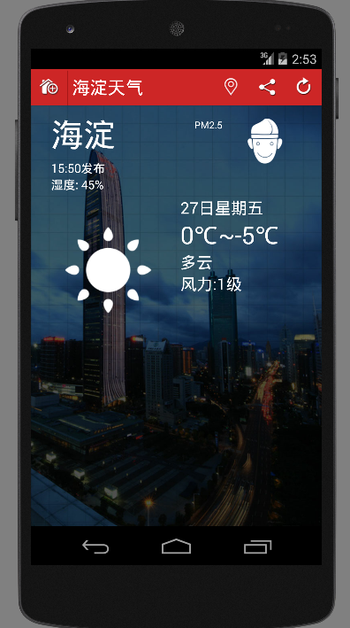

# 处理ListView中Item单击


    小组成员: OOOO   最终完成日期：15年00月00日
# 

**一、简介**

*简要介绍本模块所要完成的功能。*

**二、基础知识**

*简要介绍本模块所需掌握的基础知识*
   
* Intent传递数据：

      从天气预报的主界面（即天气情况显示界面）到城市列表界面是通过Intent来启动一个新的Activity的，现在，我们在点击城市列表的某个城市的时候，我们需要将所点击的城市信息作为参数传回主界面的Activity并进行相应的查询显示等处理。
      这时，发起方（主界面）要调用startActivityForResult(Intent intent, int requestCode)
      
      
      
      同时发起方要实现onActivityResult(int requestCode, int resultCode, Intent intent)来获取返回结果。
      
      
      
      这样MainActivity才可以根据获得的cityCode更新城市天气。
      那么同时在城市列表的Activity中，则要在finish()之前，将数据放入intent中，并调用setResult(int resultCode, Intent intent)方法，设置返回结果。

* ListView中Item单击和长按事件：

        单击事件注册监听事件示例：
        listView.setOnItemClickListener(new AdapterView.OnItemClickListener() {
            @Override
            public void onItemClick(AdapterView<?> parent, View view, int position, long id) {
                Toast.makeText(listview.this,"你单击的是第"+(position+1)+"条数据",Toast.LENGTH_SHORT).show();
            }
        });
        长按事件注册监听事件示例：
        listView.setOnItemLongClickListener(new AdapterView.OnItemLongClickListener() {
            @Override
            public boolean onItemLongClick(AdapterView<?> parent, View view, int position, long id) {
                Toast.makeText(listview.this,"你长按的是第"+(position+1)+"条数据",Toast.LENGTH_SHORT).show();
                return false;
            }
        });
        我们可以通过以上方法注册不同的监听事件，响应不同的操作，比如我们可以在单击事件里面跳转到其他页面，也可以在长按事件里面弹出一个小窗口。操作是比较灵活的。
        下面介绍一下单击和长按事件个参数的意义：
        ......
        ......
        ......
        下面介绍一下给Item中的子控件 （按钮、图标、文字等）添加点击事件，来进行点击后的不同处理：
        ......
        ......
        ......


* 自定义ListItem单击事件

        ListItem点击事件可以分为，单击ListItem事件和长按ListItem事件。但是这两个功能并非全能的，例如在手机通讯录中，某一时间可能打电话给甲，另一时间则是发短信，或者长按删除联系人甲。这是单击事件和长按事件就无法满足实际需求。
        不过ListView提供了SimpleAdapter用来绑定用户自定义控件和数据。通过调用getView()方法，为List中每个Item返回一个自定义View，此时可以对View中相关控件添加监听函数。
        具体实现：
        @Override
        public View getView(int position, View convertView, ViewGroup parent) {
	        // TODO Auto-generated method stub
	        View view;
	        if(convertView == null){
	        	view = mInflater.inflate(R.layout.layout_list_click2, null);
	        } else {
	        	view = convertView;
	        }			
	        ...
		    //从当前view中选择需要添加监听函数的控件
	    	View icon = view.findViewById(R.id.imageView1);
            //为自定义ListViewItem中控件添加点击监听函数
        	icon.setOnClickListener(new View.OnClickListener() {
        	public void onClick(View v) {
	            // TODO Auto-generated method stub
	        	//添加事件处理流程
	        	}
        	});
        	return view;
        }
   

**三、主要思路及步骤**

**3.1 主要思路**

    当响应单击事件时：
        首先设置监听函数，即调用OnItemClickListener()函数；
        接着，在处理函数内部，设置处理流程，OnItemClick().
    响应长按事件:
        首先触发的是onItemLongClick函数，执行onItemLongClick操作；
        其次，然后根据onItemLongClick的返回值判断是不是执行OnCreateContextMenuListener函数；
        如果onItemLongClick返回false，则会继续执行OnCreateContextMenuListener函数。
    响应自定义控件事件：
        首先调用getView()函数，在其中绑定控件；
        其次设置该空间监听函数，并处理事件。

**3.2 实践步骤**

&#160; &#160; &#160; &#160;
在上一节中，已经通过ListView展示出城市列表，如下图所示：



&#160; &#160; &#160; &#160;这些城市列表是通过SelectCity活动中的ListView来展示的，在SelectCity类中，我们可以定义每个ListView中的Item被单击时的行为。例如本程序在单击某个城市后，返回主页面进行显示天气。
代码如下：

``` 

public class SelectCity extends Activity implements View.OnClickListener{

    private ImageView mBackBtn;
   // private String[] data;
    private List<String> data=new ArrayList<String>();
    private ListView mlistView;

    @Override
    protected void onCreate(Bundle savedInstanceState) {
        super.onCreate(savedInstanceState);
        setContentView(R.layout.select_city);

        mlistView=(ListView)findViewById(R.id.list_view);

        MyApplication application= (MyApplication) this.getApplication(); //获取MyApplication,可以通过Activity的getApplicaion()方法
        //MyApplication application=(MyApplication) getApplicationContext(); //获取MyApplication,也可以通过Context的getApplicationContext()方法
        data=application.getMCityList();  //获取全局变量

        ArrayAdapter<String> adapter=new ArrayAdapter<String>(
                this,android.R.layout.simple_list_item_1,data);
        mlistView.setAdapter(adapter);
        //setContentView(mlistView);

        mBackBtn = (ImageView)findViewById(R.id.title_back);
        mBackBtn.setOnClickListener(this);

        //单击listView中的view
        mlistView.setOnItemClickListener(new AdapterView.OnItemClickListener() {
            @Override
            public void onItemClick(AdapterView<?> adapterView, View view, int i, long l) {
                Log.d("selectcityname",data.get(i));
                Toast.makeText(SelectCity.this,"你单击了："+i,Toast.LENGTH_SHORT).show();
                Intent intent = new Intent(SelectCity.this,tianqiActivity.class);//这里tianqiActivity.class是主活动。在主活动中再通过所选择的城市查询天气
                intent.putExtra("cityName",data.get(i));
                //startActivity(intent);

                setResult(RESULT_OK,intent);
                finish(); 
            }
        });
    }

    @Override
    public boolean onCreateOptionsMenu(Menu menu) {
        // Inflate the menu; this adds items to the action bar if it is present.
        getMenuInflater().inflate(R.menu.menu_select_city, menu);
        return true;
    }

    @Override
    public boolean onOptionsItemSelected(MenuItem item) {
        // Handle action bar item clicks here. The action bar will
        // automatically handle clicks on the Home/Up button, so long
        // as you specify a parent activity in AndroidManifest.xml.
        int id = item.getItemId();

        //noinspection SimplifiableIfStatement
        if (id == R.id.action_settings) {
            return true;
        }

        return super.onOptionsItemSelected(item);
    }

    public void onClick(View view){
        switch (view.getId()){
            case R.id.title_back:
                finish();
                break;


            default:
                break;
        }
    }
}

        ```
&#160; &#160; &#160; &#160;我们在SelectCity活动中通过mlistView.setOnItemClickListener()方法来定以定义单击item后的活动，我们先通过Toast.makeText弹出提示框，提示我们选择了第几个城市，然后再通过Intent把选择的城市传到主活动（tianqiActivity.class）中。

&#160; &#160; &#160; &#160;下图是单击item后的效果。这里我们选择“海淀”。


因为item是从0开始计数的，所以海淀序号为1。



&#160; &#160; &#160; &#160;
把选择的城市通过Intent的方法setResult(RESULT_OK,intent)发送到主活动以后，主活动通过onActivityResult()方法接受Intent。
&#160; &#160; &#160; &#160;
因为之前查询某个城市的天气是通过城市编码，这里改成了城市名称，所以我们在查询城市天气的方法也稍作修改，具体如下：
```
protected void onActivityResult(int requestCode,int resultCode,Intent intent){
        if(requestCode==1 && resultCode==RESULT_OK){
            String cityname=intent.getStringExtra("cityName");
            Log.d("cityname", cityname);
            queryWeatherCode(cityname, 2);//这里应该按照选择的城市进行查询
           // queryWeatherCode("101010100",1);
        }
    }
    
    /**
    * 根据城市查询所对应的天气信息
    *
    */
    private void queryWeatherCode(String cityCode, int arg){
    //第二个参数arg有两个值，1和2，arg为1时cityCode表示城市编码，arg为2时cityCode表示城市名称。
        Log.d("queryWeatherCode",cityCode);
        final int flag=arg;
        final String address1 = "http://wthrcdn.etouch.cn/WeatherApi?citykey="+cityCode;
        final String address2 = "http://wthrcdn.etouch.cn/WeatherApi?city="+cityCode;

        Log.d("myWeather", address1);
        Log.d("myWeather", address2);

        new Thread(new Runnable(){
            @Override
            public void run() {
                try{
                   // URL url=new URL("http://wthrcdn.etouch.cn/WeatherApi?citykey="+cityCode);
                    /*URLConnection urlConnection=url.openConnection();
                    HttpURLConnection httpUrlConnection=(HttpURLConnection) urlConnection;
                    BufferedReader reader=new BufferedReader(new InputStreamReader(httpUrlConnection.getInputStream()));*/

                    HttpClient httpClient=new DefaultHttpClient();
                    HttpGet httpget=null;

                    if(flag==1){
                        httpget=new HttpGet(address1);
                    }
                    else if(flag==2){
                        httpget=new HttpGet(address2);
                    }
                    HttpResponse httpResponse = httpClient.execute(httpget);
                    if(httpResponse.getStatusLine().getStatusCode()==200) {
                        HttpEntity entity = httpResponse.getEntity();
                        InputStream responseStream = entity.getContent();
                        responseStream = new GZIPInputStream(responseStream);
                        BufferedReader reader = new BufferedReader(new InputStreamReader(responseStream));

                        StringBuilder response = new StringBuilder();
                        String str;
                        while ((str = reader.readLine()) != null) {
                            response.append(str);
                        }
                        String responseStr = response.toString();
                        Log.d("myWeather1", responseStr);
                        TodayWeather todayWeather = parseXML(responseStr);

                        if (todayWeather != null) {
                            Log.d("myapp2",todayWeather.toString());
                            //发送消息，由主线程更新UI
                            Message msg = new Message();
                            msg.what = UPDATE_TODAY_WEATHER;
                            msg.obj = todayWeather;
                            mHandler.sendMessage(msg);
                        }
                    }
                }catch (Exception e){
                    e.printStackTrace();
                }
            }
        }).start();
    }
```
以上就是在单击Item后，程序的整个过程。


**四、常见问题及注意事项**

*详细描述本部分的常遇到的问题以及开发过程中的注意事项*
