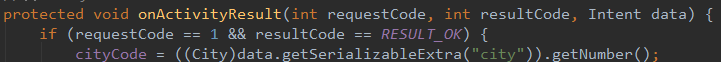

# 处理ListView中Item单击

    小组成员: OOOO   最终完成日期：15年00月00日
# 

**一、简介**

*简要介绍本模块所要完成的功能。*

**二、基础知识**

*简要介绍本模块所需掌握的基础知识*
   
* Intent传递数据：

      从天气预报的主界面（即天气情况显示界面）到城市列表界面是通过Intent来启动一个新的Activity的，现在，我们在点击城市列表的某个城市的时候，我们需要将所点击的城市信息作为参数传回主界面的Activity并进行相应的查询显示等处理。
      这时，发起方（主界面）要调用startActivityForResult(Intent intent, int requestCode)
      
      同时发起方要实现onActivityResult(int requestCode, int resultCode, Intent intent)来获取返回结果。
      
      这样MainActivity才可以根据获得的cityCode更新城市天气。
      那么同时在城市列表的Activity中，则要在finish()之前，将数据放入intent中，并调用setResult(int resultCode, Intent intent)方法，设置返回结果。

* ListView中Item单击和长按事件：

        单击事件：
        listView.setOnItemClickListener(new AdapterView.OnItemClickListener() {
            @Override
            public void onItemClick(AdapterView<?> parent, View view, int position, long id) {
                Toast.makeText(listview.this,"你单击的是第"+(position+1)+"条数据",Toast.LENGTH_SHORT).show();
            }
        });
        长按事件：
        listView.setOnItemLongClickListener(new AdapterView.OnItemLongClickListener() {
            @Override
            public boolean onItemLongClick(AdapterView<?> parent, View view, int position, long id) {
                Toast.makeText(listview.this,"你长按的是第"+(position+1)+"条数据",Toast.LENGTH_SHORT).show();
                return false;
            }
        });

* 知识点3：

      知识点介绍

   

**三、主要思路及步骤**

**3.1 主要思路**

*简要介绍主要思路*

**3.2 实践步骤**

*详细描述开发的具体步骤*

**四、常见问题及注意事项**

*详细描述本部分的常遇到的问题以及开发过程中的注意事项*
