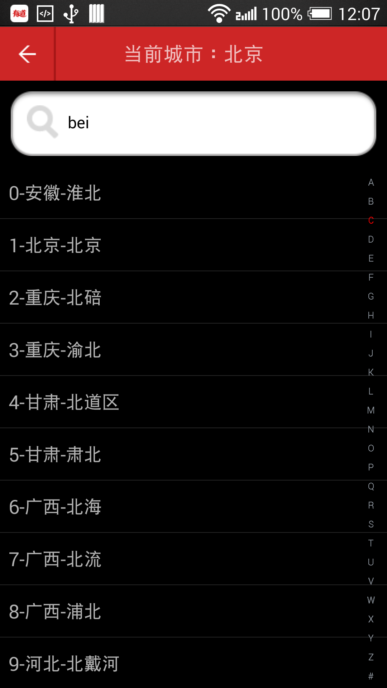
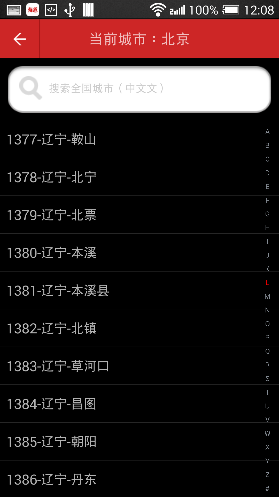

# 搜索城市

    小组成员: 黄汉煜、潘启慧、朱思敏、杨晓、潘伊男   最终完成日期：15年11月29日
# 

**一、简介**

本模块主要完成了两个功能：
    1、通过输入拼音或汉字查找城市
    2、通过侧栏的首字母A-Z（类似通讯录侧栏检索）快速检索省市

**二、基础知识**

* 知识点1：

      通过监听EditText更改事件获取搜索参数并查询数据库返回结果

* 知识点2：

     自定义View、监听ontouch事件来实现按首字母查询的功能

   

**三、主要思路及步骤**

**3.1 主要思路**

    功能1: 在用户点击搜索框并输入城市拼音或汉字时触发onTextChanged事件，获取这个EditText参数，从数据库中读取对应城市并展示
    
    功能2：自定义侧栏SideBar (extends View)，注册ontouch事件，在点击侧栏时获取被点击的字母并遍历城市列表，查找首字母对应的province并定位，这个城市列表是要根据province的拼音首字母为首，city的拼音首字母为辅升序排序的。

**3.2 实践步骤**

    **功能1：通过输入拼音或汉字查找城市**
       ** 1.1**添加控件：
    <EditText
        android:id="@+id/search_edit"
        android:layout_width="fill_parent"
        android:layout_height="wrap_content"
        android:hint="搜索全国城市（中⽂文）"
        android:layout_margin="10.0dip"
        android:drawableLeft=
            "@drawable/magnifying_glass"
        android:drawablePadding="8.0dip"
        android:paddingBottom="8.0dip"
        android:paddingLeft="10.0dip"
        android:paddingRight="30.0dip"
        android:paddingTop="8.0dip"
        android:singleLine="true"
        android:background
            ="@drawable/contact_search_box_edittext_keyword_background"
    android:textColor="#ff000000"
    android:textColorHint="#ffcccccc"
    android:textSize="15.0sp"
    />
        **1.2**注册函数响应ontextchange事件：
    edit_search.addTextChangedListener(new TextWatcher() {
        @Override
        public void onTextChanged(CharSequence s, int start, int before, int count) {//根据输入模糊查询
            mCityList=((MyApplication) MyApplication.getInstance()).getmCityDB().getAllCity(s.toString());  //查询获取当前条件下的城市
            dispalyList(); //展示结果
        }
        
    });
   
    功能2:通过侧栏的首字母A-Z（类似通讯录侧栏检索）快速检索省市**
    2.1: 自定义侧栏视图SideBar
    public class SideBar extends View implements OnTouchListener 
    **2.2**：通过ondraw函数在视图对应位置上填上字母
    letters = toList(new char[] { 'A', 'B', 'C', 'D', 'E', 'F', 'G', 'H','I', 'J', 'K', 'L', 'M', 'N', 'O', 'P', 'Q', 'R', 'S', 'T','U', 'V', 'W', 'X', 'Y', 'Z', '#' });
    2.3： 注册ontouch事件，获取点击位置的字母（获取方式不再详述），定位到对应首字母的province
        char sindex = letters.get(currentItem) ;
            for (int i = 0 ; i < adapter.getCount() ;i ++) {
                City c = adapter.getItem(i) ;
                if (c.getProvincepy()!=null && c.getProvincepy().length() >0 &&c.getProvincepy().charAt(0)==sindex ){
                    listView.setSelection(i);
                    break ;
                }
            }
	    功能1效果图 ：
	    
	    功能2效果图（详看右侧栏A-Z）：
		
**四、常见问题及注意事项**

    无
