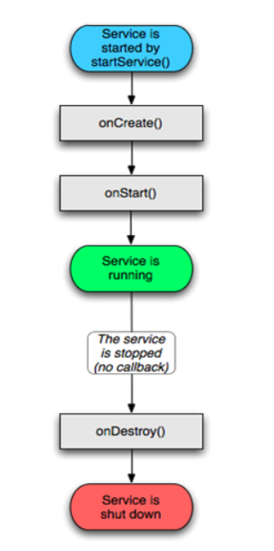
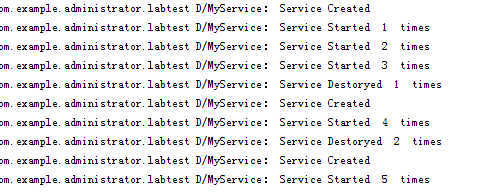
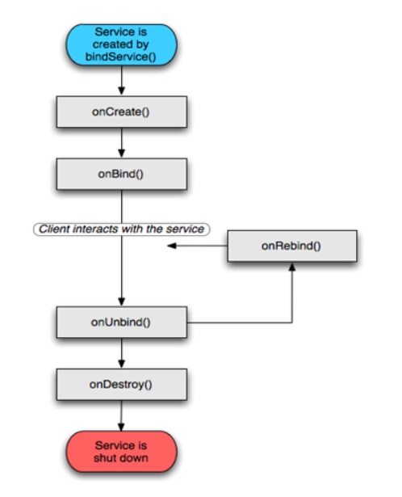
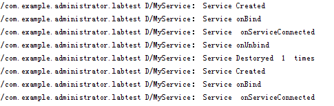

# 通过Service后台获取数据

    小组成员: 姜昊、杨超、黄凯凯、刘冶、邹勇杰    最终完成日期：15年11月30日
# 

**一、简介**

通过Service后台获取数据。

**二、基础知识**

*简要介绍本模块所需掌握的基础知识*
   
* 知识点1：Service的生命周期解析 

    **1：使用context.startService() 启动Service **  
    其生命周期为context.startService() -->onCreate()-->onStartCommand()-->Service is running-->context.stopService()-->onDestroy() ->Service shut down,生命周期如图  
          
    如果Service还没有运行，则android先调用onCreate()然后调用onStart()；     
    如果Service已经运行，则只调用onStart()，所以一个Service的onStart方法可能会重复调用多次。    
    程序验证结果如图    
      
    由图中可得结论  
    1）：如果没有调用stopService(),再次调用startService()时只会调用onStartCommand(),不会调用onCreate()    
    2）：如果调用了stopService(),再次调用startService()时会再次调用onCreate()   
    **2：bindService()启动Service **    
    其生命周期context.bindService()->onCreate()->onBind()->Service running-->onUnbind() -> onDestroy() ->Service stop，其生命周期如图所示  
      
    onBind将返回给客户端一个IBind接口实例，IBind允许客户端回调服务的方法，比如得到Service运行的状态或其他操作。  
    这个时候把调用者（Context，例如Activity）会和Service绑定在一起，Context退出了，
    Service就会调用onUnbind->onDestroy相应退出。    
    所以调用bindService()的生命周期为：onCreate --> onBind(只一次，不可多次绑定) --> onUnbind --> onDestory。     
    一但销毁activity它就结束，如果按home把它放到后台，那他就不退出。    
    程序验证结果如图：  
    

    由图中可得结论      
    1）：bindService()启动service时不会调用onStartCommand()方法     
    2）unbindService()会先调用onUnbind()方法，然后调用onDestory()方法   
    3）：当Service onBind之后，再点击startService按钮 去绑定服务，不会调用onCreate()方法和onBind()方法

* 知识点2：Service的实现 
    实现Service需要继承android.app.Service类， 然后重写onStartCommand 、 onBind和onCreate等方法。
        – 如果在Activity等组件中通过Context.startService()方法启动Service，需要重写onStartCommand方法。
        – 如果在Activity等组件中通过Context.bindService()方法绑定Service， 需要重写onBind方法。

* 知识点3：Service的调用    
使用context.startService() 启动Service      
        // 启动一个 Activity
        startActivity(new Intent(this, LocalService1.class));
        
        // 停止一个 Activity
        stopService(new Intent(this, LocalService1.class)); 
bindService()启动Service时，需先定义一个ServiceConnection实例   
        private ServiceConnection connection = new ServiceConnection() {
            @Override
            public void onServiceConnected(ComponentName name, IBinder service) {
                System.out.println("Service Connected");
                try {
                    myService = ((MyService.MyBinder)service).getMyservice();
                    startService(serviceIntent);
                }catch (Exception e){
                    e.printStackTrace();
                }

            }

            @Override
            public void onServiceDisconnected(ComponentName name) {
                System.out.println("Service Disconnected");
                myService = null;
            }
        };
        protected void serviceStart(){//启动服务
            serviceIntent = new Intent(MainActivity.this,MyService.class);
            bindService(serviceIntent,connection, Context.BIND_AUTO_CREATE);
        }

        protected void serviceStop(){//解除绑定
            myService.onUnbind(new Intent());
        }

   

**三、主要思路及步骤**

**3.1 主要思路**

*简要介绍主要思路*

**3.2 实践步骤**

*详细描述开发的具体步骤*

**四、常见问题及注意事项**

*详细描述本部分的常遇到的问题以及开发过程中的注意事项*
