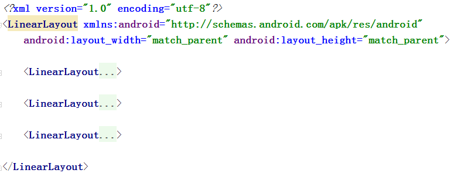
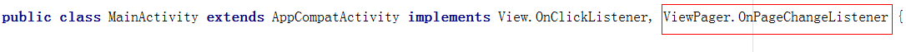
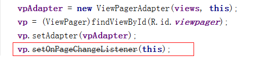

# 制作未来6天天气界面

    小组成员: 盛意林、宫翠峰、李仕聪、胡玉、刘艺霞   最终完成日期：15年00月00日
# 

**一、简介**

    本模块是制作天气预报项目中的未来6天天气界面。

**二、基础知识**

*简要介绍本模块所需掌握的基础知识*
   
* 知识点1：ViewPager控件

      ViewPager控件可以用来制作程序的引导页面，也可以在界面中制作多个视图切换的效果。其使用流程为：
        1. 在布局文件中增加ViewPager控件：Android提供了兼容低版本终端的的android.support.v4.view.ViewPager
        2. 自定义一个PagerAdapter
        3. 初始化要展示的页面列表
        4. 在Activity里实例化ViewPager控件，并设置它的Adapter

* 知识点2：PagerAdapter适配器

      实现一个PagerAdapter， 至少需要重写以下几个方法:
        1、instantiateItem(ViewGroup, int)
            //将当前视图添加到container中，返回当前View
        2、destroyItem(ViewGroup, int, Object)
            //从当前container中删除指定位置（position）的View
        3、getCount()
            //返回要滑动的View的个数
        4、isViewFromObject(View, Object)
            //该函数用于判断instantiateItem(ViewGroup, int)返回的对象是否与当前View代表的是同一个对象

* 知识点3：

      知识点介绍

   

**三、主要思路及步骤**

**3.1 主要思路**

    本模块我们主要完成了两个工作：
    1、在主布局中添加了ViewPager控件，并创建两个布局文件，用于对未来六天的天气信息进行布局，并把它们加载到ViewPager中的视图；
    2、把XML中对未来天气解析出来的数据动态显示到布局文件中

**3.2 实践步骤**

    我们主要分为三个步骤来进行：
    第一步：在主布局中通过ViewPager来添加一周天气信息的布局
        1、在主布局中添加一周天气信息布局以及ViewPager控件
        <!--七日天气信息-->
        <RelativeLayout
            android:id="@+id/future_info"
            android:layout_width="fill_parent"
            android:layout_height="wrap_content"
            android:orientation="vertical"
            android:padding="10.0dip">

            <android.support.v4.view.ViewPager
                android:layout_width="fill_parent"
                android:layout_height="wrap_content"
                android:id="@+id/viewpager">

            </android.support.v4.view.ViewPager>

        </RelativeLayout>
        
        2、创建两个布局文件page1.xml和page2.xml，用于加载到ViewPager中的视图
        在page1.xml添加3个线性布局：
        
        其中每个LinearLayout中添加的控件如下：
        <LinearLayout
            android:id="@+id/one_info"
            android:layout_width="wrap_content"
            android:layout_height="wrap_content"
            android:layout_weight="1"
            android:orientation="vertical">
            <TextView
                android:id="@+id/weekDay1"
                android:layout_width="wrap_content"
                android:layout_height="wrap_content"
                android:layout_gravity="center_horizontal"
                android:singleLine="true"
                android:text="星期五"
                android:textColor="@android:color/white"
                android:textSize="15sp"/>
            <ImageView
                android:id="@+id/imageDay1"
                android:layout_width="wrap_content"
                android:layout_height="wrap_content"
                android:layout_gravity="center_horizontal"
                android:src="@mipmap/biz_plugin_qing"/>
            <TextView
                android:id="@+id/temperatureDay1"
                android:layout_width="wrap_content"
                android:layout_height="wrap_content"
                android:layout_gravity="center_horizontal"
                android:singleLine="true"
                android:text="-2℃~-7℃"
                android:textColor="@android:color/white"
                android:textSize="15sp"/>
            <TextView
                android:id="@+id/climateDay1"
                android:layout_width="wrap_content"
                android:layout_height="wrap_content"
                android:layout_gravity="center_horizontal"
                android:singleLine="true"
                android:text="多云转晴"
                android:textColor="@android:color/white"
                android:textSize="15sp"/>
            <TextView
                android:id="@+id/windDay1"
                android:layout_width="wrap_content"
                android:layout_height="wrap_content"
                android:layout_gravity="center_horizontal"
                android:singleLine="true"
                android:text="微风"
                android:textColor="@android:color/white"
                android:textSize="15sp"/>
        </LinearLayout>
        其余的LinearLayout以及page2.xml都与上面类似，不再赘述。
        
        3、创建一个ViewPagerAdapter类，继承自基类PagerAdapter
        public class ViewPagerAdapter extends PagerAdapter {
            private List<View> views;
            private Context context;
        
            public ViewPagerAdapter(List<View> views, Context context) {
                this.views = views;
                this.context = context;
            }
        
            @Override
            public int getCount() {
                return views.size();
            }
        
            @Override
            public Object instantiateItem(ViewGroup container, int position) {
                container.addView(views.get(position));
                return views.get(position);
            }
        
            @Override
            public void destroyItem(ViewGroup container, int position, Object object) {
                container.removeView(views.get(position));
            }
        
            @Override
            public boolean isViewFromObject(View view, Object o) {
                return (view == o);
            }
        }
        
        4、在MainActivity.java中声明ViewPagerAdapter对象、ViewPager对象、List<View>集合
            private ViewPagerAdapter vpAdapter;
            private ViewPager vp;
            private List<View> views;
            
        5、在initView()函数中添加如下语句，用于动态加载page1.xml和page2.xml
            LayoutInflater inflater = LayoutInflater.from(this);
            View one_page = inflater.inflate(R.layout.page1, null);
            View two_page = inflater.inflate(R.layout.page2, null);
            views = new ArrayList<View>();
            views.add(one_page);
            views.add(two_page);
            vpAdapter = new ViewPagerAdapter(views, this);
            vp = (ViewPager)findViewById(R.id.viewpager);
            vp.setAdapter(vpAdapter);
            
        6、运行结果如下所示：

    第二步：添加导航小圆点
        1、在一周天气信息布局中添加ImageView控件（将图片资源复制到drawable目录下）
            <LinearLayout
                android:id="@+id/indicator"
                android:layout_width="fill_parent"
                android:layout_height="wrap_content"
                android:orientation="horizontal"
                android:layout_alignParentBottom="true"
                android:gravity="center_horizontal">
                <ImageView
                    android:id="@+id/iv1"
                    android:layout_width="wrap_content"
                    android:layout_height="wrap_content"
                    android:padding="5dp"
                    android:src="@drawable/page_indicator_focused"/>

                <ImageView
                    android:id="@+id/iv2"
                    android:layout_width="wrap_content"
                    android:layout_height="wrap_content"
                    android:padding="5dp"
                    android:src="@drawable/page_indicator_unfocused"/>
            </LinearLayout>
            
        2、在MainActivity.java中，增加页面变化的监听事件，动态修改导航小圆点的属性
        添加如下属性：
            private ImageView[] dots;
            private int[] ids = {R.id.iv1, R.id.iv2};
        添加如下方法：
            private void initDots() {
                dots = new ImageView[views.size()];
                for (int i=0; i<views.size(); i++) {
                    dots[i] = (ImageView)findViewById(ids[i]);
                }
            }
        
        3、在onCreate()方法中调用initDots()方法
        
        4、实现OnPageChangeListener接口，并重写相应的方法
        
            @Override
            public void onPageScrolled(int position, float positionOffset, int positionOffsetPixels) {
        
            }
        
            @Override
            public void onPageSelected(int position) {
                for (int a=0; a<ids.length; a++) {
                    if (a==position) {
                        dots[a].setImageResource(R.drawable.page_indicator_focused);
                    } else {
                        dots[a].setImageResource(R.drawable.page_indicator_unfocused);
                    }
                }
            }
        
            @Override
            public void onPageScrollStateChanged(int state) {
        
            }
        在initView()中添加如下语句：
        
        
        5、运行程序，如下所示：
        
    第三步：根据XML数据更新ViewPager中的天气信息
    注意：由于本块的代码对未来六天的处理方式较为类似，所以我们只给出部分关键代码。
        1、在TodayWeather.java中添加如下属性，并添加其set和get方法
            private String fdate1;
            private String fhigh1;
            private String flow1;
            private String ftype1;
            private String ffengxiang1;
            private String fdate2;
            private String fhigh2;
            private String flow2;
            private String ftype2;
            private String ffengxiang2;
            private String fdate3;
            private String fhigh3;
            private String flow3;
            private String ftype3;
            private String ffengxiang3;
            private String fdate0;
            private String fhigh0;
            private String flow0;
            private String ftype0;
            private String ffengxiang0;
            
        2、在MainActivity.java中parseXML()方法中添加如下语句：
            case XmlPullParser.START_TAG:
                if(xmlPullParser.getName().equals("resp")) {
                    todayWeather = new TodayWeather();
                }
                if (todayWeather != null) {
                    if (xmlPullParser.getName().equals("city")) {
                        ……
                    } else if (xmlPullParser.getName().equals("date") && dateCount==1) {
                        eventType = xmlPullParser.next();
                        todayWeather.setFdate1(xmlPullParser.getText());                            dateCount++;
                    } else if (xmlPullParser.getName().equals("high") && highCount==1) {
                        eventType = xmlPullParser.next();
                        todayWeather.setFhigh1(xmlPullParser.getText().substring(2).trim());
                        highCount++;
                    } else if (xmlPullParser.getName().equals("low") && lowCount==1) {
                        eventType = xmlPullParser.next();
                        todayWeather.setFlow1(xmlPullParser.getText().substring(2).trim());
                        lowCount++;
                    }else if (xmlPullParser.getName().equals("type") && typeCount==1) {
                        eventType = xmlPullParser.next();
                        todayWeather.setFtype1(xmlPullParser.getText());
                        typeCount++;
                    } else if (xmlPullParser.getName().equals("fengxiang") && fengxiangCount==1) {
                        eventType = xmlPullParser.next();
                        todayWeather.setFfengxiang1(xmlPullParser.getText());
                        fengxiangCount++;
                    } else if (xmlPullParser.getName().equals("date") && dateCount==2) {
                        eventType = xmlPullParser.next();
                        todayWeather.setFdate2(xmlPullParser.getText());
                        dateCount++;
                    } else if (xmlPullParser.getName().equals("high") && highCount==2) {
                        eventType = xmlPullParser.next();
                        todayWeather.setFhigh2(xmlPullParser.getText().substring(2).trim());
                        highCount++;
                    } else if (xmlPullParser.getName().equals("low") && lowCount==2) {
                        eventType = xmlPullParser.next();
                        todayWeather.setFlow2(xmlPullParser.getText().substring(2).trim());
                        lowCount++;
                    }else if (xmlPullParser.getName().equals("type") && typeCount==2) {
                        eventType = xmlPullParser.next();
                        todayWeather.setFtype2(xmlPullParser.getText());
                        typeCount++;
                    } else if (xmlPullParser.getName().equals("fengxiang") && fengxiangCount==2) {
                        eventType = xmlPullParser.next();
                        todayWeather.setFfengxiang2(xmlPullParser.getText());
                        fengxiangCount++;
                    } else if (xmlPullParser.getName().equals("date") && dateCount==3) {
                        eventType = xmlPullParser.next();
                        todayWeather.setFdate3(xmlPullParser.getText());
                        dateCount++;
                    } else if (xmlPullParser.getName().equals("high") && highCount==3) {
                        eventType = xmlPullParser.next();
                        todayWeather.setFhigh3(xmlPullParser.getText().substring(2).trim());
                        highCount++;
                    } else if (xmlPullParser.getName().equals("low") && lowCount==3) {
                        eventType = xmlPullParser.next();
                        todayWeather.setFlow3(xmlPullParser.getText().substring(2).trim());
                        lowCount++;
                    }else if (xmlPullParser.getName().equals("type") && typeCount==3) {
                        eventType = xmlPullParser.next();
                        todayWeather.setFtype3(xmlPullParser.getText());
                        typeCount++;
                    } else if (xmlPullParser.getName().equals("fengxiang") && fengxiangCount==3) {
                        eventType = xmlPullParser.next();
                        todayWeather.setFfengxiang3(xmlPullParser.getText());
                        fengxiangCount++;
                    } else if (xmlPullParser.getName().equals("date_1")) {
                        eventType = xmlPullParser.next();
                        todayWeather.setFdate0(xmlPullParser.getText());
                    }  else if (xmlPullParser.getName().equals("high_1")) {
                        eventType = xmlPullParser.next();
                        todayWeather.setFhigh0(xmlPullParser.getText().substring(2).trim());
                    } else if (xmlPullParser.getName().equals("low_1")) {
                        eventType = xmlPullParser.next();
                        todayWeather.setFlow0(xmlPullParser.getText().substring(2).trim());
                    }else if (xmlPullParser.getName().equals("type_1")) {
                        eventType = xmlPullParser.next();
                        todayWeather.setFtype0(xmlPullParser.getText());
                    } else if (xmlPullParser.getName().equals("fx_1")) {
                        eventType = xmlPullParser.next();
                        todayWeather.setFfengxiang0(xmlPullParser.getText());
                    }
                }
                break;
                
        3、在MainActivity.java中添加changeFurureWeatherImg()方法，用于动态修改天气图片
            void changeFurureWeatherImg(ImageView view, String str) {
                if(str.equals("暴雪")) {
                    view.setImageResource(R.mipmap.biz_plugin_baoxue);
                } else if (str.equals("暴雨")) {
                    view.setImageResource(R.mipmap.biz_plugin_baoyu);
                } else if (str.equals("大暴雨")) {
                    view.setImageResource(R.mipmap.biz_plugin_dabaoyu);
                } else if (str.equals("大雪")) {
                    view.setImageResource(R.mipmap.biz_plugin_daxue);
                } else if (str.equals("大雨")) {
                    view.setImageResource(R.mipmap.biz_plugin_dayu);
                } else if (str.equals("多云")) {
                    view.setImageResource(R.mipmap.biz_plugin_duoyun);
                } else if (str.equals("雷阵雨")) {
                    view.setImageResource(R.mipmap.biz_plugin_leizhenyu);
                } else if (str.equals("雷阵雨冰雹")) {
                    view.setImageResource(R.mipmap.biz_plugin_leizhenyubingbao);
                } else if (str.equals("晴")) {
                    view.setImageResource(R.mipmap.biz_plugin_qing);
                } else if (str.equals("沙尘暴")) {
                    view.setImageResource(R.mipmap.biz_plugin_shachenbao);
                } else if (str.equals("特大暴雨")) {
                    view.setImageResource(R.mipmap.biz_plugin_tedabaoyu);
                } else if (str.equals("雾")) {
                    view.setImageResource(R.mipmap.biz_plugin_wu);
                } else if (str.equals("小雪")) {
                    view.setImageResource(R.mipmap.biz_plugin_xiaoxue);
                } else if (str.equals("小雨")) {
                    view.setImageResource(R.mipmap.biz_plugin_xiaoyu);
                } else if (str.equals("阴")) {
                    view.setImageResource(R.mipmap.biz_plugin_yin);
                } else if (str.equals("雨夹雪")) {
                    view.setImageResource(R.mipmap.biz_plugin_yujiaxue);
                } else if (str.equals("阵雪")) {
                    view.setImageResource(R.mipmap.biz_plugin_zhenxue);
                } else if (str.equals("阵雨")) {
                    view.setImageResource(R.mipmap.biz_plugin_zhenyu);
                } else if (str.equals("中雪")) {
                    view.setImageResource(R.mipmap.biz_plugin_zhongxue);
                } else if (str.equals("中雨")) {
                    view.setImageResource(R.mipmap.biz_plugin_zhongyu);
                }
            }
        
        4、在initview()中添加如下语句，对page1.xml和page2.xml中的控件进行监控
        ————只列部分代码，其余类似
            weekD1 = (TextView)one_page.findViewById(R.id.weekDay1);
            temperatureD1 = (TextView)one_page.findViewById(R.id.temperatureDay1);
            climateD1 = (TextView)one_page.findViewById(R.id.climateDay1);
            windD1 = (TextView)one_page.findViewById(R.id.windDay1);
            imageD1 = (ImageView)one_page.findViewById(R.id.imageDay1);
            
        5、在updateTodayWeather()方法中添加如下语句：
        ————只列部分代码，其余类似
            weekD1.setText(todayWeather.getFdate0());
            temperatureD1.setText(todayWeather.getFhigh0() + "~" + todayWeather.getFlow0());
            climateD1.setText(todayWeather.getFtype0());
            windD1.setText(todayWeather.getFfengxiang0());
            if (todayWeather.getFtype0()!=null) {
                changeFurureWeatherImg(imageD1, todayWeather.getFtype0());
            }
            
        6、运行结果如下：
**四、常见问题及注意事项**

    1、添加ViewPager控件的时候，是使用android.support.v4.view.ViewPager。
    2、如何在主Activity中获取ViewPager中增加的布局页面的控件，并修改其值？
        由于在ViewPager中加载的布局文件是未来六天的天气信息，所以需要在MainActivity.java中对其控件进行监听，但是直接通过findViewById()方法是不能绑定该控件的，因为在MainActivity.java中只通过setContentView(R.layout.weather_info)绑定了主布局，所以其他.xml中的控件是不能直接操作的。
        解决办法：
        LayoutInflater inflater = LayoutInflater.from(this);
        View one_page = inflater.inflate(R.layout.page1, null);
        View two_page = inflater.inflate(R.layout.page2, null);
        
        weekD1 = (TextView)one_page.findViewById(R.id.weekDay1);
        
        //inflater.inflate(R.layout.xxx, null) 返回的是当前指定的xml的生成的View对象，可以把inflater理解为xml视图解析器。通过这种方式就可以监听了
    3、在做对不同天气类型更新相应的图片时，一定要做信息为空的时候的异常处理
