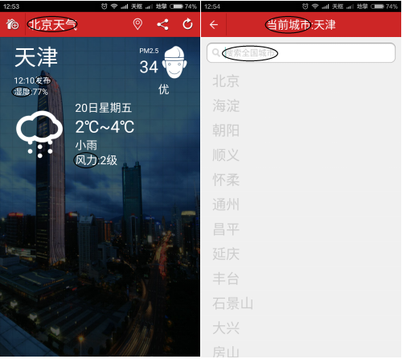
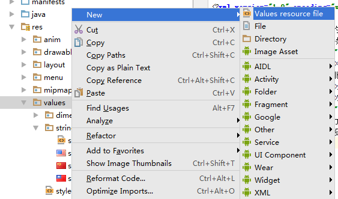
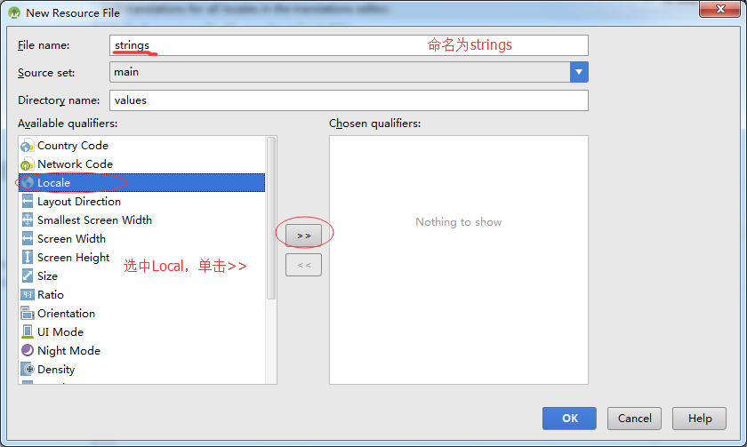
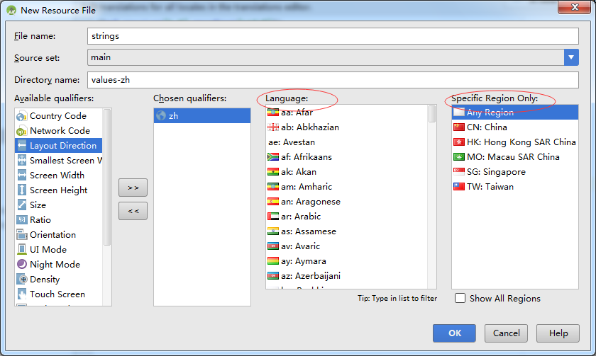
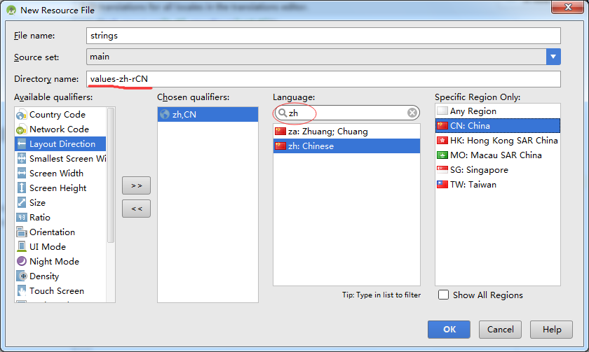

# 国际化处理

    小组成员: 刘彬彬 艾海涛 罗霄 孙丛 丁文玲   最终完成日期：15年00月00日
# 

**一、简介**

    国际化（I18N）和本地化（L10N）的联系与区别。
    I18N是软件设计自上而下模式时候的一种考虑，简单的说来，就是One Binary，Runs Globally。比如你做了英文版的软件，那么这个软件应该可以不做任何修改地去任何一种文化/语言的平台上正常运行。
    L10N是调整软件以适应当地社会文化/语言的一个流程,通常包括语言的翻译和本地图片的提供(比如一些banner，上面的文字是直接在图片里面，这个时候就需要L10N把图片也本地化)。
    国际化与本地化处理的知识基本与编程无关，关键在于配置文件的修改。可以进行如此方便的国际化处理，主要得益于安卓中独特的资源管理方式，即我们可以通过R文件的索引来引用某一个资源。

**二、基础知识**

*简要介绍本模块所需掌握的基础知识*
   
* 知识点1：

      R文件中的索引，并非是和资源一对一的关系。它应该是根据用户使用的不同环境，制定不同的方案。例如程序中通过R调用一个字符串资源时，而用户的语言设置为英文时，Android就会调用英文方案里面的字符串。

* 知识点2：

      一般用“语言_地区”的形式表示一种语言，如“zh_CN”，“zh_TW”,其中“zh”表示中文，“CN”表示中国，“TW”表示台湾，“r”是“region”的缩写。常用的“国家/地区-语言”缩写代码有：
      zh_cn：简体中文
      zh_hk：繁体中文(中国香港)  
      zh_tw：繁体中文(中国台湾地区)
      en-hk：英语(香港)
      en_us：英语(美国)
      en_gb：英语(英国)
      en_ww：英语(全球)
      ja_jp：日语(日本)
      ko_kr：韩文(韩国)

* 知识点3：

      3、language code 是两位小写字母，采用ISO 639-1标准，country code 是两位大写字母，采用ISO 3166-1标准。我们可以在维基百科上查看标准的具体信息：  
    https://en.wikipedia.org/wiki/ISO_639-1  
    https://en.wikipedia.org/wiki/ISO_3166-1_alpha-2

**三、主要思路及步骤**

**3.1 主要思路**

    把天气预报项目中直接写文案的地方，全部改成从R文件中引用字符串资源。

**3.2 实践步骤**

*   3.2.1 找出程序中需要国际化处理的地方，用黑圈围住的地方就是

*   3.2.2 添加不同语言环境下的strings.xml文件    
切换到Android管理模式：  
  
右键单击values，新建一个resource file：  

然后选择语言和地区：  

可以输入关键词搜索。选择了之后，自动创建的文件夹名字为values-zh-rCN：  

*   3.2.3 定义程序中用到的字符串：  
<?xml version="1.0" encoding="utf-8"?>
<resources>
    <string name="app_name">我的天气</string>
    <string name="bj_weather">北京天气</string>
    <string name="dis_release">发布</string>
    <string name="dis_humidity">湿度:</string>
    <string name="dis_wind">风力:</string>
</resources>
*   3.2.4 按上述步骤，添加繁体中文、英语等其他方案。英文的如下：  
<pre><code><?xml version="1.0" encoding="utf-8"?>
<resources>
    <string name="app_name">MyWeather</string>
    <string name="bj_weather">Beijing Weather</string>
    <string name="dis_release"> Released</string>
    <string name="dis_humidity">Humidity:</string>
    <string name="dis_wind">Wind:</string>
</resources></code></pre>
*   3.2.5 替换程序中的文案。Java代码中用R.string.xxx的形式，xml文件中用@string/xxx的形式。  
AndroidManifest.xml里面，把application标签下的android:label属性改为：
android:label="@string/app_name"  
weather_info.xml里面，把ID为title_city_name的TextView控件的android:text属性改为：  
android:text="@string/bj_weather"  
MainActivity.java里面，把  
timeTv.setText(todayWeather.getUpdatetime() + "发布");  
改为：  
timeTv.setText(todayWeather.getUpdatetime() + getString(R.string.dis_release));  
把  
humitityTv.setText("湿度" + todayWeather.getShidu());  
改为  
humitityTv.setText(getString(R.string.dis_humidity) + todayWeather.getShidu());  
把  
windTv.setText("风力" + todayWeather.getFengli());  
改为  
windTv.setText(getString(R.string.dis_wind) + todayWeather.getFengli());  
然后设置手机里的语言，可以看到效果。

**四、常见问题及注意事项**

*   4.1 默认资源很重要。当找不到对应设置的资源的时候，安卓会到默认资源去寻找，如果这时在默认资源里都找不到就会出错。所以默认的strings.xml也要完善。
*   4.2 除了values文件夹下的资源外，其他资源比如drawable、layout、menu、XML等也可以用这种方法进行国际化和本地化处理。
*   4.3 已掌握命名规则的话，也可以在project视图中手动建立文件夹，加入资源文件。
*   4.4 在Java代码中如果要对引用的资源字符串再进行“连接”等操作的话，应该用getString(R.string.xxx)的形式获取R文件对应的字符串。举例：  
在程序中有以下代码，效果如图：    
  
  
要对它进行国际化处理，把“风力:”这个字符串写入strings.xml文件中，在程序中替换文案，效果如图：  
  
  
  
并没有达到预期效果，这是因为R.string.dis_wind代表的是字符串“风力:”的资源ID，如果再对这个ID进行操作，程序就无法找出资源代表的字符串。应该使用getString()方法获取字符串资源，再进行操作：  
