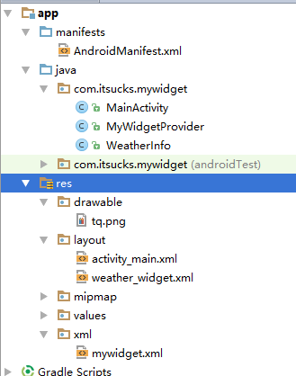
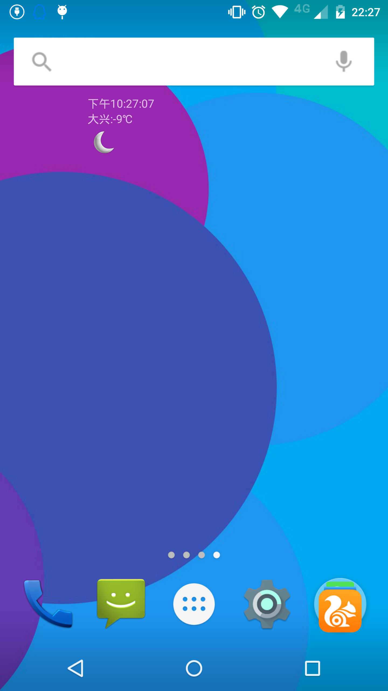
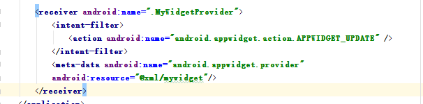

# widget桌面插件


    小组成员: 刚占慧 邱源 汤炀 谢亮 章伟  最终完成日期：15年11月29日
# 

**一、简介**

*本模块主要是完成天气预报项目的桌面插件功能*

**二、基础知识**

*桌面插件的开发主要使用的Android中的AppWidget框架*   
* 
AppWidget框架      
    1、AppWidgetProvider ：继承自 BroadcastRecevier ， 在AppWidget 应用 update、enable、disable 和 delete 时接收通知。其中，onUpdate、onReceive 是最常用到的方法，它们接收更新通知。      
    2、 AppWidgetProvderInfo：描述 AppWidget 的大小、更新频率和初始界面等信息，以XML 文件形式存在于应用的 res/xml/目录下。   
    3、AppWidgetManger ：负责管理 AppWidget ，向 AppwidgetProvider 发送通知。  
    4、RemoteViews ：一个可以在其他应用进程中运行的类，向 AppWidgetProvider 发送通知。  

* 
AppWidget 框架的主要类介绍  
    1. AppWidgetManger类  
    getAppWidgetInfo(int appWidgetId):
    通过AppWidgetId 获取 AppWidget 信息  
    bindAppWidgetId(int appWidgetId, ComponentName provider): 通过给定的ComponentName 绑定appWidgetId  
    getAppWidgetIds(ComponentName provider):
    *通过给定的ComponentName 获取AppWidgetId  
    getAppWidgetInfo(int appWidgetId):
    通过AppWidgetId 获取 AppWidget 信息  
    getInstalledProviders():
    返回一个List< AppWidgetProviderInfo>的信息  
    getInstance(Context context):
    获取 AppWidgetManger 实例使用的上下文对象  
    updateAppWidget(int[] appWidgetIds, RemoteViews views):
    通过appWidgetId 对传进来的 RemoteView 进行修改，并重新刷新AppWidget 组件  
    updateAppWidget(ComponentName provider, RemoteViews views): 
    通过 ComponentName 对传进来的 RemoeteView 进行修改，并重新刷新AppWidget 组件  
    updateAppWidget(int appWidgetId, RemoteViews views) 通过appWidgetId 对传进来的 RemoteView 进行修改，并重新刷新AppWidget 组件

    2. 
继承自 AppWidgetProvider 可实现的方法为如下：  
    onDeleted(Context context, int[] appWidgetIds)  
    onDisabled(Context context)   
    onEnabled(Context context)  
    onReceive(Context context, Intent intent)  
  Tip:因为 AppWidgetProvider 是继承自BroadcastReceiver  所以可以重写onRecevie 方法，当然必须在后台注册Receiver
5、onUpdate(Context context, AppWidgetManager appWidgetManager, int[] appWidgetIds)

   

**三、主要思路及步骤**

**3.1 主要思路**
*一般Widget设计步骤如下*
* 
第一个xml是布局XML文件(如：weather_widget.xml)，是这个widget的布局。
* 
第二个xml是mywidget.xml,主要是用于声明一个appwidget的。
* 
第三个xml是AndroidManifest.xml，注册broadcastReceiver信息。
* 
最后一个Java类用于做一些业务逻辑操作。让其继承类AppWidgetProvider

 上述涉及到的文件及其目录情况如下：      


**3.2 实践步骤**
* 
weather_widget.xml布局主要有三个控件，分别为显示时间的TextView、显示天气信息的TextView和显示天气图标的ImageView，代码如下:  
```
<?xml version="1.0" encoding="utf-8"?>
<LinearLayout xmlns:android="http://schemas.android.com/apk/res/android"
    android:orientation="vertical" android:layout_width="match_parent"
    android:layout_height="match_parent"
    android:layout_centerHorizontal="true">

    <TextView
        android:layout_width="wrap_content"
        android:layout_height="wrap_content"
        android:text="Large Text"
        android:id="@+id/time"
        android:gravity="center"/>
    <TextView
        android:layout_width="wrap_content"
        android:layout_height="wrap_content"
        android:text="Large Text"
        android:id="@+id/temperature"/>
    <ImageView
        android:id="@+id/image"
        android:layout_width="wrap_content"
        android:layout_height="wrap_content"
        android:src="@drawable/tq"/>
</LinearLayout>
```
* 
建立Widget内容提供者文件，我们在res下建立xml文件夹，并且新建一个mywidget.xml代码入下:  
```
<?xml version="1.0" encoding="utf-8"?>
<appwidget-provider xmlns:android="http://schemas.android.com/apk/res/android"
    android:minWidth="300dip" android:minHeight="72dp"
    android:updatePeriodMillis="1000"
    android:initialLayout="@layout/weather_widget"
    >
</appwidget-provider>     
```
* 
修改配置文件AndroidManifest.xml，后台注册Receiver,代码如下:
```
<?xml version="1.0" encoding="utf-8"?>
<manifest xmlns:android="http://schemas.android.com/apk/res/android"
    package="com.itsucks.mywidget"
    android:versionCode="1"
    android:versionName="1.0">
    <uses-permission android:name="android.permission.INTERNET"/>
    <application
        android:allowBackup="true"
        android:icon="@mipmap/ic_launcher"
        android:label="@string/app_name"
        android:supportsRtl="true"
        android:theme="@style/AppTheme">
        <activity android:name=".MainActivity">
            <intent-filter>
                <action android:name="android.intent.action.MAIN" />

                <category android:name="android.intent.category.LAUNCHER" />
            </intent-filter>
        </activity>
        <receiver android:name=".MyWidgetProvider">
            <intent-filter>
                <action android:name="android.appwidget.action.APPWIDGET_UPDATE" />
            </intent-filter>
            <meta-data android:name="android.appwidget.provider"
            android:resource="@xml/mywidget"/>
        </receiver>
    </application>
</manifest>
```
* 
写一个类继承自AppWidgetProvide

```
package com.itsucks.mywidget;
import android.appwidget.AppWidgetManager;
import android.appwidget.AppWidgetProvider;
import android.content.ComponentName;
import android.content.Context;
import android.content.Intent;
import android.graphics.Bitmap;
import android.graphics.BitmapFactory;
import android.widget.RemoteViews;

import java.io.IOException;
import java.io.InputStream;
import java.net.HttpURLConnection;
import java.net.URL;
import java.text.DateFormat;
import java.text.SimpleDateFormat;
import java.util.Date;
import java.util.Locale;
import java.util.Timer;
import java.util.TimerTask;

import com.show.api.ShowApiRequest;

import org.json.JSONException;
import org.json.JSONObject;

/**
 * Created by zhangwei on 2015/11/29.
 */
public class MyWidgetProvider extends AppWidgetProvider{
    
    @Override
    public void onUpdate(Context context, AppWidgetManager appWidgetManager,
                         int[] appWidgetIds){
        // TODO Auto-generated method stub
        //显示时间的定时器，每秒刷新一次
        Timer timer = new Timer();
        timer.scheduleAtFixedRate(new MyTime(context, appWidgetManager), 1, 1000);
        //显示天气的定时器，设置为没小时刷新一次
        Timer wTimer = new Timer();
        wTimer.scheduleAtFixedRate(new MyWeather(context, appWidgetManager), 1, 3600000);
        super.onUpdate(context, appWidgetManager, appWidgetIds);
    }
    @Override
    public void onReceive(Context context, Intent intent)
    {
        super.onReceive(context, intent);
    }

    //显示时间信息处理
    public class MyTime extends TimerTask {
        RemoteViews remoteViews;
        AppWidgetManager appWidgetManager;
        ComponentName thisWidget;
        DateFormat format = SimpleDateFormat.getTimeInstance(SimpleDateFormat.MEDIUM, Locale.getDefault());
        public MyTime(Context context, AppWidgetManager appWidgetManager) {
            this.appWidgetManager = appWidgetManager;
            remoteViews = new RemoteViews(context.getPackageName(), R.layout.weather_widget);
            thisWidget = new ComponentName(context, MyWidgetProvider.class);
            }
        @Override
        public void run() {
         remoteViews.setTextViewText(R.id.time, format.format(new Date()));
            appWidgetManager.updateAppWidget(thisWidget, remoteViews);
         }
        }
    //显示天气信息处理
    public class MyWeather extends TimerTask {
        RemoteViews remoteViews;
        AppWidgetManager appWidgetManager;
        ComponentName thisWidget;
        public MyWeather(Context context, AppWidgetManager appWidgetManager) {
            this.appWidgetManager = appWidgetManager;
            remoteViews = new RemoteViews(context.getPackageName(), R.layout.weather_widget);
            thisWidget = new ComponentName(context, MyWidgetProvider.class);
        }
        @Override
        public void run() {
            String temp = "";
            String city = "大兴";
            String image_url="";
            try {
            //此处笔者用的是“易源接口”提供的API，下面的***分别代表你应用的appid和secretid
                String info = new ShowApiRequest("http://route.showapi.com/9-2","****","*********")
                        .addTextPara("areaid","101050701")
                        .addTextPara("area",city)
                        .addTextPara("needMoreDay","0")
                        .addTextPara("needIndex","0")
                        .addTextPara("needHourData","0")
                        .post();
                //获取接口返回的信息
                JSONObject wholeInfo = new JSONObject(info);
                JSONObject showapi_res_body  = wholeInfo.getJSONObject("showapi_res_body");
                JSONObject now  = showapi_res_body.getJSONObject("now");
                temp = now.getString("temperature")+"℃";
                image_url = now.getString("weather_pic");
                Bitmap weather_pic = getBitmap(image_url);
                System.out.println("temp:"+temp);
                remoteViews.setTextViewText(R.id.temperature, city +":"+ temp);
                if(weather_pic!=null){
                    remoteViews.setImageViewBitmap(R.id.image,weather_pic);
                }
                appWidgetManager.updateAppWidget(thisWidget, remoteViews);
            } catch (JSONException e) {
                e.printStackTrace();
                remoteViews.setTextViewText(R.id.temperature, city+"：-5℃");
                appWidgetManager.updateAppWidget(thisWidget, remoteViews);
            }catch (IOException e){
                e.printStackTrace();
            }
        }
        //根据天气图标url从网络获取图片
        public Bitmap getBitmap(String path) throws IOException {
            URL url = new URL(path);
            HttpURLConnection conn = (HttpURLConnection)url.openConnection();
            conn.setConnectTimeout(5000);
            conn.setRequestMethod("GET");
            if(conn.getResponseCode() == 200){
                InputStream inputStream = conn.getInputStream();
                Bitmap bitmap = BitmapFactory.decodeStream(inputStream);
                return bitmap;
            }
            return null;
        }
    }
}    
```   
* 
天气插件实现如下截图
    
**四、常见问题及注意事项**

* 
AndroidManifest.xml中注册Receiver一定要严格按照下面的写法，否则很有可能注册失败，找不到插件

* 
由于要用到网络，不要忘了开网络权限
