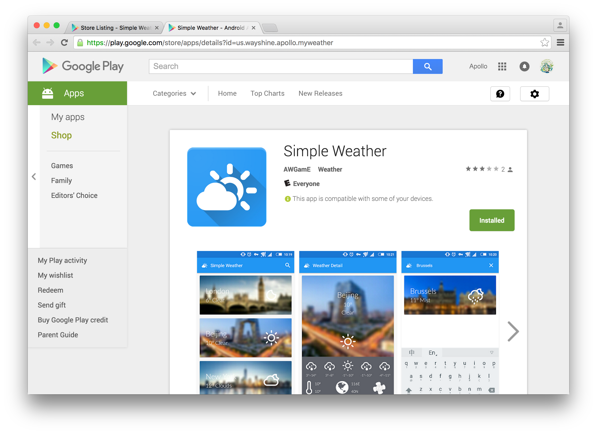
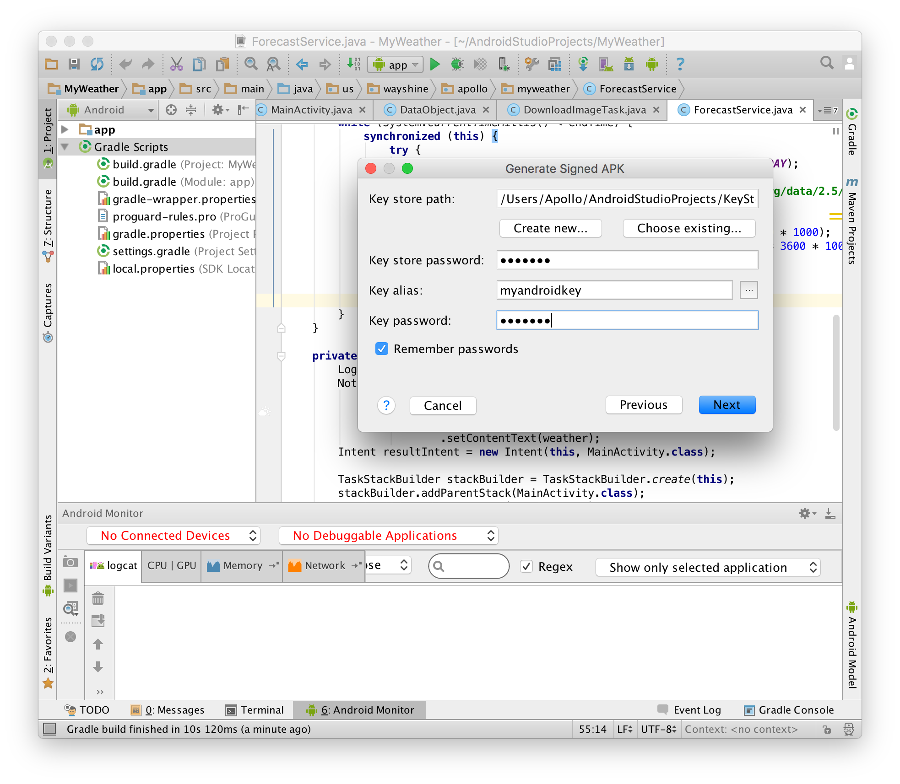

# 应用程序发布


    小组成员: OOOO   最终完成日期：15年12月02日
# 

**一、简介**

本文档将简述如何向Google Play应用市场发布Android应用程序并使用Google Play开发者后台进行应用页面内容的编辑、应用信息的管理以及市场统计等工作。

**二、基础知识**
   
* 使用Android Studio开发应用程序编译生成已签名的APK文件；

* 文档撰写与图形编辑，用于添加应用介绍以及设计部分图片展示内容；

* 项目管理的一些知识。

**三、主要思路及步骤**

**3.1 主要思路**

发布一个已经开发完成的应用程序需要经过文件编译上传、软件测试、市场界面设计等多个步骤，同时需要注意软件的发布和营销过程与开发过程并不一样，需要一定的社交手段和商业头脑，以此来提升应用软件的影响力


**3.2 实践步骤**

（1）获得已经过签名的APK文件

在向市场发布我们已经开发完成的应用程序时，我们需要对编译生成的应用程序文件（APK格式）进行签名。签名的意义在于确认应用程序的作者信息，同时可以对应用程序的版权和内容进行保护。

首先，我们需要在系统中建立一个密码库，然后使用这个密码库得到签名文件。密码库建立完成之后，我们只要点击“编译”菜单中的“获取签名APK”栏目，然后选择所建立的密码库并输入密码即可完成签名。


（2）注册Google Play开发者账户

Google Play为所有开发者提供了一个开发者后台（Google Play Developer Console），用来方便地发布和管理Android应用程序。而为了能够使用这个开发者后台（Developer Console），我们必须注册一个开发者账户。

首先我们需要一个Google账号（也就是一个Gmail的邮件地址），然后前往Google Play的开发者网站（ https://play.google.com/apps/publish/ ）申请成为开发者。这个过程中需要缴纳25美元的注册费用，可以通过任意支持美元的信用卡进行支付。支付完成后系统会进入审核阶段，审核过程会持续若干个小时，但这个过程中我们已经可以使用开发者后台的大部分功能，包括上传应用文件、设计应用展示页面等等。

需要注意的是使用Google Play开发者后台以及其他相关的服务（应用发布、管理等等）需要严格遵守Google的用户条款，违反用户条款或是发布违反法律法规的内容可能会受到服务限制和惩罚，而Google也会随时对于用户条款进行一定限度的修改和更新，需要我们时刻注意。

（3）上传APK文件并设计应用展示页面

我们可以在开发者后台中上传之前已经经过签名的APK文件。只需点击页面中的“上传新APK”即可。每次上传新的APK文件都需要说明本次更新内容，以给用户提供明确的应用更新信息。

Google Play市场中的应用展示页面包含大量的文字和图片内容，主要包括应用的名称、分组、分级和简介，以及应用程序的图标、展示图片以及设备截图等等。开发者后台鼓励开发者设计不同语言的市场页面，同时为平板电脑、智能电视等非智能手机设备提供运行截图。应用展示页面可以给用户带来第一阶段的印象，其内容的丰富程度直接影响到应用能否被用户下载，因此需要精心设计。另外需要注意的一点是，任何发布在Google Play市场的应用程序都要经过评级系统，以说明所发布的应用程序内是否存在限制级内容。

（4）测试和发布应用程序

Google Play开发者后台支持开发者进行测试工作，开发者可以设置应用程序的测试周期并可以指定一部分用户拥有访问应用页面、下载应用的权限。测试周期分为Alpha和Beta阶段。

一般来说，小型开发团队（尤其是个人开发者）会比较缺乏有经验的应用测试人员，而我们所发布的面向市场的应用程序往往可能存在一些潜在的问题或是与设计预想不一致的地方，或者说我们需要考虑真实的用户对于应用程序的感受和评价，这时候我们就需要在产品正式发布之前首先进行测试。Google Play开发者后台允许应用软件在正式发布之前先在小部分人群中进行测试。获准成为测试人员的用户能够获取应用程序并提出反馈和评价，帮助开发人员进一步改进应用程序，以减轻应用推向更广泛群体时所可能遇见的障碍。

处于测试环节的应用程序可以随时被发布至应用市场，但是已被发布的应用程序无法被回滚至测试阶段，这一点需要注意。

（5）对应用进行追踪和统计

Google Play开发者后台中同时提供了多个统计工具用来记录已发布的应用程序的安装和运行状况，开发者可以使用这些统计工具观察应用程序的安装次数、启动次数、可能存在的崩溃及其原因等等，同时可以收集用户的评分和评价。

需要注意的是，使用开发者后台的统计工具并不需要对应用程序本身做额外的设置，也不用添加额外的程序或是权限请求，所有通过Google Play市场下载安装的应用程序都可以得到数据记录和统计。

用户的评分和评价对于应用软件在市场中的排名极其关键，因此每一个开发者都必须认真对待用户的反馈意见并尽量给予回应，以此来提升应用软件的市场影响力。

**四、常见问题及注意事项**

（1）关于APK文件的签名

对应用软件进行签名的主要意义在于对其提供一个唯一的标识ID（这个ID通常和开发者信息相关），可用于软件更新、网络识别等功能。通常来讲，软件在更新过程中其内容会不断变化，但是其签名是始终确定的，这样就可以保证软件在更新时可以确定两个软件是否为同一个产品。有关于应用签名的更多细节，可参见：https://developer.android.com/tools/publishing/app-signing.html

Android Studio提供了一个名为keytool的工具，这个工具可用于获得签名时所用的密码库的证书信息。在终端中，我们可以输入以下命令获得密码库的证书指纹：

```keytool -exportcert \
-alias <your-key-name> \
-keystore <path-to-production-keystore> \
-list –v```

之后我们会获得一串SHA1码，它可用于应用程序的身份确认以及一些网络服务的授权等工作。

（2）	关于大体积文件的上传

Google Play对于所发布的应用程序的体积有一定限制，其条款要求所有文件体积大于100MB的应用必须对程序文件进行分割，即将应用中的资源文件（保存在assets文件夹中）从应用中分离出来，单独建立一个文件包进行上传，即所谓的资源库，主应用程序的文件体积仍然不能超过100MB。每个应用程序可以拥有两个资源库，而每个资源库的最大体积是2GB，当用户下载应用程序的时候，主应用程序和资源库会同时进行下载。

资源库的使用方法和注意事项可参见：https://developer.android.com/google/play/expansion-files.html

