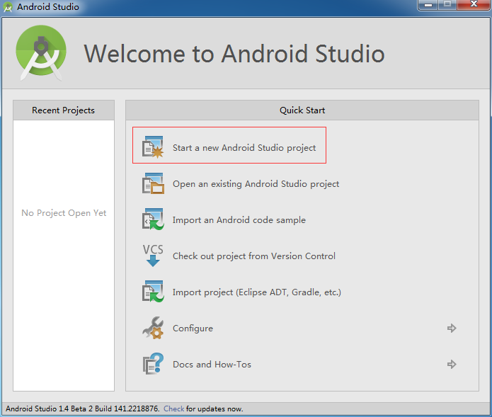

# 项目介绍

起草人: 李佳佳   日期：15年12月03日

修改：OOOO   日期：15年00月00日

修改：OOOO   日期：15年00月00日
# 
项目内容：

**使用android studio创建天气预报工程。**
# 

点击”Start a new Android Studio project”来开始创建一个android程序。如图：

为你的程序起一个名字，“Application name”就是将来你做的这个App的名字。

这里选择你的代码服务与什么类型的安卓设备和最小支持的SDK版本。

这里我们选择“Blank Activity”，这个选项，android studio会帮我们自动建一个“Hello World”的Activity以及一些默认的设置。

我们可以在这个程序上进行修改。如果你想自己创建这些东西，你应该选择“Add No Activity”.

在这里你可以修改这些文件的名字，然后点击“finish”来完成工程的创建。

至此，你已经创建了一个“Hello World”工程并且可以对这个工程进行修改。

如果关于更为基础的环境搭建部分出现问题

请参照基础实验一：环境搭建

