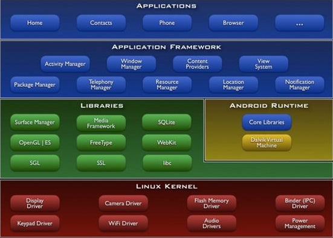
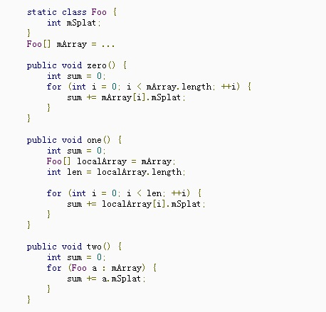

# 从计算机底层看待android应用程序的优化（1501210370 邓中洋）

##前言
在应用程序的开发中，性能优化是每一个应用程序设计人员无法避免的一项工作。总的来看，性能优化的目标主要有两个，一个是空间上的优化，一个是时间上的优化，空间上的优化主要目标是减少内存占用量，时间上的优化则是为了减少运行耗费的时间。在整个软硬件系统中，软件的总体性能取决于很多因素，比如硬件的本身的性能，编译器的编译质量，算法的优化程度，还有调用的程序库的优化程度，这里，我们站在硬件底层的角度来看待android应用程序的优化，并且介绍一些实用的优化技巧。

##应用程序性能优化浅述
写出高效的代码有两条基本的规则，不做没有必要的工作，不创建没有必要存在的数据变量。这两条听着像是废话，但却是所有程序开发者在程序性能优化上必须要注重的两个问题，而且，这两条原则说着简单，实际上却也并不容易办到，因为在实际的应用程序开发中，有很多的冗余操作并不是那么明显，很难看出是冗余的部分。就拿算法领域中的排序算法来说吧，排序算法有很多种，但是其计算复杂度却并有着很大差别，冒泡排序的算法原理简单，但是由于其中包含了许多没有任何意义的比较换序操作，造成算法臃肿，效率不高；二分归并排序和堆排序算法则不一样，这两种了算法在执行过程中，会充分利用前面的比较结果，避免了冗余的操作。实际当中，由于系统过于庞大，很容易造成一些小的性能漏洞，大量耗费cpu的运行时间，干一些并不重要甚至完全没有意义的工作。另外，设计人员的惰性会让他们为了让问题更加直观，增加很多多余的元素，使得程序更加直观，更符合人的思考方式，这样增加了软件的可维护性的同时也会大大降低程序的运行性能，因此，为了有效提高性能，请尽量站在机器的角度思考问题。

##android应用程序的优化方式
做过android应用开发的设计人员在接触android之初一定会看到下面这张图：

(android_structure.jpg)

从上图中可以看出android的应用开发的性能优化完全受限于整个应用框架。对于应用开发者来说，他所能看到的就是应用程序框架这一层，因此在别的方面下功夫都是毫无意义的，开发者唯一能做的优化方案便是依据android本身的架构特点编写适应整个框架结构的代码，同时考虑到语言本身暴露的底层信息对程序进行相应的优化。所谓语言所暴露的底层信息，就是语言当中与底层结合比较紧密的部分，比如java语言中定义一个变量时，cpu会为此变量分配相应的内存空间。

###避免创建不必要的对象
对象创建永远不会是免费的。每个线程的分代GC给零时对象分配一个地址池以降低分配开销，但往往内存分配比不分配需要的代价大。如果在用户界面周期内分配对象，就会强制一个周期性的垃圾回收，给用户体验增加小小的停顿间隙。Gingerbread中提到的并发回收也许有用，但不必要的工作应当被避免的。
因此，应该避免不必要的对象创建。下面是几个例子：

l  如果有一个返回String的方法，并且他的返回值常常附加在一个StringBuffer上，改变声明和实现，让函数直接在其后面附加，而非创建一个短暂存在的零时变量。

2  当从输入的数据集合中读取数据时，考虑返回原始数据的子串，而非新建一个拷贝.这样你虽然创建一个新的对象，但是他们共享该数据的char数组。（结果是即使仅仅使用原始输入的一部分，你也需要保证它的整体一直存在于内存中。）

3  Int类型的数组常有余Integer类型的。推而广之，两个平行的int数组要比一个（int,int）型的对象数组高效。这对于其他任何基本数据类型的组合都通用。

4  如果需要实现一个容器来存放元组（Foo,Bar），两个平行数组Foo[],Bar[]会优于一个（Foo,Bar）对象的数组。（例外情况是：当你设计API给其他代码调用时，应用好的API设计来换取小的速度提升。但在自己的内部代码中，尽量尝试高效的实现。）

通常来讲，尽量避免创建短时零时对象.少的对象创建意味着低频的垃圾回收。而这对于用户体验产生直接的影响。

###避免使用getters和setters
在c++当中，getters和setters方法在调用会被编译器直接翻译为相应的字段访问，而不是函数调用，因此避免了程序跳转带来的额外cpu开销，但是在java语言当中却并没有这样一个灵活的机制，因此为了避免程序的跳转，尽量将getters和setters的调用用字段访问代替。

###对常量使用static final修饰符
这是一种相对来说比较靠近底层的方法，将常量用final修饰符进行限定意味着常量不会进行相应的初始化，整个常量会以常数表的形式存在程序的机器码当中。避免初始化也就意味着避免了冗余操作，但这种方法只在大量的常数定义，比如表格创建当中有效，少量的常量并没有多大的意义。

###使用改进的for循环语法
改进for循环（有时被称为“for-each”循环）能够用于实现了iterable接口的集合类及数组中。在集合类中，迭代器让接口调用hasNext()和next()方法。在ArrayList中，手写的计数循环迭代要快3倍（无论有没有JIT），但其他集合类中，改进的for循环语法和迭代器具有相同的效率。

这里有一些迭代数组的实现：

zero()是当中最慢的，因为对于这个遍历中的历次迭代，JIT并不能优化获取数组长度的开销。

One()稍快，将所有东西都放进局部变量中，避免了查找。但仅只有声明数组长度对性能改善有益。

Two()是在无JIT的设备上运行最快的，对于有JIT的设备则和one()不分上下。他采用了JDK1.5中的改进for循环语法。

结论：优先采用改进for循环，但在性能要求苛刻的ArrayList迭代中，考虑采用手写计数循环。

###合理利用浮点数
通常的经验是，在Android设备中，浮点数会比整型慢两倍，在缺少FPU和JIT的G1上对比有FPU和JIT的Nexus One中确实如此（两种设备间算术运算的绝对速度差大约是10倍）从速度方面说，在现代硬件上，float和double之间没有任何不同。更广泛的讲，double大2倍。在台式机上，由于不存在空间问题，double的优先级高于float。但即使是整型，有的芯片拥有硬件乘法，却缺少除法。这种情况下，整型除法和求模运算是通过软件实现的，就像当你设计Hash表，或是做大量的算术那样。
这条建议在一些对时间敏感的算法比较有用，比如快速傅里叶变换算法。

###合理使用本地方法
本地方法并不是一定比Java高效。最起码，Java和native之间过渡的关联是有消耗的，而JIT并不能对此进行优化。当你分配本地资源时（本地堆上的内存，文件说明符等），往往很难实时的回收这些资源。同时你也需要在各种结构中编译你的代码（而非依赖JIT）。甚至可能需要针对相同的架构来编译出不同的版本：针对ARM处理器的GI编译的本地代码，并不能充分利用Nexus One上的ARM，而针对Nexus One上ARM编译的本地代码不能在G1的ARM上运行。

当你想部署程序到存在本地代码库的Android平台上时，本地代码才显得尤为有用，而并非为了Java应用程序的提速。

##结语
应用程序的优化是一项非常繁复的工作，而且对于开发者本身的能力要求极高，在实际的程序优化中，尽量运用已有的规则来达到最大的优化效果，避免为了一个微不足道的优化浪费过多的时间，毕竟程序员的时间和精力也是设计中不能忽略的成本。

