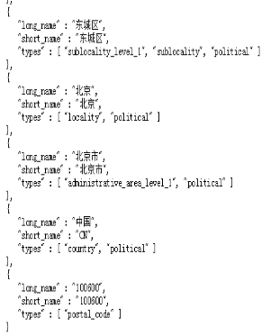

# 基于Map技术的移动LBS应用
                                            刚占慧
                           （北京大学软件与微电子学院，北京  102600）
**摘要：**近年来我国移动通信网络技术已经发展的十分成熟，其中一类非常流行的应用程序是基于位置的服务LBS。LBS应用程序跟踪您的位置，并提供额外的服务，如定位附近的遍历设施以及提供线路规划建议等。基于位置的服务作为一种获取信息的新途径为我们的生活带来了极大的便利，同时响应应用开发的需求，在Android系统中应用位置服务已经成为不可改变的事实。本文从LBS的基础讲起，进一步研究地址定位与位置监控，并进行了简单实践。  
**关键字：**Map; Android；移动LBS；应用

**引 言**  
基于位置的服务在最近几年里十分火爆，主要工作原理就是利用无线电通讯网络或GPS等定位确定移动设备所在的位置，基于地理位置的服务（LBS）在移动终端上的应用，因其根位置结合的紧密性，对移动人群需求的及时响应性，尤其是Foursquare应用的出现，通过签到方式加剧了移动LBS应用领域的飞速发展。然而早些年移动设备的功能极其有限，该功能并没有很好地开发，然而近年来基于位置服务的需求量急速增长，几乎任何移动设备上都涉及到基于地理位置的服务。  
本文所研究的基于Baidu Map技术的移动LBS，结合目前热门的Android系统，通过GPRS/WIFI等网络接入方式，从互联网中实时获取当前位置相关的热点信息，并通过在Baidu Map上的应用获取移动设备的所在位置，实现定位。本文主要分三个部分分别对Android开发中基于位置的服务进行分析：LBS简介、地址定位，地理编码与反向地理编码，并将这些内容应于天气预报实际项目中。

**背 景**  
2010年以来，LBS（Location Based Service，基于地理位置服务）在全球发展迅猛，以美国Foursquare和中国“街旁网”为代表的地理位置平台服务受到广泛关注。和以往不同的是，LBS（结合手机服务）不仅实现谷歌地图的定位功能、大众点评网的地点搜索、评价和查看功能，同时也实现了开心网、人人网的SNS平台上的人际社交网络的互动，更为重要的是LBS整合了互联网平台和移动数据平台，创建了“基于地理位置”的信息服务，整合线上线下资源，实现了全方位的社会化网络服务系统，形成了全新的社会关系，以及群体、组织和个体的之间的相互连接和行动规律。  
移动互联网时代的特点是移动终端的位置可以被服务器感知，这是一个巨大的飞跃。人们总是关注与发生在自己周围的信息，通过对移动终端设备获得越来越多有用的信息，将安卓系统作为载体，我们可以利用定位出的位置进行丰富多彩的操作，如天气预报中用户所在城市的自动选择，微博自动定位所在位置以及应用最广的路线查询我当前的位置等，这些信息包含着一个重要的信息——位置。

**LBS简介**  
LBS是基于位置的服务简称，它是通过电信移动运营商的无线电通讯网络（如GSM网、CDMA网）或外部定位方式(如GPS)获取移动终端用户的位置信息（地理坐标，或大地坐标），在地理信息系统（外语缩写：GIS、外语全称：Geographic Information System）平台的支持下，为用户提供相应服务的一种增值业务[1]。  
Android是Google公司开发的开源的轻量级移动嵌入式操作系统[2]，它以Linux内核结合系统架构层、应用层，并通过Activity、Service、Content Provider、Receiver等四大组件提供对外的基础应用API，并支持JAVA、C/C++等多种编程语言，极大降低了移动应用的开发门槛。  
总体上看LBS由移动通信网络和计算机网络结合而成，两个网络之间通过网关实现交互。移动终端通过移动通信网络发出请求，经过网关传递给LBS服务平台；服务平台根据用户请求和用户当前位置进行处理。并将结果通过网关返回给用户[1]。本质上它是一种概念较为宽泛的与空间位置有关的新型业务，即“确定地理位置”+“提供服务信息”的模式。

图1 LBS架构  

**地址定位**  
Android应用可以通过GPS来获取定位信息，并且实现了实时获取移动设备的地理位置，然而用户并不可能记住自己所在位置准确描述，我们使用位置服务的主要目的就是在用户不知道自己所在位置的情况下，系统可以进行自动定位给用户提供方便。例如地图导航，实时获取用户当前位置提供路线，美团会提示你所在位置与上次退出时登陆位置的不同，这些都不是用户输入的位置，而是系统自行定位。因此实现系统的自动定位便显得尤为重要。在本实验中采用了LocationClient和BDLocationListener两个接口，通过接受context进行位置监听注册，返回一个BDLocation对象具有用户所在位置的坐标、精度半径等信息，因为本实验中需要用到的就是用户所在的城市（区/县）信息，因此在这里直接使用location.getDistrict();获得“大兴区”，和我们的城市数据库不吻合，因此需要进行选择前两位“大兴”完成所在城市的定位，执行更新LBS操作executeUpdateByLBS(district)方法进行天气信息的更新。主要代码如下：
定义位置服务的对象并响应定位事件按钮：  
 
  
图2 定义为值服务对象  
进行位置有效性判断，如果调用初始化LBS方法如图3所示：  
   
图3 位置判断  
初始化LBS服务，定位模式默认有三种：Battery_Saving、Device_Sensors和Hight_Accuracy三种，本实验选用精确定位模式，通过给mLocationClient设置定位值选项，完成位置信息的存储，为接下来执行发起定位提供对象。  
  
图4 初始化LBS服务  
通过获得到的SDK定位结果，在BDLocationListener的onReceive方法中获取，通过该类用户可以获得error code，位置的经纬度、街道等信息，本实验主要的目的是使用者所在城市的自动定位，进行天气情况的更新，因此在这里我们直接定位到district，并进行拆分获得和城市列表数据库要求的格式一致。
  
图5 更新定位城市天气代码  
在完成上述核心代码后，注意使用百度的LBS位置服务功能必须在百度官网上申请一个权限秘钥并在AndroidManifest.xml中进行注册，同时把应用到的包加载到项目中来，完成所有工作后，即可实现定位服务与天气更新，如图：  
  
图6 定位城市更新天气效果图  
地理编码与反向地理编码
因为地图定位是按照经纬度完成的，因此如果需要让程序根据地址定位，则需要把地址解析成经、纬度。通过获取位置信息得到了经纬度信息，然而这种信息不是每个人都可以明白的，对于一个南纬28度，东经150度是什么地方，这就涉及到地址的解析与反向解析。所谓地址解析就是把普通用户能看到的字符串地址转换为经纬度；反向解析即把经纬度值转换为普通的字符串地址，即我们可以看得懂的位置信息。
地址解析，通过用户输入一个详细的地址。Android为地址解析提供了Geocoder工具类，提供两个方法进行地址和方向的解析：  
①　getFromLocation(double latitude,double longitude.int maxResults)执行地址解析，把经纬度转化为字符串地址转换为List地址值；  
②　getFromLocationName(String locaitonName,int maxResults)执行返向地址解析，把字符串地址转换为经、纬度List值。  
但是从Android2.2开始，使用Gercoder类时会提醒服务不可用，因此我们使用了Google或者Baidu的地址解析API。通过intent发起意图，启动调用将实现地址解析，反地址解析类似。百度地图解析过程实际就是向百度地图服务器接口提供一个特定格式的URL发送一个带有数据信息的Http请求，然后获得一个带有json数据的Http响应，所以，开发者需要完成的工作就是把数据包装到合适的url，以及接收到json数据之后解析。  
有关Google地址解析、反向地址解析的API用法，在这里就不进行详细介绍了，Google提供了地址解析、反向地址解析的服务地址，下面直接显示解析方法，如有不懂可以在android开发官网或者Google开发这平台进行查阅。
图7为地址解析正向过程，通过传入的城市名字address，进行经纬度的输出。
  
图7 地址解析  
如图8所示是地址解析逆向过程，通过经纬度的传入，使用HttpClient和HttpURLConnection工具类，向api接口发送请求，解析服务器响应的数据，获得结果。在解析中可能涉及到乱码，此时就需要完成拼音汉子的转换，再此不进行该内容的讲解。
  
图8 地址反向解析  
执行上述程序，在浏览器端显示地址正向解析结果如图9所示：  
  
图9-1 正向解析北京的经纬 图9-2 反向解析经纬度获得城市信息  

**临近警告**  
在Android的位置服务中使用的LocationManager时一定会涉及addProximityAlert(double laatitude, double longtitude, float radius, long expiration, PendingIntent intent)方法，该方法用于添加一个警告。所谓警告就是当用户手机不断接近指定固定点时，当与该固定点的距离小于某个指定范围时，系统触发相应的处理。该应用最为广泛的当属我们从某个城市进入另一个城市，你的手机归属地为A城市，当到达B城市时，我们便会收到一天欢迎来到B城市的信息，该应用就是位置服务的另一个普遍应用。  
在该方法中，主要参数除了latitude、longitude还有radius指定一个半径长度，expiration指定经过多少毫秒后钙磷经警告过期失效，-1规定永远不过期。Intent指定接近临近点时触发的intent组件。  
目前基于LBS的服务应用已经占据了移动应用的半壁江山，热推、网易八方、嘀咕、大众点评等。随着LBS与应用的结合，提供服务的方式也越来越多，主要表现为以下四个模式：  
1．签到模式：主要是以 Foursquar为代表。Foursquare是一家基于用户地理位置信息的手机服务网站，并鼓励手机用户同他人分享自己当前所在地理位置等信息。该模 式需要要培养用户每到一个地点就会签到的习惯，可以很好地为商户或品牌进行各种形式的营销与推广。  
2．大富翁游戏模式：国外的代表是Mytown，国内则是16Fun。主旨是游戏人生，可以让用户利用手机购买现实地理位置里的虚拟房产与道具，并进行消费与互动等将现实和虚拟真正进行融合的一种模式。  
3．周边生活服务搜索：国内代表是大众点评网，以点评网或者生活信息类网站与地理位置服务结合的模式。主要体验在于工具性的实用特质，问题在于信息量的积累和覆盖面需要比较广泛。  
4．优惠信息推送服务：以Vpon折扣随行为代表。Vpon就为用户提供了基于地理位置的优惠信息推送服务，其盈利模式是通过和线下商家的合作来实现利益的分成。  

**总结**  
信息的快速交流传播，顺理成章的就是对于广告的商业价值。对于商家来说，基于用户对位置推送周边的广告信息，一方面将极大的提高广告的精准营销程度；另一方面，商家可以结合LBS推出一些促销活动，对于那些经常签到的顾客提供优惠活动。  
本文利用Baidu Map API进行用户所在城市信息的获取实现天气更新以及利用Google Map API实现了地理位置的解析、反解析和临近警告等内容。分别实现了基于LBS应用服务系统，通过对LBS、地址定位采用的DBLocationManager、LocationClient等方法以及位置编码探讨了基于Baidu/Google Map的LBS应用的实现方式，实现了用户所在城市的自动定位。本文为目前热门的LBS应用提供了解决方案，对于从事移动定位开发的人员具有一定的参考价值，同时减少开发者对于GPS地理相关技术的依赖，节省了开发时间，对后续的LBS应用开发具有较好的借鉴意义。

**参考文献**  
[1] http://baike.baidu.com/subview/152851/5072513.htm  
[2] 公磊，周聪．基于 Android的移动终端 应用程序开发与研究[J].计算机与现代化.2008，(O8).  
[3] 李佐彬. Android开发入门与实战体验[M].北京：机械工业出版社, 2010.  
[4] 李刚.疯狂Android讲义.电子工业出版社,2012-3.  
[5] 刘胜前，陈立定，任志刚.基于Android 移动平台和GPS应用服务研究[J].信息技术．2011，(O1)．  
[5] Francesco Azzola. A Guide to Android RecyclerView and CardView. Oct 22, 2014.  
