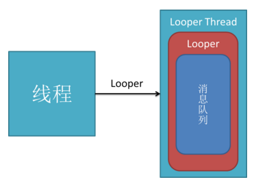
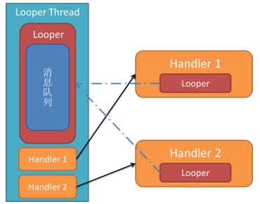
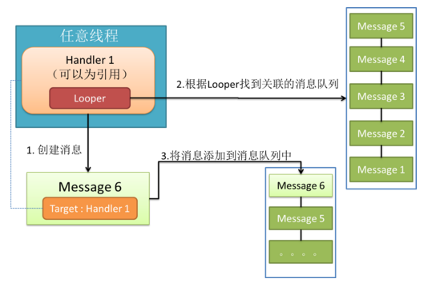
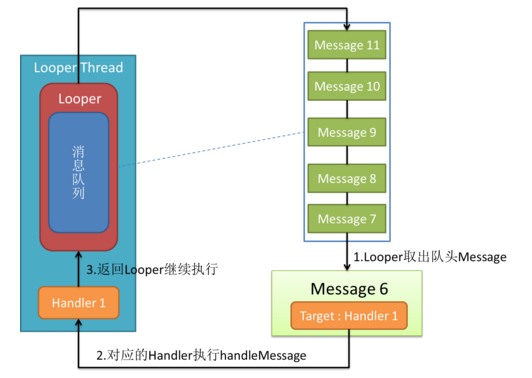
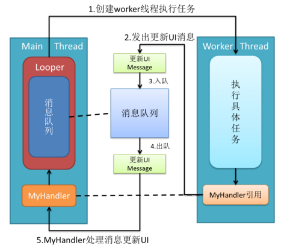

#android多线程编程机制

* 多线程的优点

      比如说发出一条网络请求时，考虑到网速等其他原因，服务器未必会立刻相应我们的请求，如果不将这类操作放在子
      线程里去运行，就会导致主线程被阻塞住，从而影响用户对软件的正常使用。

* 主线程

      主要负责处理与UI相关的事件，如：用户的按键事件，用户接触屏幕的事件以及屏幕绘图事件，并把相关的事件分发
      到对应的组件进行处理。所以主线程通常又被叫做UI线程。

* 子线程

      负责除UI之外较费时的操作，如从网络上 下载数据，或者访问数据库

* 线程的三种基本用法

      **第一种**
       1、定义一个线程只需要新建一个类继承自Thread，然后重写父类的run()方法，并在里面编写耗时逻辑即可。
       如下所示
        class MyThread extends Thread{
            @Override
            public void run(){
            //处理具体的逻辑
        }
        2、启动这个线程时，只需要new出一个MyThread的实例，然后调用它的start()方法，样run()方法中的代码就
        会在子线程当中运行了。如下所示：
        new MyThread().start()；
        或者是：
        MyThread myThread=new MyThread();
        myThread.start();
        
        **第二种**
        直接实现Runnable接口来定义一个线程
        class MyThread implements Runnable{
        @Override
        public void run(){
        //处理具体的逻辑
        }
        启动该线程的方法：
        MyThread myThread=new MyThread();
        new Thread(myThread).start();
        
        **第三种**
        匿名内部类的方式
        new Thread (new Runnable(){
        @Override
        public void run(){
        //处理具体的逻辑
        }
        }).start();
        
* 异步消息处理机制简介

    
        和许多其他的GUI库一样，Android的UI也是线程不安全的，也就是说，如果想要更新应用程序里的UI元素，则必须
        在主线程中运行，否则就会出现异常，这就要提到android异步消息处理机制
    
        Android中的异步消息处理主要由四个部分组成，Message、Handler、MessageQueue和Looper。
        
        1）Message
        Message是在线程之间传递的消息，它可以在内部携带少量信息，用于在不同的线程之间交换数据。比如Message的w
        hat字段、arg1和arg2字段（携带一些整形数据）、使用obj字段携带一个Object对象。
        
        2）Handler
        主要用于发送和处理消息，发送消息一般是使用Handler的sendMessage()方法，而发出的消息经过一系列的处理后
        ，最终会传到Handler的handlerMessage()方法中。
        
        3）MessageQueue
        MessageQueue是消息队列的意思，它主要用于存放所有通过Handler发送的消息。这部分消息会一直存在于消息队列
        中，等待被处理，每个线程中只会有一个MessageQueue对象。
        
        4）Looper
        Looper是每个线程中的MessageQueue的管家，调用Looper的loop()方法后，就会进入到一个无线循环当中，然后每
        当发现MessageQueue中存在一条消息，就会将a它提出来，并传递到Handler的handlerMessage()方法中。每个线程
        中也只会有一个Looper对象。
* 异步消息处理模块详解

##looper

    
    Looper的字面意思是“循环者”，它被设计用来使一个普通线程变成Looper线程。
    所谓Looper线程就是循环工作的线程。在程序开发中（尤其是GUI开发中），我们经常会需要一个线程不断循环，
    一旦有新任务则执行，执行完继续等待下一个任务，这就是Looper线程。使用Looper类创建Looper线程很简单：
    

    public class LooperThread extends Thread {
          @Override
          public void run() {
        // 将当前线程初始化为Looper线程
        Looper.prepare();
        
        // ...其他处理，如实例化handler
        
        // 开始循环处理消息队列
        Looper.loop();
            }
    }
    通过上面两行核心代码，线程就升级为Looper线程了，来看这两行代码
    
   1)Looper.prepare()
   
   
   
       
        通过上图可以看到，现在你的线程中有一个Looper对象，它的内部维护了一个消息队   
        列MQ。注意，一个Thread只能有一个Looper对象，
        调用loop方法后，Looper线程就开始真正工作了，它不断从自己的MQ中取出队头的消息(也叫任务)执行
        
        除了prepare()和loop()方法，Looper类还提供了一些有用的方法，比如
            
            Looper.myLooper()得到当前线程looper对象；
            getThread()得到looper对象所属线程；
            quit()方法结束looper循环；
            
        到此为止，你应该对Looper有了基本的了解，总结几点：
        1.每个线程有且最多只能有一个Looper对象，它是一个ThreadLocal
        2.Looper内部有一个消息队列，loop()方法调用后线程开始不断从队列中取出消息执行
        3.Looper使一个线程变成Looper线程。
        那么，我们如何往MQ上添加消息呢？那就要提到handle了
        
        
###Handle
        什么是handler？handler扮演了往MQ上添加消息和处理消息的角色（只处理由自己发出的消息），即通知MQ它要执行一个任务(sendMessage)，
        并在loop到自己的时候执行该任务(handleMessage)，整个过程是异步的。handler创建时会关联一个looper，
        默认的构造方法将关联当前线程的looper，不过这也是可以set的。
        
        下面我们就可以为之前的LooperThread类加入Handler：
        public class LooperThread extends Thread {
        private Handler handler1;
        private Handler handler2;

        @Override
            public void run() {
            // 将当前线程初始化为Looper线程
            Looper.prepare();
        
            // 实例化两个handler
            handler1 = new Handler();
            handler2 = new Handler();
        
            // 开始循环处理消息队列
            Looper.loop();
            }
        }
        
        加入handler后的效果如下图：
        

   
        可以看到，一个线程可以有多个Handler，但是只能有一个Looper
        
 Handler发送消息
        
        有了handler之后，我们就可以使用 post(Runnable), postAtTime(Runnable, long), postDelayed(Runnable, long),
        sendEmptyMessage(int),sendMessage(Message),sendMessageAtTime(Message, long)和 sendMessageDelayed(Message, long)这些方法向MQ上发送消息了。
        
        光看这些API你可能会觉得handler能发两种消息，
        一种是Runnable对象，一种是message对象，这是直观的理解，但其实post发出的Runnable对象最后都被封装成message对象了。
        
        其他方法就不罗列了，总之通过handler发出的message有如下特点：
        1.message.target为该handler对象，这确保了looper执行到该message时能找到处理它的handler，即loop()方法中的关键代码、
                msg.target.dispatchMessage(msg);
        2.post发出的message，其callback为Runnable对象
        
Handler处理消息

    说完了消息的发送，再来看下handler如何处理消息。
    消息的处理是通过核心方法dispatchMessage(Message msg)与钩子方法handleMessage(Message msg)完成的，见源码
    
    // 处理消息，该方法由looper调用
    public void dispatchMessage(Message msg) {
        if (msg.callback != null) {
            // 如果message设置了callback，即runnable消息，处理callback！
            handleCallback(msg);
        } else {
            // 如果handler本身设置了callback，则执行callback
            if (mCallback != null) {
                 /* 这种方法允许让activity等来实现Handler.Callback接口，避免了自己编写handler重写handleMessage方法。见http://alex-yang-xiansoftware-com.iteye.com/blog/850865 */
                if (mCallback.handleMessage(msg)) {
                    return;
                }
            }
            // 如果message没有callback，则调用handler的钩子方法handleMessage
            handleMessage(msg);
        }
    }
    
    // 处理runnable消息
    private final void handleCallback(Message message) {
        message.callback.run();  //直接调用run方法！
    }
    // 由子类实现的钩子方法
    public void handleMessage(Message msg) {
    }
        
    可以看到，除了handleMessage(Message msg)和Runnable对象的run方法由开发者实现外（实现具体逻辑），
    handler的内部工作机制对开发者是透明的。
    
Handler的用处

    1.handler可以在任意线程发送消息，这些消息会被添加到关联的MQ上。

    
    2.handler是在它关联的looper线程中处理消息的。

    这就解决了android最经典的不能在其他非主线程中更新UI的问题。android的主线程也是一个looper线程(looper在android中运用很广)，
    我们在其中创建的handler默认将关联主线程MQ。因此，利用handler的一个solution就是在activity中创建handler并将其引用传递给
    worker thread，worker thread执行完任务后使用handler发送消息通知activity更新UI。(过程如图)
    
 
 
##Message

在整个消息处理机制中，message又叫task，封装了任务携带的信息和处理该任务的handler。message的用法比较简单，这里不做总结了。但是有这么几点需要注意：

1.尽管Message有public的默认构造方法，但是你应该通过Message.obtain()来从消息池中获得空消息对象，以节省资源。

2.如果你的message只需要携带简单的int信息，请优先使用Message.arg1和Message.arg2来传递信息，这比用Bundle更省内存

3.擅用message.what来标识信息，以便用不同方式处理message。

                                异步消息处理模块 部分引用自http://www.cnblogs.com/codingmyworld/archive/2011/09/12/2174255.html  

    
    
    

