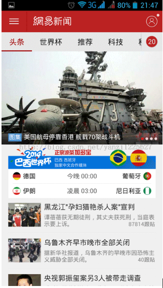
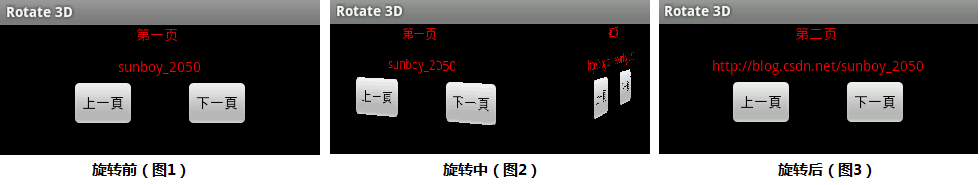
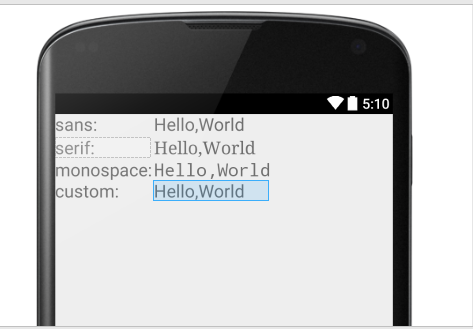

# Android经典页面框架及优化（1501210933 李佳佳）

安卓经典页面框架及优化（含自定义字体）2015.12.21更新

学号：1501210933

姓名：李佳佳

组号：第一组

本文主要是针对Android的经典界面设计给出分析和建议。

在开发安卓项目时，业务逻辑的框架选择和处理关系到系统的流畅度，稳定性等一列技术问题。

与此同时我们也不能忽略，由于移动端的发展，越来越多的应用从电脑端迁移到手机端，手机端由于和人们的生活密切接触，频繁使用，因此相比于Web端，对于界面的好看度、流畅度、手机界面操作特效等等，提出了一系列的要求，一款成功的安卓应用，必定是设计合理，界面简洁，功能丰富。


本文主要分成三部分。


第一，分析市面上主流APP的设计界面和设计风格，总结出几类常见的、已经在市场上证明反响不错的用户界面设计，进行页面的深度分析，剖析其页面组件和使用的框架，为之后的开发人员提供仿照的依据。


第二，在优化方面，将给出一些滑动的特效，以及目前成熟主流APP中使用较少的界面效果，给出UI设计的改进思路。

第三，对于UI设计的自定义字体部分，给出两种具体的实现建议。


第一部分：安卓经典页面框架的分析

1.QQ和微信

分析QQ和微信的主页面，本页面的实现主要分成两部分，底部控制栏、顶部控制栏及中间的内容显示载体fragment,底部的控制栏和标题栏相对应。


具体实现如下：

从用户功能的角度进行分析，底部控制栏里每个控件都不是单一基础控件，上面是图片、下面是文字，右上角是红点，当有更新时红点显示，否则隐藏。另外像qq的右上角还能显示未读消息的个数，实现方法是通过大量的layout一点一点搭出来的，这样的好处是方便控制比较直观，另外是可以利用Linearlayout里的layout_weight这个 属性，让底部的这些item均匀分布，缺点是代码上有很多重复，维护起来不方便。既然是整理app的通用模板框架，因此我将每个item视为一个对象，然后将其放在底部就ok了。其中在设计item的时候可以上面是图片下面是文字。


对于顶部控制采用ActionBar实现，关于主页面中间的Fragment的使用大致分两种，一种是将Fragment作为一个View写死在布局中，布局里使用android:name来告诉它对应的是哪个实体Fragment。这种添加 fragment的方式不能delete和replace掉。另一种是通过获得activity的fragmentmanager和 fragmentTransaction和进行动态的添加。这种方式更加灵活，一般使用此种方法。


2.网易新闻和新浪博客

分析其主界面风格，总结出此类界面的实现主要使用ViewPager+Fragment，即ViewPager里适配器里放的不是一般的View，而是 Fragment。

所以适配器不能继承PagerAdapter，而要继承FragmentPagerAdapter，这是在 android.support.v4.app.FragmentPagerAdapter包里的。

适配器为我们做了Fragment的切换等工作，我们能做的也就是在适配器里new Fragment的时候判断是否已存在。


在实现基本的常用界面时，是一系列的基础控件的灵活使用和嵌套，另外对于布局文件的掌握对于实现至关重要。





第二部分：安卓页面改进优化思路和UI设计建议


1.卡片式设计，扁平化趋势

近几年扁平化设计席卷了交互媒体的各个分支。

经常使用 Google 产品的朋友应该体验的出，以 Google Now 为代表，Google 全线产品都努力趋向简洁，在其中，“卡片” 这一并不新鲜的概念成了 Google 最重视的元素。


在天气预报项目中，有人摒弃了传统的天气预报格式，采用了卡片式的设计，将每个城市的天气预报呈现的信息，抽象成一张卡片，非常简洁。


卡片化设计的要求对于layout的灵活使用。第一步先去创建适配器，为ListView的初始化做好准备。继承 BaseAdapter，在getView方法里填充列表项目的图层， 初始化TextView的动作按钮。


 最核心部分是如何设置的各个按钮的触发器。因为适配器是重复使用的，这很有可能使触发器内嵌在适配器里，紧接着的项目肯定会使用相同的触发器但使用不同的 参数。
 
之后将实现移交给相关ListView的适配器。为此把View.OnClickListener放在适配器的构造器中，在适配器类中作为变量存储，把按钮触发器作为一个实例。


2.炫酷的3D滑动效果


越来越多的年轻人追求一种炫酷的3D动画效果。


Animation实现动画有两个方式：帧动画（frame-by-frame animation）和补间动画（tweened animation）。


可以如下图，通过继承Animation自定义Rotate3D，实现3D翻页效果。



第三部分：安卓UI中的自定义字体
通过前两部分的分析，总结如下：市场上流行的软件界面大多应用特效较少，主要突出功能的简洁和易用性，而极少数的个性文艺APP则侧重UI框架的使用，突出炫酷效果。在天气预报项目中，引导页面使用viewpager,实现过程中应添加必要的引导文字，此时发现Android系统默认支持三种字体，分别为：“sans”, “serif”, “monospace ”。考虑到字体在UI设计中的重要性，这一部分我们学习Android的字体部分。

自定义字体方法一：

以下是一个简单的demo，体会一下android中提供的不同字体：


```<?xml version="1.0" encoding="utf-8"?>
<LinearLayout xmlns:android="http://schemas.android.com/apk/res/android"
    android:layout_width="match_parent" android:layout_height="match_parent">


<TableLayout xmlns:Android="http://schemas.android.com/apk/res/android"
Android:layout_width="fill_parent"
Android:layout_height="fill_parent"
    Android:id="@+id/table">

<TableRow>

    <TextView
        Android:layout_marginRight="4px"
        Android:text="sans:"
        Android:textSize="20sp" >
    </TextView>
    <!-- 使用默认的sans字体 -->

    <TextView
        Android:id="@+id/sans"
        Android:text="Hello,World"
        Android:textSize="20sp"
        Android:typeface="sans" >
    </TextView>
</TableRow>

<TableRow>

    <TextView
        Android:layout_marginRight="4px"
        Android:text="serif:"
        Android:textSize="20sp" >
    </TextView>
    <!-- 使用默认的serifs字体 -->

    <TextView
        Android:id="@+id/serif"
        Android:text="Hello,World"
        Android:textSize="20sp"
        Android:typeface="serif" >
    </TextView>
</TableRow>

<TableRow>

    <TextView
        Android:layout_marginRight="4px"
        Android:text="monospace:"
        Android:textSize="20sp" >
    </TextView>
    <!-- 使用默认的monospace字体 -->

    <TextView
        Android:id="@+id/monospace"
        Android:text="Hello,World"
        Android:textSize="20sp"
        Android:typeface="monospace" >
    </TextView>
</TableRow>
<!-- 这里没有设定字体，我们将在Java代码中设定 -->

<TableRow>

    <TextView
        Android:layout_marginRight="4px"
        Android:text="custom:"
        Android:textSize="20sp" >
    </TextView>

    <TextView
        Android:id="@+id/custom"
        Android:text="Hello,World"
        Android:textSize="20sp" >
    </TextView>
</TableRow>

</TableLayout>
</LinearLayout>```


如上图所示，前三种字体成功显示，第四种定制的字体没有得到有效显示，因此默认为“sans”字体。


总结以上，使用自定义的字体方法如下：


1）将新字体的TTF文件copy到assets/fonts/目录下面，例如我们将“*.ttf”copy了过去。

2）我们需要将widget设置为该字体，比较遗憾的是，不能直接在XML文件中进行，需要编写源代码。

　　TextView tv = (TextView)findViewById(R.id.c12_custom);
　　
　　//从assert中获取有资源，获得app的assert，采用getAserts()，通过给出在assert/下面的相对路径。在实际使用中，字体库可能存在于SD卡上，可以采用createFromFile()来替代createFromAsset。 
　　
　　Typeface face = Typeface.createFromAsset (getAssets() , “fonts/timesi.ttf” );
　　
　　tv.setTypeface (face);
　　
在模拟器中先后导入华文行楷的字体，大约4M，但是系统无法识别出该字体，没有显示，然后尝试使用英文字体timesi.ttf，正常。因此 Android并非和所有的TTF字体都能兼容，尤其在中文特殊字体的支持会存在问题，对于不兼容的字体，Android不出报错，只是无法正常显示。一 般而言我们都会使用系统缺省提供的体。
　　对于华文行楷字体，我们一开始使用的文件是中文名字，出现报错，后来我们将之改为全小写的英文名称就不会出错，所以在文件命名上需要注意。
　　
　　
　　

自定义字体方法二：
为每个文本组件创建一个子类，如TextView、Button等，然后在构造函数中加载自定义字体。

public class BrandTextView extends TextView {  
public BrandTextView(Context context, AttributeSet attrs, int defStyle) 
{       
   super(context, attrs, defStyle);     
 }     
public BrandTextView(Context context, AttributeSet attrs) 
{         
 super(context, attrs);  
    }   
  public BrandTextView(Context context) 
{         
 super(context);    
 }    
 public void setTypeface(Typeface tf, int style) 
{         
  if (style == Typeface.BOLD) {                super.setTypeface(Typeface.createFromAsset(getContext().getAssets(), "fonts/YourCustomFont_Bold.ttf"));            } 
else {               super.setTypeface(Typeface.createFromAsset(getContext().getAssets(), "fonts/YourCustomFont.ttf"));            }      
} 
}

然后只需要将标准的文本控件替换成你自定义的就可以了（例如BrandTextView替换TextView）。

<com.your.package.BrandTextView         android:layout_width="wrap_content"  
android:layout_height="wrap_content"     
android:text="View with custom font"/>

<com.your.package.BrandTextView         android:layout_width="wrap_content"         android:layout_height="wrap_content"         
android:textStyle="bold"         
android:text="View with custom font and bold typeface"/>
这个方法可以方便的切换字体粗细等等，字体可以在组件xml文件的typeface属性中定义，缺点是依赖大量的模板代码，也比较麻烦。

结语：
安卓开发入门简单，但是涉及到很多细节，应该结合项目练习，在学习初期，一些小的demo设计亦是必不可少。界面设计关系到用户的使用体验，应该得到开发者的重视。
在本文当中，提供给初学者关于自定义字体的两种建议，合适的字体是UI成功的关键。

参考资料：
1）http://ryanhoo.github.io/blog/2014/05/05/android-better-way-to-apply-custom-font/
2）http://blog.csdn.net/woshiwxw765/article/details/38554869
3）http://blog.csdn.net/yanzi1225627/article/details/30763555


