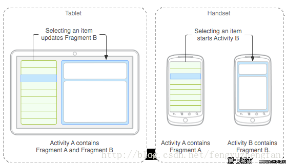
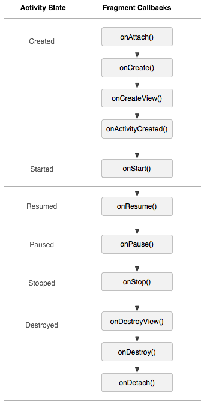
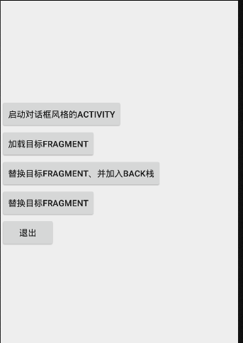
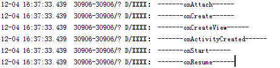
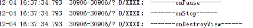
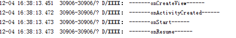
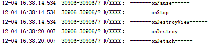

# Android中Fregment解析(1501210962 罗霄)

Fregment详解
Fregment代表了Activity的子模块，因此可以把Fregment理解成Activity片段。Fregment有自己的生命周期，也可以接受它自己的输入事件。

Fregment概述及其设计初衷
Fregment必须被“嵌入”Activity中使用，因此，虽然Fregment也拥有自己的生命周期，但是Fregment的生命周期会受到它所在的Activity的生命周期控制。例如，当Activity暂停时，该Activity内所有的Fregment暂停；当Activity被销毁时，该Activity内所有的Fregment都被销毁。只有当该Activity处于活动状态是，程序员才可通过方法独立操作Fregment。

Fregment有几个特征
1.	Fregment总是作为Activity界面的组成部分。Fregment可调用getActivity()方法获取它所在的Activity，Activity可调用FregmentManager的findFregmentByID()或findFregmentByTag()方法获取Fregment。
2.	在Activity运行过程中，可调用FregmentManager的add(),remove(),replace()方法动态添加、删除和替换Fregment。
3.	一个Activity可以同时组合多个Fregment；反过来，一个Fregment可以被多个Activity复用。
4.	Fregment可以同时响应自己的输入事件，并拥有自己的生命周期，但它们的生命周期直接被其所属的Activity的生命周期所控制。





Android3.0引入Fregment的初衷是为了适应大屏幕的平板电脑，由于平板电脑的屏幕比手机屏幕大，因此可以容纳更多的UI组件，而且这些UI组件之间存在交互关系。Fregment简化了大屏幕UI的设计，它不需要开发者管理组件包含关系的复杂变化，开发者使用Fregment对UI组件进行分组、模块化管理，就可以更方便地在运行过程中动态更新Activity的用户界面。


创建Fregment
创建Fregment与创建Activity类似，开发者实现的Fregment必须继承Fregment基类。Android提供如下的Fregment继承关系。开发者实现的Fregment，可以根据需要继承。实现Fregment与实现Activity非常相似，它们都需要实现与Activity类似的回调方法。区别只是开发Activity需要继承Activity或其子类;而开发Fregment需要继承Fregment及其子类。与此同时，只要将原来写在Activity回调方法中的代码“移到”Fregment的回调方法即可。

通常来说，创建Fregment需要实现如下三个方法
1.	onCreate()：系统创建Fregment对象后回调该方法，在实现代码中只初始化想要在Fregment中保持的必要组件，当Fregment被暂停或停止后可以恢复。
2.	onCreateView()：当Fregment绘制界面组件是会回调该方法。该方法必须返回一个View，该View也就是该Fregment所显示的View。
3.	onPause():当用户离开该Fregment时会回调该方法。

对于大部分的Fregment而言，通常都会重写上面这三个方法。但实际上开发者可以根据需要重写Fregment的任意回调方法。为了控制Fregment显示的组件，通常需要重写onCreateView()方法，该方法会返回的View将作为该Fregment显示的View组件。当Fregment绘制界面组件时将会回调该方法。
例如如下片段:
```
//重写该方法，该方法返回的View将作为Fregment显示的组件。
Public View onCreateView( LayoutInflater inflater,ViewGroup container,Bundle savedInstanceState){
	//将在/res/layout/目录下的fregment_book_detail.xml布局文件
	View rootView =inflater.inflate(R.layout.fragment_book_detail,container,false){
	if(book!=null){
	((TextView))  rootView.findViewById(R.id.book_title).setText(book.title);
	((TextView)) rootView.findViewById(R.id.book_desc).setText(book.desc);
}	
}
return rootView;
}
```
上面方法Public View onCreateView( LayoutInflater inflater,ViewGroup container,Bundle savedInstanceState)这一行代码使用了LayoutInflater加载了/res/layout/目录下的fregment_book_detail.xml 布局文件。最后一行return rootView返回该布局文件对应的View组件，这表明该Fragment将会显示该View组件。
下面通过一个实例来理解Fregment
实例：开发显示图书详情的Fragment
下面Fragment将会加载并显示一份简单的界面布局文件，并根据传入的参数带来更新界面组件。该Fragment的代码如下。
```
public class BookDetailFragment extends Fragment
{
    public static final String ITEM_ID = "item_id";

    BookContent.Book book;
    @Override
    public void onCreate(Bundle savedInstanceState)
    {
        super.onCreate(savedInstanceState);

        if (getArguments().containsKey(ITEM_ID))
        {
            book = BookContent.ITEM_MAP.get(getArguments()
                    .getInt(ITEM_ID));
        }
    }

    @Override
    public View onCreateView(LayoutInflater inflater
            , ViewGroup container, Bundle savedInstanceState)
    {

        View rootView = inflater.inflate(R.layout.fragment_book_detail,
                container, false);
        if (book != null)
        {

            ((TextView) rootView.findViewById(R.id.book_title))
                    .setText(book.title);

            ((TextView) rootView.findViewById(R.id.book_desc))
                    .setText(book.desc);
        }
        return rootView;
   }
}
```
上面的Fragment将会加载并显示res/layout/目录下的Fragment_book_detail.xml界面布局文件。上面book = BookContent.ITEM_MAP.get(getArguments() .getInt(ITEM_ID));代码获取启动该Fragment是传入的ITEM_ID参数，并根据该ID获取BookContent的ITEM_MAP中的图书信息。
BookContent类用于模拟系统的数据模型，该模拟类的代码如下。
```
public class BookContent
{
    // 定义一个内部类，作为系统的业务对象
 	public static class Book{
        public Integer id;
        public String title;
        public String desc;
        public Book(Integer id, String title, String desc)
        {
            this.id = id;
            this.title = title;
            this.desc = desc;
        }
        @Override
        public String toString()
        {
            return title;
        }
    }
    // 使用list集合记录系统所包含的Book对象
    public static List<Book> ITEMS = new ArrayList<Book>();
    // 使用Map集合记录系统所包含的Book对象
    public static Map<Integer, Book> ITEM_MAP
            = new HashMap<Integer, Book>();
    static
    {
        // 使用静态初始化代码，将Book对象添加到List集合、Map集合中
        addItem(new Book(1, "算法设计导论"
                , "屈婉玲老师真的好厉害!"));
        addItem(new Book(2, "自然语言处理"
                , "本部太远不想去"
                + "课真的听不懂"));
        addItem(new Book(3, "安卓课"
                , "安卓课真的很不错"));
    }
    private static void addItem(Book book)
    {
        ITEMS.add(book);
        ITEM_MAP.put(book.id, book);
    }
}
```

BookDetailFragment只是加载并显示一份简单的布局文件，这份布局文件中通过LinearLayout包含两个文本框。该布局文件的代码如下。
```
<LinearLayout xmlns:android="http://schemas.android.com/apk/res/android"
    android:layout_width="match_parent" android:layout_height="match_parent"
    android:orientation="vertical">
    <!-- 定义一个TextView来显示图书标题 -->
    <TextView
        style="?android:attr/textAppearanceLarge"
        android:id="@+id/book_title"
        android:layout_width="match_parent"
        android:layout_height="wrap_content"
        android:padding="16dp"/>
    <!-- 定义一个TextView来显示图书描述 -->
    <TextView
        style="?android:attr/textAppearanceMedium"
        android:id="@+id/book_desc"
        android:layout_width="match_parent"
        android:layout_height="match_parent"
        android:padding="16dp"/>
</LinearLayout>
```


实例：创建ListFragment
如果开发ListFragment的子类，则无须重写onCreateView()方法----与ListActivity类似是，只要调用ListFragment的setAdapter()方法为该Fragment设置Adapter即可。该ListFragment将会显示该Adapter提供的列表项。本实例开发了一个ListFragment的子类。
```
public class BookListFregment extends ListFragment
{
    private Callbacks mCallbacks;
    // 定义一个回调接口，该Fragment所在Activity需要实现该接口
    // 该Fragment将通过该接口与它所在的Activity交互
    public interface Callbacks
    {
        public void onItemSelected(Integer id);
    }
    @Override
    public void onCreate(Bundle savedInstanceState)
    {
        super.onCreate(savedInstanceState);
        // 为该ListFragment设置Adapter
        setListAdapter(new ArrayAdapter<BookContent.Book>(getActivity(),
                android.R.layout.simple_list_item_activated_1,
                android.R.id.text1, BookContent.ITEMS));  //①
    }
    // 当该Fragment被添加、显示到Activity时，回调该方法
    @Override
    public void onAttach(Activity activity)
    {
        super.onAttach(activity);
        // 如果Activity没有实现Callbacks接口，抛出异常
        if (!(activity instanceof Callbacks))
        {
            throw new IllegalStateException(
                    "BookListFragment所在的Activity必须实现Callbacks接口!");
        }
        // 把该Activity当成Callbacks对象
        mCallbacks = (Callbacks)activity;
    }
    // 当该Fragment从它所属的Activity中被删除时回调该方法
    @Override
    public void onDetach()
    {
        super.onDetach();
        // 将mCallbacks赋为null。
        mCallbacks = null;
    }
    // 当用户单击某列表项时激发该回调方法
    @Override
    public void onListItemClick(ListView listView
            , View view, int position, long id)
    {
        super.onListItemClick(listView, view, position, id);
        // 激发mCallbacks的onItemSelected方法
        mCallbacks.onItemSelected(BookContent
                .ITEMS.get(position).id);
    }
    public void setActivateOnItemClick(boolean activateOnItemClick)
    {
        getListView().setChoiceMode(
                activateOnItemClick ? ListView.CHOICE_MODE_SINGLE
                        : ListView.CHOICE_MODE_NONE);
    }
}
```
为了控制ListFragment显示的列表项，只要调用ListFragment提供的setAdapter()方法，即可让ListFragment显示该Adapter所提供的多个列表项。

Fragment与Activity通信
为了在Activity中显示Fragment，还必须将Fragment添加到Activity中。将Fragment添加到Activity中有如下两种方式。

	在布局文件中使用<fragment…/>元素添加Fragment，<fragment…./>元素的android:name属性指定Fragment的实现类。
	在Java代码中通过FragmentTransaction对象的add()方法来添加Fragment。

Activity的getFragmentManager()方法可返回FragmentManager,FragmentManager对象的beginTransaction()方法即可开启返回的FragmentTrasaction对象。下面Activity的getFragmentManager()方法可返回FragmentManager,FragmentManager对象的beginTransaction()方法即可开启并返回FragmentTransaction对象。
下面Activity首先通过如下布局文件来使用前面定义的BookListFragment。
```
<LinearLayout xmlns:android="http://schemas.android.com/apk/res/android"
    android:layout_width="match_parent" android:layout_height="match_parent"
    android:orientation="horizontal"
    android:layout_marginLeft="16dp"
    android:layout_marginRight="16dp"
    android:divider="?android:attr/dividerHorizontal"
    android:showDividers="middle">
    <fragment
        android:name="com.example.luoxiao.myapplication12.BookListFregment"
        android:id="@+id/book_list"
        android:layout_width="0dp"
        android:layout_height="match_parent"
        android:layout_weight="1" />
    <!-- 添加一个FrameLayout容器 -->
    <FrameLayout
        android:id="@+id/book_detail_container"
        android:layout_width="0dp"
        android:layout_height="match_parent"
        android:layout_weight="3" />
</LinearLayout>
上面布局文件中的<fragment
        android:name="com.example.luoxiao.myapplication12.BookListFregment"
        android:id="@+id/book_list"
        android:layout_width="0dp"
        android:layout_height="match_parent"
        android:layout_weight="1" />添加了BookListFragment，该Activity的左边将会显示一个ListFragment，右边只是一个FrameLayout容器，该FrameLayout容器将会动态更新其中显示的Fragment。下面是该Activity的代码。

public class MainActivity extends Activity implements BookListFregment.Callbacks {

    @Override
    protected void onCreate(Bundle savedInstanceState) {
        super.onCreate(savedInstanceState);
        setContentView(R.layout.activity_book_twopane);
    }
    public void onItemSelected(Integer id)
    {
        // 创建Bundle，准备向Fragment传入参数
        Bundle arguments = new Bundle();
        arguments.putInt(BookDetailFragment.ITEM_ID, id);
        // 创建BookDetailFragment对象
        BookDetailFragment fragment = new BookDetailFragment();
        // 向Fragment传入参数
        fragment.setArguments(arguments);
        // 使用fragment替换book_detail_container容器当前显示的Fragment
        getFragmentManager().beginTransaction()
                .replace(R.id.book_detail_container, fragment)
                .commit();  
    }
}
```
上面程序中的getFragmentManager().beginTransaction()
                .replace(R.id.book_detail_container, fragment)
                .commit(); 
这段代码就调用了FragmentTransaction的replace()方法动态更新了ID为book_detail_container容器(也就是前面布局文件中的FrameLayout容器)中显示的Fragment。将Fragment添加到Activity之后，Fragment必须与Activity交互信息，这就需要Fragment能获取它所在的Activity，Activity也能获取它所包含的任意Fragment。可按如下方式进行。
	Fragment获取它所在的Activity:调用Fragment的getActivity()方法即可返回它所在的Activity。
	Activity获取它包含的Fragment:调用Activity关联的FragmentManager的findFragmentById(int id)或findFragmentByTag(String tag)方法即可获取指定的Fragment。

在界面布局文件中使用<fragment……/>元素添加Fragment时，可以为<fragment…./>元素指定android:id或android:tag属性，这两个属性都可用于标识该Fragment，接下Activity将可通过findFragmentById(int  id)或findFragmentByTag(String tag)来获取该Fragment。
除此之外，Fragment和Activity可能还需要相互传递数据，可按如下方式进行。
	Activity想Fragment传递数据:在Activity中创建Bundle数据包，并调用Fragment的setArguments(Bundle bundle)方法即可将Bundle数据包传给Fragment。
	Fragment向Activity传递数据或Activity需要在Fragment运行中进行实时通信:在Fragment中定义一个内部回调接口，再让包含该Fragment的Activity实现该回调接口，这样Fragment即可调用该回调方法将数据传给Activity。

上面示例定义了两个Fragment，并使用一个Activity来”组合”这两个Fragment，该示例的运行界面正是实现下图中示意界面的左边部分。


Android3.0引入Fregment的初衷是为了适应大屏幕的平板电脑，由于平板电脑的屏幕比手机屏幕大，因此可以容纳更多的UI组件，而且这些UI组件之间存在交互关系。Fregment简化了大屏幕UI的设计，它不需要开发者管理组件包含关系的复杂变化，开发者使用Fregment对UI组件进行分组、模块化管理，就可以更方便地在运行过程中动态更新Activity的用户界面。


创建Fregment
创建Fregment与创建Activity类似，开发者实现的Fregment必须继承Fregment基类。Android提供如下的Fregment继承关系。开发者实现的Fregment，可以根据需要继承。实现Fregment与实现Activity非常相似，它们都需要实现与Activity类似的回调方法。区别只是开发Activity需要继承Activity或其子类;而开发Fregment需要继承Fregment及其子类。与此同时，只要将原来写在Activity回调方法中的代码“移到”Fregment的回调方法即可。

通常来说，创建Fregment需要实现如下三个方法
1.	onCreate()：系统创建Fregment对象后回调该方法，在实现代码中只初始化想要在Fregment中保持的必要组件，当Fregment被暂停或停止后可以恢复。
2.	onCreateView()：当Fregment绘制界面组件是会回调该方法。该方法必须返回一个View，该View也就是该Fregment所显示的View。
3.	onPause():当用户离开该Fregment时会回调该方法。

对于大部分的Fregment而言，通常都会重写上面这三个方法。但实际上开发者可以根据需要重写Fregment的任意回调方法。为了控制Fregment显示的组件，通常需要重写onCreateView()方法，该方法会返回的View将作为该Fregment显示的View组件。当Fregment绘制界面组件时将会回调该方法。
例如如下片段:

//重写该方法，该方法返回的View将作为Fregment显示的组件。
Public View onCreateView( LayoutInflater inflater,ViewGroup container,Bundle savedInstanceState){
	//将在/res/layout/目录下的fregment_book_detail.xml布局文件
	View rootView =inflater.inflate(R.layout.fragment_book_detail,container,false){
	if(book!=null){
	((TextView))  rootView.findViewById(R.id.book_title).setText(book.title);
	((TextView)) rootView.findViewById(R.id.book_desc).setText(book.desc);
}	
}
return rootView;
}
上面方法Public View onCreateView( LayoutInflater inflater,ViewGroup container,Bundle savedInstanceState)这一行代码使用了LayoutInflater加载了/res/layout/目录下的fregment_book_detail.xml 布局文件。最后一行return rootView返回该布局文件对应的View组件，这表明该Fragment将会显示该View组件。
下面通过一个实例来理解Fregment
实例：开发显示图书详情的Fragment
下面Fragment将会加载并显示一份简单的界面布局文件，并根据传入的参数带来更新界面组件。该Fragment的代码如下。
public class BookDetailFragment extends Fragment
{
    public static final String ITEM_ID = "item_id";

    BookContent.Book book;
    @Override
    public void onCreate(Bundle savedInstanceState)
    {
        super.onCreate(savedInstanceState);

        if (getArguments().containsKey(ITEM_ID))
        {
            book = BookContent.ITEM_MAP.get(getArguments()
                    .getInt(ITEM_ID));
        }
    }

    @Override
    public View onCreateView(LayoutInflater inflater
            , ViewGroup container, Bundle savedInstanceState)
    {

        View rootView = inflater.inflate(R.layout.fragment_book_detail,
                container, false);
        if (book != null)
        {

            ((TextView) rootView.findViewById(R.id.book_title))
                    .setText(book.title);

            ((TextView) rootView.findViewById(R.id.book_desc))
                    .setText(book.desc);
        }
        return rootView;
   }
}
上面的Fragment将会加载并显示res/layout/目录下的Fragment_book_detail.xml界面布局文件。上面book = BookContent.ITEM_MAP.get(getArguments() .getInt(ITEM_ID));代码获取启动该Fragment是传入的ITEM_ID参数，并根据该ID获取BookContent的ITEM_MAP中的图书信息。
BookContent类用于模拟系统的数据模型，该模拟类的代码如下。

public class BookContent
{
    // 定义一个内部类，作为系统的业务对象
 	public static class Book{
        public Integer id;
        public String title;
        public String desc;
        public Book(Integer id, String title, String desc)
        {
            this.id = id;
            this.title = title;
            this.desc = desc;
        }
        @Override
        public String toString()
        {
            return title;
        }
    }
    // 使用list集合记录系统所包含的Book对象
    public static List<Book> ITEMS = new ArrayList<Book>();
    // 使用Map集合记录系统所包含的Book对象
    public static Map<Integer, Book> ITEM_MAP
            = new HashMap<Integer, Book>();
    static
    {
        // 使用静态初始化代码，将Book对象添加到List集合、Map集合中
        addItem(new Book(1, "算法设计导论"
                , "屈婉玲老师真的好厉害!"));
        addItem(new Book(2, "自然语言处理"
                , "本部太远不想去"
                + "课真的听不懂"));
        addItem(new Book(3, "安卓课"
                , "安卓课真的很不错"));
    }
    private static void addItem(Book book)
    {
        ITEMS.add(book);
        ITEM_MAP.put(book.id, book);
    }
}


BookDetailFragment只是加载并显示一份简单的布局文件，这份布局文件中通过LinearLayout包含两个文本框。该布局文件的代码如下。
<LinearLayout xmlns:android="http://schemas.android.com/apk/res/android"
    android:layout_width="match_parent" android:layout_height="match_parent"
    android:orientation="vertical">
    <!-- 定义一个TextView来显示图书标题 -->
    <TextView
        style="?android:attr/textAppearanceLarge"
        android:id="@+id/book_title"
        android:layout_width="match_parent"
        android:layout_height="wrap_content"
        android:padding="16dp"/>
    <!-- 定义一个TextView来显示图书描述 -->
    <TextView
        style="?android:attr/textAppearanceMedium"
        android:id="@+id/book_desc"
        android:layout_width="match_parent"
        android:layout_height="match_parent"
        android:padding="16dp"/>
</LinearLayout>


实例：创建ListFragment
如果开发ListFragment的子类，则无须重写onCreateView()方法----与ListActivity类似是，只要调用ListFragment的setAdapter()方法为该Fragment设置Adapter即可。该ListFragment将会显示该Adapter提供的列表项。本实例开发了一个ListFragment的子类。
public class BookListFregment extends ListFragment
{
    private Callbacks mCallbacks;
    // 定义一个回调接口，该Fragment所在Activity需要实现该接口
    // 该Fragment将通过该接口与它所在的Activity交互
    public interface Callbacks
    {
        public void onItemSelected(Integer id);
    }
    @Override
    public void onCreate(Bundle savedInstanceState)
    {
        super.onCreate(savedInstanceState);
        // 为该ListFragment设置Adapter
        setListAdapter(new ArrayAdapter<BookContent.Book>(getActivity(),
                android.R.layout.simple_list_item_activated_1,
                android.R.id.text1, BookContent.ITEMS));  //①
    }
    // 当该Fragment被添加、显示到Activity时，回调该方法
    @Override
    public void onAttach(Activity activity)
    {
        super.onAttach(activity);
        // 如果Activity没有实现Callbacks接口，抛出异常
        if (!(activity instanceof Callbacks))
        {
            throw new IllegalStateException(
                    "BookListFragment所在的Activity必须实现Callbacks接口!");
        }
        // 把该Activity当成Callbacks对象
        mCallbacks = (Callbacks)activity;
    }
    // 当该Fragment从它所属的Activity中被删除时回调该方法
    @Override
    public void onDetach()
    {
        super.onDetach();
        // 将mCallbacks赋为null。
        mCallbacks = null;
    }
    // 当用户单击某列表项时激发该回调方法
    @Override
    public void onListItemClick(ListView listView
            , View view, int position, long id)
    {
        super.onListItemClick(listView, view, position, id);
        // 激发mCallbacks的onItemSelected方法
        mCallbacks.onItemSelected(BookContent
                .ITEMS.get(position).id);
    }
    public void setActivateOnItemClick(boolean activateOnItemClick)
    {
        getListView().setChoiceMode(
                activateOnItemClick ? ListView.CHOICE_MODE_SINGLE
                        : ListView.CHOICE_MODE_NONE);
    }
}
为了控制ListFragment显示的列表项，只要调用ListFragment提供的setAdapter()方法，即可让ListFragment显示该Adapter所提供的多个列表项。

Fragment与Activity通信
为了在Activity中显示Fragment，还必须将Fragment添加到Activity中。将Fragment添加到Activity中有如下两种方式。

	在布局文件中使用<fragment…/>元素添加Fragment，<fragment…./>元素的android:name属性指定Fragment的实现类。
	在Java代码中通过FragmentTransaction对象的add()方法来添加Fragment。

Activity的getFragmentManager()方法可返回FragmentManager,FragmentManager对象的beginTransaction()方法即可开启返回的FragmentTrasaction对象。下面Activity的getFragmentManager()方法可返回FragmentManager,FragmentManager对象的beginTransaction()方法即可开启并返回FragmentTransaction对象。
下面Activity首先通过如下布局文件来使用前面定义的BookListFragment。
<LinearLayout xmlns:android="http://schemas.android.com/apk/res/android"
    android:layout_width="match_parent" android:layout_height="match_parent"
    android:orientation="horizontal"
    android:layout_marginLeft="16dp"
    android:layout_marginRight="16dp"
    android:divider="?android:attr/dividerHorizontal"
    android:showDividers="middle">
    <fragment
        android:name="com.example.luoxiao.myapplication12.BookListFregment"
        android:id="@+id/book_list"
        android:layout_width="0dp"
        android:layout_height="match_parent"
        android:layout_weight="1" />
    <!-- 添加一个FrameLayout容器 -->
    <FrameLayout
        android:id="@+id/book_detail_container"
        android:layout_width="0dp"
        android:layout_height="match_parent"
        android:layout_weight="3" />
</LinearLayout>
上面布局文件中的<fragment
        android:name="com.example.luoxiao.myapplication12.BookListFregment"
        android:id="@+id/book_list"
        android:layout_width="0dp"
        android:layout_height="match_parent"
        android:layout_weight="1" />添加了BookListFragment，该Activity的左边将会显示一个ListFragment，右边只是一个FrameLayout容器，该FrameLayout容器将会动态更新其中显示的Fragment。下面是该Activity的代码。

public class MainActivity extends Activity implements BookListFregment.Callbacks {

    @Override
    protected void onCreate(Bundle savedInstanceState) {
        super.onCreate(savedInstanceState);
        setContentView(R.layout.activity_book_twopane);
    }
    public void onItemSelected(Integer id)
    {
        // 创建Bundle，准备向Fragment传入参数
        Bundle arguments = new Bundle();
        arguments.putInt(BookDetailFragment.ITEM_ID, id);
        // 创建BookDetailFragment对象
        BookDetailFragment fragment = new BookDetailFragment();
        // 向Fragment传入参数
        fragment.setArguments(arguments);
        // 使用fragment替换book_detail_container容器当前显示的Fragment
        getFragmentManager().beginTransaction()
                .replace(R.id.book_detail_container, fragment)
                .commit();  
    }
}
上面程序中的getFragmentManager().beginTransaction()
                .replace(R.id.book_detail_container, fragment)
                .commit(); 
这段代码就调用了FragmentTransaction的replace()方法动态更新了ID为book_detail_container容器(也就是前面布局文件中的FrameLayout容器)中显示的Fragment。将Fragment添加到Activity之后，Fragment必须与Activity交互信息，这就需要Fragment能获取它所在的Activity，Activity也能获取它所包含的任意Fragment。可按如下方式进行。
	Fragment获取它所在的Activity:调用Fragment的getActivity()方法即可返回它所在的Activity。
	Activity获取它包含的Fragment:调用Activity关联的FragmentManager的findFragmentById(int id)或findFragmentByTag(String tag)方法即可获取指定的Fragment。

在界面布局文件中使用<fragment……/>元素添加Fragment时，可以为<fragment…./>元素指定android:id或android:tag属性，这两个属性都可用于标识该Fragment，接下Activity将可通过findFragmentById(int  id)或findFragmentByTag(String tag)来获取该Fragment。
除此之外，Fragment和Activity可能还需要相互传递数据，可按如下方式进行。
	Activity想Fragment传递数据:在Activity中创建Bundle数据包，并调用Fragment的setArguments(Bundle bundle)方法即可将Bundle数据包传给Fragment。
	Fragment向Activity传递数据或Activity需要在Fragment运行中进行实时通信:在Fragment中定义一个内部回调接口，再让包含该Fragment的Activity实现该回调接口，这样Fragment即可调用该回调方法将数据传给Activity。

上面示例定义了两个Fragment，并使用一个Activity来”组合”这两个Fragment，该示例的运行界面正是实现下图中示意界面的左边部分。

Fragment管理与Fragment事务
前面介绍了Activity与Fragment交互相关的内容，其实Activity管理Fragment主要依靠FragmentManager。FragmentManager可以完成如下几个方面的功能。
	使用findFragmentById()或findFramentByTag()方法来获取指定的Fragment。
	调用popBackStack()方法将Fragment从后台栈中弹出(模拟用户按下BACK按键)。
	调用addOnBackStackChangeListener()注册一个监听器，用于监听后台栈的变化。

如果需要添加、删除、替换Fragment，则需要借助于FragmentTransaction对象，FragmentTransaction代表Activity对Fragment执行的多个改变。
    FragmentTransaction也被翻译为Fragment事务。与数据库事务类似的是，数据库事务代表了对底层数组的多个更新操作；而Fragment事务则代表了Activity对Fragment执行的多个改变操作。
开发者可通过FragmentManager来获得FragmentTransaction，代码片段如下：
FragmentManager fragmentManager = getFragmentManager();
FragmentTransaction fragmentTrasaction = fragmentManager.beginTrasaction();
每个FragmentTransaction可以包含多个对Fragment的修改，比如包含调用了多个add()、remove()、和replace()操作，最后调用commit()方法提交事务即可。在调用commit()之前，开发者也课调用addToBackStack()将事务添加到Back栈，该栈由Activity负责管理，这样允许用户按BACK按键返回到前一个Fragment状态。
//创建一个新的Fragment并打开事务
Fragment newFragment = new ExampleFragment();
FragmentTransaction transaction = getFragmentManager().beginTransaction();
//替换该界面Fragment_containner容器内的Fragment
Transaction.replace(R.id.fragment_container,newFragment);
//将事务添加到Back栈，允许用户按BACK按键返回到替换Fragment之前的状态
Transaction.addToBackStack(null);
//提交事务
Transaction.commit();

在上面的示例代码中，newFragment替换了当前界面布局中ID为fragment_container的容器内的Fragment，由于程序调用addToBackStack()将该replace操作添加到了Back栈中，因此用户可以通过按BACK按键返回替换之前的状态。

Fragment的生命周期
与Activity类似的是，Fragment也存在如下状态。
	运行状态:当前Fragment位于前台，用户可以见，可以获得焦点。
	暂停状态:其他Activity位于前台，该Fragment依然可见，只是不能获得焦点。
	停止状态:该Fragment不可见，失去焦点。
	销毁状态:该Fragment被完全删除，或该Fragment所在的Activity被结束。
Android文档只提到了Fragment的三个状态，官方文档没有提到Fragment的“销毁状态”。这也是合理的，因为处于“销毁状态”的Fragment基本不可用了，只能等着被回收。





如上图可以看出，在Fragment的生命周期中，如下方法会被调用。
	onAttach():当该Fragment被添加到Activity时被回调。该方法只会被调用一次。
	onCreate(Bundle savedStatus):创建Fragment时被回调。该方法只会被调用一次。
	onCreateView():每次创建、绘制该Fragment是View组件时回调该方法，Fragment将会显示该方法返回的View组件。
	onActivityCreated():当Fragment所在的Activity被启动完成后回调该方法。
	onStart():启动Fragment时被回调。
	onResume():恢复Fragment是被回调，在onStart()方法后暂停一定会回调onResume()方法。
	onPause():暂停Fragment是被回调。
	onStop():停止Fragment时被回调。
	onDestroyView():销毁该Fragment所包含的View组件时调用。
	onDestroy():销毁Fragment时被回调。该方法只会被调用一次。
	onDetacn():将该Fragment从Activity中删除、替换完成时回调该方法，在onDestroy()方法后一定会调用onDetach()方法。该方法只会被调用一次。
正如开发Activity是可以根据需要有选择地覆盖指定方法一样，开发Fragment是也可根据需要有选择地覆盖指定方法。其中最常见的就是覆盖onCreateView()方法—该方法返回的View将有Fragment显示出来。

public class LifecycleFragment extends Fragment
{

    @Override
    public void onAttach(Activity activity)
    {
        super.onAttach(activity);
        //输出日志
        Log.d("XXXX", "-------onAttach------");
    }
    @Override
    public void onCreate(Bundle savedInstanceState)
    {
        super.onCreate(savedInstanceState);
       //输出日志
        Log.d("XXXX", "-------onCreate------");
    }
    @Override
    public View onCreateView(LayoutInflater inflater, ViewGroup container,
                             Bundle data)
    {
        //输出日志
        Log.d("XXXX", "-------onCreateView------");
        TextView tv = new TextView(getActivity());
        tv.setGravity(Gravity.CENTER_HORIZONTAL);
        tv.setText("����Fragment");
        tv.setTextSize(40);
        return tv;
    }
    @Override
    public void onActivityCreated(Bundle savedInstanceState)
    {
        super.onActivityCreated(savedInstanceState);
        //输出日志
        Log.d("XXXX", "-------onActivityCreated------");
    }
    @Override
    public void onStart()
    {
        super.onStart();
        //输出日志
        Log.d("XXXX", "-------onStart------");
    }
    @Override
    public void onResume()
    {
        super.onResume();
        //输出日志
        Log.d("XXXX", "-------onResume------");
    }
    @Override
    public void onPause()
    {
        super.onPause();
        //输出日志
        Log.d("XXXX", "-------onPause------");
    }
    @Override
    public void onStop()
    {
        super.onStop();
        //输出日志
        Log.d("XXXX", "-------onStop------");
    }
    @Override
    public void onDestroyView()
    {
        super.onDestroyView();
       //输出日志
        Log.d("XXXX", "-------onDestroyView------");
    }
    @Override
    public void onDestroy()
    {
        super.onDestroy();
        //输出日志
        Log.d("XXXX", "-------onDestroy------");
    }
    @Override
    public void onDetach()
    {
        super.onDetach();
       //输出日志
        Log.d("XXXX", "-------onDetach------");
    }
}

MainActivity布局文件很简单，该布局文件如下


当使用Activity加载该Fragment时，可以在logcat控制台看到如下图



如果单击程序中的“启动对话框风格的Activity”按钮，将启动一个对话框风格的Activity，当前Activity将会转入“暂停”状态，该Fragment已经进入“暂停”状态，此时可以在控制台看到如下图所示的输出


关闭对话框风格的Activity，Fragment将会再次进入“运行”状态，将可以在LogCat控制台看到如下图的输出。


单击程序界面上的“替换目标Fragment，并加入Back栈”，将可以在logcat控制台看到如下图的输出。



从上图可以看出，替换目标Fragment，并将它添加到Back栈中，此时该Fragment虽然不可见，但它并未被销毁，它只是被添加到后台的Back栈中。当用户按下手机的back键时，该Fragment将会再次显示出来，此时可以在Logcat控制台看到如下图



单击程序界面上的“替换目标Fragment”或“退出”按钮，该Fragment将会被完全结束，Fragment将进入“销毁状态”，此时可以在Logcat控制台看到如下图所示的输出。


