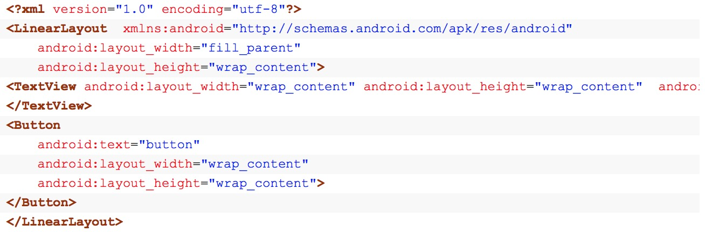
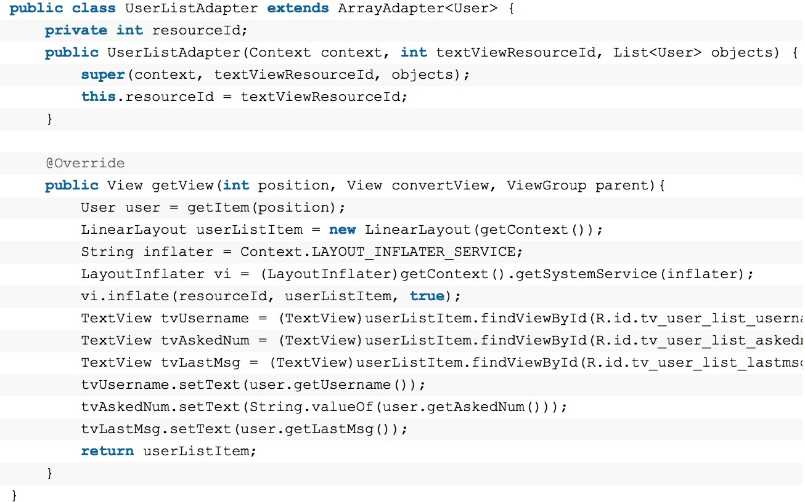

# Android 中的adapter(1501210527 高参)

# 一、Adapter介绍 
&#160; &#160; &#160; &#160;Android是完全遵循MVC模式设计的框架，Activity是Controller，layout是View。因为layout五花八门，很多数据都不能直接绑定上去，所以Android引入了Adapter这个机制作为复杂数据的展示的转换载体。Adapter是连接后端数据和前端显示的适配器接口，是数据和UI（View）之间一个重要的纽带。Adapter是将数据绑定到UI界面上的桥接类，Adapter负责创建显示每个项目的子View和提供对下层数据的访问，Adapter能快速地修改要绑定的控件的外观和功能。在多数情况下，你不需要创建自己的Adapter，Android提供了一系列Adapter来将数据绑定到UI Widget上。所以各种Adapter只不过是转换的方式和能力不一样而已。几种常见的Adapter：
#二、Adapter的体系结构：

##1、顶层接口Adapter要实现的基本方法

void registerDataSetObserver(DataSetObserver observer)  
注册一个Observer，当Adapter所表示的数据改变时会通知它。DataSetObserver是一个抽象类，定义了两个方法：onChanged与onInvalidated
  
void unregisterDataSetObserver(DataSetObserver observer)  
取消注册一个Observe

abstract Object getItem(int position)  
返回指定位置的数据项

abstract int getCount()  
所表示的数据的项数

abstract long getItemId(int position)  
返回指定位置的数据项的ID

abstract boolean hasStableIds();  
在BaseAdapter中默认返回了false，假设是不稳定的，在CursorAdapter中返回了true，Cursor中的_ID是不变的

abstract int getItemViewType(int position)  
获得相应位置的视图类型

abstract View getView(int position,View convertVeiw,ViewGroup parent)  
为每一个数据项产生相应的视图。为了避免产生大量的View浪费内存，在Android中，AdapterView中的View是可回收的使用的。比如你有100项数据要显示，而你的屏幕一次只能显示10条数据，则只产生10个View，当往下拖动要显示第11个View时，会把第1个View的引用传递过去，更新里面的数据再显示，也就是说View可重用，只是更新视图中的数据用于显示新的一项，如果一个视图的视图类型是IGNORE_ITEM_VIEW_TYPE的话，则此视图不会被重用

abstract int getViewTypeCount();  
getView可以返回的View的类型数量。
##2、抽象类BaseAdapter 
&#160; &#160; &#160; &#160;Adapter有两个子接口，ListAdapter(列表)与SpinnerAdapter(下拉列表)。它们都只定义了少数方法。一般除WrapperListAdapter接口及其实现类只实现了ListAdapter外，都同时实现了这两个接口。  
&#160; &#160; &#160; &#160;BaseAdapter一个抽象类，Adapter的基础实现类，一般作为其他实现类的基类，同时实现ListAdapter与SpinnerAdapter，提供了一些方法的默认实现。它是Android应用程序中经常用到的基础数据适配器，它的主要用途是将一组数据传到像ListView、Spinner、Gallery及GridView等UI显示组件，它是继承自接口类Adapter。其中BaseAdapter的直接子类：ArrayAdapter<T>，CursorAdapter，SimpleAdapter。BaseAdapter的间接子类：ResourceCursorAdapter，SimpleCursorAdapter。
###2、1 ArrayAdapter
&#160; &#160; &#160; &#160;ArrayAdapter支持泛型操作，最为简单，只能展示一行字。它默认ArrayAdapter产生的视图期望一个TextView，或者也可以指定一个Layout并指定其中一个类型为TextView的资源的ID，其底下的数据可以是任意类型，但显示的时候会调用其toString()方法，也就是说只能用TextView显示文字，如果想显示其他的数据，要重写getView()。
###2、2 CursorAdapter  
&#160; &#160; &#160; &#160;CursorAdapter继承于BaseAdapter是个虚类,它为cursor和ListView提供了连接的桥梁。用于显示Cursor中的数据。在构造函数中可传递一参数autoRequery表示当cursor的数据改变时是否自动调用cursor的requery()以保持视图数据为最新的。
###2、3 SimpleAdapter
&#160; &#160; &#160; &#160;SimpleAdapter一个BaseAdapter的实现类，用于绑定数据到一个XML定义的视图中。数据类型为ArrayList<Map<String,?>>。SimpleAdapter也实现了Filter接口用于数据的过滤，过滤方法类似ArrayAdapter，只是其数据类型为Map<String,?>，要判断Map中的每一项，若任意一顶符合要求就保留。SimpleAdapter也是通过bindView函数进行数据的绑定，同SimpleCursorAdapter一样，SimpleAdapter也定义了一个相同的内部接口ViewBinder，在bindView中，首先判断是否通过setViewBinder设置了ViewBinder，若设置了则调用其setViewValue进行数据绑定，如果没有设置其setViewValue返回了false，则进行下面的处理：依次判断View是否为Checkable,TextView,ImageView并进行相应的处理，可见默认情况下SimpleAdapter也是处理TextView与ImageView，当然可以setViewBinder。  

&#160; &#160; &#160; &#160;SimpleAdapter(Context context, List<? extends Map<String, ?>> data, int resource, String[] from, int[] to)  

&#160; &#160; &#160; &#160;参数context：上下文，比如this。关联SimpleAdapter运行的视图上下文；参数data：Map列表，列表要显示的数据，这部分需要自己实现，如例子中的getData()，类型要与上面的一致，每条项目要与from中指定条目一致；参数resource：ListView单项布局文件的Id,这个布局就是你自定义的布局了，你想显示什么样子的布局都在这个布局中。这个布局中必须包括了to中定义的控件id；参数 from：一个被添加到Map上关联每一个项目列名称的列表，数组里面是列名称；参数to：是一个int数组，数组里面的id是自定义布局中各个控件的id，需要与上面的from对应
###2、4 ResourceCursorAdapter
&#160; &#160; &#160; &#160;ResourceCursorAdapter如类名所示，该类继承自CursorAdapter，通过XML产生Views，该类只是简单地重写了一些函数，通过LayoutInflater.inflate将XML转换为View
###2、5 SimpleCursorAdapter
&#160; &#160; &#160; &#160;SimpleCursorAdapter一个ResourceCursorAdapter的简单实现类，用于把cursor中相应的列映射为XML定义的视图中的TextView和ImageView。
# 三、实验
ArrayAdapter列表的显示需要三个元素：  
a．ListVeiw 用来展示列表的View。  
b．适配器 用来把数据映射到ListView上的中介。  
c．数据 具体的将被映射的字符串，图片，或者基本组件。
主要讲解ArrayAdapter的创建方法，我把ArrayAdapter分为三种:简单的、样式丰富的但内容简单的、内容丰富的。
默认的，ArrayAdapter期望接受的样式文件里只含有一个textview，然后它把接受到的数据toString后（即调用数据对象的toString方法）展示在textview里。
## 3、1简单的
这样的列表的每一行都只有一行文字。

上面代码中，android.R.layout.simple_expandable_list_item_1是android里已提供的样式，我们也可换成自己的xml。
## 3、2样式丰富但内容简单的
layout下的online_user_list_item.xml内容如下：
里面含有的textview是我们想要展示内容的地方。那么构建ArrayAdapter时，应该这样写：
### 3、3内容丰富的（自定义ArrayAdapter）
这就需要写一个类继承自ArrayAdapter并且重写getView方法。
 
activity里就这样写