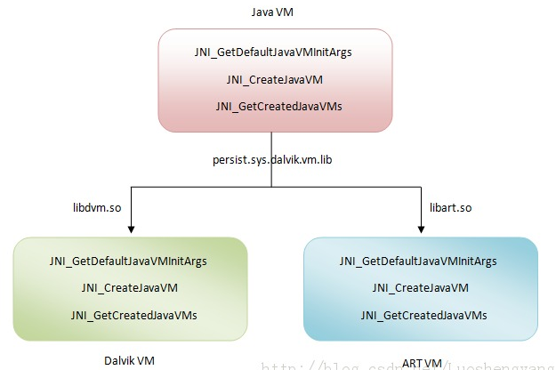

# Android ART模式详细分析与测试(1501210385 刘冶)

##**简介** 
    
&#160;&#160;&#160;&#160;ART虚拟机，是在Android 4.4中才出现的新功能，其全称是Android Run Time。该功能是用于解决Android 系统的卡顿问题，尤其针对于中低端手机，以及内存较小的手机。

&#160;&#160;&#160;&#160;众所周知，Android APK 应用程序一般都是使用JAVA编写的，因此Android 运行相应的应用程序时，都需要使用对应的JAVA 虚拟机环境。在4.4的版本之前，Android 系统所使用的JAVA虚拟机为Dalvik虚拟机。而Dalvik虚拟机的使用则是每次运行程序时，都要先在Dalvik虚拟机中进行编译。如果将程序关闭，再次打开时还需重新进行编译，效率低，而且程序开的越多，卡顿产生的越大。

&#160;&#160;&#160;&#160;而从4.4版本的Android之后，Google推出了ART模式进行相关优化。ART虚拟机与Dalvik虚拟机最大的不同，就是对程序的编译方式。在ART虚拟机环境下，Android对程序只进行一次编译，就是在程序安装时。在安装应用时，ART虚拟机就先将程序的Java语言转化为适合Android系统运行的机器语言，而且是一次编译终身受用。这样就免于程序每次运行时，都要重新编译的麻烦了。

##**具体分析** 

####**1.	接口简介**

&#160;&#160;&#160;&#160;ART模式下的虚拟机和传统的Dalvik虚拟机一样，实现了一套完全兼容Java虚拟机的接口。具体情况如下图所示：


&#160;&#160;&#160;&#160;如上图所示：在Android系统中，提供了一个系统属性persist.sys.dalvik.vm.lib，它的值要么等于libdvm.so，要么等于libart.so。当等于libdvm.so时，就表示当前用的是Dalvik虚拟机，而当等于libart.so时，就表示当前用的是ART虚拟机。而libdvm.so和libart.so导出了JNI_GetDefaultJavaVMInitArgs、JNI_CreateJavaVM和JNI_GetCreatedJavaVMs这三个接口，供外界调用。

&#160;&#160;&#160;&#160;三个参数分别为：

**JNI_GetDefaultJavaVMInitArgs -- 获取虚拟机的默认初始化参数**

**JNI_CreateJavaVM -- 在进程中创建虚拟机实例**

**JNI_GetCreatedJavaVMs -- 获取进程中创建的虚拟机实例**

&#160;&#160;&#160;&#160;**由此我们可以得出结论，ART模式和Dalvik虚拟机一样也是通过创建对应的ART虚拟机来进行应用程序的安装，启动和运行的。
**

####**2.	启动和安装过程**
&#160;&#160;&#160;&#160;**ART模式的优越性主要就体现在启动ART虚拟机和安装对应应用程序阶段**

&#160;&#160;&#160;&#160;从对比角度来看，Dalvik虚拟机执行的是dex字节码，ART虚拟机执行的是本地机器码。这意味着Dalvik虚拟机包含有一个解释器，用来执行dex字节码。当然，Android从2.2开始，也包含有JIT（Just-In-Time），用来在运行时动态地将执行频率很高的dex字节码翻译成本地机器码，然后再执行。通过JIT，就可以有效地提高Dalvik虚拟机的执行效率。但是，将dex字节码翻译成本地机器码是发生在应用程序的运行过程中的，并且应用程序每一次重新运行的时候，都要做重做这个翻译工作的。因此，即使用采用了JIT，Dalvik虚拟机的总体性能还是不能与直接执行本地机器码的ART虚拟机相比。

&#160;&#160;&#160;&#160;ART虚拟机使用AOT（Ahead-Of-Time 优先编译方式）在应用安装的时候将应用的dex字节码翻译成本地机器码。这样在使用对应的应用程序时可以直接调用机器码不需要多次编译。这样也能使系统在运行时绝大部分性能能够集中在应用程序本身上，而不需要花在编译的过程当中。

&#160;&#160;&#160;&#160;**首先是ART虚拟机的安装过程。**

&#160;&#160;&#160;&#160;启动ART虚拟机的过程和Dalvik虚拟机类似，都是通过Android系统启动过程中创建的Zygote进程来利用ART运行时导出的Java虚拟机接口创建ART虚拟机。而Zygote进程是通过复制自己来创建新的应用程序进程的，并且已经加载过对应的系统库和对应系统资源。因此通过这种自我复制的方式来创建应用程序进程，省去的不仅仅是应用程序进程创建虚拟机的时间，还能省去应用程序进程加载各种系统库和系统资源的时间。

&#160;&#160;&#160;&#160;启动Zygote进程起始于**AndroidRuntime类的成员函数start**。具体代码如下：

```
void AndroidRuntime::start(const char* className, const char* options)
{
    ......

    /* start the virtual machine */
    JniInvocation jni_invocation;
    jni_invocation.Init(NULL);
    JNIEnv* env;
    if (startVm(&mJavaVM, &env) != 0) {
        return;
    }

    ......

    /*
     * Start VM.  This thread becomes the main thread of the VM, and will
     * not return until the VM exits.
     */
    char* slashClassName = toSlashClassName(className);
    jclass startClass = env->FindClass(slashClassName);
    if (startClass == NULL) {
        ALOGE("JavaVM unable to locate class '%s'\n", slashClassName);
        /* keep going */
    } else {
        jmethodID startMeth = env->GetStaticMethodID(startClass, "main",
            "([Ljava/lang/String;)V");
        if (startMeth == NULL) {
            ALOGE("JavaVM unable to find main() in '%s'\n", className);
            /* keep going */
        } else {
            env->CallStaticVoidMethod(startClass, startMeth, strArray);

    #if 0
            if (env->ExceptionCheck())
                threadExitUncaughtException(env);
    #endif
        }
    }
    
    ......
}
```
&#160;&#160;&#160;&#160;**对应其中init成员函数实现：**

```
#ifdef HAVE_ANDROID_OS
static const char* kLibrarySystemProperty = "persist.sys.dalvik.vm.lib";
#endif
static const char* kLibraryFallback = "libdvm.so";

bool JniInvocation::Init(const char* library) {
#ifdef HAVE_ANDROID_OS
  char default_library[PROPERTY_VALUE_MAX];
  property_get(kLibrarySystemProperty, default_library, kLibraryFallback);
#else
  const char* default_library = kLibraryFallback;
#endif
  if (library == NULL) {
    library = default_library;
  }

  handle_ = dlopen(library, RTLD_NOW);
  if (handle_ == NULL) {
    if (strcmp(library, kLibraryFallback) == 0) {
      // Nothing else to try.
      ALOGE("Failed to dlopen %s: %s", library, dlerror());
      return false;
    }
    // Note that this is enough to get something like the zygote
    // running, we can't property_set here to fix this for the future
    // because we are root and not the system user. See
    // RuntimeInit.commonInit for where we fix up the property to
    // avoid future fallbacks. http://b/11463182
    ALOGW("Falling back from %s to %s after dlopen error: %s",
          library, kLibraryFallback, dlerror());
    library = kLibraryFallback;
    handle_ = dlopen(library, RTLD_NOW);
    if (handle_ == NULL) {
      ALOGE("Failed to dlopen %s: %s", library, dlerror());
      return false;
    }
  }
  if (!FindSymbol(reinterpret_cast<void**>(&JNI_GetDefaultJavaVMInitArgs_),
                  "JNI_GetDefaultJavaVMInitArgs")) {
    return false;
  }
  if (!FindSymbol(reinterpret_cast<void**>(&JNI_CreateJavaVM_),
                  "JNI_CreateJavaVM")) {
    return false;
  }
  if (!FindSymbol(reinterpret_cast<void**>(&JNI_GetCreatedJavaVMs_),
                  "JNI_GetCreatedJavaVMs")) {
    return false;
  }
  return true;
}
```
&#160;&#160;&#160;&#160;**对应其中startVM函数实现：**
```
int AndroidRuntime::startVm(JavaVM** pJavaVM, JNIEnv** pEnv)
{
    ......

    /*
     * Initialize the VM.
     *
     * The JavaVM* is essentially per-process, and the JNIEnv* is per-thread.
     * If this call succeeds, the VM is ready, and we can start issuing
     * JNI calls.
     */
    if (JNI_CreateJavaVM(pJavaVM, pEnv, &initArgs) < 0) {
        ALOGE("JNI_CreateJavaVM failed\n");
        goto bail;
    }

    ......
}
```