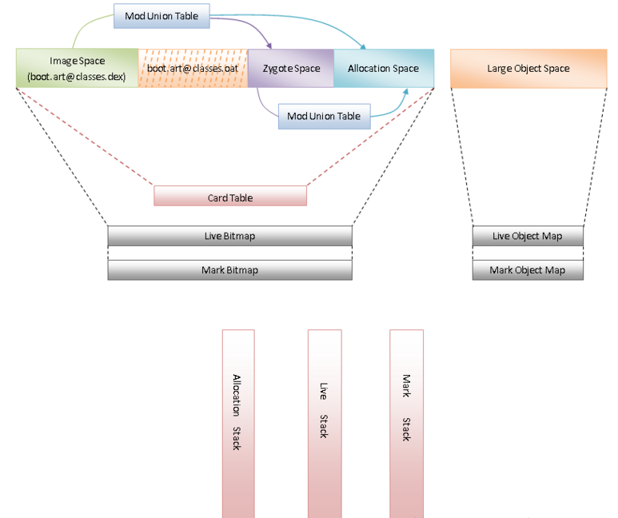

# Android ART模式详细分析与测试(1501210385 刘冶)

##**简介** 
    
&#160;&#160;&#160;&#160;ART虚拟机，是在Android 4.4中才出现的新功能，其全称是Android Run Time。该功能是用于解决Android 系统的卡顿问题，尤其针对于中低端手机，以及内存较小的手机。

&#160;&#160;&#160;&#160;众所周知，Android APK 应用程序一般都是使用JAVA编写的，因此Android 运行相应的应用程序时，都需要使用对应的JAVA 虚拟机环境。在4.4的版本之前，Android 系统所使用的JAVA虚拟机为Dalvik虚拟机。而Dalvik虚拟机的使用则是每次运行程序时，都要先在Dalvik虚拟机中进行编译。如果将程序关闭，再次打开时还需重新进行编译，效率低，而且程序开的越多，卡顿产生的越大。

&#160;&#160;&#160;&#160;而从4.4版本的Android之后，Google推出了ART模式进行相关优化。ART虚拟机与Dalvik虚拟机最大的不同，就是对程序的编译方式。在ART虚拟机环境下，Android对程序只进行一次编译，就是在程序安装时。在安装应用时，ART虚拟机就先将程序的Java语言转化为适合Android系统运行的机器语言，而且是一次编译终身受用。这样就免于程序每次运行时，都要重新编译的麻烦了。

##**具体分析** 

####**1.	接口简介**

&#160;&#160;&#160;&#160;ART模式下的虚拟机和传统的Dalvik虚拟机一样，实现了一套完全兼容Java虚拟机的接口。具体情况如下图所示：


&#160;&#160;&#160;&#160;如上图所示：在Android系统中，提供了一个系统属性persist.sys.dalvik.vm.lib，它的值要么等于libdvm.so，要么等于libart.so。当等于libdvm.so时，就表示当前用的是Dalvik虚拟机，而当等于libart.so时，就表示当前用的是ART虚拟机。而libdvm.so和libart.so导出了JNI_GetDefaultJavaVMInitArgs、JNI_CreateJavaVM和JNI_GetCreatedJavaVMs这三个接口，供外界调用。

&#160;&#160;&#160;&#160;三个参数分别为：

**JNI_GetDefaultJavaVMInitArgs -- 获取虚拟机的默认初始化参数**

**JNI_CreateJavaVM -- 在进程中创建虚拟机实例**

**JNI_GetCreatedJavaVMs -- 获取进程中创建的虚拟机实例**

&#160;&#160;&#160;&#160;**由此我们可以得出结论，ART模式和Dalvik虚拟机一样也是通过创建对应的ART虚拟机来进行应用程序的安装，启动和运行的。
**

####**2.	启动和安装过程**
&#160;&#160;&#160;&#160;**ART模式的优越性主要就体现在启动ART虚拟机和安装对应应用程序阶段**

&#160;&#160;&#160;&#160;从对比角度来看，Dalvik虚拟机执行的是dex字节码，ART虚拟机执行的是本地机器码。这意味着Dalvik虚拟机包含有一个解释器，用来执行dex字节码。当然，Android从2.2开始，也包含有JIT（Just-In-Time），用来在运行时动态地将执行频率很高的dex字节码翻译成本地机器码，然后再执行。通过JIT，就可以有效地提高Dalvik虚拟机的执行效率。但是，将dex字节码翻译成本地机器码是发生在应用程序的运行过程中的，并且应用程序每一次重新运行的时候，都要做重做这个翻译工作的。因此，即使用采用了JIT，Dalvik虚拟机的总体性能还是不能与直接执行本地机器码的ART虚拟机相比。

&#160;&#160;&#160;&#160;ART虚拟机使用AOT（Ahead-Of-Time 优先编译方式）在应用安装的时候将应用的dex字节码翻译成本地机器码。这样在使用对应的应用程序时可以直接调用机器码不需要多次编译。这样也能使系统在运行时绝大部分性能能够集中在应用程序本身上，而不需要花在编译的过程当中。

&#160;&#160;&#160;&#160;**首先是ART虚拟机的安装过程。**

&#160;&#160;&#160;&#160;启动ART虚拟机的过程和Dalvik虚拟机类似，都是通过Android系统启动过程中创建的Zygote进程来利用ART运行时导出的Java虚拟机接口创建ART虚拟机。而Zygote进程是通过复制自己来创建新的应用程序进程的，并且已经加载过对应的系统库和对应系统资源。因此通过这种自我复制的方式来创建应用程序进程，省去的不仅仅是应用程序进程创建虚拟机的时间，还能省去应用程序进程加载各种系统库和系统资源的时间。

&#160;&#160;&#160;&#160;启动Zygote进程起始于**AndroidRuntime类的成员函数start**。具体代码如下：

```
void AndroidRuntime::start(const char* className, const char* options)
{
    ......

    /* start the virtual machine */
    JniInvocation jni_invocation;
    jni_invocation.Init(NULL);
    JNIEnv* env;
    if (startVm(&mJavaVM, &env) != 0) {
        return;
    }

    ......

    /*
     * Start VM.  This thread becomes the main thread of the VM, and will
     * not return until the VM exits.
     */
    char* slashClassName = toSlashClassName(className);
    jclass startClass = env->FindClass(slashClassName);
    if (startClass == NULL) {
        ALOGE("JavaVM unable to locate class '%s'\n", slashClassName);
        /* keep going */
    } else {
        jmethodID startMeth = env->GetStaticMethodID(startClass, "main",
            "([Ljava/lang/String;)V");
        if (startMeth == NULL) {
            ALOGE("JavaVM unable to find main() in '%s'\n", className);
            /* keep going */
        } else {
            env->CallStaticVoidMethod(startClass, startMeth, strArray);

    #if 0
            if (env->ExceptionCheck())
                threadExitUncaughtException(env);
    #endif
        }
    }
    
    ......
}
```
&#160;&#160;&#160;&#160;**对应其中init成员函数实现：**

```
#ifdef HAVE_ANDROID_OS
static const char* kLibrarySystemProperty = "persist.sys.dalvik.vm.lib";
#endif
static const char* kLibraryFallback = "libdvm.so";

bool JniInvocation::Init(const char* library) {
#ifdef HAVE_ANDROID_OS
  char default_library[PROPERTY_VALUE_MAX];
  property_get(kLibrarySystemProperty, default_library, kLibraryFallback);
#else
  const char* default_library = kLibraryFallback;
#endif
  if (library == NULL) {
    library = default_library;
  }

  handle_ = dlopen(library, RTLD_NOW);
  if (handle_ == NULL) {
    if (strcmp(library, kLibraryFallback) == 0) {
      // Nothing else to try.
      ALOGE("Failed to dlopen %s: %s", library, dlerror());
      return false;
    }
    // Note that this is enough to get something like the zygote
    // running, we can't property_set here to fix this for the future
    // because we are root and not the system user. See
    // RuntimeInit.commonInit for where we fix up the property to
    // avoid future fallbacks. http://b/11463182
    ALOGW("Falling back from %s to %s after dlopen error: %s",
          library, kLibraryFallback, dlerror());
    library = kLibraryFallback;
    handle_ = dlopen(library, RTLD_NOW);
    if (handle_ == NULL) {
      ALOGE("Failed to dlopen %s: %s", library, dlerror());
      return false;
    }
  }
  if (!FindSymbol(reinterpret_cast<void**>(&JNI_GetDefaultJavaVMInitArgs_),
                  "JNI_GetDefaultJavaVMInitArgs")) {
    return false;
  }
  if (!FindSymbol(reinterpret_cast<void**>(&JNI_CreateJavaVM_),
                  "JNI_CreateJavaVM")) {
    return false;
  }
  if (!FindSymbol(reinterpret_cast<void**>(&JNI_GetCreatedJavaVMs_),
                  "JNI_GetCreatedJavaVMs")) {
    return false;
  }
  return true;
}
```
&#160;&#160;&#160;&#160;**对应其中startVM函数实现：**
```
int AndroidRuntime::startVm(JavaVM** pJavaVM, JNIEnv** pEnv)
{
    ......

    /*
     * Initialize the VM.
     *
     * The JavaVM* is essentially per-process, and the JNIEnv* is per-thread.
     * If this call succeeds, the VM is ready, and we can start issuing
     * JNI calls.
     */
    if (JNI_CreateJavaVM(pJavaVM, pEnv, &initArgs) < 0) {
        ALOGE("JNI_CreateJavaVM failed\n");
        goto bail;
    }

    ......
}
```
&#160;&#160;&#160;&#160;主要过程如下：

&#160;&#160;&#160;&#160;**创建JniInvocation实例调用对应的成员函数init来初始化JNI环境；***

&#160;&#160;&#160;&#160;（主要就是通过读取系统属性persist.sys.dalvik.vm.lib，判别是ART虚拟机或者是Dalvik虚拟机，然后导出对应上文提到的三个接口，保存在JniInvocation类的对应成员变量当中）

&#160;&#160;&#160;&#160;**调用AndroidRuntime类的成员函数startVm来创建虚拟机及其对应的JNI接口。**

&#160;&#160;&#160;&#160;（startVm最主要就是调用函数JNI_CreateJavaVM来创建一个JavaVM接口及其对应的JNIEnv接口：）

&#160;&#160;&#160;&#160;以上就是ART虚拟机的启动过程，主要就是通过读取对应存储的系统属性persist.sys.dalvik.vm.lib和一个适配层JniInvocation，创建对应的ART虚拟机用于后续应用程序的安装与使用。

&#160;&#160;&#160;&#160;**然后就是应用程序的安装过程中将dex字节码翻译为本地机器码的过程。**

&#160;&#160;&#160;&#160;简单来说，这个过程就是Android系统通过PackageManagerService来安装APK，在安装的过程，PackageManagerService会通过另外一个类Installer的成员函数dexopt来对APK里面的dex字节码进行优化。而Installer则是通过socket向守护进程installd发送一个dexopt请求，再通过其中的dexopt函数进行处理。

&#160;&#160;&#160;&#160;函数原型如下：
```
int dexopt(const char *apk_path, uid_t uid, int is_public)
{
    struct utimbuf ut;
    struct stat apk_stat, dex_stat;
    char out_path[PKG_PATH_MAX];
    char dexopt_flags[PROPERTY_VALUE_MAX];
    char persist_sys_dalvik_vm_lib[PROPERTY_VALUE_MAX];
    char *end;
    int res, zip_fd=-1, out_fd=-1;

    ......

    /* The command to run depend ones the value of persist.sys.dalvik.vm.lib */
    property_get("persist.sys.dalvik.vm.lib", persist_sys_dalvik_vm_lib, "libdvm.so");

    /* Before anything else: is there a .odex file?  If so, we have
     * precompiled the apk and there is nothing to do here.
     */
    sprintf(out_path, "%s%s", apk_path, ".odex");
    if (stat(out_path, &dex_stat) == 0) {
        return 0;
    }

    if (create_cache_path(out_path, apk_path)) {
        return -1;
    }

    ......

    out_fd = open(out_path, O_RDWR | O_CREAT | O_EXCL, 0644);

    ......

    pid_t pid;
    pid = fork();
    if (pid == 0) {
        ......

        if (strncmp(persist_sys_dalvik_vm_lib, "libdvm", 6) == 0) {
            run_dexopt(zip_fd, out_fd, apk_path, out_path, dexopt_flags);
        } else if (strncmp(persist_sys_dalvik_vm_lib, "libart", 6) == 0) {
            run_dex2oat(zip_fd, out_fd, apk_path, out_path, dexopt_flags);
        } else {
            exit(69);   /* Unexpected persist.sys.dalvik.vm.lib value */
        }
        exit(68);   /* only get here on exec failure */
    } 

    ......
}
```

&#160;&#160;&#160;&#160;具体流程如下：

&#160;&#160;&#160;&#160;dexopt函数首先读取系统属性persist.sys.dalvik.vm.lib的值，再通过fork来创建一个子进程。如果系统属性persist.sys.dalvik.vm.lib的值等于libdvm.so，那么该子进程就会调用函数run_dexopt来将dex文件优化成odex文件。另一方面，如果系统属性persist.sys.dalvik.vm.lib的值等于libart.so，那么该子进程就会调用函数run_dex2oat来将dex文件翻译成oat文件，即将dex字节码翻译成本地机器码，并且保存在一个oat文件中。

####**3.	运行阶段简介**
&#160;&#160;&#160;&#160;**在应用程序的运行阶段，主要就是对安装之后的OAT文件进行解析和执行的过程。**

&#160;&#160;&#160;&#160;**首先简单介绍一下OAT文件的结构。**

&#160;&#160;&#160;&#160;OAT文件是一种Android私有ELF文件格式，它不仅包含有从DEX文件翻译而来的本地机器指令，还包含有原来的DEX文件内容。

&#160;&#160;&#160;&#160;具体结构如下：


&#160;&#160;&#160;&#160;具体来讲：OAT文件包含有两个特殊的段oatdata和oatexec，前者包含有用来生成本地机器指令的dex文件内容，后者包含有生成的本地机器指令，它们之间的关系通过储存在oatdata段前面的oat头部描述。

&#160;&#160;&#160;&#160;ART运行时是利用LLVM编译框架来将DEX字节码翻译成本地机器指令，其中要通过一个称为Backend的模块来生成本地机器指令。这些生成的机器指令就保存在ELF文件格式的OAT文件的oatexec段中。而与此同时，ART运行时会为每一个类方法都生成一系列的本地机器指令。这些本地机器指令不是孤立存在的，因为它们可能需要其它的函数来完成自己的功能。

&#160;&#160;&#160;&#160;Backend模块需要在为类方法生成本地机器指令时，处理调用其它模块提供的函数的问题。因此诞生了两种机制：Portable和Quick。

&#160;&#160;&#160;&#160;Portable类型的Backend通过集成在LLVM编译框架里面的一个称为MCLinker的链接器来生成本地机器指令。因为本身ELF文件格式支持对应依赖关系的记录与描述，因此MCLinker仅仅是作为一个静态的链接器。

&#160;&#160;&#160;&#160;Quick类型的Backend生成的本地机器指令是使用线程的TLS（线程本地区域）提供一个函数表来调用其它模块的函数。由于使用的是函数表，即加载时不需要再处理模式之间的依赖关系，因此加载过程不需要重定位，使得速度提升，因此成为Quick方式。

&#160;&#160;&#160;&#160;而ART模式的运行过程中，系统是通过OatFile类的静态成员函数Open函数进行OAT文件的加载过程的。

&#160;&#160;&#160;&#160;代码如下：
```
OatFile* OatFile::Open(const std::string& filename,
                       const std::string& location,
                       byte* requested_base,
                       bool executable) {
  CHECK(!filename.empty()) << location;
  CheckLocation(filename);
#ifdef ART_USE_PORTABLE_COMPILER
  // If we are using PORTABLE, use dlopen to deal with relocations.
  //
  // We use our own ELF loader for Quick to deal with legacy apps that
  // open a generated dex file by name, remove the file, then open
  // another generated dex file with the same name. http://b/10614658
  if (executable) {
    return OpenDlopen(filename, location, requested_base);
  }
#endif
  // If we aren't trying to execute, we just use our own ElfFile loader for a couple reasons:
  //
  // On target, dlopen may fail when compiling due to selinux restrictions on installd.
  //
  // On host, dlopen is expected to fail when cross compiling, so fall back to OpenElfFile.
  // This won't work for portable runtime execution because it doesn't process relocations.
  UniquePtr<File> file(OS::OpenFileForReading(filename.c_str()));
  if (file.get() == NULL) {
    return NULL;
  }
  return OpenElfFile(file.get(), location, requested_base, false, executable);
}
```
&#160;&#160;&#160;&#160;具体流程如下：

&#160;&#160;&#160;&#160;如果编译时指定了ART_USE_PORTABLE_COMPILER宏，并且参数executable为true，那么就通过OatFile类的静态成员函数OpenDlopen来加载指定的OAT文件。OatFile类的静态成员函数OpenDlopen直接通过动态链接器提供的dlopen函数来加载OAT文件。

&#160;&#160;&#160;&#160;否则，通过OatFile类的静态成员函数OpenElfFile来手动加载指定的OAT文件。即按照ELF文件格式来解析要加载的OAT文件的，并且根据解析获得的信息将OAT里面相应的段加载到内存中来。

&#160;&#160;&#160;&#160;具体加载过程设计到的函数较为复杂，不做进一步解释。

&#160;&#160;&#160;&#160;通过对OAT文件的解析，我们就能够在ART运行时查找类方法的本地机器指令，同时由于ART运行时提供了Java虚拟机接口，而要实现Java虚拟机接口不得不依赖于DEX文件，因此OAT文件结构内仍然包含了原始的DEX文件。

&#160;&#160;&#160;&#160;在获得对应的类方法的机器指令或者DEX码之后，我们就可以对相应的程序进行执行了。在ART运行时中，类方法的执行方式有两种。一种是像Dalvik虚拟机一样，将其DEX字节码交给解释器执行；另一种则是直接将其本地机器指令交给CPU执行。

####**4.	垃圾收集机制**
&#160;&#160;&#160;&#160;ART运行时垃圾收集机制与Dalvik虚拟机的垃圾收集机制类似，涉及到Zygote堆、Active堆、Card Table、Heap Bitmap和Mark Stack等概念。

&#160;&#160;&#160;&#160;如图所示：


&#160;&#160;&#160;&#160;ART运行时堆划分为四个空间，分别是Image Space、Zygote Space、Allocation Space和Large Object Space。其中，Image Space、Zygote Space、Allocation Space是在地址上连续的空间，称为Continuous Space，而Large Object Space是一些离散地址的集合，用来分配一些大对象，称为Discontinuous Space。

&#160;&#160;&#160;&#160;而ART的关键之处则是在boot.art@classes.oat这一段空间。它是用于保存的是一些预先创建的对象，使得后续加载过程中免于重复创建而做出的优化。

&#160;&#160;&#160;&#160;ART运行时与Dalvik虚拟机一样，都使用了Mark-Sweep算法进行垃圾回收（GC），因此它们的垃圾回收流程在总体上是一致的。但是ART模式有其独特的优点。

&#160;&#160;&#160;&#160;具体如下：

&#160;&#160;&#160;&#160;1.	ART运行时堆的划分和管理更细致，它分为Image Space、Zygote Space、Allocation Space和Large Object Space四个Space，再加上一个Allocation Stack。其中，Allocation Space和Large Object Space和Dalvik虚拟机的Zygote堆和Active堆作用是一样的，而其余的Space则有特别的作用，例如，Image Space的对象是永远不需要回收的。

&#160;&#160;&#160;&#160;2.	ART运行时的每一个Space都有不同的回收策略，ART运行时根据这个特性提供了Mark Sweep、Partial Mark Sweep和Sticky Mark Sweep等三种回收力度不同的垃圾收集器。其中，Mark Sweep的垃圾回收力度最大，它会同时回收Zygote Space、Allocation Space和Large Object Space的垃圾，Partial Mark Sweep的垃圾回收力度居中，它只会同时回收Allocation Space和Large Object Space的垃圾，而Sticky Mark Sweep的垃圾回收力度最小，它只会回收Allocation Stack的垃圾，即上次GC以后分配出来的又不再使用了的对象。力度越大的垃圾收集器，回收垃圾时需要的时候也就越长。这样我们就可以在应用程序运行的过程中根据不同的情景使用不同的垃圾收集器，那就可以更有效地执行垃圾回收过程。

&#160;&#160;&#160;&#160;3.	 ART运行时充分地利用了设备的CPU多核特性，在并行GC的执行过程中，将每一个并发阶段的工作划分成多个子任务，然后提交给一个线程池执行，这样就可以更高效率地完成整个GC过程，避免长时间对应用程序造成停顿。

##**测试与总结** 

&#160;&#160;&#160;&#160;由于相应程序的测试较为复杂，我仅仅只是查阅相关资料，并结合自己使用ART模式之后的体验对ART模式简单做一个分析。

&#160;&#160;&#160;&#160;首先OAT机制的引入的确加快了对应程序的使用与流畅性，就Android4.4版本来讲，针对ART优化过后，据官方数据性能的提升几乎可以达到30%。而与此同时，OAT的引入也带来了安装时间增长的问题。程序体会变得更为臃肿，但是运行效率会更高。同时也更为省电。不仅如此，引入AOT之后由于ELF文件格式的引入，使得对应的程序本身保护性能得到提升，即反编译难度加大，知识产权保护得到提升。

&#160;&#160;&#160;&#160;同时优化之后的垃圾回收机制的的确确有了极大的提升，基本上从原本的毫秒级优化到了微秒级，使得系统本身的卡顿和暂停现象有了极大的提升。据实验表明原本Dalvik虚拟机平均的暂停时间为54ms，而经过优化之后的ART虚拟机几乎只有3ms的平均暂停时间。

&#160;&#160;&#160;&#160;然而，仅说了这么多是不够的，虽然ART模式进行了对应的优化，但是我们基本上都从未使用过。

&#160;&#160;&#160;&#160;开启ART模式的方式就是通过手机设置——>开发者选项——>选择运行环境中选取对应的ART模式。

&#160;&#160;&#160;&#160;在体验过ART模式之后，直观感觉上来讲，系统的运行效率确实有一定是提升，而且某些程序的体验也得到了一定的提高，但并不是所有的应用都获得了对应的提升，有些体验可能更差了。可能是由于相关的应用程序没有针对更高本版的Android系统进行对应的优化过程。

&#160;&#160;&#160;&#160;ART模式带来的变化目前来看并不明显，然而随着Android系统进一步演化，我相信Dalvik虚拟机应该会逐步被替代或者逐渐消失（而不仅仅是目前处于的可选模式之一）。ART模式会越来越流行，优化带来的不仅仅是速度的变革，同时也是针对Android系统的进一步提升，与IOS的竞争与相关影响也会逐渐凸显出来。

##**致谢**
&#160;&#160;&#160;&#160;感谢张老师这学期对我们的在课程之上的指导，同时我想对老师的课程提提意见，尽管课程文档的详细程度已经够了，但是我还是希望老师能够提供对应的参考书目。而对于学习环境和学习过程上的督促我感觉老师已经做得很好了。

##**参考文献**
http://blog.csdn.net/luoshengyang/article/details/18006645

http://blog.csdn.net/luoshengyang/article/details/39256813

http://blog.csdn.net/luoshengyang/article/details/42072975
